# ERD-29 — Detailed ERD  
## Monitoring / Observability

| Field | Value |
|-------|--------|
| **Document** | ERD-29 Monitoring / Observability Detailed ERD |
| **Version** | **1.1** |
| **Status** | **Locked — Ready for Future Reference** |
| **Document Status** | **Locked** |
| **Next Stage** | **Sprint 29 Backend Planning** |
| **Schema** | `monitoring` |
| **Prefix** | `mon_` |
| **Business Tables** | Exactly **17** |
| **Aligned To** | FRD-29 (Locked v1.1) · ERD-29 Entity Planning (Locked v1.1) · Sprint 29 ARB Recommendation Locked v1.1 · Architecture Lock v1.1 (C-01–C-06) · BRD v1.0 · SDD v1.1 · DBS v1.1 · FRD-01 Foundation · FRD-21 Integration Hub · FRD-22 Analytics · FRD-27 AI Platform · FRD-28 API Developer Portal |
| **Prior Release** | ERP Core v1.23-beta |
| **Planned Delivery** | ERP Core v1.24-beta (planned) |
| **Planned Module** | `apps/api/src/modules/monitoring/` |
| **Planned API Mount** | `/api/v1/monitoring` (planning — APIs not designed in this document) |
| **RBAC Namespace (planning)** | `monitoring.*` — final codes at permission seed |

> **Detailed ERD only.** Physical persistence model for the locked Entity Planning inventory. Exactly **17** entities — no add · no remove · no rename. No Backend Planning, APIs, migrations, models, repositories, services, or implementation in this document.

### Version History

| Version | Date | Change |
|---------|------|--------|
| 1.0 | 2026-07-29 | Initial ERD-29 Monitoring / Observability Detailed ERD. Exactly **17** locked entities. Schema `monitoring` / prefix `mon_`. Mermaid ERD · relationship matrix · column catalogs · FK/UUID strategies. Architecture Lock v1.1 preserved. Next Stage: Backend Planning. |
| 1.1 | 2026-07-29 | Editorial Lock after Permanent Enterprise Architecture Review Board unanimous approval. Aligned optional SLO service_id delete rule; clarified alert_rule.slo_id as intra UUID attribute (no ORM FK); completed Relationship Matrix rows already defined in §11; clarified Reliability aggregate wording; added global DBS index note; ASCII Aggregate Hierarchy; Forbidden Relationships; Future Reserved stub. Metadata Version 1.1 / Locked — Ready for Future Reference / Next Stage Sprint 29 Backend Planning. No entity added, removed, or renamed. Still exactly **17** entities. No ownership, aggregate membership, Mermaid architecture, or FK strategy changes. Architecture Lock v1.1 preserved. |

---

## 1. Document Control

| Field | Value |
|-------|--------|
| **Document ID** | ERD-29 |
| **Document Title** | Monitoring / Observability — Detailed ERD |
| **Domain** | Monitoring / Observability |
| **Classification** | Internal — Confidential |
| **Authoritative Baselines** | BRD v1.0 · SDD v1.1 · DBS v1.1 · Architecture Lock v1.1 · FRD-29 Locked v1.1 · ERD-29 Entity Planning Locked v1.1 · Sprint 29 ARB Recommendation Locked v1.1 · ERD-01…ERD-28 |
| **Entity Planning Baseline** | [ERD-29-Monitoring-Observability-Entity-Planning.md](./ERD-29-Monitoring-Observability-Entity-Planning.md) (Locked v1.1) |
| **Permanent ARB** | 13 architects · 20+ years · unanimous approval required |
| **Product Role** | Enterprise Observability Metadata and Control Plane |
| **Repository Path Note** | Sprint 29 Detailed ERD stored under `docs/03_ERD/`. Historical Sprint 26–28 ERDs may use `docs/06_ERD/`. Documentation organization only. |

---

## 2. Purpose

This Detailed ERD freezes the **physical persistence model** for the Monitoring / Observability bounded context:

- Exactly **17** `mon_*` tables under schema **`monitoring`**
- Intra-schema foreign keys only among `mon_*` tables
- Cross-module references as **UUID / service contracts only** — never peer-schema foreign keys
- Ownership preserved: observability metadata / policy / control-plane only

**Monitoring does not become** APM, log store, metrics DB, tracing backend, SIEM, or infrastructure monitoring platform.  
**External observability platforms remain external.**  
**Foundation** remains Auth / RBAC / Audit / Notification / Workflow SoR.  
**Integration Hub** remains usage / transport SoR.  
**Architecture Lock v1.1** is FINAL.

Later Backend Planning and implementation **must use only these entities, columns, and relationships**.

---

## 3. ERD Design Principles

| Principle | Statement |
|-----------|-----------|
| **Metadata / Control Plane only** | All 17 `mon_*` tables store definitions, policies, bindings, and operational report metadata — not telemetry payloads |
| **External platforms remain external** | Prometheus · Grafana · Loki · OpenTelemetry · cloud APM · SIEM are adapter/UUID bindings only |
| **Zero duplicate ownership** | Never duplicate Foundation Audit, Hub usage metering, Analytics warehouse, AI telemetry SoR, or Developer Portal DX reports |
| **Intra-schema FKs only** | ORM foreign keys exist only among `mon_*` tables |
| **UUID references only (peers)** | Foundation / Hub / Analytics / AI / DevPortal / business modules referenced by UUID — never peer-schema FKs |
| **No peer ORM** | Monitoring never writes peer-module ORM models |
| **Secret refs only** | `secret_ref` attributes — no plaintext tokens |
| **Version-first policy** | Separate `mon_observability_policy_version`; other publishable entities are version-aware on the same row |
| **Published immutability** | Published versions are never silently replaced |
| **DBS v1.1 naming** | Schema `monitoring` · prefix `mon_` · UUID PK `id` |
| **Architecture Lock v1.1** | Final — never modified by this ERD |

---

## 4. Entity Classification (Locked)

| Classification | Entities (17 total — unchanged) |
|----------------|----------------------------------|
| **Core** | `mon_observability_policy` · `mon_observability_policy_version` · `mon_monitored_service` · `mon_monitored_component` · `mon_metric_definition` · `mon_log_trace_policy` · `mon_health_check` · `mon_alert_rule` · `mon_alert_routing_policy` · `mon_service_policy_assignment` |
| **Extension** | `mon_slo_definition` · `mon_sli_definition` · `mon_dashboard_definition` · `mon_signal_correlation` · `mon_external_platform_binding` · `mon_service_platform_assignment` |
| **Operational** | `mon_observability_report` |

*Operational is Entity Planning classification only — does not redefine FRD capability banding.*

---

## 5. Standard Column Profiles (DBS v1.1)

### 5.1 Primary Key

| Column | Type | Nullable | Default | Notes |
|--------|------|----------|---------|-------|
| `id` | UUID | NO | app-generated (UUID v7 preferred) | PK · immutable |

### 5.2 Tenant / Company / Branch Scope

| Column | Type | Nullable | Default | Notes |
|--------|------|----------|---------|-------|
| `tenant_id` | UUID | NO | — | Multi-tenant isolation (peer UUID — no peer-schema FK) |
| `company_id` | UUID | NO | — | Company scope (peer UUID — no peer-schema FK) |
| `branch_id` | UUID | YES | NULL | Optional branch scope (peer UUID — no peer-schema FK) |

### 5.3 Audit Fields (required)

| Column | Type | Nullable | Default | Notes |
|--------|------|----------|---------|-------|
| `created_at` | TIMESTAMPTZ | NO | `now()` | Immutable |
| `created_by` | UUID | NO | — | Foundation user UUID ref — **no peer-schema FK** |
| `updated_at` | TIMESTAMPTZ | YES | NULL | Set on update |
| `updated_by` | UUID | YES | NULL | Foundation user UUID ref — **no peer-schema FK** |
| `version` | INTEGER | NO | `1` | Optimistic concurrency stamp; increment on update |

### 5.4 Soft Delete Fields (required)

| Column | Type | Nullable | Default | Notes |
|--------|------|----------|---------|-------|
| `is_deleted` | BOOLEAN | NO | `FALSE` | Soft-delete flag (DBS) |
| `deleted_at` | TIMESTAMPTZ | YES | NULL | Set when soft-deleted |
| `deleted_by` | UUID | YES | NULL | Foundation user UUID ref — **no peer-schema FK** |

Physical `DELETE` on business rows is prohibited except ARB-approved exceptions.

### 5.5 Status Fields

| Column | Type | Nullable | Default | Notes |
|--------|------|----------|---------|-------|
| `status` | VARCHAR(30) | NO | entity-specific | Lifecycle status |

### 5.6 Common Business Metadata

| Column | Type | Nullable | Notes |
|--------|------|----------|-------|
| `code` / `*_code` | VARCHAR(64) | NO (where used) | Business key within tenant/company |
| `name` / `*_name` | VARCHAR(255) | NO (where used) | Display name |
| `description` | TEXT | YES | Free-text description |
| `metadata_json` | JSONB | YES | Extensible control-plane metadata (definitions only — never raw telemetry warehouse) |

---

## 6. Mermaid ER Diagram

Intra-schema relationships only. Cross-module UUIDs appear as attributes — **not** Mermaid relationship edges to peer modules.

```mermaid
erDiagram
    mon_observability_policy ||--o{ mon_observability_policy_version : versions
    mon_observability_policy_version ||--o{ mon_service_policy_assignment : assigned_as
    mon_monitored_service ||--o{ mon_monitored_component : contains
    mon_monitored_service ||--o{ mon_service_policy_assignment : receives_policy
    mon_monitored_service ||--o{ mon_service_platform_assignment : receives_platform
    mon_monitored_service ||--o{ mon_health_check : health_checks
    mon_monitored_component ||--o{ mon_service_policy_assignment : may_receive_policy
    mon_monitored_component ||--o{ mon_service_platform_assignment : may_receive_platform
    mon_monitored_component ||--o{ mon_health_check : may_have_checks
    mon_monitored_service ||--o{ mon_slo_definition : may_own_slo
    mon_slo_definition ||--o{ mon_sli_definition : has_indicators
    mon_alert_rule ||--o{ mon_alert_routing_policy : routes
    mon_external_platform_binding ||--o{ mon_service_platform_assignment : bound_to
    mon_alert_rule ||--o{ mon_signal_correlation : may_correlate
    mon_metric_definition ||--o{ mon_signal_correlation : may_correlate
    mon_metric_definition ||--o{ mon_alert_rule : may_trigger
    mon_observability_policy_version ||--o{ mon_dashboard_definition : may_scope
    mon_observability_policy_version ||--o{ mon_log_trace_policy : may_align

    mon_observability_policy {
        uuid id PK
        string policy_code
        string status
        uuid tenant_id
    }
    mon_observability_policy_version {
        uuid id PK
        uuid policy_id FK
        string version_label
        string status
    }
    mon_monitored_service {
        uuid id PK
        string service_code
        string status
        uuid peer_module_ref
    }
    mon_monitored_component {
        uuid id PK
        uuid service_id FK
        string component_code
        string status
    }
    mon_metric_definition {
        uuid id PK
        string metric_code
        string status
    }
    mon_log_trace_policy {
        uuid id PK
        string policy_code
        string signal_kind
        string status
        uuid policy_version_id FK
    }
    mon_health_check {
        uuid id PK
        uuid service_id FK
        uuid component_id FK
        string check_code
        string status
    }
    mon_alert_rule {
        uuid id PK
        string rule_code
        string severity
        string status
        uuid metric_definition_id FK
    }
    mon_alert_routing_policy {
        uuid id PK
        uuid alert_rule_id FK
        uuid notification_channel_ref
        string status
    }
    mon_slo_definition {
        uuid id PK
        uuid service_id FK
        string slo_code
        string status
    }
    mon_sli_definition {
        uuid id PK
        uuid slo_id FK
        string sli_code
        string status
    }
    mon_dashboard_definition {
        uuid id PK
        string dashboard_code
        string status
        uuid policy_version_id FK
    }
    mon_signal_correlation {
        uuid id PK
        string correlation_code
        string status
        uuid alert_rule_id FK
        uuid metric_definition_id FK
    }
    mon_external_platform_binding {
        uuid id PK
        string binding_code
        string platform_type
        string secret_ref
        string status
    }
    mon_service_policy_assignment {
        uuid id PK
        uuid service_id FK
        uuid component_id FK
        uuid policy_version_id FK
        string status
    }
    mon_service_platform_assignment {
        uuid id PK
        uuid service_id FK
        uuid component_id FK
        uuid platform_binding_id FK
        string status
    }
    mon_observability_report {
        uuid id PK
        string report_code
        string status
        uuid tenant_id
    }
```



**Notes on Mermaid attributes:**

- `peer_module_ref` · `notification_channel_ref` · `secret_ref` · `created_by` / `updated_by` / `deleted_by` = peer/Foundation UUID attributes (**not** Mermaid FKs)
- Optional FKs (`component_id`, `policy_version_id` on log/dashboard, `metric_definition_id`, `alert_rule_id` on correlation) may be null per business rules
- No Mermaid edges to Foundation, Integration Hub, Analytics, AI, Developer Portal, or external platform schemas

### Relationship Design Notes

- Cross-module UUID attributes intentionally do **NOT** become Mermaid relationships.
- Mermaid represents only **intra-schema ownership**.
- Service contracts remain the **only** integration mechanism with external bounded contexts.
- **No peer ORM** is permitted.
- Raw metrics / logs / spans must never be persisted as SoR rows in these tables.

---

## 7. Relationship Matrix

| Parent | Child | Cardinality | Ownership | Cascade / Restrict |
|--------|-------|-------------|-----------|--------------------|
| `mon_observability_policy` | `mon_observability_policy_version` | 1 : 0..* | Monitoring | **ON DELETE RESTRICT** · **ON UPDATE CASCADE** |
| `mon_observability_policy_version` | `mon_service_policy_assignment` | 1 : 0..* | Monitoring | **ON DELETE RESTRICT** · **ON UPDATE CASCADE** |
| `mon_monitored_service` | `mon_monitored_component` | 1 : 0..* | Monitoring | **ON DELETE RESTRICT** · **ON UPDATE CASCADE** |
| `mon_monitored_service` | `mon_service_policy_assignment` | 1 : 0..* | Monitoring | **ON DELETE RESTRICT** · **ON UPDATE CASCADE** |
| `mon_monitored_service` | `mon_service_platform_assignment` | 1 : 0..* | Monitoring | **ON DELETE RESTRICT** · **ON UPDATE CASCADE** |
| `mon_monitored_service` | `mon_health_check` | 1 : 0..* | Monitoring | **ON DELETE RESTRICT** · **ON UPDATE CASCADE** |
| `mon_monitored_service` | `mon_slo_definition` | 1 : 0..* | Monitoring | **ON DELETE SET NULL** · **ON UPDATE CASCADE** (optional nullable FK) |
| `mon_monitored_component` | `mon_service_policy_assignment` | 1 : 0..* | Monitoring | **ON DELETE SET NULL** (optional) · **ON UPDATE CASCADE** |
| `mon_monitored_component` | `mon_service_platform_assignment` | 1 : 0..* | Monitoring | **ON DELETE SET NULL** (optional) · **ON UPDATE CASCADE** |
| `mon_monitored_component` | `mon_health_check` | 1 : 0..* | Monitoring | **ON DELETE SET NULL** (optional) · **ON UPDATE CASCADE** |
| `mon_slo_definition` | `mon_sli_definition` | 1 : 0..* | Monitoring | **ON DELETE RESTRICT** · **ON UPDATE CASCADE** |
| `mon_alert_rule` | `mon_alert_routing_policy` | 1 : 0..* | Monitoring | **ON DELETE RESTRICT** · **ON UPDATE CASCADE** |
| `mon_external_platform_binding` | `mon_service_platform_assignment` | 1 : 0..* | Monitoring | **ON DELETE RESTRICT** · **ON UPDATE CASCADE** |
| `mon_metric_definition` | `mon_alert_rule` | 1 : 0..* | Monitoring | **ON DELETE SET NULL** (optional) · **ON UPDATE CASCADE** |
| `mon_metric_definition` | `mon_sli_definition` | 1 : 0..* | Monitoring | **ON DELETE SET NULL** (optional) · **ON UPDATE CASCADE** |
| `mon_alert_rule` | `mon_signal_correlation` | 1 : 0..* | Monitoring | **ON DELETE SET NULL** (optional) · **ON UPDATE CASCADE** |
| `mon_metric_definition` | `mon_signal_correlation` | 1 : 0..* | Monitoring | **ON DELETE SET NULL** (optional) · **ON UPDATE CASCADE** |
| `mon_observability_policy_version` | `mon_dashboard_definition` | 1 : 0..* | Monitoring | **ON DELETE SET NULL** (optional) · **ON UPDATE CASCADE** |
| `mon_observability_policy_version` | `mon_log_trace_policy` | 1 : 0..* | Monitoring | **ON DELETE SET NULL** (optional) · **ON UPDATE CASCADE** |
| — | `mon_observability_report` | — | Monitoring | Standalone operational report metadata; no required parent |

**ON DELETE CASCADE is not used** for Monitoring business tables.

**Forbidden Relationships:** No peer-schema foreign keys · No telemetry warehouse tables · No duplicate Foundation ownership (Audit / Notification / Workflow / RBAC).

---

## 8. Foreign Key Strategy

| Rule | Statement |
|------|-----------|
| **Intra-schema FKs** | Allowed only between `monitoring.mon_*` tables |
| **Default delete** | `ON DELETE RESTRICT` |
| **Default update** | `ON UPDATE CASCADE` |
| **Optional children** | `ON DELETE SET NULL` where the FK column is nullable |
| **Peer modules** | UUID attributes only — **never** peer-schema FKs |
| **No CASCADE delete** | Forbidden without Permanent ARB exception |

---

## 9. UUID-only Cross-Module References

| Attribute (examples) | Peer | Mode |
|----------------------|------|------|
| `tenant_id` · `company_id` · `branch_id` | Foundation / Organization context | UUID + context filters — no org master duplication |
| `created_by` · `updated_by` · `deleted_by` | Foundation users | UUID only — no peer-schema FK |
| `peer_module_ref` / `module_code` | Business / Platform modules | UUID / stable module code — monitored target identity only |
| `notification_channel_ref` | Foundation Notification | UUID / contract ref — delivery remains Foundation (C-05) |
| `workflow_instance_id` | Foundation Workflow | UUID optional — Workflow Engine remains SoR (C-04) |
| `secret_ref` | Vault / Integration Hub secret patterns | Opaque ref string/UUID — no plaintext secrets |
| `hub_projection_ref` | Integration Hub (optional) | UUID/contract — Hub remains usage SoR |
| Analytics / AI / DevPortal | Optional future hooks | UUID only — no SoR transfer |

**Intra-schema UUID attribute (not ORM FK):** `mon_alert_rule.slo_id` may reference `mon_slo_definition.id` as a UUID attribute only — **no Mermaid/ORM foreign key**; no Relationship Matrix edge.

---

## 10. Aggregate Hierarchy

| Aggregate | Root | Members |
|-----------|------|---------|
| **Policy Governance** | `mon_observability_policy` | `mon_observability_policy_version` · `mon_service_policy_assignment` |
| **Service Registry** | `mon_monitored_service` | `mon_monitored_component` |
| **Signal Catalog** | `mon_metric_definition` | `mon_log_trace_policy` |
| **Reliability** | SLO branch · Health Check branch (see below) | `mon_slo_definition` · `mon_sli_definition` · `mon_health_check` |
| **Alerting Control Plane** | `mon_alert_rule` | `mon_alert_routing_policy` |
| **Dashboard Catalog** | `mon_dashboard_definition` | — |
| **Correlation** | `mon_signal_correlation` | — |
| **External Bindings** | `mon_external_platform_binding` | `mon_service_platform_assignment` |
| **Operations** | `mon_observability_report` | — |

**Reliability clarification (editorial):** Reliability consists of two branches under one aggregate — the **SLO branch** (`mon_slo_definition` → `mon_sli_definition`) and the **Health Check branch** (`mon_health_check`). Membership is unchanged from Entity Planning Locked v1.1.

Aggregate boundaries unchanged from Entity Planning Locked v1.1.

### ASCII Aggregate Hierarchy

ASCII only. Planning visualization — **not an ERD**. Membership unchanged.

```text
Policy Governance
└── mon_observability_policy
      ├── mon_observability_policy_version
      └── mon_service_policy_assignment

Service Registry
└── mon_monitored_service
      └── mon_monitored_component

Signal Catalog
├── mon_metric_definition
└── mon_log_trace_policy

Reliability
├── SLO branch
│     └── mon_slo_definition
│           └── mon_sli_definition
└── Health Check branch
      └── mon_health_check

Alerting Control Plane
└── mon_alert_rule
      └── mon_alert_routing_policy
            └── (notification_channel_ref UUID → Foundation Notification contract)

Dashboard Catalog
└── mon_dashboard_definition

Correlation
└── mon_signal_correlation

External Bindings
└── mon_external_platform_binding
      ├── (secret_ref → vault/Hub patterns — not plaintext)
      └── mon_service_platform_assignment

Operations
└── mon_observability_report
      └── (projections via contracts — not Analytics / Hub / telemetry SoR)
```

---

## 11. Detailed Table Definitions

Conventions for all tables unless overridden:

- Schema: **`monitoring`**
- Table name = entity name
- PK: `id UUID`
- Scope: `tenant_id`, `company_id`, optional `branch_id`
- Audit + soft delete + `version` per §5
- Unique constraints apply where `is_deleted = FALSE`

**Global DBS index note:** Unless explicitly overridden in a table section, all `monitoring.mon_*` tables inherit the standard DBS indexes: **Primary Key (`id`)** · **Tenant/Company (`tenant_id`, `company_id`)** · **Created At (`created_at`)**. Per-table index lists below are additional or clarifying only — they do not replace this baseline.

---

### 11.1 `mon_observability_policy`

| Field | Value |
|-------|--------|
| **Purpose** | Stable identity for tenant/platform observability policy masters |
| **Table Name** | `monitoring.mon_observability_policy` |
| **Aggregate** | Policy Governance |

| Column | Type | Nullable | Default | Description |
|--------|------|----------|---------|-------------|
| `id` | UUID | NO | app UUID | PK |
| `tenant_id` | UUID | NO | — | Tenant scope |
| `company_id` | UUID | NO | — | Company scope |
| `branch_id` | UUID | YES | NULL | Optional branch |
| `policy_code` | VARCHAR(64) | NO | — | Business key |
| `policy_name` | VARCHAR(255) | NO | — | Display name |
| `description` | TEXT | YES | NULL | Description |
| `scope_level` | VARCHAR(30) | NO | `'platform'` | `platform` · `tenant` · `company` · `module` |
| `status` | VARCHAR(30) | NO | `'draft'` | `draft` · `active` · `retired` |
| `metadata_json` | JSONB | YES | NULL | Extensible policy identity metadata |
| `created_at` | TIMESTAMPTZ | NO | `now()` | Audit |
| `created_by` | UUID | NO | — | Audit |
| `updated_at` | TIMESTAMPTZ | YES | NULL | Audit |
| `updated_by` | UUID | YES | NULL | Audit |
| `version` | INTEGER | NO | `1` | Optimistic lock |
| `is_deleted` | BOOLEAN | NO | `FALSE` | Soft delete |
| `deleted_at` | TIMESTAMPTZ | YES | NULL | Soft delete |
| `deleted_by` | UUID | YES | NULL | Soft delete |

**Unique:** `(tenant_id, company_id, policy_code)` where `is_deleted = FALSE`  
**Indexes:** PK(`id`); `(tenant_id, company_id)`; `(tenant_id, company_id, status)`; `(created_at)`  
**Business Rules:** Does not store telemetry. Identity only; content lives on versions.

---

### 11.2 `mon_observability_policy_version`

| Field | Value |
|-------|--------|
| **Purpose** | Versioned publishable observability policy content (only separate version entity) |
| **Table Name** | `monitoring.mon_observability_policy_version` |
| **Aggregate** | Policy Governance |

| Column | Type | Nullable | Default | Description |
|--------|------|----------|---------|-------------|
| `id` | UUID | NO | app UUID | PK |
| `tenant_id` | UUID | NO | — | Tenant scope |
| `company_id` | UUID | NO | — | Company scope |
| `branch_id` | UUID | YES | NULL | Optional branch |
| `policy_id` | UUID | NO | — | FK → `mon_observability_policy.id` |
| `version_label` | VARCHAR(32) | NO | — | e.g. `1.0.0` |
| `version_number` | INTEGER | NO | `1` | Monotonic per policy |
| `retention_intent_json` | JSONB | YES | NULL | Retention policy metadata |
| `sampling_intent_json` | JSONB | YES | NULL | Sampling policy metadata |
| `redaction_policy_json` | JSONB | YES | NULL | PII/redaction policy metadata |
| `content_json` | JSONB | YES | NULL | Additional policy definition payload |
| `status` | VARCHAR(30) | NO | `'draft'` | `draft` · `in_review` · `published` · `retired` |
| `published_at` | TIMESTAMPTZ | YES | NULL | Publish timestamp |
| `retired_at` | TIMESTAMPTZ | YES | NULL | Retire timestamp |
| `workflow_instance_id` | UUID | YES | NULL | Foundation Workflow UUID (no peer FK) |
| `change_summary` | TEXT | YES | NULL | Version notes |
| `created_at` | TIMESTAMPTZ | NO | `now()` | Audit |
| `created_by` | UUID | NO | — | Audit |
| `updated_at` | TIMESTAMPTZ | YES | NULL | Audit |
| `updated_by` | UUID | YES | NULL | Audit |
| `version` | INTEGER | NO | `1` | Optimistic lock |
| `is_deleted` | BOOLEAN | NO | `FALSE` | Soft delete |
| `deleted_at` | TIMESTAMPTZ | YES | NULL | Soft delete |
| `deleted_by` | UUID | YES | NULL | Soft delete |

**Unique:** `(policy_id, version_label)` where `is_deleted = FALSE`; `(policy_id, version_number)` where `is_deleted = FALSE`  
**Indexes:** PK; FK(`policy_id`); `(tenant_id, company_id, status)`; `(policy_id, status)`  
**FK:** `policy_id` → `mon_observability_policy` **ON DELETE RESTRICT ON UPDATE CASCADE**  
**Business Rules:** Published rows immutable (no silent replace). Approvals via Foundation Workflow where required.

---

### 11.3 `mon_monitored_service`

| Field | Value |
|-------|--------|
| **Purpose** | Register ERP modules / platform services for observability governance |
| **Table Name** | `monitoring.mon_monitored_service` |
| **Aggregate** | Service Registry |

| Column | Type | Nullable | Default | Description |
|--------|------|----------|---------|-------------|
| `id` | UUID | NO | app UUID | PK |
| `tenant_id` | UUID | NO | — | Tenant scope |
| `company_id` | UUID | NO | — | Company scope |
| `branch_id` | UUID | YES | NULL | Optional branch |
| `service_code` | VARCHAR(64) | NO | — | Business key |
| `service_name` | VARCHAR(255) | NO | — | Display name |
| `description` | TEXT | YES | NULL | Description |
| `module_code` | VARCHAR(64) | YES | NULL | Stable module code |
| `peer_module_ref` | UUID | YES | NULL | Peer module UUID (no peer FK) |
| `environment_class` | VARCHAR(30) | NO | `'production'` | `development` · `staging` · `production` · `sandbox` |
| `owner_ref` | UUID | YES | NULL | Owner identity UUID (no peer FK) |
| `status` | VARCHAR(30) | NO | `'draft'` | `draft` · `active` · `inactive` · `retired` |
| `metadata_json` | JSONB | YES | NULL | Registration metadata |
| `created_at` | TIMESTAMPTZ | NO | `now()` | Audit |
| `created_by` | UUID | NO | — | Audit |
| `updated_at` | TIMESTAMPTZ | YES | NULL | Audit |
| `updated_by` | UUID | YES | NULL | Audit |
| `version` | INTEGER | NO | `1` | Optimistic lock |
| `is_deleted` | BOOLEAN | NO | `FALSE` | Soft delete |
| `deleted_at` | TIMESTAMPTZ | YES | NULL | Soft delete |
| `deleted_by` | UUID | YES | NULL | Soft delete |

**Unique:** `(tenant_id, company_id, service_code)` where `is_deleted = FALSE`  
**Indexes:** PK; `(tenant_id, company_id, status)`; `(module_code)`; `(peer_module_ref)`  
**Business Rules:** Does not own business module SoR. Peer refs UUID-only.

---

### 11.4 `mon_monitored_component`

| Field | Value |
|-------|--------|
| **Purpose** | Component-level registration under a monitored service |
| **Table Name** | `monitoring.mon_monitored_component` |
| **Aggregate** | Service Registry |

| Column | Type | Nullable | Default | Description |
|--------|------|----------|---------|-------------|
| `id` | UUID | NO | app UUID | PK |
| `tenant_id` | UUID | NO | — | Tenant scope |
| `company_id` | UUID | NO | — | Company scope |
| `branch_id` | UUID | YES | NULL | Optional branch |
| `service_id` | UUID | NO | — | FK → `mon_monitored_service.id` |
| `component_code` | VARCHAR(64) | NO | — | Business key within service |
| `component_name` | VARCHAR(255) | NO | — | Display name |
| `description` | TEXT | YES | NULL | Description |
| `component_kind` | VARCHAR(40) | YES | NULL | e.g. `api` · `worker` · `scheduler` · `adapter` |
| `status` | VARCHAR(30) | NO | `'draft'` | `draft` · `active` · `inactive` · `retired` |
| `metadata_json` | JSONB | YES | NULL | Component metadata |
| `created_at` | TIMESTAMPTZ | NO | `now()` | Audit |
| `created_by` | UUID | NO | — | Audit |
| `updated_at` | TIMESTAMPTZ | YES | NULL | Audit |
| `updated_by` | UUID | YES | NULL | Audit |
| `version` | INTEGER | NO | `1` | Optimistic lock |
| `is_deleted` | BOOLEAN | NO | `FALSE` | Soft delete |
| `deleted_at` | TIMESTAMPTZ | YES | NULL | Soft delete |
| `deleted_by` | UUID | YES | NULL | Soft delete |

**Unique:** `(service_id, component_code)` where `is_deleted = FALSE`  
**Indexes:** PK; FK(`service_id`); `(tenant_id, company_id, status)`  
**FK:** `service_id` → `mon_monitored_service` **ON DELETE RESTRICT ON UPDATE CASCADE**  
**Business Rules:** Not an infrastructure CMDB product.

---

### 11.5 `mon_metric_definition`

| Field | Value |
|-------|--------|
| **Purpose** | Catalog metric **definitions** only (not time-series storage) |
| **Table Name** | `monitoring.mon_metric_definition` |
| **Aggregate** | Signal Catalog |

| Column | Type | Nullable | Default | Description |
|--------|------|----------|---------|-------------|
| `id` | UUID | NO | app UUID | PK |
| `tenant_id` | UUID | NO | — | Tenant scope |
| `company_id` | UUID | NO | — | Company scope |
| `branch_id` | UUID | YES | NULL | Optional branch |
| `metric_code` | VARCHAR(128) | NO | — | Metric name/code |
| `metric_name` | VARCHAR(255) | NO | — | Display name |
| `description` | TEXT | YES | NULL | Description |
| `metric_type` | VARCHAR(40) | NO | — | `counter` · `gauge` · `histogram` · `summary` · `other` |
| `unit` | VARCHAR(40) | YES | NULL | Unit label |
| `label_schema_json` | JSONB | YES | NULL | Allowed label definitions |
| `definition_version` | INTEGER | NO | `1` | Version-aware attribute (not separate entity) |
| `status` | VARCHAR(30) | NO | `'draft'` | `draft` · `published` · `retired` |
| `published_at` | TIMESTAMPTZ | YES | NULL | Publish timestamp |
| `metadata_json` | JSONB | YES | NULL | Definition metadata only |
| `created_at` | TIMESTAMPTZ | NO | `now()` | Audit |
| `created_by` | UUID | NO | — | Audit |
| `updated_at` | TIMESTAMPTZ | YES | NULL | Audit |
| `updated_by` | UUID | YES | NULL | Audit |
| `version` | INTEGER | NO | `1` | Optimistic lock |
| `is_deleted` | BOOLEAN | NO | `FALSE` | Soft delete |
| `deleted_at` | TIMESTAMPTZ | YES | NULL | Soft delete |
| `deleted_by` | UUID | YES | NULL | Soft delete |

**Unique:** `(tenant_id, company_id, metric_code, definition_version)` where `is_deleted = FALSE`  
**Indexes:** PK; `(tenant_id, company_id, status)`; `(metric_code)`  
**Validation:** Reject raw time-series payloads as SoR.  
**Business Rules:** Not Prometheus TSDB.

---

### 11.6 `mon_log_trace_policy`

| Field | Value |
|-------|--------|
| **Purpose** | Log/trace classification · sampling · redaction · retention **policy metadata** |
| **Table Name** | `monitoring.mon_log_trace_policy` |
| **Aggregate** | Signal Catalog |

| Column | Type | Nullable | Default | Description |
|--------|------|----------|---------|-------------|
| `id` | UUID | NO | app UUID | PK |
| `tenant_id` | UUID | NO | — | Tenant scope |
| `company_id` | UUID | NO | — | Company scope |
| `branch_id` | UUID | YES | NULL | Optional branch |
| `policy_code` | VARCHAR(64) | NO | — | Business key |
| `policy_name` | VARCHAR(255) | NO | — | Display name |
| `signal_kind` | VARCHAR(20) | NO | — | `log` · `trace` · `both` |
| `policy_version_id` | UUID | YES | NULL | Optional FK → `mon_observability_policy_version.id` |
| `classification_json` | JSONB | YES | NULL | Classification metadata |
| `sampling_json` | JSONB | YES | NULL | Sampling metadata |
| `redaction_json` | JSONB | YES | NULL | Redaction metadata |
| `retention_intent_json` | JSONB | YES | NULL | Retention intent metadata |
| `definition_version` | INTEGER | NO | `1` | Version-aware attribute |
| `status` | VARCHAR(30) | NO | `'draft'` | `draft` · `published` · `retired` |
| `published_at` | TIMESTAMPTZ | YES | NULL | Publish timestamp |
| `metadata_json` | JSONB | YES | NULL | Additional policy metadata |
| `created_at` | TIMESTAMPTZ | NO | `now()` | Audit |
| `created_by` | UUID | NO | — | Audit |
| `updated_at` | TIMESTAMPTZ | YES | NULL | Audit |
| `updated_by` | UUID | YES | NULL | Audit |
| `version` | INTEGER | NO | `1` | Optimistic lock |
| `is_deleted` | BOOLEAN | NO | `FALSE` | Soft delete |
| `deleted_at` | TIMESTAMPTZ | YES | NULL | Soft delete |
| `deleted_by` | UUID | YES | NULL | Soft delete |

**Unique:** `(tenant_id, company_id, policy_code, definition_version)` where `is_deleted = FALSE`  
**Indexes:** PK; `(tenant_id, company_id, signal_kind, status)`; FK(`policy_version_id`)  
**FK (optional):** `policy_version_id` → `mon_observability_policy_version` **ON DELETE SET NULL ON UPDATE CASCADE**  
**Business Rules:** Not Loki/ELK/OTel backends. No raw log/span warehouses.

---

### 11.7 `mon_health_check`

| Field | Value |
|-------|--------|
| **Purpose** | Health-check / probe **registration** metadata |
| **Table Name** | `monitoring.mon_health_check` |
| **Aggregate** | Reliability |

| Column | Type | Nullable | Default | Description |
|--------|------|----------|---------|-------------|
| `id` | UUID | NO | app UUID | PK |
| `tenant_id` | UUID | NO | — | Tenant scope |
| `company_id` | UUID | NO | — | Company scope |
| `branch_id` | UUID | YES | NULL | Optional branch |
| `service_id` | UUID | NO | — | FK → `mon_monitored_service.id` |
| `component_id` | UUID | YES | NULL | Optional FK → `mon_monitored_component.id` |
| `check_code` | VARCHAR(64) | NO | — | Business key |
| `check_name` | VARCHAR(255) | NO | — | Display name |
| `check_kind` | VARCHAR(40) | NO | `'http'` | `http` · `tcp` · `grpc` · `custom` · `other` |
| `endpoint_ref` | VARCHAR(512) | YES | NULL | Endpoint reference metadata (not probe runner product) |
| `interval_seconds` | INTEGER | YES | NULL | Intended interval metadata |
| `timeout_seconds` | INTEGER | YES | NULL | Intended timeout metadata |
| `definition_json` | JSONB | YES | NULL | Probe registration metadata |
| `status` | VARCHAR(30) | NO | `'draft'` | `draft` · `active` · `retired` |
| `metadata_json` | JSONB | YES | NULL | Additional metadata |
| `created_at` | TIMESTAMPTZ | NO | `now()` | Audit |
| `created_by` | UUID | NO | — | Audit |
| `updated_at` | TIMESTAMPTZ | YES | NULL | Audit |
| `updated_by` | UUID | YES | NULL | Audit |
| `version` | INTEGER | NO | `1` | Optimistic lock |
| `is_deleted` | BOOLEAN | NO | `FALSE` | Soft delete |
| `deleted_at` | TIMESTAMPTZ | YES | NULL | Soft delete |
| `deleted_by` | UUID | YES | NULL | Soft delete |

**Unique:** `(service_id, check_code)` where `is_deleted = FALSE`  
**Indexes:** PK; FK(`service_id`); FK(`component_id`); `(tenant_id, company_id, status)`  
**FK:** `service_id` → `mon_monitored_service` **ON DELETE RESTRICT ON UPDATE CASCADE**  
**FK (optional):** `component_id` → `mon_monitored_component` **ON DELETE SET NULL ON UPDATE CASCADE**  
**Business Rules:** Registration only — not deep probe-runner product.

---

### 11.8 `mon_alert_rule`

| Field | Value |
|-------|--------|
| **Purpose** | Alert rule and severity classification metadata |
| **Table Name** | `monitoring.mon_alert_rule` |
| **Aggregate** | Alerting Control Plane |

| Column | Type | Nullable | Default | Description |
|--------|------|----------|---------|-------------|
| `id` | UUID | NO | app UUID | PK |
| `tenant_id` | UUID | NO | — | Tenant scope |
| `company_id` | UUID | NO | — | Company scope |
| `branch_id` | UUID | YES | NULL | Optional branch |
| `rule_code` | VARCHAR(64) | NO | — | Business key |
| `rule_name` | VARCHAR(255) | NO | — | Display name |
| `description` | TEXT | YES | NULL | Description |
| `severity` | VARCHAR(20) | NO | `'warning'` | `info` · `warning` · `critical` · `fatal` |
| `metric_definition_id` | UUID | YES | NULL | Optional FK → `mon_metric_definition.id` |
| `slo_id` | UUID | YES | NULL | Optional **intra-schema UUID attribute** referencing `mon_slo_definition.id` — **not** an ORM foreign key |
| `condition_json` | JSONB | YES | NULL | Rule condition metadata |
| `definition_version` | INTEGER | NO | `1` | Version-aware attribute |
| `status` | VARCHAR(30) | NO | `'draft'` | `draft` · `in_review` · `published` · `retired` |
| `published_at` | TIMESTAMPTZ | YES | NULL | Publish timestamp |
| `workflow_instance_id` | UUID | YES | NULL | Foundation Workflow UUID |
| `metadata_json` | JSONB | YES | NULL | Additional metadata |
| `created_at` | TIMESTAMPTZ | NO | `now()` | Audit |
| `created_by` | UUID | NO | — | Audit |
| `updated_at` | TIMESTAMPTZ | YES | NULL | Audit |
| `updated_by` | UUID | YES | NULL | Audit |
| `version` | INTEGER | NO | `1` | Optimistic lock |
| `is_deleted` | BOOLEAN | NO | `FALSE` | Soft delete |
| `deleted_at` | TIMESTAMPTZ | YES | NULL | Soft delete |
| `deleted_by` | UUID | YES | NULL | Soft delete |

**Unique:** `(tenant_id, company_id, rule_code, definition_version)` where `is_deleted = FALSE`  
**Indexes:** PK; `(tenant_id, company_id, severity, status)`; FK(`metric_definition_id`)  
**FK (optional):** `metric_definition_id` → `mon_metric_definition` **ON DELETE SET NULL ON UPDATE CASCADE**  
**UUID attribute (not ORM FK):** `slo_id` → optional reference to `mon_slo_definition.id` (no FK constraint; no Relationship Matrix edge)  
**Business Rules:** Not SIEM. Published immutability via new `definition_version`. `slo_id` remains a UUID attribute only.

---

### 11.9 `mon_alert_routing_policy`

| Field | Value |
|-------|--------|
| **Purpose** | Route alert notifications via Foundation Notification channel refs |
| **Table Name** | `monitoring.mon_alert_routing_policy` |
| **Aggregate** | Alerting Control Plane |

| Column | Type | Nullable | Default | Description |
|--------|------|----------|---------|-------------|
| `id` | UUID | NO | app UUID | PK |
| `tenant_id` | UUID | NO | — | Tenant scope |
| `company_id` | UUID | NO | — | Company scope |
| `branch_id` | UUID | YES | NULL | Optional branch |
| `alert_rule_id` | UUID | NO | — | FK → `mon_alert_rule.id` |
| `routing_code` | VARCHAR(64) | NO | — | Business key within rule |
| `routing_name` | VARCHAR(255) | NO | — | Display name |
| `notification_channel_ref` | UUID | NO | — | Foundation Notification channel UUID (**no peer FK**) |
| `channel_kind` | VARCHAR(40) | YES | NULL | Channel classification metadata |
| `routing_json` | JSONB | YES | NULL | Routing policy metadata |
| `is_critical_route` | BOOLEAN | NO | `FALSE` | Critical route flag (approval gated) |
| `definition_version` | INTEGER | NO | `1` | Version-aware attribute |
| `status` | VARCHAR(30) | NO | `'draft'` | `draft` · `in_review` · `published` · `retired` |
| `published_at` | TIMESTAMPTZ | YES | NULL | Publish timestamp |
| `workflow_instance_id` | UUID | YES | NULL | Foundation Workflow UUID |
| `metadata_json` | JSONB | YES | NULL | Additional metadata |
| `created_at` | TIMESTAMPTZ | NO | `now()` | Audit |
| `created_by` | UUID | NO | — | Audit |
| `updated_at` | TIMESTAMPTZ | YES | NULL | Audit |
| `updated_by` | UUID | YES | NULL | Audit |
| `version` | INTEGER | NO | `1` | Optimistic lock |
| `is_deleted` | BOOLEAN | NO | `FALSE` | Soft delete |
| `deleted_at` | TIMESTAMPTZ | YES | NULL | Soft delete |
| `deleted_by` | UUID | YES | NULL | Soft delete |

**Unique:** `(alert_rule_id, routing_code, definition_version)` where `is_deleted = FALSE`  
**Indexes:** PK; FK(`alert_rule_id`); `(notification_channel_ref)`; `(tenant_id, company_id, status)`  
**FK:** `alert_rule_id` → `mon_alert_rule` **ON DELETE RESTRICT ON UPDATE CASCADE**  
**Business Rules:** Foundation Notification remains delivery SoR (C-05).

---

### 11.10 `mon_slo_definition`

| Field | Value |
|-------|--------|
| **Purpose** | SLO definition metadata for reliability governance |
| **Table Name** | `monitoring.mon_slo_definition` |
| **Aggregate** | Reliability |

| Column | Type | Nullable | Default | Description |
|--------|------|----------|---------|-------------|
| `id` | UUID | NO | app UUID | PK |
| `tenant_id` | UUID | NO | — | Tenant scope |
| `company_id` | UUID | NO | — | Company scope |
| `branch_id` | UUID | YES | NULL | Optional branch |
| `service_id` | UUID | YES | NULL | Optional FK → `mon_monitored_service.id` |
| `slo_code` | VARCHAR(64) | NO | — | Business key |
| `slo_name` | VARCHAR(255) | NO | — | Display name |
| `description` | TEXT | YES | NULL | Description |
| `objective_json` | JSONB | YES | NULL | Objective metadata (target, window) |
| `definition_version` | INTEGER | NO | `1` | Version-aware attribute |
| `status` | VARCHAR(30) | NO | `'draft'` | `draft` · `published` · `retired` |
| `published_at` | TIMESTAMPTZ | YES | NULL | Publish timestamp |
| `metadata_json` | JSONB | YES | NULL | Additional metadata |
| `created_at` | TIMESTAMPTZ | NO | `now()` | Audit |
| `created_by` | UUID | NO | — | Audit |
| `updated_at` | TIMESTAMPTZ | YES | NULL | Audit |
| `updated_by` | UUID | YES | NULL | Audit |
| `version` | INTEGER | NO | `1` | Optimistic lock |
| `is_deleted` | BOOLEAN | NO | `FALSE` | Soft delete |
| `deleted_at` | TIMESTAMPTZ | YES | NULL | Soft delete |
| `deleted_by` | UUID | YES | NULL | Soft delete |

**Unique:** `(tenant_id, company_id, slo_code, definition_version)` where `is_deleted = FALSE`  
**Indexes:** PK; FK(`service_id`); `(tenant_id, company_id, status)`  
**FK (optional):** `service_id` → `mon_monitored_service` **ON DELETE SET NULL ON UPDATE CASCADE**  
**Business Rules:** Not a native telemetry evaluation warehouse. Optional `service_id` uses **ON DELETE SET NULL · ON UPDATE CASCADE**.

---

### 11.11 `mon_sli_definition`

| Field | Value |
|-------|--------|
| **Purpose** | SLI definition metadata aligned to SLO definitions |
| **Table Name** | `monitoring.mon_sli_definition` |
| **Aggregate** | Reliability |

| Column | Type | Nullable | Default | Description |
|--------|------|----------|---------|-------------|
| `id` | UUID | NO | app UUID | PK |
| `tenant_id` | UUID | NO | — | Tenant scope |
| `company_id` | UUID | NO | — | Company scope |
| `branch_id` | UUID | YES | NULL | Optional branch |
| `slo_id` | UUID | NO | — | FK → `mon_slo_definition.id` |
| `sli_code` | VARCHAR(64) | NO | — | Business key within SLO |
| `sli_name` | VARCHAR(255) | NO | — | Display name |
| `description` | TEXT | YES | NULL | Description |
| `indicator_json` | JSONB | YES | NULL | Indicator definition metadata |
| `metric_definition_id` | UUID | YES | NULL | Optional FK → `mon_metric_definition.id` |
| `definition_version` | INTEGER | NO | `1` | Version-aware attribute |
| `status` | VARCHAR(30) | NO | `'draft'` | `draft` · `published` · `retired` |
| `published_at` | TIMESTAMPTZ | YES | NULL | Publish timestamp |
| `metadata_json` | JSONB | YES | NULL | Additional metadata |
| `created_at` | TIMESTAMPTZ | NO | `now()` | Audit |
| `created_by` | UUID | NO | — | Audit |
| `updated_at` | TIMESTAMPTZ | YES | NULL | Audit |
| `updated_by` | UUID | YES | NULL | Audit |
| `version` | INTEGER | NO | `1` | Optimistic lock |
| `is_deleted` | BOOLEAN | NO | `FALSE` | Soft delete |
| `deleted_at` | TIMESTAMPTZ | YES | NULL | Soft delete |
| `deleted_by` | UUID | YES | NULL | Soft delete |

**Unique:** `(slo_id, sli_code, definition_version)` where `is_deleted = FALSE`  
**Indexes:** PK; FK(`slo_id`); FK(`metric_definition_id`); `(tenant_id, company_id, status)`  
**FK:** `slo_id` → `mon_slo_definition` **ON DELETE RESTRICT ON UPDATE CASCADE**  
**FK (optional):** `metric_definition_id` → `mon_metric_definition` **ON DELETE SET NULL ON UPDATE CASCADE**  
**Business Rules:** Metadata only.

---

### 11.12 `mon_dashboard_definition`

| Field | Value |
|-------|--------|
| **Purpose** | Dashboard / view definition metadata (not Grafana product) |
| **Table Name** | `monitoring.mon_dashboard_definition` |
| **Aggregate** | Dashboard Catalog |

| Column | Type | Nullable | Default | Description |
|--------|------|----------|---------|-------------|
| `id` | UUID | NO | app UUID | PK |
| `tenant_id` | UUID | NO | — | Tenant scope |
| `company_id` | UUID | NO | — | Company scope |
| `branch_id` | UUID | YES | NULL | Optional branch |
| `dashboard_code` | VARCHAR(64) | NO | — | Business key |
| `dashboard_name` | VARCHAR(255) | NO | — | Display name |
| `description` | TEXT | YES | NULL | Description |
| `policy_version_id` | UUID | YES | NULL | Optional FK → `mon_observability_policy_version.id` |
| `layout_json` | JSONB | YES | NULL | View/layout definition metadata |
| `definition_version` | INTEGER | NO | `1` | Version-aware attribute |
| `status` | VARCHAR(30) | NO | `'draft'` | `draft` · `published` · `retired` |
| `published_at` | TIMESTAMPTZ | YES | NULL | Publish timestamp |
| `metadata_json` | JSONB | YES | NULL | Additional metadata |
| `created_at` | TIMESTAMPTZ | NO | `now()` | Audit |
| `created_by` | UUID | NO | — | Audit |
| `updated_at` | TIMESTAMPTZ | YES | NULL | Audit |
| `updated_by` | UUID | YES | NULL | Audit |
| `version` | INTEGER | NO | `1` | Optimistic lock |
| `is_deleted` | BOOLEAN | NO | `FALSE` | Soft delete |
| `deleted_at` | TIMESTAMPTZ | YES | NULL | Soft delete |
| `deleted_by` | UUID | YES | NULL | Soft delete |

**Unique:** `(tenant_id, company_id, dashboard_code, definition_version)` where `is_deleted = FALSE`  
**Indexes:** PK; FK(`policy_version_id`); `(tenant_id, company_id, status)`  
**FK (optional):** `policy_version_id` → `mon_observability_policy_version` **ON DELETE SET NULL ON UPDATE CASCADE**  
**Business Rules:** Not Grafana SoR. Panel fragments live in `layout_json`.

---

### 11.13 `mon_signal_correlation`

| Field | Value |
|-------|--------|
| **Purpose** | Non-SIEM signal correlation / incident-signal metadata |
| **Table Name** | `monitoring.mon_signal_correlation` |
| **Aggregate** | Correlation |

| Column | Type | Nullable | Default | Description |
|--------|------|----------|---------|-------------|
| `id` | UUID | NO | app UUID | PK |
| `tenant_id` | UUID | NO | — | Tenant scope |
| `company_id` | UUID | NO | — | Company scope |
| `branch_id` | UUID | YES | NULL | Optional branch |
| `correlation_code` | VARCHAR(64) | NO | — | Business key |
| `correlation_name` | VARCHAR(255) | NO | — | Display name |
| `description` | TEXT | YES | NULL | Description |
| `alert_rule_id` | UUID | YES | NULL | Optional FK → `mon_alert_rule.id` |
| `metric_definition_id` | UUID | YES | NULL | Optional FK → `mon_metric_definition.id` |
| `correlation_json` | JSONB | YES | NULL | Correlation metadata (non-SIEM) |
| `status` | VARCHAR(30) | NO | `'draft'` | `draft` · `active` · `retired` |
| `metadata_json` | JSONB | YES | NULL | Additional metadata |
| `created_at` | TIMESTAMPTZ | NO | `now()` | Audit |
| `created_by` | UUID | NO | — | Audit |
| `updated_at` | TIMESTAMPTZ | YES | NULL | Audit |
| `updated_by` | UUID | YES | NULL | Audit |
| `version` | INTEGER | NO | `1` | Optimistic lock |
| `is_deleted` | BOOLEAN | NO | `FALSE` | Soft delete |
| `deleted_at` | TIMESTAMPTZ | YES | NULL | Soft delete |
| `deleted_by` | UUID | YES | NULL | Soft delete |

**Unique:** `(tenant_id, company_id, correlation_code)` where `is_deleted = FALSE`  
**Indexes:** PK; FK(`alert_rule_id`); FK(`metric_definition_id`); `(tenant_id, company_id, status)`  
**FK (optional):** `alert_rule_id` → `mon_alert_rule` **ON DELETE SET NULL ON UPDATE CASCADE**  
**FK (optional):** `metric_definition_id` → `mon_metric_definition` **ON DELETE SET NULL ON UPDATE CASCADE**  
**Business Rules:** Explicitly not SIEM. Foundation Audit remains audit warehouse.

---

### 11.14 `mon_external_platform_binding`

| Field | Value |
|-------|--------|
| **Purpose** | Adapter/UUID binding to external observability platforms |
| **Table Name** | `monitoring.mon_external_platform_binding` |
| **Aggregate** | External Bindings |

| Column | Type | Nullable | Default | Description |
|--------|------|----------|---------|-------------|
| `id` | UUID | NO | app UUID | PK |
| `tenant_id` | UUID | NO | — | Tenant scope |
| `company_id` | UUID | NO | — | Company scope |
| `branch_id` | UUID | YES | NULL | Optional branch |
| `binding_code` | VARCHAR(64) | NO | — | Business key |
| `binding_name` | VARCHAR(255) | NO | — | Display name |
| `platform_type` | VARCHAR(40) | NO | — | `prometheus` · `grafana` · `loki` · `otel` · `cloud_apm` · `siem` · `other` |
| `external_ref` | VARCHAR(255) | YES | NULL | External platform contract/ref |
| `adapter_key` | VARCHAR(64) | YES | NULL | Adapter identifier |
| `secret_ref` | VARCHAR(255) | YES | NULL | Vault/Hub secret ref (**never plaintext**) |
| `endpoint_ref` | VARCHAR(512) | YES | NULL | External endpoint reference metadata |
| `binding_json` | JSONB | YES | NULL | Adapter binding metadata |
| `definition_version` | INTEGER | NO | `1` | Version-aware attribute |
| `status` | VARCHAR(30) | NO | `'draft'` | `draft` · `in_review` · `active` · `retired` |
| `activated_at` | TIMESTAMPTZ | YES | NULL | Activation timestamp |
| `workflow_instance_id` | UUID | YES | NULL | Foundation Workflow UUID |
| `metadata_json` | JSONB | YES | NULL | Additional metadata |
| `created_at` | TIMESTAMPTZ | NO | `now()` | Audit |
| `created_by` | UUID | NO | — | Audit |
| `updated_at` | TIMESTAMPTZ | YES | NULL | Audit |
| `updated_by` | UUID | YES | NULL | Audit |
| `version` | INTEGER | NO | `1` | Optimistic lock |
| `is_deleted` | BOOLEAN | NO | `FALSE` | Soft delete |
| `deleted_at` | TIMESTAMPTZ | YES | NULL | Soft delete |
| `deleted_by` | UUID | YES | NULL | Soft delete |

**Unique:** `(tenant_id, company_id, binding_code, definition_version)` where `is_deleted = FALSE`  
**Indexes:** PK; `(tenant_id, company_id, platform_type, status)`; `(adapter_key)`  
**Validation:** `platform_type` required; plaintext secrets rejected.  
**Business Rules:** Platforms remain external SoR for telemetry storage/execution.

---

### 11.15 `mon_service_policy_assignment`

| Field | Value |
|-------|--------|
| **Purpose** | Assign observability policy versions to monitored services/components |
| **Table Name** | `monitoring.mon_service_policy_assignment` |
| **Aggregate** | Policy Governance |

| Column | Type | Nullable | Default | Description |
|--------|------|----------|---------|-------------|
| `id` | UUID | NO | app UUID | PK |
| `tenant_id` | UUID | NO | — | Tenant scope |
| `company_id` | UUID | NO | — | Company scope |
| `branch_id` | UUID | YES | NULL | Optional branch |
| `service_id` | UUID | NO | — | FK → `mon_monitored_service.id` |
| `component_id` | UUID | YES | NULL | Optional FK → `mon_monitored_component.id` |
| `policy_version_id` | UUID | NO | — | FK → `mon_observability_policy_version.id` |
| `assignment_code` | VARCHAR(64) | YES | NULL | Optional assignment key |
| `effective_from` | TIMESTAMPTZ | YES | NULL | Effective start |
| `effective_to` | TIMESTAMPTZ | YES | NULL | Effective end |
| `status` | VARCHAR(30) | NO | `'active'` | `active` · `inactive` · `retired` |
| `metadata_json` | JSONB | YES | NULL | Assignment metadata |
| `created_at` | TIMESTAMPTZ | NO | `now()` | Audit |
| `created_by` | UUID | NO | — | Audit |
| `updated_at` | TIMESTAMPTZ | YES | NULL | Audit |
| `updated_by` | UUID | YES | NULL | Audit |
| `version` | INTEGER | NO | `1` | Optimistic lock |
| `is_deleted` | BOOLEAN | NO | `FALSE` | Soft delete |
| `deleted_at` | TIMESTAMPTZ | YES | NULL | Soft delete |
| `deleted_by` | UUID | YES | NULL | Soft delete |

**Unique:** `(service_id, component_id, policy_version_id)` where `is_deleted = FALSE` (treat NULL `component_id` as distinct per DBS NULL-unique rules at Backend Planning)  
**Indexes:** PK; FK(`service_id`); FK(`component_id`); FK(`policy_version_id`); `(tenant_id, company_id, status)`  
**FK:** `service_id` → `mon_monitored_service` **ON DELETE RESTRICT ON UPDATE CASCADE**  
**FK:** `policy_version_id` → `mon_observability_policy_version` **ON DELETE RESTRICT ON UPDATE CASCADE**  
**FK (optional):** `component_id` → `mon_monitored_component` **ON DELETE SET NULL ON UPDATE CASCADE**  
**Business Rules:** Association only — no peer-schema FKs.

---

### 11.16 `mon_service_platform_assignment`

| Field | Value |
|-------|--------|
| **Purpose** | Assign external platform bindings to monitored services/components |
| **Table Name** | `monitoring.mon_service_platform_assignment` |
| **Aggregate** | External Bindings |

| Column | Type | Nullable | Default | Description |
|--------|------|----------|---------|-------------|
| `id` | UUID | NO | app UUID | PK |
| `tenant_id` | UUID | NO | — | Tenant scope |
| `company_id` | UUID | NO | — | Company scope |
| `branch_id` | UUID | YES | NULL | Optional branch |
| `service_id` | UUID | NO | — | FK → `mon_monitored_service.id` |
| `component_id` | UUID | YES | NULL | Optional FK → `mon_monitored_component.id` |
| `platform_binding_id` | UUID | NO | — | FK → `mon_external_platform_binding.id` |
| `assignment_code` | VARCHAR(64) | YES | NULL | Optional assignment key |
| `hub_projection_ref` | UUID | YES | NULL | Optional Integration Hub projection UUID (no peer FK) |
| `effective_from` | TIMESTAMPTZ | YES | NULL | Effective start |
| `effective_to` | TIMESTAMPTZ | YES | NULL | Effective end |
| `status` | VARCHAR(30) | NO | `'active'` | `active` · `inactive` · `retired` |
| `metadata_json` | JSONB | YES | NULL | Assignment metadata |
| `created_at` | TIMESTAMPTZ | NO | `now()` | Audit |
| `created_by` | UUID | NO | — | Audit |
| `updated_at` | TIMESTAMPTZ | YES | NULL | Audit |
| `updated_by` | UUID | YES | NULL | Audit |
| `version` | INTEGER | NO | `1` | Optimistic lock |
| `is_deleted` | BOOLEAN | NO | `FALSE` | Soft delete |
| `deleted_at` | TIMESTAMPTZ | YES | NULL | Soft delete |
| `deleted_by` | UUID | YES | NULL | Soft delete |

**Unique:** `(service_id, component_id, platform_binding_id)` where `is_deleted = FALSE`  
**Indexes:** PK; FK(`service_id`); FK(`component_id`); FK(`platform_binding_id`); `(tenant_id, company_id, status)`  
**FK:** `service_id` → `mon_monitored_service` **ON DELETE RESTRICT ON UPDATE CASCADE**  
**FK:** `platform_binding_id` → `mon_external_platform_binding` **ON DELETE RESTRICT ON UPDATE CASCADE**  
**FK (optional):** `component_id` → `mon_monitored_component` **ON DELETE SET NULL ON UPDATE CASCADE**  
**Business Rules:** Does not materialize telemetry.

---

### 11.17 `mon_observability_report`

| Field | Value |
|-------|--------|
| **Purpose** | Control-plane operational report definitions / export metadata |
| **Table Name** | `monitoring.mon_observability_report` |
| **Aggregate** | Operations |

| Column | Type | Nullable | Default | Description |
|--------|------|----------|---------|-------------|
| `id` | UUID | NO | app UUID | PK |
| `tenant_id` | UUID | NO | — | Tenant scope |
| `company_id` | UUID | NO | — | Company scope |
| `branch_id` | UUID | YES | NULL | Optional branch |
| `report_code` | VARCHAR(64) | NO | — | Business key |
| `report_name` | VARCHAR(255) | NO | — | Display name |
| `description` | TEXT | YES | NULL | Description |
| `report_kind` | VARCHAR(40) | NO | `'operational'` | `policy_coverage` · `binding_status` · `alert_inventory` · `slo_inventory` · `operational` · `other` |
| `definition_json` | JSONB | YES | NULL | Report definition metadata |
| `last_generated_at` | TIMESTAMPTZ | YES | NULL | Last generation metadata |
| `export_format` | VARCHAR(20) | YES | NULL | `json` · `csv` · `xlsx` · `pdf` |
| `status` | VARCHAR(30) | NO | `'draft'` | `draft` · `active` · `archived` |
| `metadata_json` | JSONB | YES | NULL | Additional metadata |
| `created_at` | TIMESTAMPTZ | NO | `now()` | Audit |
| `created_by` | UUID | NO | — | Audit |
| `updated_at` | TIMESTAMPTZ | YES | NULL | Audit |
| `updated_by` | UUID | YES | NULL | Audit |
| `version` | INTEGER | NO | `1` | Optimistic lock |
| `is_deleted` | BOOLEAN | NO | `FALSE` | Soft delete |
| `deleted_at` | TIMESTAMPTZ | YES | NULL | Soft delete |
| `deleted_by` | UUID | YES | NULL | Soft delete |

**Unique:** `(tenant_id, company_id, report_code)` where `is_deleted = FALSE`  
**Indexes:** PK; `(tenant_id, company_id, report_kind, status)`; `(created_at)`  
**Business Rules:** Projections via contracts only. Not Analytics warehouse · not Hub usage SoR · not raw telemetry warehouse.

---

**Business Tables: 17** · **Schema: `monitoring`** · **Prefix: `mon_`**

---

## 12. Versioning Strategy

| Artifact | Mechanism |
|----------|-----------|
| Observability Policy | Separate entity `mon_observability_policy_version` |
| Metric / Log-Trace / Alert / Routing / SLO / SLI / Dashboard / Binding | `definition_version` attribute on same entity + status lifecycle |
| Optimistic concurrency | `version INTEGER` on every table |

**Rule:** Only `mon_observability_policy_version` is a separate version entity. Do not invent additional version tables without Permanent ARB approval. Published content is never silently replaced.

---

## 13. Soft Delete Strategy

| Concern | Strategy |
|---------|----------|
| Mutable metadata | `is_deleted` · `deleted_at` · `deleted_by` |
| Published versions | Prefer **retire** lifecycle over hard delete |
| Audit-relevant history | Soft-deleted rows remain queryable for compliance windows |
| Physical DELETE | Forbidden on business rows without ARB exception |
| Unique constraints | Soft-delete-aware (`is_deleted = FALSE`) |

---

## 14. Audit Strategy

| Concern | Strategy |
|---------|----------|
| Row audit columns | `created_at` · `created_by` · `updated_at` · `updated_by` · `version` |
| Soft delete audit | `deleted_at` · `deleted_by` |
| Enterprise audit warehouse | **Foundation Audit (C-06)** — Monitoring emits events only |
| Minimum audited actions | Policy publish/retire · service/component changes · alert publish · routing changes · binding activate/retire · report export |

---

## 15. Multi-Tenant Strategy

| Rule | Statement |
|------|-----------|
| Isolation | All tables include `tenant_id` NOT NULL |
| Company scope | All tables include `company_id` NOT NULL |
| Branch scope | Optional `branch_id` |
| Queries | Always filter by tenant (and company where required) |
| Org masters | Not duplicated — Organization remains SoR |

---

## 16. Lifecycle Strategy

| Entity class | Lifecycle |
|--------------|-----------|
| Policy Version / Alert Rule / Routing / Dashboard / Binding / SLO / SLI / Metric / Log-Trace | Draft → (In Review) → Publish → Retire |
| Service / Component | Draft → Active → Inactive → Retire |
| Health Check / Signal Correlation | Draft → Active → Retire |
| Assignments | Active → Inactive → Retire |
| Observability Report | Draft → Active → Archive |

---

## 17. Ownership Matrix

| Concern | Owner |
|---------|--------|
| All 17 `mon_*` tables | **Monitoring / Observability** |
| AuthN · AuthZ · RBAC · Audit warehouse · Notification delivery · Workflow | **Foundation** |
| Usage metering · transport | **Integration Hub** |
| Analytics warehouse | **Analytics** |
| AI telemetry metadata | **AI Platform** |
| DX operational reports | **API Developer Portal** |
| Prometheus / Grafana / Loki / OTel / cloud APM / SIEM products | **External systems** |

---

## 18. Phase Alignment (Locked Entity Planning)

| Phase | Tables |
|-------|--------|
| **Phase 0** | Schema shell only — **0 / 17** |
| **Phase 1** | `mon_observability_policy` · `mon_observability_policy_version` · `mon_monitored_service` · `mon_monitored_component` · `mon_metric_definition` · `mon_health_check` · `mon_service_policy_assignment` → **7 / 17** |
| **Phase 2** | `mon_log_trace_policy` · `mon_alert_rule` · `mon_alert_routing_policy` → **10 / 17** |
| **Phase 3** | `mon_slo_definition` · `mon_sli_definition` · `mon_dashboard_definition` · `mon_external_platform_binding` · `mon_service_platform_assignment` · `mon_signal_correlation` → **16 / 17** |
| **Phase 4** | `mon_observability_report` → **17 / 17** |

---

## 19. Future Reserved

Documentation only. **No entities** in Sprint 29 inventory.

| Roadmap Item | Notes |
|--------------|-------|
| Observability UI product tables | Separately authorized frontend — not Sprint 29 |
| Native metrics TSDB / log warehouse / trace backend tables | Explicitly future — forbidden as Sprint 29 SoR |
| Deep APM / full SIEM / cloud infra monitoring product tables | Remain external / future — not Monitoring ownership transfer |
| Additional external platform adapters | Same binding model — no new entity class required |
| Deeper SLO evaluation automation metadata | May extend locked SLO/SLI without ownership redesign |

---

## 20. Permanent Architectural Constraints

| # | Constraint |
|---|------------|
| 1 | Architecture Lock v1.1 is FINAL — no modification |
| 2 | Exactly **17** entities — no add · no remove · no rename |
| 3 | Schema `monitoring` · prefix `mon_` |
| 4 | Monitoring owns observability metadata / control-plane only |
| 5 | External platforms remain external |
| 6 | Foundation / Integration Hub / Analytics / AI / DevPortal ownership unchanged |
| 7 | Intra-schema FKs only; peer refs UUID-only; **no peer ORM** |
| 8 | Default `ON DELETE RESTRICT` · `ON UPDATE CASCADE`; no business CASCADE delete |
| 9 | No plaintext secrets; no telemetry warehouse tables |
| 10 | No Backend Planning, APIs, migrations, or implementation in this document |
| 11 | Unanimous Permanent ARB approval required before implementation |

---

## 21. Validation Checklist

| # | Criterion | Status |
|---|-----------|--------|
| 1 | Exactly **17** entities — inventory matches Entity Planning Locked v1.1 | ✅ |
| 2 | Schema `monitoring` · prefix `mon_` (DBS) | ✅ |
| 3 | Purpose · columns · types · nullability · defaults · status · version · audit · soft delete · tenant/company/branch defined per entity | ✅ |
| 4 | Unique constraints · recommended indexes · business rules defined | ✅ |
| 5 | Relationship matrix · FK strategy · cascade/restrict · optional relationships defined | ✅ |
| 6 | UUID-only cross-module references · no peer-schema FKs | ✅ |
| 7 | Mermaid `erDiagram` generated (intra-schema only) | ✅ |
| 8 | Ownership · aggregates · Architecture Lock preserved | ✅ |
| 9 | Only `mon_observability_policy_version` is separate version entity | ✅ |
| 10 | Ready for Sprint 29 Backend Planning | ✅ |

---

## 22. Metadata

| Field | Value |
|-------|--------|
| **Version** | **1.1** |
| **Status** | **Locked — Ready for Future Reference** |
| **Document Status** | **Locked** |
| **Entity Count** | **17** |
| **Schema / Prefix** | `monitoring` / `mon_` |
| **Next Stage** | **Sprint 29 Backend Planning** |
| **Architecture Lock** | v1.1 — Preserved |
| **Entity Planning Baseline** | Locked v1.1 |

---

## 23. Closing Statement

ERD-29 Detailed ERD is now Locked and becomes the baseline for all future Backend Planning, implementation, validation, and release activities.

No architectural or ownership changes were introduced.

Entity Planning Locked v1.1 is preserved. Exactly **17** entities remain unchanged.

No Backend Planning, APIs, Migrations, Models, Repositories, Services, or Implementation are included in this document.

**ERD-29 Detailed ERD — Complete.**

**Architecture Lock preserved.**

**Ready for Sprint 29 Backend Planning.**
