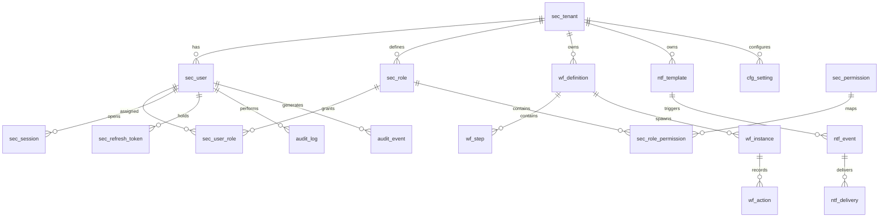

# ERD_01 — Foundation Domain

**Document:** Enterprise ERD — Foundation Domain  
**Version:** 1.0  
**Status:** Draft for Architecture Review  
**Schema:** `foundation`, `audit`, `config`  
**Aligned To:** BRD v1.0 · FRD-01 · SDD v1.1 · DBS v1.1 · Architecture Lock v1.1  
**Classification:** Internal — Confidential  

---

## 1. Module Overview

The Foundation Domain is the platform backbone for all ERP modules. It provides centralized **Authentication**, **Authorization**, **RBAC**, **Tenant Management**, **Session Management**, **Workflow Engine**, **Notification Engine**, **Audit System**, and **System Configuration**.

| Sub-Module | Tables | Purpose |
|------------|--------|---------|
| Tenant Management | `sec_tenant` | Multi-tenant root entity |
| Authentication | `sec_user`, `sec_session`, `sec_refresh_token` | Identity and token lifecycle |
| Authorization / RBAC | `sec_role`, `sec_permission`, `sec_user_role`, `sec_role_permission` | Permission-driven access |
| Workflow Engine | `wf_definition`, `wf_step`, `wf_instance`, `wf_action` | Approval orchestration (C-04) |
| Notification Engine | `ntf_template`, `ntf_event`, `ntf_delivery` | Multi-channel notifications (C-05) |
| Audit System | `audit_log`, `audit_event` | Central audit (C-06, DG-06) |
| Configuration | `cfg_setting` | Hierarchical system settings |

**Table count:** 18  
**PostgreSQL:** Single cluster, logical schema separation per DBS §14  

---

## 2. Scope

### In Scope
- Tenant, user, role, permission, session, and token data models
- Workflow definition and runtime instance tracking
- Notification template, event, and delivery tracking
- Append-only audit logging
- System/tenant/company/branch configuration keys

### Out of Scope
- Organization hierarchy (`org_*`) — ERD_02
- Business master data (`master_*`) — ERD_03
- Business transactions (`trx_*`)
- Authentication implementation code, SQLAlchemy models, Alembic scripts

### Assumptions
- `sec_user` links to `master_employee` in Sprint 2+ (optional FK, nullable until HR module)
- Password hashes stored encrypted; never plaintext (DBS §39)
- All timestamps: `TIMESTAMPTZ` UTC
- All PKs: `UUID` (v7 recommended)

---

## 3. Business Entities

| Entity | Table | Classification | Description |
|--------|-------|----------------|-------------|
| Tenant | `sec_tenant` | Security | SaaS tenant root |
| User | `sec_user` | Security | Platform login identity |
| Role | `sec_role` | Security | Named role grouping |
| Permission | `sec_permission` | Security | Atomic resource action |
| User Role | `sec_user_role` | Security | User ↔ Role junction |
| Role Permission | `sec_role_permission` | Security | Role ↔ Permission junction |
| Session | `sec_session` | Security | Active Redis-backed session reference |
| Refresh Token | `sec_refresh_token` | Security | JWT refresh token store |
| Workflow Definition | `wf_definition` | Workflow | Approval flow template |
| Workflow Step | `wf_step` | Workflow | Step within a definition |
| Workflow Instance | `wf_instance` | Workflow | Runtime approval instance |
| Workflow Action | `wf_action` | Workflow | Immutable action history |
| Notification Template | `ntf_template` | Notification | Channel template |
| Notification Event | `ntf_event` | Notification | Triggered notification |
| Notification Delivery | `ntf_delivery` | Notification | Per-channel delivery attempt |
| Audit Log | `audit_log` | Audit | Entity-level change log |
| Audit Event | `audit_event` | Audit | System/security event log |
| System Setting | `cfg_setting` | Configuration | Key-value configuration |

---

## 4. Entity Relationship Diagram



```text
sec_tenant
    ├── sec_user ──┬── sec_user_role ── sec_role ── sec_role_permission ── sec_permission
    │              ├── sec_session
    │              └── sec_refresh_token
    ├── wf_definition ── wf_step
    │                 └── wf_instance ── wf_action
    ├── ntf_template ── ntf_event ── ntf_delivery
    ├── cfg_setting
    └── audit_log / audit_event (performed_by → sec_user)
```

---

## 5. Table Inventory

| # | Table | Schema | Classification | Soft Delete | Partition |
|---|-------|--------|----------------|-------------|-----------|
| 1 | `sec_tenant` | foundation | Security | Optional | No |
| 2 | `sec_user` | foundation | Security | Optional | No |
| 3 | `sec_role` | foundation | Security | Optional | No |
| 4 | `sec_permission` | foundation | Security | No | No |
| 5 | `sec_user_role` | foundation | Security | No | No |
| 6 | `sec_role_permission` | foundation | Security | No | No |
| 7 | `sec_session` | foundation | Security | No | Monthly |
| 8 | `sec_refresh_token` | foundation | Security | No | Monthly |
| 9 | `wf_definition` | foundation | Workflow | No | No |
| 10 | `wf_step` | foundation | Workflow | No | No |
| 11 | `wf_instance` | foundation | Workflow | No | Yearly |
| 12 | `wf_action` | foundation | Workflow | No | Yearly |
| 13 | `ntf_template` | foundation | Notification | Optional | No |
| 14 | `ntf_event` | foundation | Notification | No | Monthly |
| 15 | `ntf_delivery` | foundation | Notification | No | Monthly |
| 16 | `audit_log` | audit | Audit | No (append-only) | Yearly |
| 17 | `audit_event` | audit | Audit | No (append-only) | Yearly |
| 18 | `cfg_setting` | config | Configuration | Optional | No |

---

## 6. Table Definitions

### Standard Column Profiles (Reference)

| Profile | Columns |
|---------|---------|
| **AUDIT_STD** | `created_at`, `created_by`, `updated_at`, `updated_by`, `version` |
| **TENANT_STD** | `tenant_id UUID NOT NULL` |
| **SOFT_DELETE_OPT** | `is_deleted BOOLEAN DEFAULT FALSE`, `deleted_at TIMESTAMPTZ`, `deleted_by UUID` |

---

### 6.1 `sec_tenant`

#### 6.1.1 Purpose
Root multi-tenant entity. Every SaaS customer maps to one tenant.

#### 6.1.2 Columns

| Column | Type | Nullable | Default | Description |
|--------|------|----------|---------|-------------|
| `id` | UUID | NO | app-generated | PK |
| `tenant_code` | VARCHAR(50) | NO | — | Unique tenant code |
| `tenant_name` | VARCHAR(255) | NO | — | Display name |
| `status` | VARCHAR(30) | NO | `'active'` | active, suspended, inactive |
| `subscription_plan` | VARCHAR(50) | YES | — | Plan tier |
| `max_companies` | INTEGER | YES | — | License limit |
| `max_users` | INTEGER | YES | — | License limit |
| `timezone` | VARCHAR(50) | NO | `'UTC'` | Default tenant TZ |
| `locale` | VARCHAR(10) | NO | `'en'` | Default locale |
| `created_at` | TIMESTAMPTZ | NO | `now()` | Immutable |
| `created_by` | UUID | YES | — | System/bootstrap user |
| `updated_at` | TIMESTAMPTZ | NO | `now()` | — |
| `updated_by` | UUID | YES | — | — |
| `version` | INTEGER | NO | `1` | Optimistic lock |
| `is_deleted` | BOOLEAN | NO | `FALSE` | Soft delete |
| `deleted_at` | TIMESTAMPTZ | YES | — | — |
| `deleted_by` | UUID | YES | — | — |

#### 6.1.3 Primary Key
`pk_sec_tenant` → `id`

#### 6.1.4 Foreign Keys
None (root entity)

#### 6.1.5 Constraints
- `uk_sec_tenant_code` UNIQUE (`tenant_code`)
- `ck_sec_tenant_status` CHECK (`status` IN ('active','suspended','inactive'))

#### 6.1.6 Index Strategy
- `pk_sec_tenant` (id)
- `ux_sec_tenant_code` (tenant_code)
- `ix_sec_tenant_status` (status)

#### 6.1.7 Audit Columns
Full AUDIT_STD + SOFT_DELETE_OPT

#### 6.1.8 Soft Delete Rules
Soft delete allowed; suspended tenants retain data; cross-tenant access prohibited.

#### 6.1.9 Business Rules
- `tenant_code` immutable after creation
- Super Admin manages tenant lifecycle
- No physical DELETE

---

### 6.2 `sec_user`

#### 6.2.1 Purpose
Platform login identity for all user types (Super Admin, Company Admin, Branch Admin, Manager, Employee).

#### 6.2.2 Columns

| Column | Type | Nullable | Default | Description |
|--------|------|----------|---------|-------------|
| `id` | UUID | NO | app-generated | PK |
| `tenant_id` | UUID | NO | — | FK → sec_tenant |
| `email` | VARCHAR(255) | NO | — | Login email |
| `password_hash` | VARCHAR(255) | NO | — | bcrypt/argon2 hash |
| `display_name` | VARCHAR(255) | NO | — | — |
| `user_type` | VARCHAR(30) | NO | — | super_admin, company_admin, branch_admin, manager, employee |
| `status` | VARCHAR(30) | NO | `'active'` | draft, active, locked, inactive |
| `mfa_enabled` | BOOLEAN | NO | `FALSE` | MFA flag |
| `mfa_secret_encrypted` | TEXT | YES | — | Encrypted TOTP secret |
| `last_login_at` | TIMESTAMPTZ | YES | — | — |
| `failed_login_count` | INTEGER | NO | `0` | Lockout counter |
| `locked_until` | TIMESTAMPTZ | YES | — | Account lock expiry |
| `employee_id` | UUID | YES | — | FK → master_employee (ERD_03, future) |
| `created_at` | TIMESTAMPTZ | NO | `now()` | — |
| `created_by` | UUID | YES | — | — |
| `updated_at` | TIMESTAMPTZ | NO | `now()` | — |
| `updated_by` | UUID | YES | — | — |
| `version` | INTEGER | NO | `1` | — |
| `is_deleted` | BOOLEAN | NO | `FALSE` | — |
| `deleted_at` | TIMESTAMPTZ | YES | — | — |
| `deleted_by` | UUID | YES | — | — |

#### 6.2.3 Primary Key
`pk_sec_user` → `id`

#### 6.2.4 Foreign Keys
- `fk_sec_user_tenant` → `sec_tenant(id)` ON DELETE RESTRICT ON UPDATE CASCADE

#### 6.2.5 Constraints
- `uk_sec_user_tenant_email` UNIQUE (`tenant_id`, `email`)
- `ck_sec_user_type` CHECK on `user_type`
- `ck_sec_user_status` CHECK on `status`

#### 6.2.6 Index Strategy
- `pk_sec_user` (id)
- `ux_sec_user_tenant_email` (tenant_id, email)
- `ix_sec_user_tenant_id` (tenant_id)
- `ix_sec_user_status` (status)
- `ix_sec_user_employee_id` (employee_id)

#### 6.2.7 Audit Columns
Full AUDIT_STD + SOFT_DELETE_OPT

#### 6.2.8 Soft Delete Rules
Soft delete optional per DBS Security matrix; no physical DELETE.

#### 6.2.9 Business Rules
- Password never plaintext; `password_hash` encrypted at rest per DBS §39
- Email unique per tenant
- MFA Ready per FRD-01
- Account lockout after configurable failed attempts

---

### 6.3 `sec_role`

#### 6.3.1 Purpose
Named role for RBAC grouping (e.g., Finance Manager, HR Admin).

#### 6.3.2 Columns

| Column | Type | Nullable | Description |
|--------|------|----------|-------------|
| `id` | UUID | NO | PK |
| `tenant_id` | UUID | NO | FK → sec_tenant |
| `role_code` | VARCHAR(100) | NO | Unique per tenant |
| `role_name` | VARCHAR(255) | NO | — |
| `description` | TEXT | YES | — |
| `is_system_role` | BOOLEAN | NO | DEFAULT FALSE — system roles non-deletable |
| `status` | VARCHAR(30) | NO | active, inactive |
| `created_at` | TIMESTAMPTZ | NO | — |
| `created_by` | UUID | YES | — |
| `updated_at` | TIMESTAMPTZ | NO | — |
| `updated_by` | UUID | YES | — |
| `version` | INTEGER | NO | `1` | — |
| `is_deleted` | BOOLEAN | NO | `FALSE` | — |
| `deleted_at` | TIMESTAMPTZ | YES | — | — |
| `deleted_by` | UUID | YES | — | — |

#### 6.3.3 Primary Key
`pk_sec_role` → `id`

#### 6.3.4 Foreign Keys
- `fk_sec_role_tenant` → `sec_tenant(id)` ON DELETE RESTRICT ON UPDATE CASCADE

#### 6.3.5 Constraints
- `uk_sec_role_tenant_code` UNIQUE (`tenant_id`, `role_code`)
- `ck_sec_role_status` CHECK on `status`

#### 6.3.6 Index Strategy
- `pk_sec_role` (id)
- `ux_sec_role_tenant_code` (tenant_id, role_code)
- `ix_sec_role_tenant_id` (tenant_id)
- `ix_sec_role_status` (status)

#### 6.3.7 Audit Columns
Full AUDIT_STD

#### 6.3.8 Soft Delete Rules
Soft delete optional; system roles cannot be physically deleted.

#### 6.3.9 Business Rules
- `role_code` unique per tenant
- System roles seeded at tenant provisioning

---

### 6.4 `sec_permission`

#### 6.4.1 Purpose
Atomic permission: `resource:action` (e.g., `sales.order:approve`).

#### 6.4.2 Columns

| Column | Type | Nullable | Description |
|--------|------|----------|-------------|
| `id` | UUID | NO | PK |
| `permission_code` | VARCHAR(150) | NO | Globally unique code |
| `resource` | VARCHAR(100) | NO | Module/resource |
| `action` | VARCHAR(50) | NO | create, read, update, delete, approve, export |
| `description` | TEXT | YES | — |
| `module` | VARCHAR(50) | NO | Domain module |
| `is_active` | BOOLEAN | NO | DEFAULT TRUE |
| `created_at` | TIMESTAMPTZ | NO | — |
| `created_by` | UUID | YES | — |

#### 6.4.3 Primary Key
`pk_sec_permission` → `id`

#### 6.4.4 Foreign Keys
None (global permission catalog)

#### 6.4.5 Constraints
- `uk_sec_permission_code` UNIQUE (`permission_code`)

#### 6.4.6 Index Strategy
- `pk_sec_permission` (id)
- `ux_sec_permission_code` (permission_code)
- `ix_sec_permission_module` (module)
- `ix_sec_permission_resource` (resource)

#### 6.4.7 Audit Columns
`created_at`, `created_by` only (reference catalog)

#### 6.4.8 Soft Delete Rules
No soft delete — use `is_active` (Reference-style per DBS)

#### 6.4.9 Business Rules
- Global permission catalog seeded via migration
- Permission codes immutable after release

---

### 6.5 `sec_user_role`

#### 6.5.1 Purpose
Junction table assigning roles to users.

#### 6.5.2 Columns

| Column | Type | Nullable | Description |
|--------|------|----------|-------------|
| `id` | UUID | NO | PK |
| `tenant_id` | UUID | NO | FK → sec_tenant |
| `user_id` | UUID | NO | FK → sec_user |
| `role_id` | UUID | NO | FK → sec_role |
| `assigned_at` | TIMESTAMPTZ | NO | `now()` | — |
| `assigned_by` | UUID | YES | FK → sec_user |
| `expires_at` | TIMESTAMPTZ | YES | — | Optional expiry |

#### 6.5.3 Primary Key
`pk_sec_user_role` → `id`

#### 6.5.4 Foreign Keys
- `fk_sec_user_role_tenant` → `sec_tenant(id)`
- `fk_sec_user_role_user` → `sec_user(id)`
- `fk_sec_user_role_role` → `sec_role(id)`

#### 6.5.5 Constraints
- `uk_sec_user_role` UNIQUE (`user_id`, `role_id`)

#### 6.5.6 Index Strategy
- `pk_sec_user_role` (id)
- `ux_sec_user_role` (user_id, role_id)
- `ix_sec_user_role_tenant_id` (tenant_id)
- `ix_sec_user_role_role_id` (role_id)

#### 6.5.7 Audit Columns
`assigned_at`, `assigned_by`

#### 6.5.8 Soft Delete Rules
No soft delete — revoke by DELETE with audit event

#### 6.5.9 Business Rules
- User may hold multiple roles
- Role assignment audited via `audit_event`

---

### 6.6 `sec_role_permission`

#### 6.6.1 Purpose
Junction table granting permissions to roles.

#### 6.6.2 Columns

| Column | Type | Nullable | Description |
|--------|------|----------|-------------|
| `id` | UUID | NO | PK |
| `tenant_id` | UUID | NO | FK → sec_tenant |
| `role_id` | UUID | NO | FK → sec_role |
| `permission_id` | UUID | NO | FK → sec_permission |
| `granted_at` | TIMESTAMPTZ | NO | `now()` | — |
| `granted_by` | UUID | YES | FK → sec_user |

#### 6.6.3 Primary Key
`pk_sec_role_permission` → `id`

#### 6.6.4 Foreign Keys
- `fk_sec_role_permission_tenant` → `sec_tenant(id)`
- `fk_sec_role_permission_role` → `sec_role(id)`
- `fk_sec_role_permission_permission` → `sec_permission(id)`

#### 6.6.5 Constraints
- `uk_sec_role_permission` UNIQUE (`role_id`, `permission_id`)

#### 6.6.6 Index Strategy
- `pk_sec_role_permission` (id)
- `ux_sec_role_permission` (role_id, permission_id)
- `ix_sec_role_permission_tenant_id` (tenant_id)

#### 6.6.7 Audit Columns
`granted_at`, `granted_by`

#### 6.6.8 Soft Delete Rules
No soft delete

#### 6.6.9 Business Rules
- Permission changes audited
- Effective permissions = union of all role permissions

---

### 6.7 `sec_session`

#### 6.7.1 Purpose
Active session reference (Redis is primary; DB for audit/revocation).

#### 6.7.2 Columns

| Column | Type | Nullable | Description |
|--------|------|----------|-------------|
| `id` | UUID | NO | PK — session ID |
| `tenant_id` | UUID | NO | FK → sec_tenant |
| `user_id` | UUID | NO | FK → sec_user |
| `session_token_hash` | VARCHAR(255) | NO | Hashed token |
| `ip_address` | INET | YES | — |
| `user_agent` | TEXT | YES | — |
| `issued_at` | TIMESTAMPTZ | NO | — |
| `expires_at` | TIMESTAMPTZ | NO | — |
| `revoked_at` | TIMESTAMPTZ | YES | NULL = active |
| `revoked_by` | UUID | YES | FK → sec_user |

#### 6.7.3 Primary Key
`pk_sec_session` → `id`

#### 6.7.4 Foreign Keys
- `fk_sec_session_tenant` → `sec_tenant(id)`
- `fk_sec_session_user` → `sec_user(id)`

#### 6.7.5 Constraints
- `ck_sec_session_expiry` CHECK (`expires_at` > `issued_at`)

#### 6.7.6 Index Strategy
- `pk_sec_session` (id)
- `ix_sec_session_user_id` (user_id)
- `ix_sec_session_tenant_id` (tenant_id)
- `ix_sec_session_expires_at` (expires_at)

#### 6.7.7 Audit Columns
`issued_at` only (session lifecycle)

#### 6.7.8 Soft Delete Rules
No soft delete; sessions expire or revoke

#### 6.7.9 Business Rules
- Sessions revocable per DBS §39
- Redis primary read path; DB for persistence/audit

---

### 6.8 `sec_refresh_token`

#### 6.8.1 Purpose
JWT refresh token store with rotation support.

#### 6.8.2 Columns

| Column | Type | Nullable | Description |
|--------|------|----------|-------------|
| `id` | UUID | NO | PK |
| `tenant_id` | UUID | NO | FK → sec_tenant |
| `user_id` | UUID | NO | FK → sec_user |
| `session_id` | UUID | NO | FK → sec_session |
| `token_hash` | VARCHAR(255) | NO | Hashed refresh token |
| `issued_at` | TIMESTAMPTZ | NO | — |
| `expires_at` | TIMESTAMPTZ | NO | — |
| `revoked_at` | TIMESTAMPTZ | YES | — |
| `replaced_by` | UUID | YES | Token rotation chain |

#### 6.8.3 Primary Key
`pk_sec_refresh_token` → `id`

#### 6.8.4 Foreign Keys
- `fk_sec_refresh_token_tenant` → `sec_tenant(id)`
- `fk_sec_refresh_token_user` → `sec_user(id)`
- `fk_sec_refresh_token_session` → `sec_session(id)`

#### 6.8.5 Constraints
- `ck_sec_refresh_token_expiry` CHECK (`expires_at` > `issued_at`)

#### 6.8.6 Index Strategy
- `pk_sec_refresh_token` (id)
- `ix_sec_refresh_token_user_id` (user_id)
- `ix_sec_refresh_token_session_id` (session_id)
- `ix_sec_refresh_token_expires_at` (expires_at)

#### 6.8.7 Audit Columns
`issued_at`, `revoked_at`

#### 6.8.8 Soft Delete Rules
No soft delete; purge after expiry

#### 6.8.9 Business Rules
- Token rotation on refresh
- Hashed storage only

---

### 6.9 `wf_definition`

#### 6.9.1 Purpose
Workflow template per module/document type.

#### 6.9.2 Columns

| Column | Type | Nullable | Description |
|--------|------|----------|-------------|
| `id` | UUID | NO | PK |
| `tenant_id` | UUID | NO | FK → sec_tenant |
| `workflow_code` | VARCHAR(100) | NO | UK per tenant |
| `workflow_name` | VARCHAR(255) | NO | — |
| `module` | VARCHAR(50) | NO | e.g., procurement, sales |
| `document_type` | VARCHAR(100) | NO | e.g., purchase_order |
| `version_no` | INTEGER | NO | Definition version |
| `is_active` | BOOLEAN | NO | DEFAULT TRUE |
| `config_json` | JSONB | YES | Parallel approval rules, escalation |
| `created_at` | TIMESTAMPTZ | NO | — |
| `created_by` | UUID | YES | — |
| `updated_at` | TIMESTAMPTZ | NO | — |
| `updated_by` | UUID | YES | — |

#### 6.9.3 Primary Key
`pk_wf_definition` → `id`

#### 6.9.4 Foreign Keys
- `fk_wf_definition_tenant` → `sec_tenant(id)`

#### 6.9.5 Constraints
- `uk_wf_definition_tenant_code` UNIQUE (`tenant_id`, `workflow_code`, `version_no`)

#### 6.9.6 Index Strategy
- `pk_wf_definition` (id)
- `ux_wf_definition_tenant_code` (tenant_id, workflow_code, version_no)
- `ix_wf_definition_module` (module)

#### 6.9.7 Audit Columns
`created_at`, `created_by`, `updated_at`, `updated_by`

#### 6.9.8 Soft Delete Rules
No soft delete per Workflow matrix — use `is_active`

#### 6.9.9 Business Rules
- All business approvals through Workflow Engine (C-04)
- Versioned definitions; running instances retain original version

---

### 6.10 `wf_step`

#### 6.10.1 Purpose
Individual approval step within a workflow definition.

#### 6.10.2 Columns

| Column | Type | Nullable | Description |
|--------|------|----------|-------------|
| `id` | UUID | NO | PK |
| `tenant_id` | UUID | NO | FK → sec_tenant |
| `workflow_id` | UUID | NO | FK → wf_definition |
| `step_order` | INTEGER | NO | Sequence |
| `step_code` | VARCHAR(100) | NO | — |
| `step_name` | VARCHAR(255) | NO | — |
| `approver_type` | VARCHAR(50) | NO | role, user, manager, department_head |
| `approver_ref` | UUID | YES | Role/user reference |
| `is_parallel` | BOOLEAN | NO | DEFAULT FALSE |
| `sla_hours` | INTEGER | YES | Escalation SLA |
| `created_at` | TIMESTAMPTZ | NO | — |
| `created_by` | UUID | YES | — |

#### 6.10.3 Primary Key
`pk_wf_step` → `id`

#### 6.10.4 Foreign Keys
- `fk_wf_step_tenant` → `sec_tenant(id)`
- `fk_wf_step_workflow` → `wf_definition(id)`

#### 6.10.5 Constraints
- `uk_wf_step_order` UNIQUE (`workflow_id`, `step_order`)

#### 6.10.6 Index Strategy
- `pk_wf_step` (id)
- `ux_wf_step_order` (workflow_id, step_order)

#### 6.10.7 Audit Columns
`created_at`, `created_by`

#### 6.10.8 Soft Delete Rules
No soft delete

#### 6.10.9 Business Rules
- Parallel approvals supported per DBS §31
- Escalations logged in `wf_action`

---

### 6.11 `wf_instance`

#### 6.11.1 Purpose
Runtime workflow for a business document.

#### 6.11.2 Columns

| Column | Type | Nullable | Description |
|--------|------|----------|-------------|
| `id` | UUID | NO | PK |
| `tenant_id` | UUID | NO | FK → sec_tenant |
| `company_id` | UUID | NO | FK → org_company (ERD_02) |
| `workflow_id` | UUID | NO | FK → wf_definition |
| `entity_name` | VARCHAR(100) | NO | Source table |
| `entity_id` | UUID | NO | Source document PK |
| `current_step_id` | UUID | YES | FK → wf_step |
| `status` | VARCHAR(30) | NO | pending, approved, rejected, cancelled |
| `started_at` | TIMESTAMPTZ | NO | — |
| `completed_at` | TIMESTAMPTZ | YES | — |
| `started_by` | UUID | NO | FK → sec_user |
| `created_at` | TIMESTAMPTZ | NO | — |
| `updated_at` | TIMESTAMPTZ | NO | — |

#### 6.11.3 Primary Key
`pk_wf_instance` → `id`

#### 6.11.4 Foreign Keys
- `fk_wf_instance_tenant` → `sec_tenant(id)`
- `fk_wf_instance_company` → `org_company(id)`
- `fk_wf_instance_workflow` → `wf_definition(id)`
- `fk_wf_instance_step` → `wf_step(id)`
- `fk_wf_instance_started_by` → `sec_user(id)`

#### 6.11.5 Constraints
- `ck_wf_instance_status` CHECK on `status`

#### 6.11.6 Index Strategy
- `pk_wf_instance` (id)
- `ix_wf_instance_entity` (entity_name, entity_id)
- `ix_wf_instance_tenant_id` (tenant_id)
- `ix_wf_instance_status` (status)
- `ix_wf_instance_started_at` (started_at)

#### 6.11.7 Audit Columns
`started_at`, `started_by`, `created_at`, `updated_at`

#### 6.11.8 Soft Delete Rules
No soft delete; immutable history via `wf_action`

#### 6.11.9 Business Rules
- One active instance per document (enforced at service layer)
- Partition by `started_at` yearly

---

### 6.12 `wf_action`

#### 6.12.1 Purpose
Immutable approval action log.

#### 6.12.2 Columns

| Column | Type | Nullable | Description |
|--------|------|----------|-------------|
| `id` | UUID | NO | PK |
| `tenant_id` | UUID | NO | FK → sec_tenant |
| `instance_id` | UUID | NO | FK → wf_instance |
| `step_id` | UUID | NO | FK → wf_step |
| `action` | VARCHAR(30) | NO | approve, reject, delegate, escalate |
| `comments` | TEXT | YES | — |
| `performed_by` | UUID | NO | FK → sec_user |
| `performed_at` | TIMESTAMPTZ | NO | — |
| `ip_address` | INET | YES | — |

#### 6.12.3 Primary Key
`pk_wf_action` → `id`

#### 6.12.4 Foreign Keys
- `fk_wf_action_tenant` → `sec_tenant(id)`
- `fk_wf_action_instance` → `wf_instance(id)`
- `fk_wf_action_step` → `wf_step(id)`
- `fk_wf_action_performed_by` → `sec_user(id)`

#### 6.12.5 Constraints
- `ck_wf_action_type` CHECK on `action`

#### 6.12.6 Index Strategy
- `pk_wf_action` (id)
- `ix_wf_action_instance_id` (instance_id)
- `ix_wf_action_performed_at` (performed_at)

#### 6.12.7 Audit Columns
Append-only; `performed_at`, `performed_by`

#### 6.12.8 Soft Delete Rules
No updates or deletes (immutable per DBS §31)

#### 6.12.9 Business Rules
- Every action timestamped
- Partition yearly

---

### 6.13 `ntf_template`

#### 6.13.1 Purpose
Notification channel template.

#### 6.13.2 Columns

| Column | Type | Nullable | Description |
|--------|------|----------|-------------|
| `id` | UUID | NO | PK |
| `tenant_id` | UUID | NO | FK → sec_tenant |
| `template_code` | VARCHAR(100) | NO | UK per tenant |
| `template_name` | VARCHAR(255) | NO | — |
| `channel` | VARCHAR(30) | NO | email, sms, push, in_app |
| `subject_template` | TEXT | YES | — |
| `body_template` | TEXT | NO | — |
| `locale` | VARCHAR(10) | NO | DEFAULT 'en' |
| `is_active` | BOOLEAN | NO | DEFAULT TRUE |
| `created_at` | TIMESTAMPTZ | NO | — |
| `created_by` | UUID | YES | — |
| `updated_at` | TIMESTAMPTZ | NO | — |
| `updated_by` | UUID | YES | — |
| `is_deleted` | BOOLEAN | NO | DEFAULT FALSE |
| `deleted_at` | TIMESTAMPTZ | YES | — |
| `deleted_by` | UUID | YES | — |

#### 6.13.3 Primary Key
`pk_ntf_template` → `id`

#### 6.13.4 Foreign Keys
- `fk_ntf_template_tenant` → `sec_tenant(id)`

#### 6.13.5 Constraints
- `uk_ntf_template_code` UNIQUE (`tenant_id`, `template_code`, `channel`)

#### 6.13.6 Index Strategy
- `pk_ntf_template` (id)
- `ux_ntf_template_code` (tenant_id, template_code, channel)

#### 6.13.7 Audit Columns
Full AUDIT_STD + SOFT_DELETE_OPT

#### 6.13.8 Soft Delete Rules
Optional per Notification matrix

#### 6.13.9 Business Rules
- All notifications through Notification Engine (C-05)
- Multi-channel support per DBS §36

---

### 6.14 `ntf_event`

#### 6.14.1 Purpose
Triggered notification event.

#### 6.14.2 Columns

| Column | Type | Nullable | Description |
|--------|------|----------|-------------|
| `id` | UUID | NO | PK |
| `tenant_id` | UUID | NO | FK → sec_tenant |
| `template_id` | UUID | NO | FK → ntf_template |
| `event_type` | VARCHAR(100) | NO | e.g., order_approved |
| `recipient_user_id` | UUID | YES | FK → sec_user |
| `recipient_address` | VARCHAR(255) | YES | Email/phone override |
| `payload_json` | JSONB | YES | Template variables |
| `status` | VARCHAR(30) | NO | queued, sent, failed |
| `created_at` | TIMESTAMPTZ | NO | — |

#### 6.14.3 Primary Key
`pk_ntf_event` → `id`

#### 6.14.4 Foreign Keys
- `fk_ntf_event_tenant` → `sec_tenant(id)`
- `fk_ntf_event_template` → `ntf_template(id)`
- `fk_ntf_event_recipient` → `sec_user(id)`

#### 6.14.5 Constraints
- `ck_ntf_event_status` CHECK on `status`

#### 6.14.6 Index Strategy
- `pk_ntf_event` (id)
- `ix_ntf_event_tenant_id` (tenant_id)
- `ix_ntf_event_status` (status)
- `ix_ntf_event_created_at` (created_at)

#### 6.14.7 Audit Columns
`created_at` only

#### 6.14.8 Soft Delete Rules
No soft delete

#### 6.14.9 Business Rules
- Partition monthly by `created_at`

---

### 6.15 `ntf_delivery`

#### 6.15.1 Purpose
Per-channel delivery attempt tracking.

#### 6.15.2 Columns

| Column | Type | Nullable | Description |
|--------|------|----------|-------------|
| `id` | UUID | NO | PK |
| `tenant_id` | UUID | NO | FK → sec_tenant |
| `event_id` | UUID | NO | FK → ntf_event |
| `channel` | VARCHAR(30) | NO | — |
| `attempt_no` | INTEGER | NO | DEFAULT 1 |
| `status` | VARCHAR(30) | NO | success, failed, retrying |
| `provider_response` | TEXT | YES | — |
| `delivered_at` | TIMESTAMPTZ | YES | — |

#### 6.15.3 Primary Key
`pk_ntf_delivery` → `id`

#### 6.15.4 Foreign Keys
- `fk_ntf_delivery_tenant` → `sec_tenant(id)`
- `fk_ntf_delivery_event` → `ntf_event(id)`

#### 6.15.5 Constraints
- `ck_ntf_delivery_status` CHECK on `status`

#### 6.15.6 Index Strategy
- `pk_ntf_delivery` (id)
- `ix_ntf_delivery_event_id` (event_id)

#### 6.15.7 Audit Columns
`delivered_at`

#### 6.15.8 Soft Delete Rules
No soft delete

#### 6.15.9 Business Rules
- Retry mechanism supported per DBS §36
- Delivery status tracked per channel

---

### 6.16 `audit_log`

#### 6.16.1 Purpose
Entity change audit log (DBS §32).

#### 6.16.2 Columns

| Column | Type | Nullable | Description |
|--------|------|----------|-------------|
| `id` | UUID | NO | PK |
| `tenant_id` | UUID | YES | — |
| `company_id` | UUID | YES | — |
| `entity_name` | VARCHAR(100) | NO | — |
| `entity_id` | UUID | NO | — |
| `operation` | VARCHAR(30) | NO | create, update, soft_delete, approve |
| `old_value` | JSONB | YES | — |
| `new_value` | JSONB | YES | — |
| `performed_by` | UUID | YES | FK → sec_user |
| `performed_at` | TIMESTAMPTZ | NO | — |
| `ip_address` | INET | YES | — |
| `user_agent` | TEXT | YES | — |
| `request_id` | VARCHAR(100) | YES | Correlation ID |

#### 6.16.3 Primary Key
`pk_audit_log` → `id`

#### 6.16.4 Foreign Keys
- `fk_audit_log_performed_by` → `sec_user(id)`

#### 6.16.5 Constraints
- `ck_audit_log_operation` CHECK on `operation`

#### 6.16.6 Index Strategy
- `pk_audit_log` (id)
- `ix_audit_log_entity` (entity_name, entity_id)
- `ix_audit_log_performed_at` (performed_at)
- `ix_audit_log_tenant_id` (tenant_id)

#### 6.16.7 Audit Columns
N/A — this is the audit table

#### 6.16.8 Soft Delete Rules
Append-only; no updates or deletes

#### 6.16.9 Business Rules
- 10-year minimum retention
- Partition yearly by `performed_at`

---

### 6.17 `audit_event`

#### 6.17.1 Purpose
Security/system events (login, logout, role change).

#### 6.17.2 Columns

| Column | Type | Nullable | Description |
|--------|------|----------|-------------|
| `id` | UUID | NO | PK |
| `tenant_id` | UUID | YES | — |
| `event_type` | VARCHAR(100) | NO | login, logout, mfa_challenge, permission_denied |
| `severity` | VARCHAR(20) | NO | info, warning, critical |
| `user_id` | UUID | YES | FK → sec_user |
| `details_json` | JSONB | YES | — |
| `performed_at` | TIMESTAMPTZ | NO | — |
| `ip_address` | INET | YES | — |

#### 6.17.3 Primary Key
`pk_audit_event` → `id`

#### 6.17.4 Foreign Keys
- `fk_audit_event_user` → `sec_user(id)`

#### 6.17.5 Constraints
- `ck_audit_event_severity` CHECK on `severity`

#### 6.17.6 Index Strategy
- `pk_audit_event` (id)
- `ix_audit_event_type` (event_type)
- `ix_audit_event_performed_at` (performed_at)
- `ix_audit_event_user_id` (user_id)

#### 6.17.7 Audit Columns
N/A — append-only event log

#### 6.17.8 Soft Delete Rules
No updates or deletes

#### 6.17.9 Business Rules
- All auditable security operations logged (DG-06)
- Partition yearly

---

### 6.18 `cfg_setting`

#### 6.18.1 Purpose
Hierarchical configuration (DBS §34).

#### 6.18.2 Columns

| Column | Type | Nullable | Description |
|--------|------|----------|-------------|
| `id` | UUID | NO | PK |
| `tenant_id` | UUID | YES | FK → sec_tenant (nullable for global) |
| `company_id` | UUID | YES | FK → org_company (nullable) |
| `branch_id` | UUID | YES | FK → org_branch (nullable) |
| `setting_key` | VARCHAR(150) | NO | — |
| `setting_value` | TEXT | NO | — |
| `value_type` | VARCHAR(30) | NO | string, integer, boolean, json |
| `scope` | VARCHAR(30) | NO | global, tenant, company, branch |
| `is_encrypted` | BOOLEAN | NO | DEFAULT FALSE |
| `description` | TEXT | YES | — |
| `created_at` | TIMESTAMPTZ | NO | — |
| `created_by` | UUID | YES | — |
| `updated_at` | TIMESTAMPTZ | NO | — |
| `updated_by` | UUID | YES | — |
| `version` | INTEGER | NO | DEFAULT 1 |
| `is_deleted` | BOOLEAN | NO | DEFAULT FALSE |
| `deleted_at` | TIMESTAMPTZ | YES | — |
| `deleted_by` | UUID | YES | — |

#### 6.18.3 Primary Key
`pk_cfg_setting` → `id`

#### 6.18.4 Foreign Keys
- `fk_cfg_setting_tenant` → `sec_tenant(id)`
- `fk_cfg_setting_company` → `org_company(id)`
- `fk_cfg_setting_branch` → `org_branch(id)`

#### 6.18.5 Constraints
- `uk_cfg_setting_scope_key` UNIQUE (`tenant_id`, `company_id`, `branch_id`, `setting_key`) NULLS NOT DISTINCT

#### 6.18.6 Index Strategy
- `pk_cfg_setting` (id)
- `ux_cfg_setting_scope_key` (tenant_id, company_id, branch_id, setting_key)
- `ix_cfg_setting_scope` (scope)

#### 6.18.7 Audit Columns
Full AUDIT_STD + SOFT_DELETE_OPT

#### 6.18.8 Soft Delete Rules
Optional; encrypted values for sensitive settings

#### 6.18.9 Business Rules
- Hierarchical override: branch > company > tenant > global
- Version controlled per DBS §34

---

## 7. Relationship Matrix

| Parent | Child | Cardinality | FK Column |
|--------|-------|-------------|-----------|
| sec_tenant | sec_user | 1:N | tenant_id |
| sec_tenant | sec_role | 1:N | tenant_id |
| sec_user | sec_user_role | 1:N | user_id |
| sec_role | sec_user_role | 1:N | role_id |
| sec_role | sec_role_permission | 1:N | role_id |
| sec_permission | sec_role_permission | 1:N | permission_id |
| sec_user | sec_session | 1:N | user_id |
| sec_user | sec_refresh_token | 1:N | user_id |
| wf_definition | wf_step | 1:N | workflow_id |
| wf_definition | wf_instance | 1:N | workflow_id |
| wf_instance | wf_action | 1:N | instance_id |
| ntf_template | ntf_event | 1:N | template_id |
| ntf_event | ntf_delivery | 1:N | event_id |
| sec_user | audit_log | 1:N | performed_by |
| sec_user | audit_event | 1:N | user_id |

---

## 8. Cross Module Dependencies

| This Module | Depends On | Relationship |
|-------------|------------|--------------|
| Foundation | Organization (ERD_02) | `wf_instance.company_id`, `cfg_setting.company_id/branch_id` |
| Foundation | Master Data (ERD_03) | `sec_user.employee_id` → `master_employee` |
| All Modules | Foundation | RBAC permissions, workflow, notifications, audit |

**Rule (C-02):** No module reads another module's tables directly — access via service APIs. FKs are logical integrity references within same PostgreSQL cluster.

---

## 9. Data Flow

```text
Login Request
    → sec_user (validate)
    → sec_session + sec_refresh_token (create)
    → audit_event (login)

Business Document Submit
    → wf_instance (create from wf_definition)
    → wf_action (approve/reject steps)
    → ntf_event → ntf_delivery (notify approver)
    → audit_log (entity change)

Configuration Change
    → cfg_setting (upsert)
    → audit_log (record change)
```

---

## 10. Performance Considerations

- `sec_user`: index `(tenant_id, email)` for login lookup < 50ms
- `sec_role_permission`: materialized permission cache in Redis (SDD)
- `audit_log` / `audit_event`: append-only, partition by year; OLTP target < 200ms insert
- `wf_instance`: index `(entity_name, entity_id)` for document lookup
- `sec_session`: TTL-aligned purge job; Redis primary read path

---

## 11. Partition Strategy

| Table | Strategy | Key |
|-------|----------|-----|
| audit_log | RANGE yearly | performed_at |
| audit_event | RANGE yearly | performed_at |
| wf_instance | RANGE yearly | started_at |
| wf_action | RANGE yearly | performed_at |
| sec_session | RANGE monthly | issued_at |
| ntf_event | RANGE monthly | created_at |

---

## 12. Archival Strategy

| Table | Retention | Archival |
|-------|-----------|----------|
| audit_log | 10 years minimum | Move to cold storage after 3 years |
| audit_event | 10 years | Same |
| sec_session | 90 days after expiry | Purge |
| sec_refresh_token | 30 days after expiry | Purge |
| wf_action | 10 years | Archive with wf_instance |

---

## 13. Security Classification

| Table | Classification |
|-------|----------------|
| sec_user | Restricted (credentials) |
| sec_session, sec_refresh_token | Restricted |
| sec_role, sec_permission | Confidential |
| audit_log, audit_event | Confidential |
| cfg_setting (encrypted keys) | Confidential |
| wf_*, ntf_* | Internal |

---

## 14. Data Retention

Per DBS: audit minimum 10 years; session/token ephemeral per policy above; configuration retained until soft-deleted + approval for permanent removal.

---

## 15. Sample Records

```json
{
  "sec_tenant": { "tenant_code": "ABCGRP", "tenant_name": "ABC Group", "status": "active" },
  "sec_user": { "email": "admin@abc.com", "user_type": "super_admin", "status": "active" },
  "sec_role": { "role_code": "FINANCE_MANAGER", "role_name": "Finance Manager" },
  "sec_permission": { "permission_code": "finance.invoice:approve", "resource": "finance.invoice", "action": "approve" },
  "wf_definition": { "workflow_code": "PO_APPROVAL", "module": "procurement", "document_type": "purchase_order" },
  "cfg_setting": { "setting_key": "auth.mfa.required", "setting_value": "true", "scope": "tenant" }
}
```

---

## 16. Data Dictionary

| Term | Definition |
|------|------------|
| Tenant | Top-level SaaS customer isolation boundary |
| Permission | Atomic `resource:action` grant unit |
| Workflow Instance | Runtime approval process for one document |
| Audit Log | Entity field-level change record |
| Setting Scope | Configuration inheritance level (global → branch) |

---

*End of ERD_01 — Foundation Domain*
