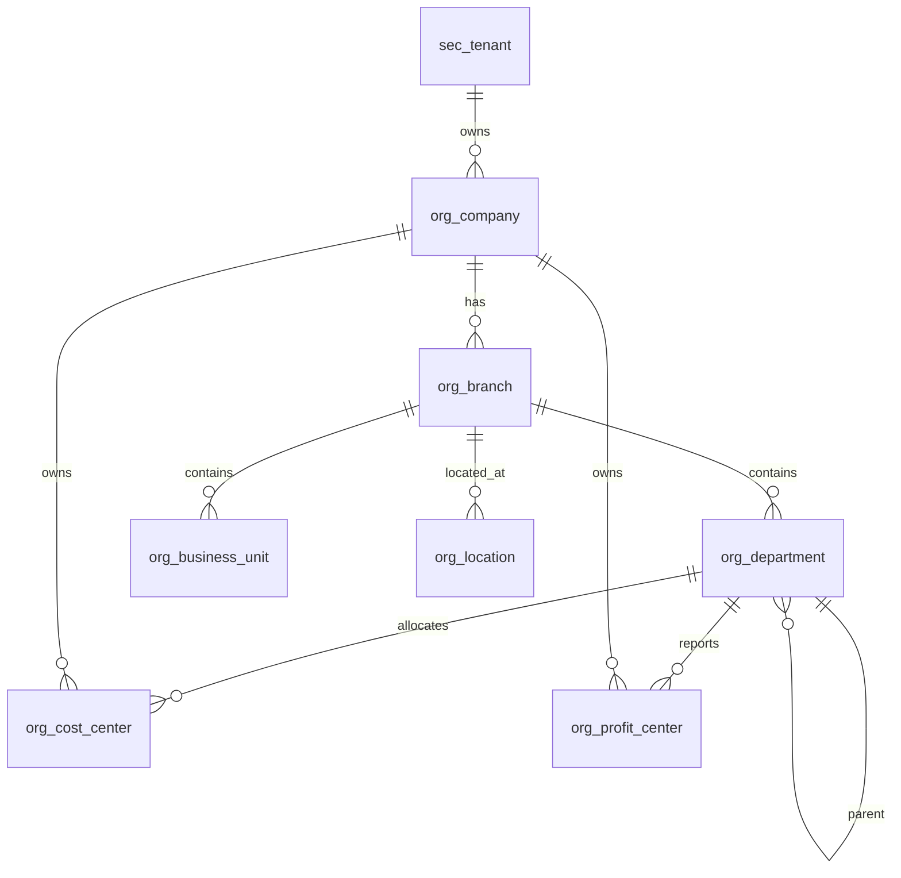

# ERD_02 — Organization Domain

**Document:** Enterprise ERD — Organization Domain  
**Version:** 1.0  
**Status:** Draft for Architecture Review  
**Schema:** `organization`  
**Aligned To:** BRD v1.0 · FRD-02 · SDD v1.1 · DBS v1.1 · Architecture Lock v1.1  
**Classification:** Internal — Confidential  

---

## 1. Module Overview

The Organization Domain defines the legal, operational, and reporting hierarchy for the ERP platform. All business modules reference this structure for tenant isolation, financial books, and organizational reporting.

### Organization Hierarchy

```text
Tenant
    ↓
Company
    ↓
Branch
    ↓
Business Unit
    ↓
Department
    ↓
Cost Center / Profit Center
```

Location entities support geographic and physical site management.

| Sub-Module | Table | Purpose |
|------------|-------|---------|
| Company Management | `org_company` | Legal entity |
| Branch Management | `org_branch` | Operating site |
| Department Management | `org_department` | Functional unit |
| Business Unit | `org_business_unit` | Division grouping |
| Location | `org_location` | Physical/geographic site |
| Cost Center | `org_cost_center` | Cost allocation unit |
| Profit Center | `org_profit_center` | Profitability unit |

**Table count:** 7  
**PostgreSQL Schema:** `organization` per DBS §14  

---

## 2. Scope

### In Scope
- Multi-tenant company hierarchy
- Branch, department, business unit structure
- Cost center and profit center for Finance integration
- Physical location management

### Out of Scope
- Security and authentication (`sec_*`) — ERD_01
- Business master data (`master_*`) — ERD_03
- Financial transactions (`trx_*`)
- SQLAlchemy models, Alembic migrations, application code

### Assumptions
- Every company belongs to exactly one `sec_tenant`
- `tenant_id`, `company_id`, `branch_id` propagated to all downstream transactional tables
- Cross-tenant joins strictly prohibited (DBS §Multi-Tenant)

### Dependencies
- `sec_tenant` (ERD_01) — upstream

---

## 3. Business Entities

| Entity | Table | Classification | Description |
|--------|-------|----------------|-------------|
| Company | `org_company` | Master | Legal company entity |
| Branch | `org_branch` | Master | Operating branch/site |
| Department | `org_department` | Master | Functional department |
| Business Unit | `org_business_unit` | Master | Division grouping |
| Location | `org_location` | Master | Physical location |
| Cost Center | `org_cost_center` | Master | Cost allocation unit |
| Profit Center | `org_profit_center` | Master | Profitability reporting unit |

---

## 4. Entity Relationship Diagram



```text
sec_tenant
    └── org_company
            ├── org_branch
            │       ├── org_department ── (self: parent_department_id)
            │       ├── org_business_unit
            │       └── org_location
            ├── org_cost_center
            └── org_profit_center
```

### Core Hierarchy (Mandatory Path)

```text
Tenant
    ↓
Company
    ↓
Branch
    ↓
Department
```

---

## 5. Table Inventory

| # | Table | Schema | Classification | tenant_id | company_id | branch_id | Soft Delete |
|---|-------|--------|----------------|-----------|------------|-----------|-------------|
| 1 | `org_company` | organization | Master | ✅ | self | — | ✅ |
| 2 | `org_branch` | organization | Master | ✅ | ✅ | self | ✅ |
| 3 | `org_department` | organization | Master | ✅ | ✅ | ✅ | ✅ |
| 4 | `org_business_unit` | organization | Master | ✅ | ✅ | ✅ | ✅ |
| 5 | `org_location` | organization | Master | ✅ | ✅ | ✅ | ✅ |
| 6 | `org_cost_center` | organization | Master | ✅ | ✅ | optional | ✅ |
| 7 | `org_profit_center` | organization | Master | ✅ | ✅ | optional | ✅ |

---

## 6. Table Definitions

### Standard Master Profile (DBS §28)

All `org_*` master tables include:

| Column Group | Columns |
|--------------|---------|
| Primary Key | `id UUID` |
| Tenant | `tenant_id UUID NOT NULL` |
| Audit | `created_at`, `created_by`, `updated_at`, `updated_by`, `version` |
| Soft Delete | `is_deleted`, `deleted_at`, `deleted_by` |
| Business | `code`, `name`, `status` |

---

### 6.1 `org_company`

#### 6.1.1 Purpose
Legal company entity under a tenant (FRD-02 §5). Each company maintains independent Chart of Accounts, Financial Books, Tax Configuration, and Fiscal Calendar per DBS multi-company rules.

#### 6.1.2 Columns

| Column | Type | Nullable | Default | Description |
|--------|------|----------|---------|-------------|
| `id` | UUID | NO | app-generated | PK |
| `tenant_id` | UUID | NO | — | FK → sec_tenant |
| `company_code` | VARCHAR(50) | NO | — | UK per tenant |
| `company_name` | VARCHAR(255) | NO | — | Display name |
| `legal_name` | VARCHAR(255) | NO | — | Registered legal name |
| `registration_number` | VARCHAR(100) | YES | — | Encrypted at rest |
| `tax_number` | VARCHAR(100) | YES | — | Encrypted at rest |
| `country_code` | VARCHAR(3) | NO | — | ISO 3166 |
| `currency_code` | VARCHAR(3) | NO | — | Base currency ISO 4217 |
| `fiscal_year_start_month` | SMALLINT | NO | `4` | 1–12 |
| `status` | VARCHAR(30) | NO | `'active'` | draft, active, inactive |
| `created_at` | TIMESTAMPTZ | NO | `now()` | Immutable |
| `created_by` | UUID | YES | — | — |
| `updated_at` | TIMESTAMPTZ | NO | `now()` | — |
| `updated_by` | UUID | YES | — | — |
| `version` | INTEGER | NO | `1` | Optimistic lock |
| `is_deleted` | BOOLEAN | NO | `FALSE` | — |
| `deleted_at` | TIMESTAMPTZ | YES | — | — |
| `deleted_by` | UUID | YES | — | — |

#### 6.1.3 Primary Key
`pk_org_company` → `id`

#### 6.1.4 Foreign Keys
- `fk_org_company_tenant` → `sec_tenant(id)` ON DELETE RESTRICT ON UPDATE CASCADE

#### 6.1.5 Constraints
- `uk_org_company_tenant_code` UNIQUE (`tenant_id`, `company_code`)
- `ck_org_company_status` CHECK (`status` IN ('draft','active','inactive'))
- `ck_org_company_fiscal_month` CHECK (`fiscal_year_start_month` BETWEEN 1 AND 12)

#### 6.1.6 Index Strategy
- `pk_org_company` (id)
- `ux_org_company_tenant_code` (tenant_id, company_code)
- `ix_org_company_tenant_id` (tenant_id)
- `ix_org_company_status` (status)
- `ix_org_company_name` (company_name)

#### 6.1.7 Audit Columns
Full audit standard per DBS §28

#### 6.1.8 Soft Delete Rules
Physical DELETE prohibited; soft delete with `is_deleted = true`

#### 6.1.9 Business Rules
- `company_code` unique per tenant; immutable after creation
- Tax and registration numbers encrypted (DBS §Security)
- Company Admin access scoped to own company (FRD-01)

---

### 6.2 `org_branch`

#### 6.2.1 Purpose
Operating branch or site under a company (FRD-02 §3 Level 3).

#### 6.2.2 Columns

| Column | Type | Nullable | Description |
|--------|------|----------|-------------|
| `id` | UUID | NO | PK |
| `tenant_id` | UUID | NO | FK → sec_tenant |
| `company_id` | UUID | NO | FK → org_company |
| `branch_code` | VARCHAR(50) | NO | UK per company |
| `branch_name` | VARCHAR(255) | NO | — |
| `branch_type` | VARCHAR(30) | NO | head_office, regional, warehouse, retail |
| `address_line1` | VARCHAR(255) | YES | — |
| `address_line2` | VARCHAR(255) | YES | — |
| `city` | VARCHAR(100) | YES | — |
| `state_code` | VARCHAR(20) | YES | — |
| `postal_code` | VARCHAR(20) | YES | — |
| `country_code` | VARCHAR(3) | YES | — |
| `phone` | VARCHAR(30) | YES | — |
| `email` | VARCHAR(255) | YES | — |
| `status` | VARCHAR(30) | NO | draft, active, inactive |
| AUDIT_STD + SOFT_DELETE_OPT | | | |

#### 6.2.3 Primary Key
`pk_org_branch` → `id`

#### 6.2.4 Foreign Keys
- `fk_org_branch_tenant` → `sec_tenant(id)`
- `fk_org_branch_company` → `org_company(id)` ON DELETE RESTRICT

#### 6.2.5 Constraints
- `uk_org_branch_company_code` UNIQUE (`company_id`, `branch_code`)
- `ck_org_branch_type` CHECK on `branch_type`
- `ck_org_branch_status` CHECK on `status`

#### 6.2.6 Index Strategy
- `pk_org_branch` (id)
- `ux_org_branch_company_code` (company_id, branch_code)
- `ix_org_branch_tenant_id` (tenant_id)
- `ix_org_branch_company_id` (company_id)
- `ix_org_branch_status` (status)

#### 6.2.7 Audit Columns
Full audit standard

#### 6.2.8 Soft Delete Rules
Soft delete only; no physical DELETE

#### 6.2.9 Business Rules
- `branch_id` mandatory on all downstream transactional tables
- Branch Admin access scoped to own branch (FRD-01)
- Inter-branch transfers follow dedicated workflows (DBS)

---

### 6.3 `org_department`

#### 6.3.1 Purpose
Functional department within a branch (FRD-02 §3 Level 5).

#### 6.3.2 Columns

| Column | Type | Nullable | Description |
|--------|------|----------|-------------|
| `id` | UUID | NO | PK |
| `tenant_id` | UUID | NO | FK → sec_tenant |
| `company_id` | UUID | NO | FK → org_company |
| `branch_id` | UUID | NO | FK → org_branch |
| `department_code` | VARCHAR(50) | NO | UK per branch |
| `department_name` | VARCHAR(255) | NO | — |
| `parent_department_id` | UUID | YES | Self-FK → org_department |
| `head_employee_id` | UUID | YES | FK → master_employee (ERD_03) |
| `status` | VARCHAR(30) | NO | draft, active, inactive |
| AUDIT_STD + SOFT_DELETE_OPT | | | |

#### 6.3.3 Primary Key
`pk_org_department` → `id`

#### 6.3.4 Foreign Keys
- `fk_org_department_tenant` → `sec_tenant(id)`
- `fk_org_department_company` → `org_company(id)`
- `fk_org_department_branch` → `org_branch(id)`
- `fk_org_department_parent` → `org_department(id)`
- `fk_org_department_head` → `master_employee(id)` (deferred)

#### 6.3.5 Constraints
- `uk_org_department_branch_code` UNIQUE (`branch_id`, `department_code`)

#### 6.3.6 Index Strategy
- `pk_org_department` (id)
- `ux_org_department_branch_code` (branch_id, department_code)
- `ix_org_department_company_id` (company_id)
- `ix_org_department_parent_id` (parent_department_id)

#### 6.3.7 Audit Columns
Full audit standard

#### 6.3.8 Soft Delete Rules
Soft delete only

#### 6.3.9 Business Rules
- Supports hierarchical department tree via `parent_department_id`
- Manager access scoped to department (FRD-01)

---

### 6.4 `org_business_unit`

#### 6.4.1 Purpose
Business division grouping within a branch (FRD-02 §3 Level 4).

#### 6.4.2 Columns

| Column | Type | Nullable | Description |
|--------|------|----------|-------------|
| `id` | UUID | NO | PK |
| `tenant_id` | UUID | NO | FK → sec_tenant |
| `company_id` | UUID | NO | FK → org_company |
| `branch_id` | UUID | NO | FK → org_branch |
| `business_unit_code` | VARCHAR(50) | NO | UK per branch |
| `business_unit_name` | VARCHAR(255) | NO | — |
| `manager_employee_id` | UUID | YES | FK → master_employee |
| `status` | VARCHAR(30) | NO | draft, active, inactive |
| AUDIT_STD + SOFT_DELETE_OPT | | | |

#### 6.4.3 Primary Key
`pk_org_business_unit` → `id`

#### 6.4.4 Foreign Keys
- `fk_org_business_unit_tenant` → `sec_tenant(id)`
- `fk_org_business_unit_company` → `org_company(id)`
- `fk_org_business_unit_branch` → `org_branch(id)`

#### 6.4.5 Constraints
- `uk_org_business_unit_branch_code` UNIQUE (`branch_id`, `business_unit_code`)

#### 6.4.6 Index Strategy
- `pk_org_business_unit` (id)
- `ux_org_business_unit_branch_code` (branch_id, business_unit_code)
- `ix_org_business_unit_company_id` (company_id)

#### 6.4.7 Audit Columns
Full audit standard

#### 6.4.8 Soft Delete Rules
Soft delete only

#### 6.4.9 Business Rules
- Examples: Manufacturing, Retail, Services (FRD-02)

---

### 6.5 `org_location`

#### 6.5.1 Purpose
Physical or geographic location linked to a branch.

#### 6.5.2 Columns

| Column | Type | Nullable | Description |
|--------|------|----------|-------------|
| `id` | UUID | NO | PK |
| `tenant_id` | UUID | NO | FK → sec_tenant |
| `company_id` | UUID | NO | FK → org_company |
| `branch_id` | UUID | NO | FK → org_branch |
| `location_code` | VARCHAR(50) | NO | UK per branch |
| `location_name` | VARCHAR(255) | NO | — |
| `location_type` | VARCHAR(30) | NO | office, warehouse, plant, store |
| `latitude` | NUMERIC(10,7) | YES | — |
| `longitude` | NUMERIC(10,7) | YES | — |
| `address_line1` | VARCHAR(255) | YES | — |
| `address_line2` | VARCHAR(255) | YES | — |
| `city` | VARCHAR(100) | YES | — |
| `state_code` | VARCHAR(20) | YES | — |
| `postal_code` | VARCHAR(20) | YES | — |
| `country_code` | VARCHAR(3) | YES | — |
| `status` | VARCHAR(30) | NO | draft, active, inactive |
| AUDIT_STD + SOFT_DELETE_OPT | | | |

#### 6.5.3 Primary Key
`pk_org_location` → `id`

#### 6.5.4 Foreign Keys
- `fk_org_location_tenant` → `sec_tenant(id)`
- `fk_org_location_company` → `org_company(id)`
- `fk_org_location_branch` → `org_branch(id)`

#### 6.5.5 Constraints
- `uk_org_location_branch_code` UNIQUE (`branch_id`, `location_code`)

#### 6.5.6 Index Strategy
- `pk_org_location` (id)
- `ux_org_location_branch_code` (branch_id, location_code)
- `ix_org_location_company_id` (company_id)

#### 6.5.7 Audit Columns
Full audit standard

#### 6.5.8 Soft Delete Rules
Soft delete only

#### 6.5.9 Business Rules
- Referenced by `master_warehouse` and `master_asset` (ERD_03)

---

### 6.6 `org_cost_center`

#### 6.6.1 Purpose
Cost allocation unit for expense tracking (FRD-02 §3 Level 6).

#### 6.6.2 Columns

| Column | Type | Nullable | Description |
|--------|------|----------|-------------|
| `id` | UUID | NO | PK |
| `tenant_id` | UUID | NO | FK → sec_tenant |
| `company_id` | UUID | NO | FK → org_company |
| `branch_id` | UUID | YES | FK → org_branch (optional) |
| `department_id` | UUID | YES | FK → org_department |
| `cost_center_code` | VARCHAR(50) | NO | UK per company |
| `cost_center_name` | VARCHAR(255) | NO | — |
| `valid_from` | DATE | NO | — |
| `valid_to` | DATE | YES | — |
| `status` | VARCHAR(30) | NO | draft, active, inactive |
| AUDIT_STD + SOFT_DELETE_OPT | | | |

#### 6.6.3 Primary Key
`pk_org_cost_center` → `id`

#### 6.6.4 Foreign Keys
- `fk_org_cost_center_tenant` → `sec_tenant(id)`
- `fk_org_cost_center_company` → `org_company(id)`
- `fk_org_cost_center_branch` → `org_branch(id)`
- `fk_org_cost_center_department` → `org_department(id)`

#### 6.6.5 Constraints
- `uk_org_cost_center_company_code` UNIQUE (`company_id`, `cost_center_code`)
- `ck_org_cost_center_dates` CHECK (`valid_to` IS NULL OR `valid_to` >= `valid_from`)

#### 6.6.6 Index Strategy
- `pk_org_cost_center` (id)
- `ux_org_cost_center_company_code` (company_id, cost_center_code)
- `ix_org_cost_center_department_id` (department_id)

#### 6.6.7 Audit Columns
Full audit standard

#### 6.6.8 Soft Delete Rules
Soft delete only

#### 6.6.9 Business Rules
- Used by Finance, HR, Projects for cost allocation (FRD-02)
- Examples: Sales Delhi, HR Corporate, Production Unit 1

---

### 6.7 `org_profit_center`

#### 6.7.1 Purpose
Profitability reporting unit (FRD-02 §3 Level 7).

#### 6.7.2 Columns

| Column | Type | Nullable | Description |
|--------|------|----------|-------------|
| `id` | UUID | NO | PK |
| `tenant_id` | UUID | NO | FK → sec_tenant |
| `company_id` | UUID | NO | FK → org_company |
| `branch_id` | UUID | YES | FK → org_branch |
| `department_id` | UUID | YES | FK → org_department |
| `profit_center_code` | VARCHAR(50) | NO | UK per company |
| `profit_center_name` | VARCHAR(255) | NO | — |
| `valid_from` | DATE | NO | — |
| `valid_to` | DATE | YES | — |
| `status` | VARCHAR(30) | NO | draft, active, inactive |
| AUDIT_STD + SOFT_DELETE_OPT | | | |

#### 6.7.3 Primary Key
`pk_org_profit_center` → `id`

#### 6.7.4 Foreign Keys
- `fk_org_profit_center_tenant` → `sec_tenant(id)`
- `fk_org_profit_center_company` → `org_company(id)`
- `fk_org_profit_center_branch` → `org_branch(id)`
- `fk_org_profit_center_department` → `org_department(id)`

#### 6.7.5 Constraints
- `uk_org_profit_center_company_code` UNIQUE (`company_id`, `profit_center_code`)

#### 6.7.6 Index Strategy
- `pk_org_profit_center` (id)
- `ux_org_profit_center_company_code` (company_id, profit_center_code)

#### 6.7.7 Audit Columns
Full audit standard

#### 6.7.8 Soft Delete Rules
Soft delete only

#### 6.7.9 Business Rules
- Used for profitability analysis (FRD-02)
- Examples: Retail Division, Manufacturing Division

---

## 7. Relationship Matrix

| Parent | Child | Cardinality | FK Column |
|--------|-------|-------------|-----------|
| sec_tenant | org_company | 1:N | tenant_id |
| org_company | org_branch | 1:N | company_id |
| org_branch | org_department | 1:N | branch_id |
| org_branch | org_business_unit | 1:N | branch_id |
| org_branch | org_location | 1:N | branch_id |
| org_department | org_cost_center | 1:N | department_id |
| org_department | org_profit_center | 1:N | department_id |
| org_department | org_department | 1:N | parent_department_id |
| org_company | org_cost_center | 1:N | company_id |
| org_company | org_profit_center | 1:N | company_id |

---

## 8. Cross Module Dependencies

| Consumer Module | Uses Organization Entity | FK Columns |
|-----------------|--------------------------|------------|
| Foundation (ERD_01) | org_company, org_branch | cfg_setting, wf_instance |
| Master Data (ERD_03) | org_company, org_branch, org_department | company_id, branch_id, department_id |
| Finance (FRD-04) | org_cost_center, org_profit_center | cost/profit allocation |
| HR/Payroll (FRD-09/10) | org_department, org_branch | employee assignment |
| All trx_* modules | org_company, org_branch | tenant_id, company_id, branch_id |

**Rule (C-02):** Cross-module access via service APIs only.

---

## 9. Data Flow

```text
Tenant Onboarding
    → sec_tenant (ERD_01)
    → org_company (create legal entity)
    → org_branch (create HQ branch)
    → org_department (create default departments)
    → cfg_setting (company-level config, ERD_01)

Employee Assignment (ERD_03)
    → master_employee references org_company, org_branch, org_department

Financial Posting (future FRD-04)
    → trx_* references org_cost_center, org_profit_center
```

---

## 10. Performance Considerations

- Organization tree queries: recursive CTE on `org_department.parent_department_id`
- Index `(branch_id, parent_department_id)` for tree traversal
- List APIs: pagination default 25, max 200 (DBS)
- Cache active company/branch list in Redis (reference data pattern per SDD)
- OLTP query target < 200ms

---

## 11. Partition Strategy

No partitioning for `org_*` master tables (low volume, read-heavy). Review at 10M+ rows per EARB guidance.

---

## 12. Archival Strategy

- Inactive companies/branches: `status = inactive` then soft delete
- Future SCD Type 2 via `hist_*` tables for compliance tracking
- Permanent purge requires EARB approval

---

## 13. Security Classification

| Table | Classification |
|-------|----------------|
| org_company | Confidential (tax/registration numbers encrypted) |
| org_branch | Internal |
| org_department | Internal |
| org_business_unit | Internal |
| org_location | Internal |
| org_cost_center | Internal |
| org_profit_center | Internal |

---

## 14. Data Retention

Retained for life of tenant. Soft delete only. Permanent purge requires documented EARB approval per DBS.

---

## 15. Sample Records

```json
{
  "org_company": {
    "company_code": "ABC-IN",
    "company_name": "ABC India Pvt Ltd",
    "legal_name": "ABC India Private Limited",
    "country_code": "IND",
    "currency_code": "INR",
    "status": "active"
  },
  "org_branch": {
    "branch_code": "DEL-HQ",
    "branch_name": "Delhi Head Office",
    "branch_type": "head_office",
    "status": "active"
  },
  "org_department": {
    "department_code": "FIN",
    "department_name": "Finance",
    "status": "active"
  },
  "org_cost_center": {
    "cost_center_code": "CC-FIN-DEL",
    "cost_center_name": "Finance Delhi",
    "status": "active"
  },
  "org_profit_center": {
    "profit_center_code": "PC-RETAIL",
    "profit_center_name": "Retail Division",
    "status": "active"
  }
}
```

---

## 16. Data Dictionary

| Term | Definition |
|------|------------|
| Tenant | Top-level SaaS isolation boundary (sec_tenant) |
| Company | Legal entity with independent financial books |
| Branch | Physical or operational site under a company |
| Department | Functional organizational unit |
| Business Unit | Division-level grouping (Manufacturing, Retail, Services) |
| Cost Center | Unit for expense and cost allocation |
| Profit Center | Unit for revenue and profitability analysis |
| Location | Geographic/physical site reference |

---

*End of ERD_02 — Organization Domain*
