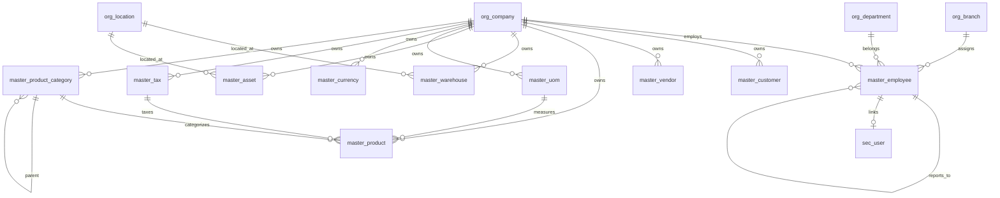

# ERD_03 — Master Data Domain

**Document:** Enterprise ERD — Master Data Domain  
**Version:** 1.0  
**Status:** Draft for Architecture Review  
**Schema:** `master`  
**Aligned To:** BRD v1.0 · FRD-03 · SDD v1.1 · DBS v1.1 · Architecture Lock v1.1  
**Classification:** Internal — Confidential  

---

## 1. Module Overview

The Master Data Domain is the central repository for core business entities consumed by all downstream ERP modules. It enforces **single source of truth** (C-01), prohibits duplicate master records (DA-03), and ensures cross-module consistency.

### Enterprise Master Data Modules

| Module | Table | Primary Consumers |
|--------|-------|-------------------|
| Employee Master | `master_employee` | HR, Payroll, Projects, Assets, Helpdesk, Workflow |
| Customer Master | `master_customer` | CRM, Sales, Finance, Helpdesk |
| Vendor Master | `master_vendor` | Procurement, Finance |
| Product Master | `master_product` | Sales, Inventory, Manufacturing |
| Product Category | `master_product_category` | Product hierarchy |
| UOM Master | `master_uom` | Product, Inventory |
| Currency Master | `master_currency` | Finance, multi-currency |
| Tax Master | `master_tax` | Finance, Sales, Procurement |
| Asset Master | `master_asset` | Asset Management, Finance |
| Warehouse Master | `master_warehouse` | Inventory, SCM |

**Table count:** 10  
**PostgreSQL Schema:** `master` per DBS §14  

---

## 2. Scope

### In Scope
- Company-scoped master entity definitions
- Tenant isolation on all master records
- Audit, versioning, and soft delete per DBS §28
- Master data governance rules per FRD-03

### Out of Scope
- Business transactions (`trx_*`)
- Global reference catalogs (`ref_country`, `ref_state`) — separate seed data
- SQLAlchemy models, Alembic migrations, application code
- History tables (`hist_*`) — Phase 2 SCD Type 2

### Assumptions
- All masters require `tenant_id` and `company_id`
- Business codes unique per company
- `branch_id` required where operational scope applies
- Physical DELETE prohibited on all master tables

### Dependencies
- `sec_tenant` (ERD_01) — upstream
- `org_company`, `org_branch`, `org_department` (ERD_02) — upstream

---

## 3. Business Entities

| Entity | Table | UK Scope | Referenced By (FRD-03) |
|--------|-------|----------|------------------------|
| Employee | `master_employee` | company + employee_code | HR, Payroll, Projects, Assets, Helpdesk, Workflow |
| Customer | `master_customer` | company + customer_code | CRM, Sales, Finance, Helpdesk |
| Vendor | `master_vendor` | company + vendor_code | Procurement, Finance |
| Product | `master_product` | company + product_code | Sales, Inventory, Manufacturing |
| Product Category | `master_product_category` | company + category_code | Product hierarchy |
| UOM | `master_uom` | company + uom_code | Product, Inventory |
| Currency | `master_currency` | company + currency_code | Finance |
| Tax | `master_tax` | company + tax_code | Finance, Sales, Procurement |
| Asset | `master_asset` | company + asset_code | Asset Management, Finance |
| Warehouse | `master_warehouse` | company + warehouse_code | Inventory, SCM |

---

## 4. Entity Relationship Diagram



```text
org_company
    ├── master_employee ── org_branch, org_department
    ├── master_customer
    ├── master_vendor
    ├── master_product ── master_product_category, master_uom, master_tax
    ├── master_product_category (self-referencing)
    ├── master_uom
    ├── master_currency
    ├── master_tax
    ├── master_asset ── org_location
    └── master_warehouse ── org_location, org_branch
```

---

## 5. Table Inventory

| # | Table | Classification | tenant_id | company_id | branch_id | Soft Delete | Version |
|---|-------|----------------|-----------|------------|-----------|-------------|---------|
| 1 | `master_employee` | Master | ✅ | ✅ | ✅ | ✅ | ✅ |
| 2 | `master_customer` | Master | ✅ | ✅ | ✅ | ✅ | ✅ |
| 3 | `master_vendor` | Master | ✅ | ✅ | ✅ | ✅ | ✅ |
| 4 | `master_product` | Master | ✅ | ✅ | ✅ | ✅ | ✅ |
| 5 | `master_product_category` | Master | ✅ | ✅ | optional | ✅ | ✅ |
| 6 | `master_uom` | Master | ✅ | ✅ | — | ✅ | ✅ |
| 7 | `master_currency` | Master | ✅ | ✅ | — | ✅ | ✅ |
| 8 | `master_tax` | Master | ✅ | ✅ | — | ✅ | ✅ |
| 9 | `master_asset` | Master | ✅ | ✅ | ✅ | ✅ | ✅ |
| 10 | `master_warehouse` | Master | ✅ | ✅ | ✅ | ✅ | ✅ |

All tables include full audit columns per DBS §28 and Common Mandatory Columns Matrix §41.

---

## 6. Table Definitions

### Standard Master Profile (DBS §28)

| Column Group | Columns |
|--------------|---------|
| Primary Key | `id UUID` (v7 recommended) |
| Tenant | `tenant_id UUID NOT NULL` |
| Company | `company_id UUID NOT NULL` |
| Business Key | `{entity}_code VARCHAR(50-100) NOT NULL` |
| Name | `{entity}_name VARCHAR(255) NOT NULL` |
| Status | `status VARCHAR(30) NOT NULL` |
| Audit | `created_at`, `created_by`, `updated_at`, `updated_by`, `version` |
| Soft Delete | `is_deleted`, `deleted_at`, `deleted_by` |

---

### 6.1 `master_employee`

#### 6.1.1 Purpose
Central employee repository (FRD-03 §4). Single source of truth for all employee references across HR, Payroll, Projects, Assets, and Helpdesk.

#### 6.1.2 Columns

| Column | Type | Nullable | Default | Description |
|--------|------|----------|---------|-------------|
| `id` | UUID | NO | app-generated | PK |
| `tenant_id` | UUID | NO | — | FK → sec_tenant |
| `company_id` | UUID | NO | — | FK → org_company |
| `branch_id` | UUID | NO | — | FK → org_branch |
| `department_id` | UUID | NO | — | FK → org_department |
| `employee_code` | VARCHAR(50) | NO | auto EMP-000001 | UK per company |
| `first_name` | VARCHAR(100) | NO | — | — |
| `last_name` | VARCHAR(100) | NO | — | — |
| `email` | VARCHAR(255) | NO | — | — |
| `mobile` | VARCHAR(30) | NO | — | — |
| `designation` | VARCHAR(100) | NO | — | Job title |
| `reporting_manager_id` | UUID | YES | — | Self-FK → master_employee |
| `date_of_joining` | DATE | NO | — | — |
| `date_of_leaving` | DATE | YES | — | — |
| `status` | VARCHAR(30) | NO | `'draft'` | draft, active, on_leave, resigned, terminated |
| `user_id` | UUID | YES | — | FK → sec_user (ERD_01) |
| `created_at` | TIMESTAMPTZ | NO | `now()` | — |
| `created_by` | UUID | YES | — | — |
| `updated_at` | TIMESTAMPTZ | NO | `now()` | — |
| `updated_by` | UUID | YES | — | — |
| `version` | INTEGER | NO | `1` | — |
| `is_deleted` | BOOLEAN | NO | `FALSE` | — |
| `deleted_at` | TIMESTAMPTZ | YES | — | — |
| `deleted_by` | UUID | YES | — | — |

#### 6.1.3 Primary Key
`pk_master_employee` → `id`

#### 6.1.4 Foreign Keys
- `fk_master_employee_tenant` → `sec_tenant(id)`
- `fk_master_employee_company` → `org_company(id)`
- `fk_master_employee_branch` → `org_branch(id)`
- `fk_master_employee_department` → `org_department(id)`
- `fk_master_employee_manager` → `master_employee(id)`
- `fk_master_employee_user` → `sec_user(id)`

#### 6.1.5 Constraints
- `uk_master_employee_company_code` UNIQUE (`company_id`, `employee_code`)
- `uk_master_employee_company_email` UNIQUE (`company_id`, `email`)
- `ck_master_employee_status` CHECK on `status`

#### 6.1.6 Index Strategy
- `pk_master_employee` (id)
- `ux_master_employee_company_code` (company_id, employee_code)
- `ix_master_employee_tenant_id` (tenant_id)
- `ix_master_employee_company_id` (company_id)
- `ix_master_employee_branch_id` (branch_id)
- `ix_master_employee_department_id` (department_id)
- `ix_master_employee_status` (status)
- `ix_master_employee_email` (email)

#### 6.1.7 Audit Columns
Full audit standard per DBS §28

#### 6.1.8 Soft Delete Rules
Physical DELETE prohibited; soft delete = archive per FRD-03 Rule 4

#### 6.1.9 Business Rules
- Employee code auto-generated: `EMP-000001` format
- No duplicate employees per company
- PII classified as Confidential
- Links to `sec_user` when platform access granted

---

### 6.2 `master_customer`

#### 6.2.1 Purpose
Maintain all customers (FRD-03 §5). Referenced by CRM, Sales, Finance, and Helpdesk.

#### 6.2.2 Columns

| Column | Type | Nullable | Description |
|--------|------|----------|-------------|
| `id` | UUID | NO | PK |
| `tenant_id` | UUID | NO | FK → sec_tenant |
| `company_id` | UUID | NO | FK → org_company |
| `branch_id` | UUID | NO | FK → org_branch |
| `customer_code` | VARCHAR(50) | NO | UK per company |
| `customer_name` | VARCHAR(255) | NO | — |
| `customer_type` | VARCHAR(30) | NO | individual, corporate, government |
| `tax_number` | VARCHAR(100) | YES | Encrypted at rest |
| `email` | VARCHAR(255) | YES | — |
| `mobile` | VARCHAR(30) | YES | — |
| `billing_address_json` | JSONB | NO | Structured address |
| `shipping_address_json` | JSONB | YES | Structured address |
| `credit_limit` | NUMERIC(18,2) | YES | — |
| `currency_code` | VARCHAR(3) | YES | ISO 4217 |
| `status` | VARCHAR(30) | NO | draft, active, inactive, blocked |
| AUDIT_STD + SOFT_DELETE_OPT | | | |

#### 6.2.3 Primary Key
`pk_master_customer` → `id`

#### 6.2.4 Foreign Keys
- `fk_master_customer_tenant` → `sec_tenant(id)`
- `fk_master_customer_company` → `org_company(id)`
- `fk_master_customer_branch` → `org_branch(id)`

#### 6.2.5 Constraints
- `uk_master_customer_company_code` UNIQUE (`company_id`, `customer_code`)
- `ck_master_customer_type` CHECK on `customer_type`

#### 6.2.6 Index Strategy
- `pk_master_customer` (id)
- `ux_master_customer_company_code` (company_id, customer_code)
- `ix_master_customer_tenant_id` (tenant_id)
- `ix_master_customer_name` (customer_name)
- `ix_master_customer_status` (status)

#### 6.2.7 Audit Columns
Full audit standard

#### 6.2.8 Soft Delete Rules
Soft delete only; no physical DELETE

#### 6.2.9 Business Rules
- Billing address mandatory
- Customer types: Individual, Corporate, Government (FRD-03)
- Tax number encrypted per DBS §Security

---

### 6.3 `master_vendor`

#### 6.3.1 Purpose
Maintain all vendors/suppliers (FRD-03). Referenced by Procurement and Finance.

#### 6.3.2 Columns

| Column | Type | Nullable | Description |
|--------|------|----------|-------------|
| `id` | UUID | NO | PK |
| `tenant_id` | UUID | NO | FK → sec_tenant |
| `company_id` | UUID | NO | FK → org_company |
| `branch_id` | UUID | NO | FK → org_branch |
| `vendor_code` | VARCHAR(50) | NO | UK per company |
| `vendor_name` | VARCHAR(255) | NO | — |
| `vendor_type` | VARCHAR(30) | NO | domestic, international, service |
| `tax_number` | VARCHAR(100) | YES | Encrypted |
| `email` | VARCHAR(255) | YES | — |
| `mobile` | VARCHAR(30) | YES | — |
| `payment_terms` | VARCHAR(50) | YES | — |
| `bank_details_encrypted` | TEXT | YES | Encrypted JSON |
| `address_json` | JSONB | YES | — |
| `status` | VARCHAR(30) | NO | draft, active, inactive, blocked |
| AUDIT_STD + SOFT_DELETE_OPT | | | |

#### 6.3.3 Primary Key
`pk_master_vendor` → `id`

#### 6.3.4 Foreign Keys
- `fk_master_vendor_tenant` → `sec_tenant(id)`
- `fk_master_vendor_company` → `org_company(id)`
- `fk_master_vendor_branch` → `org_branch(id)`

#### 6.3.5 Constraints
- `uk_master_vendor_company_code` UNIQUE (`company_id`, `vendor_code`)

#### 6.3.6 Index Strategy
- `pk_master_vendor` (id)
- `ux_master_vendor_company_code` (company_id, vendor_code)
- `ix_master_vendor_tenant_id` (tenant_id)
- `ix_master_vendor_status` (status)

#### 6.3.7 Audit Columns
Full audit standard

#### 6.3.8 Soft Delete Rules
Soft delete only

#### 6.3.9 Business Rules
- Bank details encrypted (DBS §Security)
- No duplicate vendors per company

---

### 6.4 `master_product`

#### 6.4.1 Purpose
Product and service catalog (FRD-03). Referenced by Sales, Inventory, and Manufacturing.

#### 6.4.2 Columns

| Column | Type | Nullable | Description |
|--------|------|----------|-------------|
| `id` | UUID | NO | PK |
| `tenant_id` | UUID | NO | FK → sec_tenant |
| `company_id` | UUID | NO | FK → org_company |
| `branch_id` | UUID | YES | FK → org_branch |
| `product_code` | VARCHAR(50) | NO | UK per company |
| `product_name` | VARCHAR(255) | NO | — |
| `product_type` | VARCHAR(30) | NO | goods, service, bundle |
| `category_id` | UUID | YES | FK → master_product_category |
| `uom_id` | UUID | NO | FK → master_uom |
| `tax_id` | UUID | YES | FK → master_tax |
| `barcode` | VARCHAR(50) | YES | — |
| `hsn_sac_code` | VARCHAR(20) | YES | Tax classification |
| `standard_cost` | NUMERIC(18,4) | YES | — |
| `list_price` | NUMERIC(18,4) | YES | — |
| `is_inventory_tracked` | BOOLEAN | NO | DEFAULT TRUE |
| `description` | TEXT | YES | — |
| `status` | VARCHAR(30) | NO | draft, active, inactive, discontinued |
| AUDIT_STD + SOFT_DELETE_OPT | | | |

#### 6.4.3 Primary Key
`pk_master_product` → `id`

#### 6.4.4 Foreign Keys
- `fk_master_product_tenant` → `sec_tenant(id)`
- `fk_master_product_company` → `org_company(id)`
- `fk_master_product_category` → `master_product_category(id)`
- `fk_master_product_uom` → `master_uom(id)`
- `fk_master_product_tax` → `master_tax(id)`

#### 6.4.5 Constraints
- `uk_master_product_company_code` UNIQUE (`company_id`, `product_code`)
- `ck_master_product_type` CHECK on `product_type`

#### 6.4.6 Index Strategy
- `pk_master_product` (id)
- `ux_master_product_company_code` (company_id, product_code)
- `ix_master_product_category_id` (category_id)
- `ix_master_product_barcode` (barcode)
- `ix_master_product_status` (status)

#### 6.4.7 Audit Columns
Full audit standard

#### 6.4.8 Soft Delete Rules
Soft delete only; discontinued products remain for historical transactions

#### 6.4.9 Business Rules
- UOM mandatory for all products
- Inventory-tracked flag controls stock module integration

---

### 6.5 `master_product_category`

#### 6.5.1 Purpose
Hierarchical product categorization.

#### 6.5.2 Columns

| Column | Type | Nullable | Description |
|--------|------|----------|-------------|
| `id` | UUID | NO | PK |
| `tenant_id` | UUID | NO | FK → sec_tenant |
| `company_id` | UUID | NO | FK → org_company |
| `category_code` | VARCHAR(50) | NO | UK per company |
| `category_name` | VARCHAR(255) | NO | — |
| `parent_category_id` | UUID | YES | Self-FK |
| `level` | SMALLINT | NO | DEFAULT 1 |
| `path` | VARCHAR(500) | YES | Materialized path |
| `status` | VARCHAR(30) | NO | active, inactive |
| AUDIT_STD + SOFT_DELETE_OPT | | | |

#### 6.5.3 Primary Key
`pk_master_product_category` → `id`

#### 6.5.4 Foreign Keys
- `fk_master_product_category_tenant` → `sec_tenant(id)`
- `fk_master_product_category_company` → `org_company(id)`
- `fk_master_product_category_parent` → `master_product_category(id)`

#### 6.5.5 Constraints
- `uk_master_product_category_company_code` UNIQUE (`company_id`, `category_code`)

#### 6.5.6 Index Strategy
- `pk_master_product_category` (id)
- `ux_master_product_category_company_code` (company_id, category_code)
- `ix_master_product_category_parent_id` (parent_category_id)
- `ix_master_product_category_path` (path)

#### 6.5.7 Audit Columns
Full audit standard

#### 6.5.8 Soft Delete Rules
Soft delete only

#### 6.5.9 Business Rules
- Supports multi-level category hierarchy
- Path maintained for efficient tree queries

---

### 6.6 `master_uom`

#### 6.6.1 Purpose
Unit of Measure master (FRD-03). Referenced by Product and Inventory modules.

#### 6.6.2 Columns

| Column | Type | Nullable | Description |
|--------|------|----------|-------------|
| `id` | UUID | NO | PK |
| `tenant_id` | UUID | NO | FK → sec_tenant |
| `company_id` | UUID | NO | FK → org_company |
| `uom_code` | VARCHAR(20) | NO | UK per company (e.g., KG, PCS) |
| `uom_name` | VARCHAR(100) | NO | — |
| `uom_type` | VARCHAR(30) | NO | weight, volume, count, length |
| `decimal_places` | SMALLINT | NO | DEFAULT 2 |
| `is_base_uom` | BOOLEAN | NO | DEFAULT FALSE |
| `status` | VARCHAR(30) | NO | active, inactive |
| AUDIT_STD + SOFT_DELETE_OPT | | | |

#### 6.6.3 Primary Key
`pk_master_uom` → `id`

#### 6.6.4 Foreign Keys
- `fk_master_uom_tenant` → `sec_tenant(id)`
- `fk_master_uom_company` → `org_company(id)`

#### 6.6.5 Constraints
- `uk_master_uom_company_code` UNIQUE (`company_id`, `uom_code`)

#### 6.6.6 Index Strategy
- `pk_master_uom` (id)
- `ux_master_uom_company_code` (company_id, uom_code)

#### 6.6.7 Audit Columns
Full audit standard

#### 6.6.8 Soft Delete Rules
Soft delete only

#### 6.6.9 Business Rules
- One base UOM per type per company recommended
- Company-scoped; complements global `ref_uom` seed data

---

### 6.7 `master_currency`

#### 6.7.1 Purpose
Company-level currency configuration with exchange rates (FRD-03).

#### 6.7.2 Columns

| Column | Type | Nullable | Description |
|--------|------|----------|-------------|
| `id` | UUID | NO | PK |
| `tenant_id` | UUID | NO | FK → sec_tenant |
| `company_id` | UUID | NO | FK → org_company |
| `currency_code` | VARCHAR(3) | NO | ISO 4217, UK per company |
| `currency_name` | VARCHAR(100) | NO | — |
| `symbol` | VARCHAR(10) | YES | — |
| `decimal_places` | SMALLINT | NO | DEFAULT 2 |
| `is_base_currency` | BOOLEAN | NO | DEFAULT FALSE |
| `exchange_rate` | NUMERIC(18,8) | YES | Rate to base currency |
| `rate_effective_date` | DATE | YES | — |
| `status` | VARCHAR(30) | NO | active, inactive |
| AUDIT_STD + SOFT_DELETE_OPT | | | |

#### 6.7.3 Primary Key
`pk_master_currency` → `id`

#### 6.7.4 Foreign Keys
- `fk_master_currency_tenant` → `sec_tenant(id)`
- `fk_master_currency_company` → `org_company(id)`

#### 6.7.5 Constraints
- `uk_master_currency_company_code` UNIQUE (`company_id`, `currency_code`)
- Exactly one `is_base_currency = true` per company (enforced at service layer)

#### 6.7.6 Index Strategy
- `pk_master_currency` (id)
- `ux_master_currency_company_code` (company_id, currency_code)

#### 6.7.7 Audit Columns
Full audit standard

#### 6.7.8 Soft Delete Rules
Soft delete only

#### 6.7.9 Business Rules
- Base currency aligns with `org_company.currency_code`
- Exchange rates versioned by `rate_effective_date`

---

### 6.8 `master_tax`

#### 6.8.1 Purpose
Tax configuration for Finance, Sales, and Procurement (FRD-03).

#### 6.8.2 Columns

| Column | Type | Nullable | Description |
|--------|------|----------|-------------|
| `id` | UUID | NO | PK |
| `tenant_id` | UUID | NO | FK → sec_tenant |
| `company_id` | UUID | NO | FK → org_company |
| `tax_code` | VARCHAR(50) | NO | UK per company |
| `tax_name` | VARCHAR(255) | NO | — |
| `tax_type` | VARCHAR(30) | NO | gst, vat, sales_tax, withholding |
| `rate_percent` | NUMERIC(8,4) | NO | — |
| `is_compound` | BOOLEAN | NO | DEFAULT FALSE |
| `effective_from` | DATE | NO | — |
| `effective_to` | DATE | YES | — |
| `status` | VARCHAR(30) | NO | active, inactive |
| AUDIT_STD + SOFT_DELETE_OPT | | | |

#### 6.8.3 Primary Key
`pk_master_tax` → `id`

#### 6.8.4 Foreign Keys
- `fk_master_tax_tenant` → `sec_tenant(id)`
- `fk_master_tax_company` → `org_company(id)`

#### 6.8.5 Constraints
- `uk_master_tax_company_code` UNIQUE (`company_id`, `tax_code`)
- `ck_master_tax_dates` CHECK (`effective_to` IS NULL OR `effective_to` >= `effective_from`)

#### 6.8.6 Index Strategy
- `pk_master_tax` (id)
- `ux_master_tax_company_code` (company_id, tax_code)
- `ix_master_tax_effective_from` (effective_from)

#### 6.8.7 Audit Columns
Full audit standard

#### 6.8.8 Soft Delete Rules
Soft delete only

#### 6.8.9 Business Rules
- Tax rates effective-dated for compliance
- Referenced by `master_product.tax_id`

---

### 6.9 `master_asset`

#### 6.9.1 Purpose
Fixed asset register (FRD-03). Referenced by Asset Management and Finance.

#### 6.9.2 Columns

| Column | Type | Nullable | Description |
|--------|------|----------|-------------|
| `id` | UUID | NO | PK |
| `tenant_id` | UUID | NO | FK → sec_tenant |
| `company_id` | UUID | NO | FK → org_company |
| `branch_id` | UUID | NO | FK → org_branch |
| `asset_code` | VARCHAR(50) | NO | UK per company |
| `asset_name` | VARCHAR(255) | NO | — |
| `asset_category` | VARCHAR(100) | NO | — |
| `serial_number` | VARCHAR(100) | YES | — |
| `purchase_date` | DATE | YES | — |
| `purchase_value` | NUMERIC(18,2) | YES | — |
| `location_id` | UUID | YES | FK → org_location |
| `custodian_employee_id` | UUID | YES | FK → master_employee |
| `depreciation_method` | VARCHAR(50) | YES | straight_line, declining_balance |
| `useful_life_months` | INTEGER | YES | — |
| `status` | VARCHAR(30) | NO | draft, active, disposed, written_off |
| AUDIT_STD + SOFT_DELETE_OPT | | | |

#### 6.9.3 Primary Key
`pk_master_asset` → `id`

#### 6.9.4 Foreign Keys
- `fk_master_asset_tenant` → `sec_tenant(id)`
- `fk_master_asset_company` → `org_company(id)`
- `fk_master_asset_branch` → `org_branch(id)`
- `fk_master_asset_location` → `org_location(id)`
- `fk_master_asset_custodian` → `master_employee(id)`

#### 6.9.5 Constraints
- `uk_master_asset_company_code` UNIQUE (`company_id`, `asset_code`)

#### 6.9.6 Index Strategy
- `pk_master_asset` (id)
- `ux_master_asset_company_code` (company_id, asset_code)
- `ix_master_asset_custodian_id` (custodian_employee_id)
- `ix_master_asset_status` (status)

#### 6.9.7 Audit Columns
Full audit standard

#### 6.9.8 Soft Delete Rules
Soft delete only; disposed assets retained for audit

#### 6.9.9 Business Rules
- Financial values post to Finance module (FRD-04)
- Custodian must be active employee

---

### 6.10 `master_warehouse`

#### 6.10.1 Purpose
Warehouse and storage location master (FRD-03). Referenced by Inventory and SCM.

#### 6.10.2 Columns

| Column | Type | Nullable | Description |
|--------|------|----------|-------------|
| `id` | UUID | NO | PK |
| `tenant_id` | UUID | NO | FK → sec_tenant |
| `company_id` | UUID | NO | FK → org_company |
| `branch_id` | UUID | NO | FK → org_branch |
| `warehouse_code` | VARCHAR(50) | NO | UK per company |
| `warehouse_name` | VARCHAR(255) | NO | — |
| `warehouse_type` | VARCHAR(30) | NO | central, transit, retail, quarantine |
| `location_id` | UUID | YES | FK → org_location |
| `is_default` | BOOLEAN | NO | DEFAULT FALSE |
| `address_json` | JSONB | YES | — |
| `status` | VARCHAR(30) | NO | active, inactive |
| AUDIT_STD + SOFT_DELETE_OPT | | | |

#### 6.10.3 Primary Key
`pk_master_warehouse` → `id`

#### 6.10.4 Foreign Keys
- `fk_master_warehouse_tenant` → `sec_tenant(id)`
- `fk_master_warehouse_company` → `org_company(id)`
- `fk_master_warehouse_branch` → `org_branch(id)`
- `fk_master_warehouse_location` → `org_location(id)`

#### 6.10.5 Constraints
- `uk_master_warehouse_company_code` UNIQUE (`company_id`, `warehouse_code`)

#### 6.10.6 Index Strategy
- `pk_master_warehouse` (id)
- `ux_master_warehouse_company_code` (company_id, warehouse_code)
- `ix_master_warehouse_branch_id` (branch_id)

#### 6.10.7 Audit Columns
Full audit standard

#### 6.10.8 Soft Delete Rules
Soft delete only

#### 6.10.9 Business Rules
- One default warehouse per branch recommended
- Quarantine warehouse for quality holds (FRD-14 integration)

---

## 7. Relationship Matrix

| Parent | Child | Cardinality | FK Column |
|--------|-------|-------------|-----------|
| org_company | all master_* | 1:N | company_id |
| org_branch | master_employee, master_warehouse, master_asset | 1:N | branch_id |
| org_department | master_employee | 1:N | department_id |
| org_location | master_warehouse, master_asset | 1:N | location_id |
| master_product_category | master_product | 1:N | category_id |
| master_product_category | master_product_category | 1:N | parent_category_id |
| master_uom | master_product | 1:N | uom_id |
| master_tax | master_product | 1:N | tax_id |
| master_employee | master_employee | 1:N | reporting_manager_id |
| master_employee | master_asset | 1:N | custodian_employee_id |
| master_employee | sec_user | 1:1 | user_id (reverse) |

---

## 8. Cross Module Dependencies

| Downstream Module | FRD | Master Tables Used |
|-------------------|-----|-------------------|
| Finance & Accounting | FRD-04 | customer, vendor, tax, currency, asset |
| CRM | FRD-05 | customer |
| Sales | FRD-06 | customer, product |
| Procurement | FRD-07 | vendor, product |
| Inventory & Warehouse | FRD-08 | product, warehouse, uom |
| HR | FRD-09 | employee |
| Payroll | FRD-10 | employee |
| Manufacturing | FRD-13 | product, uom |
| Asset Management | FRD-12 | asset, employee |
| SCM | FRD-15 | warehouse, product |

**Rule (C-01):** Single source of truth — all modules consume masters via service APIs, not duplicate tables.

---

## 9. Data Flow

```text
Organization Setup (ERD_02)
    ↓
master_currency, master_uom, master_tax (company defaults)
    ↓
master_employee (onboard staff) → sec_user link (ERD_01)
    ↓
master_customer, master_vendor, master_product (business masters)
    ↓
Downstream trx_* modules consume via API (Sales, Procurement, Inventory)
```

---

## 10. Performance Considerations

- UK indexes on `(company_id, *_code)` for all masters — mandatory per DBS §28
- `ix(tenant_id)`, `ix(company_id)`, `ix(status)` on every master table
- OpenSearch index for customer/product name search (SDD)
- List APIs: pagination mandatory (default 25, max 200)
- Redis cache for frequently accessed masters (permissions, UOM, currency)
- OLTP query target < 200ms

---

## 11. Partition Strategy

No OLTP partitioning for master tables (moderate volume). Future `hist_*` history tables partitioned yearly for SCD Type 2 compliance.

---

## 12. Archival Strategy

| Scenario | Action |
|----------|--------|
| Resigned/terminated employee | `status` → resigned/terminated; soft delete after retention period |
| Discontinued product | `status` → discontinued; retain for historical transactions |
| Inactive customer/vendor | `status` → inactive; soft delete with approval |
| Permanent purge | EARB approval + legal review required |

---

## 13. Security Classification

| Table | Classification | Encrypted Fields |
|-------|----------------|------------------|
| master_employee | Confidential | email, mobile (PII) |
| master_customer | Confidential | tax_number |
| master_vendor | Confidential | tax_number, bank_details_encrypted |
| master_product | Internal | — |
| master_product_category | Internal | — |
| master_uom | Internal | — |
| master_currency | Internal | — |
| master_tax | Internal | — |
| master_asset | Internal | — |
| master_warehouse | Internal | — |

---

## 14. Data Retention

Master records retained indefinitely while soft-deleted. Historical versions via future `hist_*` tables. Permanent purge requires EARB approval per DBS.

---

## 15. Sample Records

```json
{
  "master_employee": {
    "employee_code": "EMP-000001",
    "first_name": "Rahul",
    "last_name": "Sharma",
    "email": "rahul.sharma@abc.com",
    "designation": "Finance Manager",
    "status": "active"
  },
  "master_customer": {
    "customer_code": "CUST-00001",
    "customer_name": "Acme Corporation",
    "customer_type": "corporate",
    "status": "active"
  },
  "master_vendor": {
    "vendor_code": "VEND-00001",
    "vendor_name": "Global Supplies Ltd",
    "vendor_type": "domestic",
    "status": "active"
  },
  "master_product": {
    "product_code": "PRD-00001",
    "product_name": "Industrial Widget A",
    "product_type": "goods",
    "is_inventory_tracked": true,
    "status": "active"
  },
  "master_warehouse": {
    "warehouse_code": "WH-DEL-01",
    "warehouse_name": "Delhi Central Warehouse",
    "warehouse_type": "central",
    "is_default": true,
    "status": "active"
  }
}
```

---

## 16. Data Dictionary

| Term | Definition |
|------|------------|
| Master Record | Authoritative business entity — single source of truth (C-01) |
| Company Scope | Uniqueness boundary for all business codes |
| Soft Delete | `is_deleted = true`; record excluded from normal queries |
| Status Lifecycle | draft → active → inactive → archived |
| Business Code | Human-readable unique identifier per company (e.g., EMP-000001) |
| Tenant Isolation | All queries filtered by `tenant_id` — cross-tenant joins prohibited |
| Version | Optimistic concurrency counter incremented on every update |

---

## ERD Phase Gate — Master Data Summary

| Metric | Value |
|--------|-------|
| Tables | 10 |
| Schema | `master` |
| Total columns (approx.) | 180+ |
| FK dependencies | ERD_01 (sec_tenant), ERD_02 (org_*) |

### Recommended Alembic Migration Order (Cross-ERD)

1. `sec_tenant` → security tables (ERD_01)
2. `org_company` → `org_branch` → `org_department` (ERD_02)
3. `master_uom`, `master_currency`, `master_tax` (no product FKs)
4. `master_product_category` (self-referencing)
5. `master_employee`, `master_customer`, `master_vendor`
6. `master_product` (depends on category, uom, tax)
7. `master_warehouse`, `master_asset` (depends on location, employee)

---

*End of ERD_03 — Master Data Domain*
