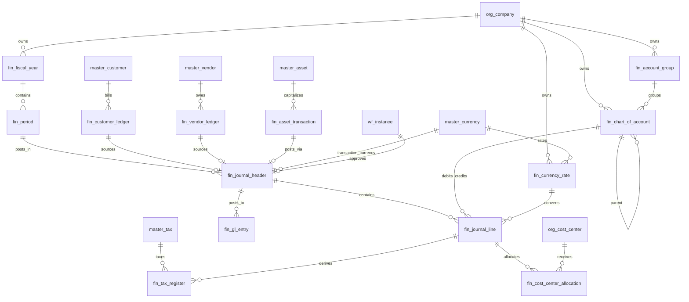

# ERD_04 — Finance & Accounting Domain

**Document:** Enterprise ERD — Finance & Accounting Domain  
**Version:** 1.0  
**Status:** Draft for Architecture Review  
**Schema:** `finance`  
**Table Prefix:** `fin_`  
**Aligned To:** BRD v1.0 · FRD-04 · SDD v1.1 · DBS v1.1 · Architecture Lock v1.1  
**Classification:** Internal — Confidential  

---

## 1. Module Overview

The Finance & Accounting Domain is the **central financial sink** (Architecture Lock §5) for all revenue, cost, tax, and asset postings across the ERP. It enforces **double-entry accounting**, fiscal period control, multi-company books, and audit-compliant financial records.

### Enterprise Finance Modules (FRD-04)

| # | Module | Primary Tables | Primary Consumers |
|---|--------|----------------|-------------------|
| 1 | Chart of Accounts | `fin_account_group`, `fin_chart_of_account` | All financial postings |
| 2 | Fiscal Calendar | `fin_fiscal_year`, `fin_period` | Period close, reporting |
| 3 | Journal Entries | `fin_journal_header`, `fin_journal_line` | Manual & system postings |
| 4 | General Ledger | `fin_gl_entry` | Trial balance, BS, P&L |
| 5 | Accounts Receivable | `fin_customer_ledger` | Sales, CRM, Collections |
| 6 | Accounts Payable | `fin_vendor_ledger` | Procurement, Payments |
| 7 | Tax Accounting | `fin_tax_register` | Sales, Procurement, Compliance |
| 8 | Cost Center Accounting | `fin_cost_center_allocation` | Payroll, Projects, Expenses |
| 9 | Asset Accounting | `fin_asset_transaction` | Asset Management, Depreciation |
| 10 | Currency Accounting | `fin_currency_rate` | Multi-currency journals & GL |

**Table count:** 13  
**PostgreSQL Schema:** `finance` per DBS §14  

### Architectural Position

```text
Foundation (ERD_01) ── Workflow, Audit, RBAC
Organization (ERD_02) ── Company, Branch, Cost/Profit Centers
Master Data (ERD_03) ── Customer, Vendor, Currency, Tax, Asset
        ↓
Finance (ERD_04) ── GL, AR, AP, Tax, Cost, Asset postings
        ↓
Sales · Procurement · Payroll · Assets · Projects · BI
```

---

## 2. Scope

### In Scope
- Company-scoped Chart of Accounts and account hierarchy
- Fiscal year and accounting period management with period locking
- Double-entry journal entries (manual, system-generated, adjustment, reversal)
- Posted General Ledger (immutable after posting)
- Customer and vendor sub-ledgers (AR/AP)
- Tax register for compliance reporting
- Cost center allocation on journal/GL lines
- Asset accounting integration postings
- Multi-currency exchange rates and base-currency conversion
- Workflow approval for journals (Foundation `wf_*`)
- Full audit trail on all financial changes

### Out of Scope (Phase 2 / Separate ERD)
- Budget tables (`fin_budget_*`) — FRD-04 §11, deferred to Sprint 5+
- Bank accounts and bank reconciliation (`fin_bank_*`) — FRD-04 §13
- Sales/Purchase invoices (`trx_*` in sales/procurement schemas)
- SQLAlchemy models, Alembic migrations, application code
- History tables (`hist_*`) — SCD Type 2 for COA changes
- Materialized reporting cubes / data warehouse tables

### Assumptions
- Every financial transaction creates balanced double-entry postings
- GL is never updated directly — all entries originate from journals or approved sub-ledger postings
- `company_id` is the books boundary; each company maintains independent COA and fiscal calendar
- `branch_id` is mandatory on all transactional finance tables per DBS multi-tenancy
- Physical DELETE prohibited on all finance business tables
- Posted GL entries are append-only (no soft delete; reversal via offsetting journal)

### Dependencies

| Upstream | Tables Used |
|----------|-------------|
| ERD_01 Foundation | `sec_tenant`, `sec_user`, `wf_definition`, `wf_instance` |
| ERD_02 Organization | `org_company`, `org_branch`, `org_cost_center`, `org_profit_center` |
| ERD_03 Master Data | `master_customer`, `master_vendor`, `master_currency`, `master_tax`, `master_asset` |

---

## 3. Business Entities

| Entity | Table | UK Scope | Classification |
|--------|-------|----------|----------------|
| Account Group | `fin_account_group` | company + group_code | Finance Master |
| Chart of Account | `fin_chart_of_account` | company + account_code | Finance Master |
| Fiscal Year | `fin_fiscal_year` | company + fiscal_year_code | Finance Master |
| Accounting Period | `fin_period` | fiscal_year + period_number | Finance Master |
| Journal Header | `fin_journal_header` | company + journal_number | Transaction |
| Journal Line | `fin_journal_line` | journal + line_number | Transaction Detail |
| GL Entry | `fin_gl_entry` | company + entry_number | Posted Ledger |
| Customer Ledger | `fin_customer_ledger` | company + document_number | Sub-Ledger |
| Vendor Ledger | `fin_vendor_ledger` | company + document_number | Sub-Ledger |
| Tax Register | `fin_tax_register` | company + register_number | Register |
| Cost Center Allocation | `fin_cost_center_allocation` | parent_line + seq | Allocation Detail |
| Asset Transaction | `fin_asset_transaction` | company + transaction_number | Integration Transaction |
| Currency Rate | `fin_currency_rate` | company + currency + effective_date | Finance Master |

---

## 4. Entity Relationship Diagram



```text
org_company
    ├── fin_account_group
    ├── fin_chart_of_account (self-referencing hierarchy)
    ├── fin_fiscal_year
    │       └── fin_period
    ├── fin_currency_rate ── master_currency
    │
    ├── fin_journal_header ── fin_period, master_currency, wf_instance
    │       └── fin_journal_line ── fin_chart_of_account
    │               ├── fin_cost_center_allocation ── org_cost_center
    │               └── fin_tax_register ── master_tax
    │
    ├── fin_gl_entry ── fin_journal_header, fin_chart_of_account, fin_period
    │
    ├── fin_customer_ledger ── master_customer
    ├── fin_vendor_ledger ── master_vendor
    └── fin_asset_transaction ── master_asset
```

---

## 5. Table Inventory

| # | Table | Classification | tenant_id | company_id | branch_id | Soft Delete | Version | Workflow |
|---|-------|----------------|-----------|------------|-----------|-------------|---------|----------|
| 1 | `fin_account_group` | Finance Master | ✅ | ✅ | — | ✅ | ✅ | — |
| 2 | `fin_chart_of_account` | Finance Master | ✅ | ✅ | — | ✅ | ✅ | — |
| 3 | `fin_fiscal_year` | Finance Master | ✅ | ✅ | — | ✅ | ✅ | — |
| 4 | `fin_period` | Finance Master | ✅ | ✅ | optional | ✅ | ✅ | — |
| 5 | `fin_journal_header` | Transaction | ✅ | ✅ | ✅ | ✅ | ✅ | ✅ |
| 6 | `fin_journal_line` | Transaction Detail | ✅ | ✅ | ✅ | ✅ | ✅ | — |
| 7 | `fin_gl_entry` | Posted Ledger | ✅ | ✅ | ✅ | ❌ | ✅ | — |
| 8 | `fin_customer_ledger` | Sub-Ledger | ✅ | ✅ | ✅ | ✅ | ✅ | ✅ |
| 9 | `fin_vendor_ledger` | Sub-Ledger | ✅ | ✅ | ✅ | ✅ | ✅ | ✅ |
| 10 | `fin_tax_register` | Register | ✅ | ✅ | ✅ | ❌ | ✅ | — |
| 11 | `fin_cost_center_allocation` | Allocation | ✅ | ✅ | ✅ | ✅ | ✅ | — |
| 12 | `fin_asset_transaction` | Integration Txn | ✅ | ✅ | ✅ | ✅ | ✅ | ✅ |
| 13 | `fin_currency_rate` | Finance Master | ✅ | ✅ | — | ✅ | ✅ | — |

> **Note:** `fin_gl_entry` and posted `fin_tax_register` rows are **append-only** — no soft delete; corrections via reversal journals.

---

## 6. Standard Column Profiles

### 6.0 Finance Master Profile (COA, Fiscal, Rates)

| Column Group | Columns |
|--------------|---------|
| Primary Key | `id UUID` |
| Tenant | `tenant_id UUID NOT NULL` |
| Company | `company_id UUID NOT NULL` |
| Business Key | `{entity}_code VARCHAR(50) NOT NULL` |
| Name | `{entity}_name VARCHAR(255) NOT NULL` |
| Status | `status VARCHAR(30) NOT NULL` |
| Audit | `created_at`, `created_by`, `updated_at`, `updated_by`, `version` |
| Soft Delete | `is_deleted`, `deleted_at`, `deleted_by` |

### 6.0.1 Transaction Header Profile (Journal, Sub-Ledgers)

Per DBS §29 Transaction Table Standards:

| Column Group | Columns |
|--------------|---------|
| Primary Key | `id UUID` |
| Document | `document_number VARCHAR(50) NOT NULL`, `document_date DATE NOT NULL` |
| Status | `status VARCHAR(30)`, `workflow_status VARCHAR(30)` |
| Tenant Scope | `tenant_id`, `company_id`, `branch_id` |
| Fiscal | `fiscal_year_id UUID`, `period_id UUID` |
| Currency | `currency_code VARCHAR(3)`, `exchange_rate NUMERIC(18,8)` |
| Source | `source_module VARCHAR(50)`, `source_document_type VARCHAR(50)`, `source_document_id UUID` |
| Audit + Soft Delete + Version | per DBS §28 |

### 6.0.2 Posted Ledger Profile (GL Entry)

| Column Group | Columns |
|--------------|---------|
| Primary Key | `id UUID` |
| Entry Identity | `entry_number VARCHAR(50) NOT NULL` (immutable) |
| Posting Ref | `journal_header_id UUID`, `journal_line_id UUID` |
| Account | `account_id UUID NOT NULL` |
| Amounts | `debit_amount NUMERIC(18,4)`, `credit_amount NUMERIC(18,4)` |
| Base Currency | `base_debit_amount`, `base_credit_amount NUMERIC(18,4)` |
| Period | `period_id UUID NOT NULL` (locked at post time) |
| Tenant Scope | `tenant_id`, `company_id`, `branch_id` |
| Audit | `posted_at`, `posted_by`, `created_at`, `created_by`, `version` |
| Soft Delete | **Prohibited** — reversal only |

---

## 7. Table Definitions

---

### 7.1 `fin_account_group`

#### 7.1.1 Purpose
Hierarchical grouping of GL accounts (Assets, Liabilities, Equity, Revenue, Expenses) per FRD-04 §4. Provides roll-up structure for financial reporting.

#### 7.1.2 Columns

| Column | Type | Nullable | Default | Description |
|--------|------|----------|---------|-------------|
| `id` | UUID | NO | app-generated | PK |
| `tenant_id` | UUID | NO | — | FK → `foundation.sec_tenant` |
| `company_id` | UUID | NO | — | FK → `organization.org_company` |
| `group_code` | VARCHAR(20) | NO | — | UK per company (e.g., `1000`, `2000`) |
| `group_name` | VARCHAR(255) | NO | — | e.g., Assets, Liabilities |
| `account_type` | VARCHAR(30) | NO | — | asset, liability, equity, revenue, expense |
| `parent_group_id` | UUID | YES | — | Self-FK → `fin_account_group` |
| `display_order` | SMALLINT | NO | `1` | Report sort order |
| `status` | VARCHAR(30) | NO | `'active'` | active, inactive |
| AUDIT_STD + SOFT_DELETE_OPT | | | | |

#### 7.1.3 Primary Key
`pk_fin_account_group` → `id`

#### 7.1.4 Foreign Keys
- `fk_fin_account_group_tenant` → `sec_tenant(id)`
- `fk_fin_account_group_company` → `org_company(id)`
- `fk_fin_account_group_parent` → `fin_account_group(id)`

#### 7.1.5 Constraints
- `uk_fin_account_group_company_code` UNIQUE (`company_id`, `group_code`)
- `ck_fin_account_group_type` CHECK on `account_type`
- `ck_fin_account_group_status` CHECK (`status` IN ('active','inactive'))

#### 7.1.6 Index Strategy
- `pk_fin_account_group` (id)
- `ux_fin_account_group_company_code` (company_id, group_code)
- `ix_fin_account_group_tenant_id` (tenant_id)
- `ix_fin_account_group_company_id` (company_id)
- `ix_fin_account_group_parent_id` (parent_group_id)

#### 7.1.7 Audit Columns
Full audit standard per DBS §28

#### 7.1.8 Soft Delete Rules
Soft delete only; inactive groups with active accounts blocked at service layer

#### 7.1.9 Business Rules
- Standard group codes: 1000 Assets, 2000 Liabilities, 3000 Equity, 4000 Revenue, 5000 Expenses (FRD-04)
- Cannot delete group with child accounts or child groups

---

### 7.2 `fin_chart_of_account`

#### 7.2.1 Purpose
Central account structure (COA) — the authoritative GL account registry per company (FRD-04 §4).

#### 7.2.2 Columns

| Column | Type | Nullable | Description |
|--------|------|----------|-------------|
| `id` | UUID | NO | PK |
| `tenant_id` | UUID | NO | FK → `sec_tenant` |
| `company_id` | UUID | NO | FK → `org_company` |
| `account_group_id` | UUID | NO | FK → `fin_account_group` |
| `account_code` | VARCHAR(50) | NO | UK per company (e.g., `1100-001`) |
| `account_name` | VARCHAR(255) | NO | — |
| `account_type` | VARCHAR(30) | NO | asset, liability, equity, revenue, expense |
| `parent_account_id` | UUID | YES | Self-FK for hierarchy |
| `is_posting_account` | BOOLEAN | NO | DEFAULT TRUE — leaf accounts only |
| `is_cost_center_enabled` | BOOLEAN | NO | DEFAULT FALSE |
| `is_profit_center_enabled` | BOOLEAN | NO | DEFAULT FALSE |
| `normal_balance` | VARCHAR(10) | NO | debit, credit |
| `currency_code` | VARCHAR(3) | YES | Account-level currency restriction |
| `status` | VARCHAR(30) | NO | draft, active, inactive |
| AUDIT_STD + SOFT_DELETE_OPT | | | |

#### 7.2.3 Primary Key
`pk_fin_chart_of_account` → `id`

#### 7.2.4 Foreign Keys
- `fk_fin_coa_tenant` → `sec_tenant(id)`
- `fk_fin_coa_company` → `org_company(id)`
- `fk_fin_coa_group` → `fin_account_group(id)`
- `fk_fin_coa_parent` → `fin_chart_of_account(id)`

#### 7.2.5 Constraints
- `uk_fin_coa_company_code` UNIQUE (`company_id`, `account_code`)
- `ck_fin_coa_type` CHECK on `account_type`
- `ck_fin_coa_normal_balance` CHECK (`normal_balance` IN ('debit','credit'))
- `ck_fin_coa_posting_leaf` CHECK (`is_posting_account` = TRUE OR `parent_account_id` IS NOT NULL) — enforced at service layer for hierarchy

#### 7.2.6 Index Strategy
- `pk_fin_chart_of_account` (id)
- `ux_fin_coa_company_code` (company_id, account_code)
- `ix_fin_coa_group_id` (account_group_id)
- `ix_fin_coa_parent_id` (parent_account_id)
- `ix_fin_coa_account_type` (account_type)
- `ix_fin_coa_status` (status)

#### 7.2.7 Audit Columns
Full audit standard

#### 7.2.8 Soft Delete Rules
Soft delete only; accounts with GL postings cannot be deleted — set `inactive`

#### 7.2.9 Business Rules
- Only `is_posting_account = true` accounts accept journal/GL postings
- Account code immutable after first posting
- COA is company-scoped; inter-company accounts require EARB-approved IC chart

---

### 7.3 `fin_fiscal_year`

#### 7.3.1 Purpose
Fiscal year definition per company (FRD-04 §14). Aligns with `org_company.fiscal_year_start_month`.

#### 7.3.2 Columns

| Column | Type | Nullable | Description |
|--------|------|----------|-------------|
| `id` | UUID | NO | PK |
| `tenant_id` | UUID | NO | FK → `sec_tenant` |
| `company_id` | UUID | NO | FK → `org_company` |
| `fiscal_year_code` | VARCHAR(20) | NO | UK per company (e.g., `FY2025-26`) |
| `fiscal_year_name` | VARCHAR(100) | NO | — |
| `start_date` | DATE | NO | — |
| `end_date` | DATE | NO | — |
| `status` | VARCHAR(30) | NO | open, closed, archived |
| `closed_at` | TIMESTAMPTZ | YES | Year-end close timestamp |
| `closed_by` | UUID | YES | FK → `sec_user` |
| AUDIT_STD + SOFT_DELETE_OPT | | | |

#### 7.3.3 Primary Key
`pk_fin_fiscal_year` → `id`

#### 7.3.4 Foreign Keys
- `fk_fin_fiscal_year_tenant` → `sec_tenant(id)`
- `fk_fin_fiscal_year_company` → `org_company(id)`

#### 7.3.5 Constraints
- `uk_fin_fiscal_year_company_code` UNIQUE (`company_id`, `fiscal_year_code`)
- `ck_fin_fiscal_year_dates` CHECK (`end_date` > `start_date`)
- `ck_fin_fiscal_year_status` CHECK (`status` IN ('open','closed','archived'))
- Exactly one `status = 'open'` fiscal year per company — service layer

#### 7.3.6 Index Strategy
- `pk_fin_fiscal_year` (id)
- `ux_fin_fiscal_year_company_code` (company_id, fiscal_year_code)
- `ix_fin_fiscal_year_status` (status)
- `ix_fin_fiscal_year_dates` (company_id, start_date, end_date)

#### 7.3.7 Audit Columns
Full audit standard

#### 7.3.8 Soft Delete Rules
Prohibited when periods exist or postings reference the year

#### 7.3.9 Business Rules
- Year closing is irreversible without CFO/EARB approval
- Auto-generate 12/13 periods on fiscal year creation

---

### 7.4 `fin_period`

#### 7.4.1 Purpose
Accounting periods within a fiscal year. Enforces period locking (FRD-04 §15).

#### 7.4.2 Columns

| Column | Type | Nullable | Description |
|--------|------|----------|-------------|
| `id` | UUID | NO | PK |
| `tenant_id` | UUID | NO | FK → `sec_tenant` |
| `company_id` | UUID | NO | FK → `org_company` |
| `fiscal_year_id` | UUID | NO | FK → `fin_fiscal_year` |
| `branch_id` | UUID | YES | FK → `org_branch` — NULL = company-wide period |
| `period_number` | SMALLINT | NO | 1–13 |
| `period_name` | VARCHAR(50) | NO | e.g., `Apr-2025` |
| `start_date` | DATE | NO | — |
| `end_date` | DATE | NO | — |
| `status` | VARCHAR(30) | NO | open, soft_closed, hard_closed |
| `ar_closed` | BOOLEAN | NO | DEFAULT FALSE |
| `ap_closed` | BOOLEAN | NO | DEFAULT FALSE |
| `inventory_closed` | BOOLEAN | NO | DEFAULT FALSE |
| `payroll_closed` | BOOLEAN | NO | DEFAULT FALSE |
| `gl_closed` | BOOLEAN | NO | DEFAULT FALSE |
| `closed_at` | TIMESTAMPTZ | YES | — |
| `closed_by` | UUID | YES | — |
| AUDIT_STD + SOFT_DELETE_OPT | | | |

#### 7.4.3 Primary Key
`pk_fin_period` → `id`

#### 7.4.4 Foreign Keys
- `fk_fin_period_tenant` → `sec_tenant(id)`
- `fk_fin_period_company` → `org_company(id)`
- `fk_fin_period_fiscal_year` → `fin_fiscal_year(id)`
- `fk_fin_period_branch` → `org_branch(id)`

#### 7.4.5 Constraints
- `uk_fin_period_year_number` UNIQUE (`fiscal_year_id`, `period_number`, `branch_id`)
- `ck_fin_period_dates` CHECK (`end_date` >= `start_date`)
- `ck_fin_period_status` CHECK (`status` IN ('open','soft_closed','hard_closed'))

#### 7.4.6 Index Strategy
- `pk_fin_period` (id)
- `ix_fin_period_fiscal_year_id` (fiscal_year_id)
- `ix_fin_period_status` (status)
- `ix_fin_period_dates` (start_date, end_date)
- `ix_fin_period_company_branch` (company_id, branch_id)

#### 7.4.7 Audit Columns
Full audit standard

#### 7.4.8 Soft Delete Rules
Prohibited when journal/GL entries exist

#### 7.4.9 Business Rules
- **Closed period cannot be edited** (FRD-04 §15) — `hard_closed` blocks all postings
- `soft_closed` allows adjustment journals with elevated permission (`finance.journal:adjust`)
- Monthly closing checklist: AR, AP, Inventory, Payroll, GL flags (FRD-04 §15)

---

### 7.5 `fin_journal_header`

#### 7.5.1 Purpose
Journal entry header — container for double-entry lines. Supports manual, system-generated, adjustment, and reversal entries (FRD-04 §6).

#### 7.5.2 Columns

| Column | Type | Nullable | Description |
|--------|------|----------|-------------|
| `id` | UUID | NO | PK |
| `tenant_id` | UUID | NO | FK → `sec_tenant` |
| `company_id` | UUID | NO | FK → `org_company` |
| `branch_id` | UUID | NO | FK → `org_branch` |
| `journal_number` | VARCHAR(50) | NO | UK per company |
| `journal_date` | DATE | NO | Posting date |
| `journal_type` | VARCHAR(30) | NO | manual, system, adjustment, reversal |
| `description` | VARCHAR(500) | NO | — |
| `fiscal_year_id` | UUID | NO | FK → `fin_fiscal_year` |
| `period_id` | UUID | NO | FK → `fin_period` |
| `currency_code` | VARCHAR(3) | NO | Transaction currency (ISO 4217) |
| `exchange_rate` | NUMERIC(18,8) | NO | Rate to company base currency |
| `total_debit` | NUMERIC(18,4) | NO | DEFAULT 0 — denormalized |
| `total_credit` | NUMERIC(18,4) | NO | DEFAULT 0 — denormalized |
| `status` | VARCHAR(30) | NO | draft, submitted, approved, posted, reversed, cancelled |
| `workflow_status` | VARCHAR(30) | NO | pending, in_progress, approved, rejected |
| `workflow_instance_id` | UUID | YES | FK → `foundation.wf_instance` |
| `posted_at` | TIMESTAMPTZ | YES | — |
| `posted_by` | UUID | YES | FK → `sec_user` |
| `reversal_of_id` | UUID | YES | Self-FK — original journal |
| `source_module` | VARCHAR(50) | YES | sales, procurement, payroll, assets, finance |
| `source_document_type` | VARCHAR(50) | YES | invoice, payment, depreciation |
| `source_document_id` | UUID | YES | Polymorphic source reference |
| AUDIT_STD + SOFT_DELETE_OPT | | | |

#### 7.5.3 Primary Key
`pk_fin_journal_header` → `id`

#### 7.5.4 Foreign Keys
- `fk_fin_journal_header_tenant` → `sec_tenant(id)`
- `fk_fin_journal_header_company` → `org_company(id)`
- `fk_fin_journal_header_branch` → `org_branch(id)`
- `fk_fin_journal_header_fiscal_year` → `fin_fiscal_year(id)`
- `fk_fin_journal_header_period` → `fin_period(id)`
- `fk_fin_journal_header_workflow` → `wf_instance(id)`
- `fk_fin_journal_header_reversal` → `fin_journal_header(id)`

#### 7.5.5 Constraints
- `uk_fin_journal_header_company_number` UNIQUE (`company_id`, `journal_number`)
- `ck_fin_journal_header_balanced` CHECK (`status` != 'posted' OR `total_debit` = `total_credit`)
- `ck_fin_journal_header_amounts` CHECK (`total_debit` >= 0 AND `total_credit` >= 0)
- `ck_fin_journal_header_type` CHECK on `journal_type`
- `ck_fin_journal_header_status` CHECK on `status`

#### 7.5.6 Index Strategy
- `pk_fin_journal_header` (id)
- `ux_fin_journal_header_company_number` (company_id, journal_number)
- `ix_fin_journal_header_period_id` (period_id)
- `ix_fin_journal_header_status` (status)
- `ix_fin_journal_header_journal_date` (journal_date)
- `ix_fin_journal_header_source` (source_module, source_document_id)
- `ix_fin_journal_header_workflow` (workflow_instance_id)

#### 7.5.7 Audit Columns
Full audit standard; `approve`, `post`, `reverse` operations logged to `audit.audit_log`

#### 7.5.8 Soft Delete Rules
Soft delete allowed only in `draft` status; posted journals cannot be deleted — reversal only

#### 7.5.9 Business Rules
- **Total Debit must equal Total Credit** before submit (FRD-04 §6)
- Journal number auto-generated: `JE-00000001` per company
- Workflow: Draft → Submitted → Finance Manager → Approved → Posted (FRD-04 §17)
- Posting creates `fin_gl_entry` rows atomically in single DB transaction
- Period must be `open` or `soft_closed` (with adjust permission) at post time

---

### 7.6 `fin_journal_line`

#### 7.6.1 Purpose
Journal entry line items — individual debit/credit postings to GL accounts.

#### 7.6.2 Columns

| Column | Type | Nullable | Description |
|--------|------|----------|-------------|
| `id` | UUID | NO | PK |
| `tenant_id` | UUID | NO | FK → `sec_tenant` |
| `company_id` | UUID | NO | FK → `org_company` |
| `branch_id` | UUID | NO | FK → `org_branch` |
| `journal_header_id` | UUID | NO | FK → `fin_journal_header` |
| `line_number` | SMALLINT | NO | 1, 2, 3… |
| `account_id` | UUID | NO | FK → `fin_chart_of_account` |
| `description` | VARCHAR(500) | YES | Line narration |
| `debit_amount` | NUMERIC(18,4) | NO | DEFAULT 0 |
| `credit_amount` | NUMERIC(18,4) | NO | DEFAULT 0 |
| `base_debit_amount` | NUMERIC(18,4) | NO | Base currency debit |
| `base_credit_amount` | NUMERIC(18,4) | NO | Base currency credit |
| `currency_code` | VARCHAR(3) | NO | Line currency |
| `exchange_rate` | NUMERIC(18,8) | NO | — |
| `cost_center_id` | UUID | YES | FK → `org_cost_center` |
| `profit_center_id` | UUID | YES | FK → `org_profit_center` |
| `customer_id` | UUID | YES | FK → `master_customer` — AR clearing lines |
| `vendor_id` | UUID | YES | FK → `master_vendor` — AP clearing lines |
| `tax_id` | UUID | YES | FK → `master_tax` |
| `reference_number` | VARCHAR(100) | YES | External ref |
| AUDIT_STD + SOFT_DELETE_OPT | | | |

#### 7.6.3 Primary Key
`pk_fin_journal_line` → `id`

#### 7.6.4 Foreign Keys
- `fk_fin_journal_line_header` → `fin_journal_header(id)`
- `fk_fin_journal_line_account` → `fin_chart_of_account(id)`
- `fk_fin_journal_line_cost_center` → `org_cost_center(id)`
- `fk_fin_journal_line_profit_center` → `org_profit_center(id)`
- `fk_fin_journal_line_customer` → `master_customer(id)`
- `fk_fin_journal_line_vendor` → `master_vendor(id)`
- `fk_fin_journal_line_tax` → `master_tax(id)`

#### 7.6.5 Constraints
- `uk_fin_journal_line_header_number` UNIQUE (`journal_header_id`, `line_number`)
- `ck_fin_journal_line_dc` CHECK (
  (`debit_amount` > 0 AND `credit_amount` = 0) OR
  (`credit_amount` > 0 AND `debit_amount` = 0)
)
- `ck_fin_journal_line_amounts` CHECK (`debit_amount` >= 0 AND `credit_amount` >= 0)

#### 7.6.6 Index Strategy
- `pk_fin_journal_line` (id)
- `ix_fin_journal_line_header_id` (journal_header_id)
- `ix_fin_journal_line_account_id` (account_id)
- `ix_fin_journal_line_cost_center_id` (cost_center_id)
- `ix_fin_journal_line_customer_id` (customer_id)
- `ix_fin_journal_line_vendor_id` (vendor_id)

#### 7.6.7 Audit Columns
Full audit standard

#### 7.6.8 Soft Delete Rules
Lines deletable only when header is `draft`; cascade soft-delete with header

#### 7.6.9 Business Rules
- Each line is exclusively debit OR credit (not both)
- `base_*_amount` = transaction amount × `exchange_rate`
- Cost center required when account has `is_cost_center_enabled = true`

---

### 7.7 `fin_gl_entry`

#### 7.7.1 Purpose
Posted General Ledger entries — the immutable accounting book (FRD-04 §5). **No transaction directly modifies GL.**

#### 7.7.2 Columns

| Column | Type | Nullable | Description |
|--------|------|----------|-------------|
| `id` | UUID | NO | PK |
| `tenant_id` | UUID | NO | FK → `sec_tenant` |
| `company_id` | UUID | NO | FK → `org_company` |
| `branch_id` | UUID | NO | FK → `org_branch` |
| `entry_number` | VARCHAR(50) | NO | UK per company |
| `entry_date` | DATE | NO | GL posting date |
| `period_id` | UUID | NO | FK → `fin_period` |
| `fiscal_year_id` | UUID | NO | FK → `fin_fiscal_year` |
| `journal_header_id` | UUID | NO | FK → `fin_journal_header` |
| `journal_line_id` | UUID | NO | FK → `fin_journal_line` |
| `account_id` | UUID | NO | FK → `fin_chart_of_account` |
| `account_code` | VARCHAR(50) | NO | Denormalized for reporting |
| `debit_amount` | NUMERIC(18,4) | NO | DEFAULT 0 |
| `credit_amount` | NUMERIC(18,4) | NO | DEFAULT 0 |
| `base_debit_amount` | NUMERIC(18,4) | NO | Company base currency |
| `base_credit_amount` | NUMERIC(18,4) | NO | Company base currency |
| `currency_code` | VARCHAR(3) | NO | — |
| `exchange_rate` | NUMERIC(18,8) | NO | — |
| `description` | VARCHAR(500) | YES | — |
| `cost_center_id` | UUID | YES | FK → `org_cost_center` |
| `profit_center_id` | UUID | YES | FK → `org_profit_center` |
| `is_reversal` | BOOLEAN | NO | DEFAULT FALSE |
| `posted_at` | TIMESTAMPTZ | NO | Immutable post timestamp |
| `posted_by` | UUID | NO | FK → `sec_user` |
| `created_at` | TIMESTAMPTZ | NO | — |
| `created_by` | UUID | YES | — |
| `version` | INTEGER | NO | DEFAULT 1 |

#### 7.7.3 Primary Key
`pk_fin_gl_entry` → `id`

#### 7.7.4 Foreign Keys
All FKs ON DELETE RESTRICT

#### 7.7.5 Constraints
- `uk_fin_gl_entry_company_number` UNIQUE (`company_id`, `entry_number`)
- `ck_fin_gl_entry_dc` CHECK (same as journal line — exclusive debit/credit)
- **No soft delete columns** — append-only

#### 7.7.6 Index Strategy
- `pk_fin_gl_entry` (id)
- `ux_fin_gl_entry_company_number` (company_id, entry_number)
- `ix_fin_gl_entry_account_id` (account_id) — **critical for trial balance**
- `ix_fin_gl_entry_period_id` (period_id)
- `ix_fin_gl_entry_entry_date` (entry_date)
- `ix_fin_gl_entry_journal_header_id` (journal_header_id)
- `ix_comp_fin_gl_account_period` (company_id, account_id, period_id) — composite for BS/P&L
- `ix_comp_fin_gl_company_date` (company_id, entry_date, account_id)

#### 7.7.7 Audit Columns
`created_at`, `created_by`, `posted_at`, `posted_by`, `version` — **no `updated_at`** (immutable)

#### 7.7.8 Soft Delete Rules
**Prohibited.** Corrections via reversal journal only.

#### 7.7.9 Business Rules
- Created atomically when journal status → `posted`
- Entry number immutable; denormalized `account_code` for historical reporting integrity
- GL inquiry is read-only from application layer

---

### 7.8 `fin_customer_ledger`

#### 7.8.1 Purpose
Accounts Receivable sub-ledger — tracks customer dues, invoices, payments, credit notes (FRD-04 §7).

#### 7.8.2 Columns

| Column | Type | Nullable | Description |
|--------|------|----------|-------------|
| `id` | UUID | NO | PK |
| `tenant_id` | UUID | NO | — |
| `company_id` | UUID | NO | — |
| `branch_id` | UUID | NO | — |
| `customer_id` | UUID | NO | FK → `master_customer` |
| `document_number` | VARCHAR(50) | NO | UK per company |
| `document_date` | DATE | NO | — |
| `due_date` | DATE | NO | Aging basis |
| `document_type` | VARCHAR(30) | NO | invoice, debit_note, credit_note, payment, adjustment |
| `debit_amount` | NUMERIC(18,4) | NO | DEFAULT 0 — increases AR |
| `credit_amount` | NUMERIC(18,4) | NO | DEFAULT 0 — decreases AR |
| `balance_amount` | NUMERIC(18,4) | NO | Running balance |
| `currency_code` | VARCHAR(3) | NO | — |
| `exchange_rate` | NUMERIC(18,8) | NO | — |
| `status` | VARCHAR(30) | NO | open, partial, paid, written_off, cancelled |
| `workflow_status` | VARCHAR(30) | YES | — |
| `journal_header_id` | UUID | YES | FK → posted GL journal |
| `source_module` | VARCHAR(50) | YES | sales, finance |
| `source_document_id` | UUID | YES | Polymorphic |
| `aging_bucket` | VARCHAR(20) | YES | 0-30, 31-60, 61-90, 90+ (computed) |
| AUDIT_STD + SOFT_DELETE_OPT | | | |

#### 7.8.3 Primary Key
`pk_fin_customer_ledger` → `id`

#### 7.8.4 Foreign Keys
- `fk_fin_customer_ledger_tenant` → `sec_tenant(id)`
- `fk_fin_customer_ledger_company` → `org_company(id)`
- `fk_fin_customer_ledger_branch` → `org_branch(id)`
- `fk_fin_customer_ledger_customer` → `master_customer(id)`
- `fk_fin_customer_ledger_journal` → `fin_journal_header(id)`

#### 7.8.5 Constraints
- `uk_fin_customer_ledger_company_number` UNIQUE (`company_id`, `document_number`)
- `ck_fin_customer_ledger_status` CHECK on `status`

#### 7.8.6 Index Strategy
- `pk_fin_customer_ledger` (id)
- `ux_fin_customer_ledger_company_number` (company_id, document_number)
- `ix_fin_customer_ledger_customer_id` (customer_id)
- `ix_fin_customer_ledger_due_date` (due_date)
- `ix_fin_customer_ledger_status` (status)
- `ix_fin_customer_ledger_document_date` (document_date)

#### 7.8.7 Audit Columns
Full audit standard

#### 7.8.8 Soft Delete Rules
Soft delete only before GL posting; posted entries reversed via credit note

#### 7.8.9 Business Rules
- Sales invoice auto-creates AR Dr + Revenue Cr journal
- Aging buckets per FRD-04 §7: 0-30, 31-60, 61-90, 90+

---

### 7.9 `fin_vendor_ledger`

#### 7.9.1 Purpose
Accounts Payable sub-ledger — tracks vendor liabilities (FRD-04 §8).

#### 7.9.2 Columns

| Column | Type | Nullable | Description |
|--------|------|----------|-------------|
| `id` | UUID | NO | PK |
| `tenant_id` | UUID | NO | — |
| `company_id` | UUID | NO | — |
| `branch_id` | UUID | NO | — |
| `vendor_id` | UUID | NO | FK → `master_vendor` |
| `document_number` | VARCHAR(50) | NO | UK per company |
| `document_date` | DATE | NO | — |
| `due_date` | DATE | NO | Aging basis |
| `document_type` | VARCHAR(30) | NO | invoice, credit_note, debit_note, payment, adjustment |
| `credit_amount` | NUMERIC(18,4) | NO | DEFAULT 0 — increases AP liability |
| `debit_amount` | NUMERIC(18,4) | NO | DEFAULT 0 — decreases AP (payments) |
| `balance_amount` | NUMERIC(18,4) | NO | Running balance |
| `currency_code` | VARCHAR(3) | NO | — |
| `exchange_rate` | NUMERIC(18,8) | NO | — |
| `status` | VARCHAR(30) | NO | open, partial, paid, written_off, cancelled |
| `workflow_status` | VARCHAR(30) | YES | — |
| `journal_header_id` | UUID | YES | FK → posted GL journal |
| `source_module` | VARCHAR(50) | YES | procurement, finance |
| `source_document_id` | UUID | YES | Polymorphic |
| `aging_bucket` | VARCHAR(20) | YES | 0-30, 31-60, 61-90, 90+ (computed) |
| AUDIT_STD + SOFT_DELETE_OPT | | | |

#### 7.9.3 Primary Key
`pk_fin_vendor_ledger` → `id`

#### 7.9.4 Foreign Keys
- `fk_fin_vendor_ledger_tenant` → `sec_tenant(id)`
- `fk_fin_vendor_ledger_company` → `org_company(id)`
- `fk_fin_vendor_ledger_branch` → `org_branch(id)`
- `fk_fin_vendor_ledger_vendor` → `master_vendor(id)`
- `fk_fin_vendor_ledger_journal` → `fin_journal_header(id)`

#### 7.9.5 Constraints
- `uk_fin_vendor_ledger_company_number` UNIQUE (`company_id`, `document_number`)
- `ck_fin_vendor_ledger_status` CHECK on `status`

#### 7.9.6 Index Strategy
- `pk_fin_vendor_ledger` (id)
- `ux_fin_vendor_ledger_company_number` (company_id, document_number)
- `ix_fin_vendor_ledger_vendor_id` (vendor_id)
- `ix_fin_vendor_ledger_due_date` (due_date)
- `ix_fin_vendor_ledger_status` (status)

#### 7.9.7 Audit Columns
Full audit standard

#### 7.9.8 Soft Delete Rules
Soft delete only before GL posting; posted entries reversed via debit note

#### 7.9.9 Business Rules
- Purchase invoice creates Expense Dr + AP Cr
- Vendor payment approval: Finance Executive → Manager → CFO (FRD-04 §17)

---

### 7.10 `fin_tax_register`

#### 7.10.1 Purpose
Tax accounting register for GST/VAT/TDS compliance reporting (FRD-04 §12). Records tax collected, paid, and withheld.

#### 7.10.2 Columns

| Column | Type | Nullable | Description |
|--------|------|----------|-------------|
| `id` | UUID | NO | PK |
| `tenant_id` | UUID | NO | — |
| `company_id` | UUID | NO | — |
| `branch_id` | UUID | NO | — |
| `register_number` | VARCHAR(50) | NO | UK per company |
| `register_date` | DATE | NO | — |
| `tax_id` | UUID | NO | FK → `master_tax` |
| `tax_type` | VARCHAR(30) | NO | gst, vat, sales_tax, withholding |
| `transaction_type` | VARCHAR(30) | NO | output, input, withheld, adjustment |
| `taxable_amount` | NUMERIC(18,4) | NO | — |
| `tax_amount` | NUMERIC(18,4) | NO | — |
| `currency_code` | VARCHAR(3) | NO | — |
| `journal_header_id` | UUID | YES | FK → `fin_journal_header` |
| `journal_line_id` | UUID | YES | FK → `fin_journal_line` |
| `customer_id` | UUID | YES | FK → `master_customer` |
| `vendor_id` | UUID | YES | FK → `master_vendor` |
| `source_module` | VARCHAR(50) | NO | sales, procurement, finance, payroll |
| `source_document_id` | UUID | YES | — |
| `period_id` | UUID | NO | FK → `fin_period` |
| `status` | VARCHAR(30) | NO | active, reversed |
| `created_at` | TIMESTAMPTZ | NO | — |
| `created_by` | UUID | YES | — |
| `version` | INTEGER | NO | DEFAULT 1 |

#### 7.10.3 Primary Key
`pk_fin_tax_register` → `id`

#### 7.10.4 Foreign Keys
- `fk_fin_tax_register_tenant` → `sec_tenant(id)`
- `fk_fin_tax_register_company` → `org_company(id)`
- `fk_fin_tax_register_branch` → `org_branch(id)`
- `fk_fin_tax_register_tax` → `master_tax(id)`
- `fk_fin_tax_register_journal_header` → `fin_journal_header(id)`
- `fk_fin_tax_register_journal_line` → `fin_journal_line(id)`
- `fk_fin_tax_register_period` → `fin_period(id)`

#### 7.10.5 Constraints
- `uk_fin_tax_register_company_number` UNIQUE (`company_id`, `register_number`)
- `ck_fin_tax_register_type` CHECK on `transaction_type`

#### 7.10.6 Index Strategy
- `pk_fin_tax_register` (id)
- `ux_fin_tax_register_company_number` (company_id, register_number)
- `ix_fin_tax_register_tax_id` (tax_id)
- `ix_fin_tax_register_period_id` (period_id)
- `ix_fin_tax_register_register_date` (register_date)
- `ix_fin_tax_register_transaction_type` (transaction_type)

#### 7.10.7 Audit Columns
`created_at`, `created_by`, `version` — append-only after post

#### 7.10.8 Soft Delete Rules
Prohibited after filing period lock

#### 7.10.9 Business Rules
- Tax rate from `master_tax.rate_percent` at transaction date
- Effective-dated tax validation per `master_tax.effective_from` / `effective_to`

---

### 7.11 `fin_cost_center_allocation`

#### 7.11.1 Purpose
Distributes journal/GL line amounts across cost centers for departmental cost accounting (FRD-04 §9).

#### 7.11.2 Columns

| Column | Type | Nullable | Description |
|--------|------|----------|-------------|
| `id` | UUID | NO | PK |
| `tenant_id` | UUID | NO | — |
| `company_id` | UUID | NO | — |
| `branch_id` | UUID | NO | — |
| `journal_line_id` | UUID | NO | FK → `fin_journal_line` |
| `gl_entry_id` | UUID | YES | FK → `fin_gl_entry` (populated on post) |
| `cost_center_id` | UUID | NO | FK → `org_cost_center` |
| `allocation_sequence` | SMALLINT | NO | 1, 2, 3… |
| `allocation_percent` | NUMERIC(8,4) | YES | % split |
| `allocated_amount` | NUMERIC(18,4) | NO | Amount in base currency |
| `description` | VARCHAR(255) | YES | — |
| AUDIT_STD + SOFT_DELETE_OPT | | | |

#### 7.11.3 Primary Key
`pk_fin_cost_center_allocation` → `id`

#### 7.11.4 Foreign Keys
- `fk_fin_cost_center_allocation_tenant` → `sec_tenant(id)`
- `fk_fin_cost_center_allocation_company` → `org_company(id)`
- `fk_fin_cost_center_allocation_branch` → `org_branch(id)`
- `fk_fin_cost_center_allocation_journal_line` → `fin_journal_line(id)`
- `fk_fin_cost_center_allocation_gl_entry` → `fin_gl_entry(id)`
- `fk_fin_cost_center_allocation_cost_center` → `org_cost_center(id)`

#### 7.11.5 Constraints
- `uk_fin_cost_center_allocation_line_seq` UNIQUE (`journal_line_id`, `allocation_sequence`)
- SUM(`allocation_percent`) = 100 OR SUM(`allocated_amount`) = parent line amount — service layer

#### 7.11.6 Index Strategy
- `pk_fin_cost_center_allocation` (id)
- `ix_fin_cost_center_allocation_journal_line_id` (journal_line_id)
- `ix_fin_cost_center_allocation_cost_center_id` (cost_center_id)
- `ix_fin_cost_center_allocation_gl_entry_id` (gl_entry_id)

#### 7.11.7 Audit Columns
Full audit standard

#### 7.11.8 Soft Delete Rules
Deletable only when parent journal is `draft`

#### 7.11.9 Business Rules
- Referenced by Payroll, Projects, Procurement expense postings
- Allocation must sum to 100% of parent line amount

---

### 7.12 `fin_asset_transaction`

#### 7.12.1 Purpose
Asset accounting integration — capitalisation, depreciation, disposal postings linked to `master_asset` (FRD-04 + FRD-12).

#### 7.12.2 Columns

| Column | Type | Nullable | Description |
|--------|------|----------|-------------|
| `id` | UUID | NO | PK |
| `tenant_id` | UUID | NO | — |
| `company_id` | UUID | NO | — |
| `branch_id` | UUID | NO | — |
| `transaction_number` | VARCHAR(50) | NO | UK per company |
| `transaction_date` | DATE | NO | — |
| `asset_id` | UUID | NO | FK → `master_asset` |
| `transaction_type` | VARCHAR(30) | NO | acquisition, depreciation, revaluation, disposal, write_off |
| `amount` | NUMERIC(18,2) | NO | — |
| `currency_code` | VARCHAR(3) | NO | — |
| `journal_header_id` | UUID | YES | FK → posted journal |
| `period_id` | UUID | NO | FK → `fin_period` |
| `status` | VARCHAR(30) | NO | draft, approved, posted, reversed |
| `workflow_status` | VARCHAR(30) | YES | — |
| `description` | VARCHAR(500) | YES | — |
| AUDIT_STD + SOFT_DELETE_OPT | | | |

#### 7.12.3 Primary Key
`pk_fin_asset_transaction` → `id`

#### 7.12.4 Foreign Keys
- `fk_fin_asset_transaction_tenant` → `sec_tenant(id)`
- `fk_fin_asset_transaction_company` → `org_company(id)`
- `fk_fin_asset_transaction_branch` → `org_branch(id)`
- `fk_fin_asset_transaction_asset` → `master_asset(id)`
- `fk_fin_asset_transaction_journal` → `fin_journal_header(id)`
- `fk_fin_asset_transaction_period` → `fin_period(id)`

#### 7.12.5 Constraints
- `uk_fin_asset_transaction_company_number` UNIQUE (`company_id`, `transaction_number`)
- `ck_fin_asset_transaction_type` CHECK on `transaction_type`

#### 7.12.6 Index Strategy
- `pk_fin_asset_transaction` (id)
- `ux_fin_asset_transaction_company_number` (company_id, transaction_number)
- `ix_fin_asset_transaction_asset_id` (asset_id)
- `ix_fin_asset_transaction_period_id` (period_id)
- `ix_fin_asset_transaction_status` (status)

#### 7.12.7 Audit Columns
Full audit standard

#### 7.12.8 Soft Delete Rules
Soft delete only in `draft` status

#### 7.12.9 Business Rules
- Depreciation posts Dr Expense / Cr Accumulated Depreciation
- Disposal clears asset cost and accumulated depreciation

---

### 7.13 `fin_currency_rate`

#### 7.13.1 Purpose
Company-level exchange rate table for multi-currency journal and GL conversion (FRD-04 + `master_currency`).

#### 7.13.2 Columns

| Column | Type | Nullable | Description |
|--------|------|----------|-------------|
| `id` | UUID | NO | PK |
| `tenant_id` | UUID | NO | — |
| `company_id` | UUID | NO | — |
| `currency_id` | UUID | NO | FK → `master_currency` |
| `currency_code` | VARCHAR(3) | NO | Denormalized ISO code |
| `base_currency_code` | VARCHAR(3) | NO | Company base from `org_company.currency_code` |
| `exchange_rate` | NUMERIC(18,8) | NO | Rate: 1 foreign = X base |
| `rate_type` | VARCHAR(30) | NO | daily, monthly, manual |
| `effective_from` | DATE | NO | — |
| `effective_to` | DATE | YES | NULL = open-ended |
| `status` | VARCHAR(30) | NO | active, inactive |
| AUDIT_STD + SOFT_DELETE_OPT | | | |

#### 7.13.3 Primary Key
`pk_fin_currency_rate` → `id`

#### 7.13.4 Foreign Keys
- `fk_fin_currency_rate_tenant` → `sec_tenant(id)`
- `fk_fin_currency_rate_company` → `org_company(id)`
- `fk_fin_currency_rate_currency` → `master_currency(id)`

#### 7.13.5 Constraints
- `uk_fin_currency_rate_company_currency_date` UNIQUE (`company_id`, `currency_code`, `effective_from`)
- `ck_fin_currency_rate_dates` CHECK (`effective_to` IS NULL OR `effective_to` >= `effective_from`)
- `ck_fin_currency_rate_status` CHECK (`status` IN ('active','inactive'))

#### 7.13.6 Index Strategy
- `pk_fin_currency_rate` (id)
- `ux_fin_currency_rate_company_currency_date` (company_id, currency_code, effective_from)
- `ix_fin_currency_rate_currency_id` (currency_id)
- `ix_fin_currency_rate_effective_from` (effective_from)

#### 7.13.7 Audit Columns
Full audit standard

#### 7.13.8 Soft Delete Rules
Soft delete only; historical rates retained for audit

#### 7.13.9 Business Rules
- Journal posting uses rate effective on `journal_date`
- Base currency rate = 1.00000000

---

## 8. Relationship Matrix

| Parent | Child | Cardinality | FK Column |
|--------|-------|-------------|-----------|
| `org_company` | all `fin_*` | 1:N | `company_id` |
| `org_branch` | transactional `fin_*` | 1:N | `branch_id` |
| `fin_account_group` | `fin_chart_of_account` | 1:N | `account_group_id` |
| `fin_chart_of_account` | `fin_chart_of_account` | 1:N | `parent_account_id` |
| `fin_fiscal_year` | `fin_period` | 1:N | `fiscal_year_id` |
| `fin_period` | `fin_journal_header` | 1:N | `period_id` |
| `fin_journal_header` | `fin_journal_line` | 1:N | `journal_header_id` |
| `fin_journal_header` | `fin_gl_entry` | 1:N | `journal_header_id` |
| `fin_journal_line` | `fin_gl_entry` | 1:1 | `journal_line_id` |
| `fin_chart_of_account` | `fin_journal_line` | 1:N | `account_id` |
| `fin_chart_of_account` | `fin_gl_entry` | 1:N | `account_id` |
| `master_customer` | `fin_customer_ledger` | 1:N | `customer_id` |
| `master_vendor` | `fin_vendor_ledger` | 1:N | `vendor_id` |
| `master_tax` | `fin_tax_register` | 1:N | `tax_id` |
| `master_asset` | `fin_asset_transaction` | 1:N | `asset_id` |
| `master_currency` | `fin_currency_rate` | 1:N | `currency_id` |
| `org_cost_center` | `fin_cost_center_allocation` | 1:N | `cost_center_id` |
| `fin_journal_line` | `fin_cost_center_allocation` | 1:N | `journal_line_id` |
| `wf_instance` | `fin_journal_header` | 1:1 | `workflow_instance_id` |

---

## 9. Cross-Module Dependencies

| Downstream Module | FRD | Finance Tables Used | Integration Pattern |
|-------------------|-----|---------------------|---------------------|
| Sales | FRD-06 | `fin_customer_ledger`, `fin_journal_header`, `fin_tax_register` | Invoice → AR + Revenue journal |
| Procurement | FRD-07 | `fin_vendor_ledger`, `fin_journal_header`, `fin_tax_register` | PI → AP + Expense journal |
| Payroll | FRD-10 | `fin_journal_header`, `fin_cost_center_allocation` | Payroll run → GL journal |
| Asset Management | FRD-12 | `fin_asset_transaction`, `fin_journal_header` | Depreciation/disposal posting |
| Projects | FRD-11 | `fin_cost_center_allocation`, `fin_journal_header` | Project cost allocation |
| Inventory | FRD-08 | `fin_journal_header` | Stock valuation adjustments |
| BI & Analytics | FRD-18 | `fin_gl_entry`, sub-ledgers | Read-only reporting |
| GRC | FRD-20 | `fin_tax_register`, audit logs | Compliance retention |

| Upstream Module | FRD | Provides To Finance |
|-----------------|-----|---------------------|
| Master Data | FRD-03 | customer, vendor, currency, tax, asset |
| Organization | FRD-02 | company, branch, cost/profit centers |
| Foundation | FRD-01 | tenant, user, workflow, audit, RBAC |

**Rule (C-01):** Finance consumes masters via service APIs — no duplicate party/account master tables.

---

## 10. Data Flow

```text
Company Setup (ERD_02)
    ↓
COA Setup: fin_account_group → fin_chart_of_account
Fiscal Setup: fin_fiscal_year → fin_period (12 periods)
Currency Setup: master_currency → fin_currency_rate
    ↓
┌─────────────────────────────────────────────────────────┐
│  Transaction Sources                                     │
│  Sales Invoice → fin_customer_ledger                   │
│  Purchase Invoice → fin_vendor_ledger                  │
│  Asset Event → fin_asset_transaction                   │
│  Manual Entry → fin_journal_header (draft)             │
└─────────────────────────────────────────────────────────┘
    ↓
fin_journal_line (balanced debit/credit)
    ↓
Workflow Approval (wf_instance) — FRD-04 §17
    ↓
Post Journal → fin_gl_entry (immutable)
              → fin_tax_register (if taxable)
              → fin_cost_center_allocation (if CC enabled)
    ↓
Financial Reports: Trial Balance, BS, P&L, AR/AP Aging, Tax Reports
    ↓
Period Close (fin_period.status → hard_closed)
    ↓
Fiscal Year Close (fin_fiscal_year.status → closed)
```

---

## 11. Accounting Rules

### 11.1 Double-Entry Accounting (Golden Rule — FRD-04 §3)

| Rule | Enforcement |
|------|-------------|
| Every financial transaction creates equal debits and credits | `ck_fin_journal_header_balanced` + service validation |
| Each journal line is exclusively debit OR credit | `ck_fin_journal_line_dc` |
| GL reflects posted journals only | No direct GL insert API |
| Reversals create offsetting journal | `journal_type = 'reversal'`, `reversal_of_id` |

### 11.2 Debit / Credit Validation

| Account Type | Normal Balance | Increases With |
|--------------|----------------|----------------|
| Asset | Debit | Debit |
| Expense | Debit | Debit |
| Liability | Credit | Credit |
| Equity | Credit | Credit |
| Revenue | Credit | Credit |

Service layer validates line direction against `fin_chart_of_account.normal_balance` for warning (not blocking on contra accounts).

### 11.3 Journal Balancing Rule

```text
SUM(fin_journal_line.debit_amount) = SUM(fin_journal_line.credit_amount)
SUM(fin_journal_line.base_debit_amount) = SUM(fin_journal_line.base_credit_amount)
```

Tolerance: **0.00** — no rounding tolerance at journal level; line-level rounding to `decimal_places` per currency.

### 11.4 Fiscal Period Locking

| Period Status | Posting Allowed | Edit Allowed |
|---------------|-----------------|--------------|
| `open` | ✅ All modules | ✅ Draft journals |
| `soft_closed` | ⚠️ Adjustment journals only (`finance.journal:adjust`) | ❌ |
| `hard_closed` | ❌ | ❌ |

Sub-module close flags (`ar_closed`, `ap_closed`, etc.) must be TRUE before `gl_closed = TRUE`.

### 11.5 Financial Year Closing

1. All periods → `hard_closed`
2. Year-end adjustment journal posted
3. P&L accounts closed to retained earnings (system journal)
4. `fin_fiscal_year.status` → `closed`
5. No further postings to closed year

### 11.6 Multi-Currency Support

- Transaction currency on journal header/lines
- `fin_currency_rate` provides effective-dated rates
- Base currency amounts stored on every line and GL entry
- Exchange gain/loss posted to dedicated COA account (configurable per company)
- Rate source: `master_currency` + `fin_currency_rate` (not hardcoded)

### 11.7 Tax Calculation Support

- Tax config from `master_tax` (rate, type, effective dates)
- `fin_tax_register` records output/input/withholding per transaction
- Tax amounts derived at journal line level; register created on post
- Supports GST, VAT, TDS, Service Tax per FRD-04 §12

### 11.8 Audit Compliance

- All create/update/post/reverse/period-close → `audit.audit_log`
- Financial data retention: **7 years minimum** (FRD-04 §19); GL **10+ years** per DBS
- Posted GL is append-only — tamper-evident
- `document_number` and `entry_number` immutable after post

---

## 12. Performance Design

### 12.1 Partition Strategy

| Table | Strategy | Key |
|-------|----------|-----|
| `fin_gl_entry` | **Range partition by `entry_date`** (yearly) | High volume — 500M+ records target |
| `fin_journal_header` | Range partition by `journal_date` (yearly) | Optional at 10M+ rows |
| `fin_customer_ledger` | Range partition by `document_date` (yearly) | AR aging at scale |
| `fin_vendor_ledger` | Range partition by `document_date` (yearly) | AP aging at scale |
| `fin_tax_register` | Range partition by `register_date` (yearly) | Compliance queries |
| COA, Fiscal, Rates | No partition | Low volume |

### 12.2 Archival Strategy

| Scenario | Action |
|----------|--------|
| Closed fiscal year (> 7 years) | Move `fin_gl_entry` partitions to `finance_archive` schema |
| Cancelled draft journals | Soft delete after 90 days (configurable) |
| Posted journals | Never archived — retained per compliance |
| Tax register | Retained 7+ years; no purge without GRC approval |

### 12.3 Index Strategy (Summary)

| Priority | Index | Purpose |
|----------|-------|---------|
| P0 | `(company_id, account_id, period_id)` on `fin_gl_entry` | Trial balance |
| P0 | `(company_id, entry_date, account_id)` on `fin_gl_entry` | GL inquiry |
| P0 | `(company_id, customer_id, due_date)` on `fin_customer_ledger` | AR aging |
| P0 | `(company_id, vendor_id, due_date)` on `fin_vendor_ledger` | AP aging |
| P1 | `(company_id, journal_number)` UK | Document lookup |
| P1 | `(period_id, status)` on `fin_journal_header` | Period reports |
| P2 | `(tax_id, period_id)` on `fin_tax_register` | Tax reports |

### 12.4 Large GL Data Handling

- **Read replicas** for reporting queries (SDD §22)
- **Denormalized** `account_code` on `fin_gl_entry` avoids COA join on every report
- **No `SELECT *`** — explicit column lists in repositories
- **Pagination** mandatory on list APIs (default 25, max 200)
- **Materialized views** (Phase 2): `mv_trial_balance`, `mv_account_balance` refreshed on period close
- OLTP posting target: **< 200ms** per journal post (including GL insert batch)

---

## 13. Security Design

### 13.1 Data Classification

| Table | Classification | Notes |
|-------|----------------|-------|
| `fin_chart_of_account` | Internal | Company financial structure |
| `fin_journal_header`, `fin_journal_line` | **Confidential** | Financial transactions |
| `fin_gl_entry` | **Confidential** | Immutable ledger |
| `fin_customer_ledger` | **Confidential** | Customer financial data |
| `fin_vendor_ledger` | **Confidential** | Vendor payment data |
| `fin_tax_register` | **Confidential** | Tax compliance |
| `fin_currency_rate` | Internal | — |
| `fin_cost_center_allocation` | Internal | — |
| `fin_asset_transaction` | Internal | — |
| `fin_fiscal_year`, `fin_period` | Internal | Period control |

### 13.2 Finance RBAC Permissions (Planned — Sprint 4)

| Resource | Permissions |
|----------|-------------|
| `finance.coa` | read, create, update, delete |
| `finance.fiscal_year` | read, create, update, close |
| `finance.period` | read, close, reopen |
| `finance.journal` | read, create, update, delete, submit, approve, post, adjust, reverse |
| `finance.gl` | read |
| `finance.ar` | read, create, payment, write_off |
| `finance.ap` | read, create, payment, approve |
| `finance.tax` | read, report |
| `finance.currency_rate` | read, create, update |
| `finance.asset_transaction` | read, create, post |
| `finance.report` | read, export |

### 13.3 Access Control

| Level | Rule |
|-------|------|
| Tenant | All queries filtered by `tenant_id` |
| Company | User must have company scope via `sec_user_org_scope` |
| Branch | Branch-scoped users see branch transactions; company admins see all branches |
| Period | `hard_closed` periods reject writes regardless of permission |
| Segregation of Duties | Journal creator ≠ approver ≠ poster (configurable) |

### 13.4 Retention Policy

| Data Type | Retention | Authority |
|-----------|-----------|-----------|
| GL entries | 10+ years | DBS §38 |
| Journals | 10+ years | FRD-04 §19 |
| Tax register | 7+ years | Statutory |
| AR/AP sub-ledgers | 7+ years | FRD-04 §19 |
| Audit logs | 10+ years | DBS — append-only |
| Permanent purge | EARB + Legal approval required | DBS soft delete §35 |

---

## 14. Foundation Integration

### 14.1 Workflow Integration

| Document | Workflow Code | Steps |
|----------|---------------|-------|
| Manual Journal | `FIN_JOURNAL_APPROVAL` | Draft → Submitted → Finance Manager → Approved |
| Vendor Payment | `FIN_VENDOR_PAYMENT` | Finance Executive → Manager → CFO |
| Asset Transaction | `FIN_ASSET_POSTING` | Draft → Finance Review → Approved |

`fin_journal_header.workflow_instance_id` → `foundation.wf_instance.id`

### 14.2 Audit Integration

| Operation | `audit.audit_log.operation` |
|-----------|----------------------------|
| Journal create/update | `create`, `update` |
| Journal submit/approve/reject | `submit`, `approve`, `reject` |
| Journal post | `post` |
| Journal reverse | `reverse` |
| Period close | `period_close` |
| Fiscal year close | `year_close` |
| COA change | `create`, `update`, `archive` |

### 14.3 RBAC Integration

- Permissions seeded via Alembic (pattern: `0021_seed_master_permissions`)
- `TENANT_ADMIN` receives all `finance.*` permissions initially
- `require_permission("finance.journal:post")` on post endpoint

---

## 15. Recommended Alembic Migration Order

| Order | Migration | Tables |
|-------|-----------|--------|
| 1 | `create_finance_schema` | Schema `finance` |
| 2 | `fin_account_group` | Account groups |
| 3 | `fin_chart_of_account` | COA (depends on groups) |
| 4 | `fin_fiscal_year` | Fiscal years |
| 5 | `fin_period` | Periods (depends on fiscal year) |
| 6 | `fin_currency_rate` | Rates (depends on master_currency) |
| 7 | `fin_journal_header` | Journal headers (depends on period, wf) |
| 8 | `fin_journal_line` | Journal lines (depends on COA, masters) |
| 9 | `fin_gl_entry` | GL entries (depends on journal) |
| 10 | `fin_customer_ledger` | AR (depends on master_customer) |
| 11 | `fin_vendor_ledger` | AP (depends on master_vendor) |
| 12 | `fin_tax_register` | Tax register |
| 13 | `fin_cost_center_allocation` | Cost allocations |
| 14 | `fin_asset_transaction` | Asset transactions |
| 15 | `seed_finance_permissions` | RBAC |
| 16 | `seed_finance_workflows` | Workflow definitions |

---

## 16. Sample Records

```json
{
  "fin_account_group": {
    "group_code": "1000",
    "group_name": "Assets",
    "account_type": "asset"
  },
  "fin_chart_of_account": {
    "account_code": "1100-001",
    "account_name": "Accounts Receivable",
    "account_type": "asset",
    "normal_balance": "debit",
    "is_posting_account": true
  },
  "fin_journal_header": {
    "journal_number": "JE-00000001",
    "journal_type": "manual",
    "total_debit": 10000.00,
    "total_credit": 10000.00,
    "status": "posted"
  },
  "fin_journal_line": [
    { "line_number": 1, "debit_amount": 10000.00, "credit_amount": 0, "account_code": "1100-001" },
    { "line_number": 2, "debit_amount": 0, "credit_amount": 10000.00, "account_code": "4000-001" }
  ]
}
```

---

## 17. Data Dictionary

| Term | Definition |
|------|------------|
| COA | Chart of Accounts — company GL account structure |
| GL | General Ledger — posted, immutable accounting book |
| Sub-Ledger | AR/AP detail that rolls up to GL control accounts |
| Posting | Atomic creation of `fin_gl_entry` from approved journal |
| Period Lock | `hard_closed` period blocks all financial writes |
| Base Currency | Company functional currency from `org_company.currency_code` |
| Double Entry | Every debit matched by equal credit |
| Reversal | Offsetting journal referencing original via `reversal_of_id` |

---

## ERD Phase Gate — Finance Summary

| Metric | Value |
|--------|-------|
| Tables | 13 |
| Schema | `finance` |
| Prefix | `fin_` |
| Total columns (approx.) | 280+ |
| FK dependencies | ERD_01, ERD_02, ERD_03 |
| Posted/immutable tables | `fin_gl_entry`, posted `fin_tax_register` |
| Partition candidates | `fin_gl_entry`, sub-ledgers, tax register |

---

*End of ERD_04 — Finance & Accounting Domain*
