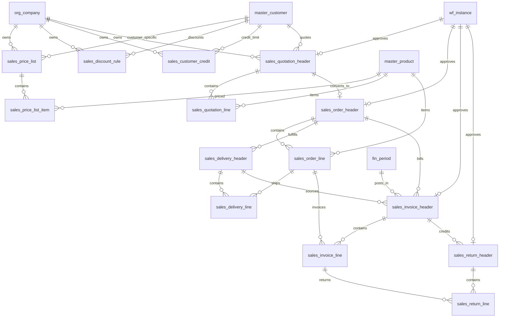

# ERD_05 — Sales Management Domain

**Document:** Enterprise ERD — Sales Management Domain  
**Version:** 1.0  
**Status:** Locked — Ready for Sprint 5 Implementation Planning  
**Schema:** `sales`  
**Table Prefix:** `sales_`  
**Aligned To:** BRD v1.0 · FRD-06 · SDD v1.1 · DBS v1.1 · Architecture Lock v1.1  
**Functional Requirements:** [FRD-06 Sales Domain](../02_FRD/FRD-06-Sales-Domain.md)  
**Classification:** Internal — Confidential  

---

## 1. Module Overview

The Sales Management Domain is the **order-to-cash transaction engine** (Architecture Lock §6) for customer quotations, sales orders, deliveries, invoicing, returns, pricing, and credit control. It consumes master data (customer, product, tax, currency) and posts revenue/AR to Finance (ERD_04) on invoice confirmation.

### Enterprise Sales Modules (FRD-06)

| # | Module | Primary Tables | Primary Consumers |
|---|--------|----------------|-------------------|
| 1 | Pricing Engine | `sales_price_list`, `sales_price_list_item`, `sales_discount_rule` | Quotation, Order, Invoice |
| 2 | Credit Management | `sales_customer_credit` | Order confirmation, Invoice |
| 3 | Quotation Management | `sales_quotation_header`, `sales_quotation_line` | CRM handoff, Sales Order |
| 4 | Sales Order Management | `sales_order_header`, `sales_order_line` | Delivery, Inventory reservation |
| 5 | Delivery Management | `sales_delivery_header`, `sales_delivery_line` | Invoice, Inventory issue |
| 6 | Invoice Management | `sales_invoice_header`, `sales_invoice_line` | Finance AR, Tax |
| 7 | Returns Management | `sales_return_header`, `sales_return_line` | Finance credit note, Inventory receipt |

**Table count:** 14  
**PostgreSQL Schema:** `sales` per DBS §14  

### Architectural Position

```text
Foundation (ERD_01) ── Workflow, Audit, RBAC
Organization (ERD_02) ── Company, Branch, Cost/Profit Centers
Master Data (ERD_03) ── Customer, Product, UOM, Currency, Tax
Finance (ERD_04) ── AR sub-ledger, Journal, Tax register
        ↓
Sales (ERD_05) ── Quotation → Order → Delivery → Invoice → Return
        ↓
Inventory (FRD-08) · BI · E-commerce (future)
```

---

## 2. Scope

### In Scope
- Company-scoped price lists, price list items, and discount rules (FRD-06 §8)
- Customer credit limits and exposure tracking (FRD-06 §6–7)
- Quotation lifecycle: draft through accepted/rejected/expired (FRD-06 §4–5)
- Sales order lifecycle: draft through confirmed/delivered/closed/cancelled (FRD-06 §6–7)
- Delivery documents linked to sales orders (FRD-06 §10)
- Sales invoice generation with tax breakdown and finance posting hooks (FRD-06 §11)
- Sales returns and credit-note source documents (FRD-06 §13–14)
- Workflow approval for quotations, discounts, orders, invoices, returns (FRD-06 §16)
- Full audit trail on all sales transactional changes (FRD-06 §18)
- Multi-currency support via `master_currency` and Finance exchange rates

### Out of Scope (Phase 2 / Separate ERD)
- **Payment collection tables** — customer payments tracked in Finance `fin_customer_ledger` (FRD-06 §12)
- **Contract management tables** — contract pricing modeled via `sales_price_list` with `price_list_type = 'contract'`; dedicated contract ERD deferred
- **CRM tables** (`crm_*`) — leads, opportunities, activities (FRD-05); optional `opportunity_reference` UUID on quotation header for future CRM integration
- **Inventory reservation/issue tables** (`inv_*`) — FRD-08; Sales emits reservation/release events via service API only
- **Procurement, manufacturing, payroll, banking** schemas and tables
- SQLAlchemy models, Alembic migrations, application code
- History tables (`hist_*`) — SCD Type 2 for price list changes
- Sales analytics cubes / materialized reporting views

### Future Integration Notes (Not Aligned FRD)
- **CRM (FRD-05):** Opportunity-to-quotation conversion via external reference UUID; no `crm_*` FK in Sprint 5 schema
- **Inventory (FRD-08):** Order confirmation triggers reservation API; delivery posting triggers stock issue API
- **E-commerce (FRD-22):** Channel orders map to `sales_order_header` via `source_module` / `source_document_id`

### Assumptions
- Every sales document is company-scoped; `branch_id` mandatory on all transactional headers/lines per DBS multi-tenancy
- `master_customer`, `master_product`, `master_uom`, `master_tax`, `master_currency` are authoritative — no duplicate party/product masters (C-01)
- Physical DELETE prohibited on all sales business tables
- Posted invoices are immutable — corrections via return/credit note documents
- Document numbers auto-generated per company; immutable after submit
- Pricing resolution follows FRD-06 hierarchy: contract → customer → volume → standard

### Dependencies

| Upstream | Tables Used |
|----------|-------------|
| ERD_01 Foundation | `sec_tenant`, `sec_user`, `wf_definition`, `wf_instance` |
| ERD_02 Organization | `org_company`, `org_branch`, `org_cost_center`, `org_profit_center` |
| ERD_03 Master Data | `master_customer`, `master_product`, `master_uom`, `master_currency`, `master_tax` |
| ERD_04 Finance | `fin_fiscal_year`, `fin_period`, `fin_customer_ledger`, `fin_journal_header`, `fin_tax_register` |

---

## 3. Table Inventory

| # | Table | Classification | tenant_id | company_id | branch_id | Soft Delete | Version | Workflow |
|---|-------|----------------|-----------|------------|-----------|-------------|---------|----------|
| 1 | `sales_price_list` | Sales Master | ✅ | ✅ | — | ✅ | ✅ | — |
| 2 | `sales_price_list_item` | Sales Master Detail | ✅ | ✅ | — | ✅ | ✅ | — |
| 3 | `sales_discount_rule` | Sales Master | ✅ | ✅ | optional | ✅ | ✅ | ✅ |
| 4 | `sales_customer_credit` | Sales Master | ✅ | ✅ | optional | ✅ | ✅ | — |
| 5 | `sales_quotation_header` | Transaction | ✅ | ✅ | ✅ | ✅ | ✅ | ✅ |
| 6 | `sales_quotation_line` | Transaction Detail | ✅ | ✅ | ✅ | ✅ | ✅ | — |
| 7 | `sales_order_header` | Transaction | ✅ | ✅ | ✅ | ✅ | ✅ | ✅ |
| 8 | `sales_order_line` | Transaction Detail | ✅ | ✅ | ✅ | ✅ | ✅ | — |
| 9 | `sales_delivery_header` | Transaction | ✅ | ✅ | ✅ | ✅ | ✅ | ✅ |
| 10 | `sales_delivery_line` | Transaction Detail | ✅ | ✅ | ✅ | ✅ | ✅ | — |
| 11 | `sales_invoice_header` | Transaction | ✅ | ✅ | ✅ | ✅ | ✅ | ✅ |
| 12 | `sales_invoice_line` | Transaction Detail | ✅ | ✅ | ✅ | ✅ | ✅ | — |
| 13 | `sales_return_header` | Transaction | ✅ | ✅ | ✅ | ✅ | ✅ | ✅ |
| 14 | `sales_return_line` | Transaction Detail | ✅ | ✅ | ✅ | ✅ | ✅ | — |

> **Note:** Posted `sales_invoice_header` rows (`status = 'posted'`) are **immutable** — no soft delete; corrections via `sales_return_header` only.

---

## 4. Entity Relationships



```text
org_company
    ├── sales_price_list ── master_customer (optional)
    │       └── sales_price_list_item ── master_product
    ├── sales_discount_rule ── master_customer, master_product (optional)
    ├── sales_customer_credit ── master_customer
    │
    ├── sales_quotation_header ── master_customer, wf_instance
    │       └── sales_quotation_line ── master_product, master_uom, master_tax
    │
    ├── sales_order_header ── sales_quotation_header, master_customer
    │       └── sales_order_line ── master_product, sales_quotation_line
    │
    ├── sales_delivery_header ── sales_order_header
    │       └── sales_delivery_line ── sales_order_line
    │
    ├── sales_invoice_header ── sales_order_header, sales_delivery_header, fin_period
    │       └── sales_invoice_line ── sales_order_line, sales_delivery_line
    │
    └── sales_return_header ── sales_invoice_header, sales_order_header
            └── sales_return_line ── sales_invoice_line
```

---

## 5. Standard Column Profiles

### 5.0 Sales Master Profile (Price List, Discount, Credit)

| Column Group | Columns |
|--------------|---------|
| Primary Key | `id UUID` |
| Tenant | `tenant_id UUID NOT NULL` |
| Company | `company_id UUID NOT NULL` |
| Business Key | `{entity}_code VARCHAR(50) NOT NULL` |
| Name | `{entity}_name VARCHAR(255)` (where applicable) |
| Status | `status VARCHAR(30) NOT NULL` |
| Effective Dates | `effective_from DATE`, `effective_to DATE` (optional) |
| Audit | `created_at`, `created_by`, `updated_at`, `updated_by`, `version` |
| Soft Delete | `is_deleted`, `deleted_at`, `deleted_by` |

### 5.1 Transaction Header Profile (Quotation, Order, Delivery, Invoice, Return)

Per DBS §29 Transaction Table Standards:

| Column Group | Columns |
|--------------|---------|
| Primary Key | `id UUID` |
| Document | `document_number VARCHAR(50) NOT NULL`, `document_date DATE NOT NULL` |
| Status | `status VARCHAR(30) NOT NULL`, `workflow_status VARCHAR(30)` |
| Tenant Scope | `tenant_id`, `company_id`, `branch_id` |
| Customer | `customer_id UUID NOT NULL` |
| Fiscal | `fiscal_year_id UUID`, `period_id UUID` (invoice/return) |
| Currency | `currency_code VARCHAR(3) NOT NULL`, `exchange_rate NUMERIC(18,8) NOT NULL` |
| Totals | `subtotal_amount`, `discount_amount`, `tax_amount`, `total_amount NUMERIC(18,4)` |
| Source | `source_module VARCHAR(50)`, `source_document_type VARCHAR(50)`, `source_document_id UUID` |
| Workflow | `workflow_instance_id UUID` |
| Audit + Soft Delete + Version | per DBS §28 |

### 5.2 Transaction Line Profile

| Column Group | Columns |
|--------------|---------|
| Primary Key | `id UUID` |
| Parent | `{parent}_header_id UUID NOT NULL` |
| Line Identity | `line_number SMALLINT NOT NULL` |
| Product | `product_id UUID NOT NULL`, `product_code VARCHAR(50)`, `product_name VARCHAR(255)` |
| Quantity | `quantity NUMERIC(18,4) NOT NULL`, `uom_id UUID`, `uom_code VARCHAR(20)` |
| Pricing | `unit_price`, `discount_percent`, `discount_amount`, `tax_amount`, `line_total NUMERIC(18,4)` |
| Tax | `tax_id UUID`, `tax_rate NUMERIC(8,4)` |
| Tenant Scope | `tenant_id`, `company_id`, `branch_id` |
| Audit + Soft Delete + Version | per DBS §28 |

---

## 6. Detailed Table Definitions

---

### 6.1 `sales_price_list`

#### 6.1.1 Purpose
Centralized price list registry supporting standard, customer-specific, volume, promotional, and contract pricing per FRD-06 §8–9.

#### 6.1.2 Columns

| Column | Type | Nullable | Default | Description |
|--------|------|----------|---------|-------------|
| `id` | UUID | NO | app-generated | PK |
| `tenant_id` | UUID | NO | — | FK → `foundation.sec_tenant` |
| `company_id` | UUID | NO | — | FK → `organization.org_company` |
| `price_list_code` | VARCHAR(50) | NO | — | UK per company |
| `price_list_name` | VARCHAR(255) | NO | — | Display name |
| `price_list_type` | VARCHAR(30) | NO | `'standard'` | standard, customer, volume, promotional, contract |
| `customer_id` | UUID | YES | — | FK → `master_customer` — required when type = customer/contract |
| `currency_code` | VARCHAR(3) | NO | — | FK ref → `master_currency` |
| `priority` | SMALLINT | NO | `100` | Lower = higher priority in resolution |
| `effective_from` | DATE | NO | — | — |
| `effective_to` | DATE | YES | — | NULL = open-ended |
| `status` | VARCHAR(30) | NO | `'active'` | draft, active, inactive, expired |
| AUDIT_STD + SOFT_DELETE_OPT | | | | |

#### 6.1.3 Business Rules
- Price list resolution: contract (priority 10) → customer (20) → volume (30) → promotional (40) → standard (50) per FRD-06 §8
- Overlapping active lists of same type/customer blocked at service layer
- Cannot deactivate list referenced by open quotations/orders

---

### 6.2 `sales_price_list_item`

#### 6.2.1 Purpose
Product-level unit prices within a price list. Supports volume break pricing via `min_quantity`.

#### 6.2.2 Columns

| Column | Type | Nullable | Description |
|--------|------|----------|-------------|
| `id` | UUID | NO | PK |
| `tenant_id` | UUID | NO | FK → `sec_tenant` |
| `company_id` | UUID | NO | FK → `org_company` |
| `price_list_id` | UUID | NO | FK → `sales_price_list` |
| `line_number` | SMALLINT | NO | 1, 2, 3… |
| `product_id` | UUID | NO | FK → `master_product` |
| `product_code` | VARCHAR(50) | NO | Denormalized |
| `min_quantity` | NUMERIC(18,4) | NO | DEFAULT 1 — volume break threshold |
| `unit_price` | NUMERIC(18,4) | NO | — |
| `uom_id` | UUID | YES | FK → `master_uom` |
| `status` | VARCHAR(30) | NO | active, inactive |
| AUDIT_STD + SOFT_DELETE_OPT | | | |

#### 6.2.3 Business Rules
- `unit_price` >= 0 (FRD-06 §5)
- Unique (`price_list_id`, `product_id`, `min_quantity`) for active rows
- Product must be sales-eligible (`master_product.is_sales_item = true`) — service layer

---

### 6.3 `sales_discount_rule`

#### 6.3.1 Purpose
Configurable discount rules requiring workflow approval when threshold exceeded (FRD-06 §16).

#### 6.3.2 Columns

| Column | Type | Nullable | Description |
|--------|------|----------|-------------|
| `id` | UUID | NO | PK |
| `tenant_id` | UUID | NO | FK → `sec_tenant` |
| `company_id` | UUID | NO | FK → `org_company` |
| `branch_id` | UUID | YES | FK → `org_branch` — NULL = company-wide |
| `discount_code` | VARCHAR(50) | NO | UK per company |
| `discount_name` | VARCHAR(255) | NO | — |
| `discount_type` | VARCHAR(30) | NO | percent, fixed_amount, buy_x_get_y |
| `discount_value` | NUMERIC(18,4) | NO | Percent or fixed amount |
| `max_discount_percent` | NUMERIC(8,4) | YES | Cap for line-level discount |
| `customer_id` | UUID | YES | FK → `master_customer` |
| `product_id` | UUID | YES | FK → `master_product` |
| `price_list_id` | UUID | YES | FK → `sales_price_list` |
| `min_order_amount` | NUMERIC(18,4) | YES | — |
| `effective_from` | DATE | NO | — |
| `effective_to` | DATE | YES | — |
| `requires_approval` | BOOLEAN | NO | DEFAULT FALSE |
| `status` | VARCHAR(30) | NO | draft, active, inactive |
| `workflow_instance_id` | UUID | YES | FK → `wf_instance` |
| AUDIT_STD + SOFT_DELETE_OPT | | | |

#### 6.3.3 Business Rules
- Discounts exceeding `max_discount_percent` or company policy trigger `SALES_DISCOUNT_APPROVAL` workflow
- Cannot stack discounts unless `discount_type` explicitly allows — service layer

---

### 6.4 `sales_customer_credit`

#### 6.4.1 Purpose
Customer credit limit and exposure tracking for order confirmation gating (FRD-06 §6–7).

#### 6.4.2 Columns

| Column | Type | Nullable | Description |
|--------|------|----------|-------------|
| `id` | UUID | NO | PK |
| `tenant_id` | UUID | NO | FK → `sec_tenant` |
| `company_id` | UUID | NO | FK → `org_company` |
| `branch_id` | UUID | YES | FK → `org_branch` |
| `customer_id` | UUID | NO | FK → `master_customer` |
| `credit_limit` | NUMERIC(18,4) | NO | DEFAULT 0 |
| `credit_used` | NUMERIC(18,4) | NO | DEFAULT 0 — denormalized exposure |
| `credit_available` | NUMERIC(18,4) | NO | GENERATED or maintained: limit − used |
| `currency_code` | VARCHAR(3) | NO | Credit limit currency |
| `payment_terms_days` | SMALLINT | YES | Default payment terms |
| `credit_hold` | BOOLEAN | NO | DEFAULT FALSE — blocks new orders |
| `credit_hold_reason` | VARCHAR(500) | YES | — |
| `last_review_date` | DATE | YES | — |
| `status` | VARCHAR(30) | NO | active, suspended, closed |
| AUDIT_STD + SOFT_DELETE_OPT | | | |

#### 6.4.3 Business Rules
- One active credit record per (`company_id`, `customer_id`, `branch_id`) — UK
- Order confirmation blocked when `credit_hold = true` or `order_total > credit_available`
- `credit_used` updated on invoice post; reduced on payment (Finance event) or return

---

### 6.5 `sales_quotation_header`

#### 6.5.1 Purpose
Customer quotation/proposal document (FRD-06 §4). Accepted quotations may convert to sales orders.

#### 6.5.2 Columns

| Column | Type | Nullable | Description |
|--------|------|----------|-------------|
| `id` | UUID | NO | PK |
| `tenant_id` | UUID | NO | FK → `sec_tenant` |
| `company_id` | UUID | NO | FK → `org_company` |
| `branch_id` | UUID | NO | FK → `org_branch` |
| `document_number` | VARCHAR(50) | NO | UK per company — `QT-YYYY-NNNNNN` |
| `document_date` | DATE | NO | Quotation date |
| `valid_until` | DATE | NO | Expiry date |
| `customer_id` | UUID | NO | FK → `master_customer` |
| `customer_name` | VARCHAR(255) | NO | Denormalized |
| `currency_code` | VARCHAR(3) | NO | — |
| `exchange_rate` | NUMERIC(18,8) | NO | DEFAULT 1.00000000 |
| `payment_terms` | VARCHAR(100) | YES | — |
| `opportunity_reference` | UUID | YES | External CRM opportunity ref (no FK) |
| `price_list_id` | UUID | YES | FK → `sales_price_list` |
| `subtotal_amount` | NUMERIC(18,4) | NO | DEFAULT 0 |
| `discount_amount` | NUMERIC(18,4) | NO | DEFAULT 0 |
| `tax_amount` | NUMERIC(18,4) | NO | DEFAULT 0 |
| `total_amount` | NUMERIC(18,4) | NO | DEFAULT 0 |
| `status` | VARCHAR(30) | NO | draft, submitted, sent, accepted, rejected, expired, cancelled |
| `workflow_status` | VARCHAR(30) | NO | pending, in_progress, approved, rejected |
| `workflow_instance_id` | UUID | YES | FK → `wf_instance` |
| `notes` | TEXT | YES | — |
| AUDIT_STD + SOFT_DELETE_OPT | | | |

#### 6.5.3 Business Rules
- Accepted quotation → eligible for sales order creation (FRD-06 §4)
- Rejected/expired quotations cannot create orders
- Auto-expire when `valid_until` < current date — scheduled job

---

### 6.6 `sales_quotation_line`

#### 6.6.1 Purpose
Quotation line items with product, quantity, pricing, discount, and tax (FRD-06 §5).

#### 6.6.2 Columns

| Column | Type | Nullable | Description |
|--------|------|----------|-------------|
| `id` | UUID | NO | PK |
| `tenant_id` | UUID | NO | — |
| `company_id` | UUID | NO | — |
| `branch_id` | UUID | NO | — |
| `quotation_header_id` | UUID | NO | FK → `sales_quotation_header` |
| `line_number` | SMALLINT | NO | — |
| `product_id` | UUID | NO | FK → `master_product` |
| `product_code` | VARCHAR(50) | NO | Denormalized |
| `product_name` | VARCHAR(255) | NO | — |
| `description` | VARCHAR(500) | YES | — |
| `quantity` | NUMERIC(18,4) | NO | Must be > 0 |
| `uom_id` | UUID | NO | FK → `master_uom` |
| `unit_price` | NUMERIC(18,4) | NO | >= 0 |
| `discount_percent` | NUMERIC(8,4) | NO | DEFAULT 0 |
| `discount_amount` | NUMERIC(18,4) | NO | DEFAULT 0 |
| `tax_id` | UUID | YES | FK → `master_tax` |
| `tax_rate` | NUMERIC(8,4) | NO | DEFAULT 0 |
| `tax_amount` | NUMERIC(18,4) | NO | DEFAULT 0 |
| `line_total` | NUMERIC(18,4) | NO | — |
| AUDIT_STD + SOFT_DELETE_OPT | | | |

#### 6.6.3 Business Rules
- `quantity` > 0, `unit_price` >= 0 (FRD-06 §5)
- Header totals = SUM(line totals) — recalculated on line change

---

### 6.7 `sales_order_header`

#### 6.7.1 Purpose
Executable customer sales order converted from quotation or created directly (FRD-06 §6).

#### 6.7.2 Columns

| Column | Type | Nullable | Description |
|--------|------|----------|-------------|
| `id` | UUID | NO | PK |
| `tenant_id` | UUID | NO | — |
| `company_id` | UUID | NO | — |
| `branch_id` | UUID | NO | — |
| `document_number` | VARCHAR(50) | NO | UK — `SO-YYYY-NNNNNN` |
| `document_date` | DATE | NO | Order date |
| `requested_delivery_date` | DATE | YES | — |
| `customer_id` | UUID | NO | FK → `master_customer` |
| `quotation_header_id` | UUID | YES | FK → `sales_quotation_header` |
| `price_list_id` | UUID | YES | FK → `sales_price_list` |
| `currency_code` | VARCHAR(3) | NO | — |
| `exchange_rate` | NUMERIC(18,8) | NO | — |
| `subtotal_amount` | NUMERIC(18,4) | NO | DEFAULT 0 |
| `discount_amount` | NUMERIC(18,4) | NO | DEFAULT 0 |
| `tax_amount` | NUMERIC(18,4) | NO | DEFAULT 0 |
| `total_amount` | NUMERIC(18,4) | NO | DEFAULT 0 |
| `delivered_amount` | NUMERIC(18,4) | NO | DEFAULT 0 — denormalized |
| `invoiced_amount` | NUMERIC(18,4) | NO | DEFAULT 0 — denormalized |
| `status` | VARCHAR(30) | NO | draft, confirmed, processing, partially_delivered, delivered, closed, cancelled |
| `workflow_status` | VARCHAR(30) | NO | — |
| `workflow_instance_id` | UUID | YES | FK → `wf_instance` |
| `reservation_status` | VARCHAR(30) | YES | pending, reserved, released — Inventory API |
| `source_module` | VARCHAR(50) | YES | ecommerce, manual |
| `source_document_id` | UUID | YES | — |
| AUDIT_STD + SOFT_DELETE_OPT | | | |

#### 6.7.3 Business Rules
- Confirmed order → inventory reservation event (FRD-06 §7)
- Cancelled order → inventory release event
- Delivered/partially delivered → eligible for invoicing
- Credit check on confirmation against `sales_customer_credit`

---

### 6.8 `sales_order_line`

#### 6.8.1 Purpose
Sales order line items with fulfillment tracking quantities.

#### 6.8.2 Columns

| Column | Type | Nullable | Description |
|--------|------|----------|-------------|
| `id` | UUID | NO | PK |
| `tenant_id` | UUID | NO | — |
| `company_id` | UUID | NO | — |
| `branch_id` | UUID | NO | — |
| `order_header_id` | UUID | NO | FK → `sales_order_header` |
| `line_number` | SMALLINT | NO | — |
| `quotation_line_id` | UUID | YES | FK → `sales_quotation_line` |
| `product_id` | UUID | NO | FK → `master_product` |
| `product_code` | VARCHAR(50) | NO | — |
| `product_name` | VARCHAR(255) | NO | — |
| `quantity` | NUMERIC(18,4) | NO | Ordered qty |
| `quantity_delivered` | NUMERIC(18,4) | NO | DEFAULT 0 |
| `quantity_invoiced` | NUMERIC(18,4) | NO | DEFAULT 0 |
| `quantity_returned` | NUMERIC(18,4) | NO | DEFAULT 0 |
| `uom_id` | UUID | NO | FK → `master_uom` |
| `unit_price` | NUMERIC(18,4) | NO | — |
| `discount_percent` | NUMERIC(8,4) | NO | DEFAULT 0 |
| `discount_amount` | NUMERIC(18,4) | NO | DEFAULT 0 |
| `tax_id` | UUID | YES | FK → `master_tax` |
| `tax_rate` | NUMERIC(8,4) | NO | DEFAULT 0 |
| `tax_amount` | NUMERIC(18,4) | NO | DEFAULT 0 |
| `line_total` | NUMERIC(18,4) | NO | — |
| `status` | VARCHAR(30) | NO | open, partially_delivered, delivered, cancelled |
| AUDIT_STD + SOFT_DELETE_OPT | | | |

#### 6.8.3 Business Rules
- `quantity_delivered` <= `quantity`; `quantity_invoiced` <= `quantity_delivered` (unless direct invoice allowed by policy)
- Line cancellation only when header is draft/confirmed and qty not delivered

---

### 6.9 `sales_delivery_header`

#### 6.9.1 Purpose
Delivery/shipment document for order fulfillment tracking (FRD-06 §10).

#### 6.9.2 Columns

| Column | Type | Nullable | Description |
|--------|------|----------|-------------|
| `id` | UUID | NO | PK |
| `tenant_id` | UUID | NO | — |
| `company_id` | UUID | NO | — |
| `branch_id` | UUID | NO | — |
| `document_number` | VARCHAR(50) | NO | UK — `DLV-YYYY-NNNNNN` |
| `document_date` | DATE | NO | Delivery date |
| `order_header_id` | UUID | NO | FK → `sales_order_header` |
| `customer_id` | UUID | NO | FK → `master_customer` |
| `ship_to_address` | TEXT | YES | — |
| `warehouse_reference` | UUID | YES | External Inventory warehouse ref (no FK) |
| `subtotal_amount` | NUMERIC(18,4) | NO | DEFAULT 0 |
| `status` | VARCHAR(30) | NO | draft, pending, in_progress, partially_delivered, delivered, cancelled |
| `workflow_status` | VARCHAR(30) | YES | — |
| `workflow_instance_id` | UUID | YES | FK → `wf_instance` |
| `shipped_at` | TIMESTAMPTZ | YES | — |
| `shipped_by` | UUID | YES | FK → `sec_user` |
| AUDIT_STD + SOFT_DELETE_OPT | | | |

#### 6.9.3 Business Rules
- Delivery confirmation triggers inventory stock issue API (FRD-08 integration point)
- Updates `sales_order_line.quantity_delivered` and order header status

---

### 6.10 `sales_delivery_line`

#### 6.10.1 Purpose
Delivery line items linking shipped quantities to order lines.

#### 6.10.2 Columns

| Column | Type | Nullable | Description |
|--------|------|----------|-------------|
| `id` | UUID | NO | PK |
| `tenant_id` | UUID | NO | — |
| `company_id` | UUID | NO | — |
| `branch_id` | UUID | NO | — |
| `delivery_header_id` | UUID | NO | FK → `sales_delivery_header` |
| `order_line_id` | UUID | NO | FK → `sales_order_line` |
| `line_number` | SMALLINT | NO | — |
| `product_id` | UUID | NO | FK → `master_product` |
| `quantity` | NUMERIC(18,4) | NO | Shipped qty |
| `uom_id` | UUID | NO | FK → `master_uom` |
| `batch_reference` | VARCHAR(100) | YES | Lot/serial ref for Inventory |
| `status` | VARCHAR(30) | NO | pending, shipped, cancelled |
| AUDIT_STD + SOFT_DELETE_OPT | | | |

---

### 6.11 `sales_invoice_header`

#### 6.11.1 Purpose
Customer sales invoice — financial document posting to Finance AR/Revenue (FRD-06 §11).

#### 6.11.2 Columns

| Column | Type | Nullable | Description |
|--------|------|----------|-------------|
| `id` | UUID | NO | PK |
| `tenant_id` | UUID | NO | — |
| `company_id` | UUID | NO | — |
| `branch_id` | UUID | NO | — |
| `document_number` | VARCHAR(50) | NO | UK — `INV-YYYY-NNNNNN` |
| `document_date` | DATE | NO | Invoice date |
| `due_date` | DATE | NO | Payment due date |
| `customer_id` | UUID | NO | FK → `master_customer` |
| `order_header_id` | UUID | YES | FK → `sales_order_header` |
| `delivery_header_id` | UUID | YES | FK → `sales_delivery_header` |
| `fiscal_year_id` | UUID | NO | FK → `fin_fiscal_year` |
| `period_id` | UUID | NO | FK → `fin_period` |
| `currency_code` | VARCHAR(3) | NO | — |
| `exchange_rate` | NUMERIC(18,8) | NO | — |
| `subtotal_amount` | NUMERIC(18,4) | NO | DEFAULT 0 |
| `discount_amount` | NUMERIC(18,4) | NO | DEFAULT 0 |
| `tax_amount` | NUMERIC(18,4) | NO | DEFAULT 0 |
| `total_amount` | NUMERIC(18,4) | NO | DEFAULT 0 |
| `amount_paid` | NUMERIC(18,4) | NO | DEFAULT 0 — updated by Finance |
| `balance_due` | NUMERIC(18,4) | NO | DEFAULT 0 |
| `status` | VARCHAR(30) | NO | draft, submitted, posted, partially_paid, paid, cancelled |
| `workflow_status` | VARCHAR(30) | NO | — |
| `workflow_instance_id` | UUID | YES | FK → `wf_instance` |
| `posted_at` | TIMESTAMPTZ | YES | — |
| `posted_by` | UUID | YES | FK → `sec_user` |
| `finance_ledger_id` | UUID | YES | FK → `fin_customer_ledger` |
| `finance_journal_id` | UUID | YES | FK → `fin_journal_header` |
| AUDIT_STD + SOFT_DELETE_OPT | | | |

#### 6.11.3 Business Rules
- Posting creates `fin_customer_ledger` + balanced `fin_journal_header` (AR Dr, Revenue Cr) per FRD-06 §11
- Posted invoices immutable — no soft delete
- Period must be `open` or `soft_closed` with adjust permission at post time

---

### 6.12 `sales_invoice_line`

#### 6.12.1 Purpose
Invoice line items with revenue account mapping for finance posting.

#### 6.12.2 Columns

| Column | Type | Nullable | Description |
|--------|------|----------|-------------|
| `id` | UUID | NO | PK |
| `tenant_id` | UUID | NO | — |
| `company_id` | UUID | NO | — |
| `branch_id` | UUID | NO | — |
| `invoice_header_id` | UUID | NO | FK → `sales_invoice_header` |
| `order_line_id` | UUID | YES | FK → `sales_order_line` |
| `delivery_line_id` | UUID | YES | FK → `sales_delivery_line` |
| `line_number` | SMALLINT | NO | — |
| `product_id` | UUID | NO | FK → `master_product` |
| `product_code` | VARCHAR(50) | NO | — |
| `description` | VARCHAR(500) | YES | — |
| `quantity` | NUMERIC(18,4) | NO | — |
| `uom_id` | UUID | NO | FK → `master_uom` |
| `unit_price` | NUMERIC(18,4) | NO | — |
| `discount_amount` | NUMERIC(18,4) | NO | DEFAULT 0 |
| `tax_id` | UUID | YES | FK → `master_tax` |
| `tax_rate` | NUMERIC(8,4) | NO | DEFAULT 0 |
| `tax_amount` | NUMERIC(18,4) | NO | DEFAULT 0 |
| `line_total` | NUMERIC(18,4) | NO | — |
| `revenue_account_id` | UUID | YES | FK → `fin_chart_of_account` — resolved at post |
| AUDIT_STD + SOFT_DELETE_OPT | | | |

---

### 6.13 `sales_return_header`

#### 6.13.1 Purpose
Customer return / credit note source document (FRD-06 §13–14).

#### 6.13.2 Columns

| Column | Type | Nullable | Description |
|--------|------|----------|-------------|
| `id` | UUID | NO | PK |
| `tenant_id` | UUID | NO | — |
| `company_id` | UUID | NO | — |
| `branch_id` | UUID | NO | — |
| `document_number` | VARCHAR(50) | NO | UK — `RET-YYYY-NNNNNN` |
| `document_date` | DATE | NO | Return date |
| `customer_id` | UUID | NO | FK → `master_customer` |
| `invoice_header_id` | UUID | YES | FK → `sales_invoice_header` |
| `order_header_id` | UUID | YES | FK → `sales_order_header` |
| `fiscal_year_id` | UUID | NO | FK → `fin_fiscal_year` |
| `period_id` | UUID | NO | FK → `fin_period` |
| `return_type` | VARCHAR(30) | NO | damaged, wrong_item, excess_qty, quality_issue |
| `currency_code` | VARCHAR(3) | NO | — |
| `exchange_rate` | NUMERIC(18,8) | NO | — |
| `subtotal_amount` | NUMERIC(18,4) | NO | DEFAULT 0 |
| `tax_amount` | NUMERIC(18,4) | NO | DEFAULT 0 |
| `total_amount` | NUMERIC(18,4) | NO | DEFAULT 0 |
| `status` | VARCHAR(30) | NO | draft, requested, approved, received, posted, closed, cancelled |
| `workflow_status` | VARCHAR(30) | NO | — |
| `workflow_instance_id` | UUID | YES | FK → `wf_instance` |
| `posted_at` | TIMESTAMPTZ | YES | — |
| `finance_journal_id` | UUID | YES | FK → `fin_journal_header` |
| `reason` | VARCHAR(500) | YES | — |
| AUDIT_STD + SOFT_DELETE_OPT | | | |

#### 6.13.3 Business Rules
- Posted return creates reversing finance entry: Sales Return Dr, AR Cr (FRD-06 §14)
- Requires `SALES_RETURN_APPROVAL` workflow before post

---

### 6.14 `sales_return_line`

#### 6.14.1 Purpose
Return line items referencing original invoice lines.

#### 6.14.2 Columns

| Column | Type | Nullable | Description |
|--------|------|----------|-------------|
| `id` | UUID | NO | PK |
| `tenant_id` | UUID | NO | — |
| `company_id` | UUID | NO | — |
| `branch_id` | UUID | NO | — |
| `return_header_id` | UUID | NO | FK → `sales_return_header` |
| `invoice_line_id` | UUID | YES | FK → `sales_invoice_line` |
| `order_line_id` | UUID | YES | FK → `sales_order_line` |
| `line_number` | SMALLINT | NO | — |
| `product_id` | UUID | NO | FK → `master_product` |
| `quantity` | NUMERIC(18,4) | NO | Returned qty |
| `uom_id` | UUID | NO | FK → `master_uom` |
| `unit_price` | NUMERIC(18,4) | NO | — |
| `tax_id` | UUID | YES | FK → `master_tax` |
| `tax_amount` | NUMERIC(18,4) | NO | DEFAULT 0 |
| `line_total` | NUMERIC(18,4) | NO | — |
| `status` | VARCHAR(30) | NO | requested, received, posted |
| AUDIT_STD + SOFT_DELETE_OPT | | | |

---

## 7. Primary Keys

| Table | Constraint Name | Column |
|-------|-----------------|--------|
| `sales_price_list` | `pk_sales_price_list` | `id` |
| `sales_price_list_item` | `pk_sales_price_list_item` | `id` |
| `sales_discount_rule` | `pk_sales_discount_rule` | `id` |
| `sales_customer_credit` | `pk_sales_customer_credit` | `id` |
| `sales_quotation_header` | `pk_sales_quotation_header` | `id` |
| `sales_quotation_line` | `pk_sales_quotation_line` | `id` |
| `sales_order_header` | `pk_sales_order_header` | `id` |
| `sales_order_line` | `pk_sales_order_line` | `id` |
| `sales_delivery_header` | `pk_sales_delivery_header` | `id` |
| `sales_delivery_line` | `pk_sales_delivery_line` | `id` |
| `sales_invoice_header` | `pk_sales_invoice_header` | `id` |
| `sales_invoice_line` | `pk_sales_invoice_line` | `id` |
| `sales_return_header` | `pk_sales_return_header` | `id` |
| `sales_return_line` | `pk_sales_return_line` | `id` |

---

## 8. Foreign Keys

| Child Table | Constraint Name | Column | Parent Table |
|-------------|-----------------|--------|--------------|
| `sales_price_list` | `fk_sales_pl_tenant` | `tenant_id` | `foundation.sec_tenant` |
| `sales_price_list` | `fk_sales_pl_company` | `company_id` | `organization.org_company` |
| `sales_price_list` | `fk_sales_pl_customer` | `customer_id` | `master.master_customer` |
| `sales_price_list_item` | `fk_sales_pli_list` | `price_list_id` | `sales.sales_price_list` |
| `sales_price_list_item` | `fk_sales_pli_product` | `product_id` | `master.master_product` |
| `sales_price_list_item` | `fk_sales_pli_uom` | `uom_id` | `master.master_uom` |
| `sales_discount_rule` | `fk_sales_dr_customer` | `customer_id` | `master.master_customer` |
| `sales_discount_rule` | `fk_sales_dr_product` | `product_id` | `master.master_product` |
| `sales_discount_rule` | `fk_sales_dr_price_list` | `price_list_id` | `sales.sales_price_list` |
| `sales_discount_rule` | `fk_sales_dr_workflow` | `workflow_instance_id` | `foundation.wf_instance` |
| `sales_customer_credit` | `fk_sales_cc_customer` | `customer_id` | `master.master_customer` |
| `sales_quotation_header` | `fk_sales_qh_customer` | `customer_id` | `master.master_customer` |
| `sales_quotation_header` | `fk_sales_qh_price_list` | `price_list_id` | `sales.sales_price_list` |
| `sales_quotation_header` | `fk_sales_qh_workflow` | `workflow_instance_id` | `foundation.wf_instance` |
| `sales_quotation_line` | `fk_sales_ql_header` | `quotation_header_id` | `sales.sales_quotation_header` |
| `sales_quotation_line` | `fk_sales_ql_product` | `product_id` | `master.master_product` |
| `sales_quotation_line` | `fk_sales_ql_tax` | `tax_id` | `master.master_tax` |
| `sales_order_header` | `fk_sales_oh_quotation` | `quotation_header_id` | `sales.sales_quotation_header` |
| `sales_order_header` | `fk_sales_oh_customer` | `customer_id` | `master.master_customer` |
| `sales_order_header` | `fk_sales_oh_workflow` | `workflow_instance_id` | `foundation.wf_instance` |
| `sales_order_line` | `fk_sales_ol_header` | `order_header_id` | `sales.sales_order_header` |
| `sales_order_line` | `fk_sales_ol_quotation_line` | `quotation_line_id` | `sales.sales_quotation_line` |
| `sales_order_line` | `fk_sales_ol_product` | `product_id` | `master.master_product` |
| `sales_delivery_header` | `fk_sales_dh_order` | `order_header_id` | `sales.sales_order_header` |
| `sales_delivery_header` | `fk_sales_dh_customer` | `customer_id` | `master.master_customer` |
| `sales_delivery_line` | `fk_sales_dl_header` | `delivery_header_id` | `sales.sales_delivery_header` |
| `sales_delivery_line` | `fk_sales_dl_order_line` | `order_line_id` | `sales.sales_order_line` |
| `sales_invoice_header` | `fk_sales_ih_order` | `order_header_id` | `sales.sales_order_header` |
| `sales_invoice_header` | `fk_sales_ih_delivery` | `delivery_header_id` | `sales.sales_delivery_header` |
| `sales_invoice_header` | `fk_sales_ih_period` | `period_id` | `finance.fin_period` |
| `sales_invoice_header` | `fk_sales_ih_ledger` | `finance_ledger_id` | `finance.fin_customer_ledger` |
| `sales_invoice_header` | `fk_sales_ih_journal` | `finance_journal_id` | `finance.fin_journal_header` |
| `sales_invoice_line` | `fk_sales_il_header` | `invoice_header_id` | `sales.sales_invoice_header` |
| `sales_invoice_line` | `fk_sales_il_order_line` | `order_line_id` | `sales.sales_order_line` |
| `sales_invoice_line` | `fk_sales_il_revenue_acct` | `revenue_account_id` | `finance.fin_chart_of_account` |
| `sales_return_header` | `fk_sales_rh_invoice` | `invoice_header_id` | `sales.sales_invoice_header` |
| `sales_return_header` | `fk_sales_rh_order` | `order_header_id` | `sales.sales_order_header` |
| `sales_return_header` | `fk_sales_rh_period` | `period_id` | `finance.fin_period` |
| `sales_return_header` | `fk_sales_rh_journal` | `finance_journal_id` | `finance.fin_journal_header` |
| `sales_return_line` | `fk_sales_rl_header` | `return_header_id` | `sales.sales_return_header` |
| `sales_return_line` | `fk_sales_rl_invoice_line` | `invoice_line_id` | `sales.sales_invoice_line` |

> All `sales_*` tables include `fk_*_tenant` → `sec_tenant(id)` and `fk_*_company` → `org_company(id)`. Transactional tables include `fk_*_branch` → `org_branch(id)`.

---

## 9. Index Strategy

### 9.1 Per-Table Indexes

| Table | Index Name | Columns | Type |
|-------|------------|---------|------|
| `sales_price_list` | `ux_sales_pl_company_code` | (`company_id`, `price_list_code`) | UNIQUE |
| `sales_price_list` | `ix_sales_pl_customer` | (`customer_id`, `status`) | BTREE |
| `sales_price_list` | `ix_sales_pl_effective` | (`effective_from`, `effective_to`) | BTREE |
| `sales_price_list_item` | `ux_sales_pli_list_product_qty` | (`price_list_id`, `product_id`, `min_quantity`) | UNIQUE |
| `sales_discount_rule` | `ux_sales_dr_company_code` | (`company_id`, `discount_code`) | UNIQUE |
| `sales_customer_credit` | `ux_sales_cc_customer_branch` | (`company_id`, `customer_id`, `branch_id`) | UNIQUE |
| `sales_quotation_header` | `ux_sales_qh_company_number` | (`company_id`, `document_number`) | UNIQUE |
| `sales_quotation_header` | `ix_sales_qh_customer_date` | (`customer_id`, `document_date`) | BTREE |
| `sales_quotation_header` | `ix_sales_qh_status` | (`status`, `valid_until`) | BTREE |
| `sales_quotation_line` | `ux_sales_ql_header_line` | (`quotation_header_id`, `line_number`) | UNIQUE |
| `sales_order_header` | `ux_sales_oh_company_number` | (`company_id`, `document_number`) | UNIQUE |
| `sales_order_header` | `ix_sales_oh_customer_date` | (`customer_id`, `document_date`) | BTREE |
| `sales_order_header` | `ix_sales_oh_status` | (`status`) | BTREE |
| `sales_order_header` | `ix_sales_oh_quotation` | (`quotation_header_id`) | BTREE |
| `sales_order_line` | `ux_sales_ol_header_line` | (`order_header_id`, `line_number`) | UNIQUE |
| `sales_delivery_header` | `ux_sales_dh_company_number` | (`company_id`, `document_number`) | UNIQUE |
| `sales_delivery_header` | `ix_sales_dh_order` | (`order_header_id`) | BTREE |
| `sales_delivery_line` | `ux_sales_dl_header_line` | (`delivery_header_id`, `line_number`) | UNIQUE |
| `sales_invoice_header` | `ux_sales_ih_company_number` | (`company_id`, `document_number`) | UNIQUE |
| `sales_invoice_header` | `ix_sales_ih_customer_due` | (`customer_id`, `due_date`) | BTREE |
| `sales_invoice_header` | `ix_sales_ih_status` | (`status`, `period_id`) | BTREE |
| `sales_invoice_line` | `ux_sales_il_header_line` | (`invoice_header_id`, `line_number`) | UNIQUE |
| `sales_return_header` | `ux_sales_rh_company_number` | (`company_id`, `document_number`) | UNIQUE |
| `sales_return_header` | `ix_sales_rh_invoice` | (`invoice_header_id`) | BTREE |
| `sales_return_line` | `ux_sales_rl_header_line` | (`return_header_id`, `line_number`) | UNIQUE |

### 9.2 Cross-Cutting Index Rules
- All tables: `ix_{table}_tenant_id` (`tenant_id`)
- All tables: `ix_{table}_company_id` (`company_id`)
- Transactional headers: `ix_{table}_branch_id` (`branch_id`)
- List APIs: composite (`company_id`, `document_date DESC`) for pagination

### 9.3 Partition Candidates (Phase 2)
- `sales_invoice_header` — range partition by `document_date` (yearly) at 10M+ rows
- `sales_order_header` — range partition by `document_date` (yearly) at scale

---

## 10. Constraints + Status Lifecycle

### 10.1 Unique Constraints

| Table | Constraint | Columns |
|-------|------------|---------|
| `sales_price_list` | `uk_sales_pl_company_code` | (`company_id`, `price_list_code`) |
| `sales_price_list_item` | `uk_sales_pli_list_product_qty` | (`price_list_id`, `product_id`, `min_quantity`) |
| `sales_discount_rule` | `uk_sales_dr_company_code` | (`company_id`, `discount_code`) |
| `sales_customer_credit` | `uk_sales_cc_customer_branch` | (`company_id`, `customer_id`, `branch_id`) |
| `sales_quotation_header` | `uk_sales_qh_company_number` | (`company_id`, `document_number`) |
| `sales_quotation_line` | `uk_sales_ql_header_line` | (`quotation_header_id`, `line_number`) |
| `sales_order_header` | `uk_sales_oh_company_number` | (`company_id`, `document_number`) |
| `sales_order_line` | `uk_sales_ol_header_line` | (`order_header_id`, `line_number`) |
| `sales_delivery_header` | `uk_sales_dh_company_number` | (`company_id`, `document_number`) |
| `sales_delivery_line` | `uk_sales_dl_header_line` | (`delivery_header_id`, `line_number`) |
| `sales_invoice_header` | `uk_sales_ih_company_number` | (`company_id`, `document_number`) |
| `sales_invoice_line` | `uk_sales_il_header_line` | (`invoice_header_id`, `line_number`) |
| `sales_return_header` | `uk_sales_rh_company_number` | (`company_id`, `document_number`) |
| `sales_return_line` | `uk_sales_rl_header_line` | (`return_header_id`, `line_number`) |

### 10.2 Check Constraints

| Table | Constraint | Rule |
|-------|------------|------|
| `sales_price_list` | `ck_sales_pl_type` | `price_list_type` IN ('standard','customer','volume','promotional','contract') |
| `sales_price_list` | `ck_sales_pl_dates` | `effective_to` IS NULL OR `effective_to` >= `effective_from` |
| `sales_price_list_item` | `ck_sales_pli_price` | `unit_price` >= 0 |
| `sales_quotation_line` | `ck_sales_ql_qty` | `quantity` > 0 |
| `sales_quotation_line` | `ck_sales_ql_price` | `unit_price` >= 0 |
| `sales_order_line` | `ck_sales_ol_qty` | `quantity` > 0 |
| `sales_customer_credit` | `ck_sales_cc_limit` | `credit_limit` >= 0 |
| `sales_invoice_header` | `ck_sales_ih_amounts` | `total_amount` >= 0 |
| `sales_invoice_header` | `ck_sales_ih_balance` | `balance_due` = `total_amount` - `amount_paid` |

### 10.3 Status Lifecycles

#### Quotation (`sales_quotation_header.status`)
```text
draft → submitted → sent → accepted | rejected | expired
accepted → (convert to sales order)
any (pre-accepted) → cancelled
```

#### Sales Order (`sales_order_header.status`)
```text
draft → confirmed → processing → partially_delivered → delivered → closed
any (pre-delivered) → cancelled
```

#### Delivery (`sales_delivery_header.status`)
```text
draft → pending → in_progress → partially_delivered → delivered
any (pre-delivered) → cancelled
```

#### Invoice (`sales_invoice_header.status`)
```text
draft → submitted → posted → partially_paid → paid
draft/submitted → cancelled
posted → (corrections via sales_return only)
```

#### Return (`sales_return_header.status`)
```text
draft → requested → approved → received → posted → closed
any (pre-posted) → cancelled
```

### 10.4 Immutability Rules
- Posted invoices: no UPDATE on amounts, customer, or lines — return document required
- Document numbers immutable after `submitted` status
- Physical DELETE prohibited — soft delete in `draft` only

---

## 11. Workflow Integration

| Document | Workflow Code | Steps | FK Column |
|----------|---------------|-------|-----------|
| Quotation | `SALES_QUOTATION_APPROVAL` | Draft → Sales Manager → Approved | `sales_quotation_header.workflow_instance_id` |
| Discount Rule | `SALES_DISCOUNT_APPROVAL` | Sales Executive → Sales Manager → Finance | `sales_discount_rule.workflow_instance_id` |
| Sales Order | `SALES_ORDER_APPROVAL` | Draft → Sales Manager → Confirmed | `sales_order_header.workflow_instance_id` |
| Invoice | `SALES_INVOICE_APPROVAL` | Draft → Finance Review → Posted | `sales_invoice_header.workflow_instance_id` |
| Return | `SALES_RETURN_APPROVAL` | Sales Manager → Finance Manager → Approved | `sales_return_header.workflow_instance_id` |

### Workflow Rules
- `workflow_instance_id` → `foundation.wf_instance.id`
- Rejected workflow sets document `status` to prior state or `cancelled`
- Segregation of duties: quotation creator ≠ approver (configurable per tenant)
- High-value orders/invoices may require elevated approval tier — policy table in Foundation

---

## 12. Finance Posting Integration

### 12.1 Invoice Posting (FRD-06 §11)

| Step | Action | Finance Artifact |
|------|--------|------------------|
| 1 | Validate period open, customer active, totals balanced | — |
| 2 | Create `fin_customer_ledger` (document_type = `sales_invoice`) | AR sub-ledger |
| 3 | Create `fin_journal_header` (source_module = `sales`, journal_type = `system`) | Journal |
| 4 | Journal lines: AR account Dr, Revenue account Cr per line | `fin_journal_line` |
| 5 | Tax lines → `fin_tax_register` (output tax) | Tax compliance |
| 6 | Update `sales_invoice_header.finance_ledger_id`, `finance_journal_id` | Cross-ref |
| 7 | Update `sales_customer_credit.credit_used` | Credit exposure |

**Accounting Entry:**
```text
Accounts Receivable (Dr)  ── total_amount
    Sales Revenue (Cr)  ── subtotal_amount
    Tax Payable (Cr)    ── tax_amount
```

### 12.2 Return / Credit Note Posting (FRD-06 §14)

| Step | Action | Finance Artifact |
|------|--------|------------------|
| 1 | Validate against original posted invoice | — |
| 2 | Create reversal `fin_journal_header` | Journal (system) |
| 3 | Sales Return Dr, AR Cr | Balanced entry |
| 4 | Tax reversal in `fin_tax_register` | Output tax adjustment |
| 5 | Reduce `sales_customer_credit.credit_used` | Credit exposure |

### 12.3 Payment Status (Finance-Owned)
- `sales_invoice_header.amount_paid` and `balance_due` updated via Finance payment events — no payment tables in Sales schema
- Invoice status `partially_paid` / `paid` driven by Finance AR allocation callbacks

### 12.4 Period Control
- Invoice/return posting blocked when `fin_period.status = 'hard_closed'`
- Respects `fin_period.ar_closed` flag during month-end close (ERD_04 §11.4)

---

## 13. Audit Strategy

| Operation | `audit.audit_log.operation` | Tables |
|-----------|---------------------------|--------|
| Price list create/update/delete | `create`, `update`, `archive` | `sales_price_list`, `sales_price_list_item` |
| Discount rule changes | `create`, `update`, `submit`, `approve` | `sales_discount_rule` |
| Credit limit changes | `create`, `update` | `sales_customer_credit` |
| Quotation lifecycle | `create`, `update`, `submit`, `approve`, `reject`, `cancel` | `sales_quotation_*` |
| Order lifecycle | `create`, `update`, `confirm`, `cancel` | `sales_order_*` |
| Delivery | `create`, `update`, `ship` | `sales_delivery_*` |
| Invoice | `create`, `update`, `submit`, `post`, `cancel` | `sales_invoice_*` |
| Return | `create`, `update`, `approve`, `post` | `sales_return_*` |

### Audit Rules
- All status transitions logged with `old_value` / `new_value` JSON per DBS §28
- Posted invoice `post` operation includes `finance_journal_id` in audit payload
- Financial document retention: **7 years minimum** aligned with Finance (FRD-06 §18)
- Audit logs append-only — no purge without GRC approval

---

## 14. Security / RBAC

### 14.1 Data Classification

| Table | Classification | Notes |
|-------|----------------|-------|
| `sales_price_list`, `sales_price_list_item` | Internal | Pricing strategy |
| `sales_discount_rule` | Internal | Margin-sensitive |
| `sales_customer_credit` | **Confidential** | Credit exposure |
| `sales_quotation_*` | Internal | Pre-sales |
| `sales_order_*`, `sales_delivery_*` | Internal | Operational |
| `sales_invoice_*` | **Confidential** | Revenue, customer financials |
| `sales_return_*` | **Confidential** | Revenue adjustments |

### 14.2 Sales RBAC Permissions (Planned — Sprint 5)

| Resource | Permissions |
|----------|-------------|
| `sales.price_list` | read, create, update, delete |
| `sales.discount_rule` | read, create, update, delete, submit, approve |
| `sales.customer_credit` | read, create, update |
| `sales.quotation` | read, create, update, delete, submit, approve, convert |
| `sales.order` | read, create, update, delete, confirm, cancel |
| `sales.delivery` | read, create, update, ship |
| `sales.invoice` | read, create, update, submit, post, cancel |
| `sales.return` | read, create, update, submit, approve, post |
| `sales.report` | read, export |

### 14.3 Access Control

| Level | Rule |
|-------|------|
| Tenant | All queries filtered by `tenant_id` |
| Company | User must have company scope via `sec_user_org_scope` |
| Branch | Branch-scoped users see branch documents; company admins see all |
| Credit Hold | Orders blocked for users without `sales.order:confirm` + credit override |
| Posted Documents | Edit blocked regardless of permission — return/credit only |

---

## 15. Migration Order

> **Alembic revision IDs must be ≤ 32 characters.** Use numeric prefix + short slug pattern established in ERD_01–ERD_04.

| Order | Revision ID | Migration | Tables / Actions |
|-------|-------------|-----------|----------------|
| 39 | `0039_create_sales_schema` | Create schema `sales` | Schema only |
| 40 | `0040_sales_price_list` | Price lists | `sales_price_list` |
| 41 | `0041_sales_price_list_item` | Price list items | `sales_price_list_item` |
| 42 | `0042_sales_discount_rule` | Discount rules | `sales_discount_rule` |
| 43 | `0043_sales_customer_credit` | Customer credit | `sales_customer_credit` |
| 44 | `0044_sales_quotation_header` | Quotation headers | `sales_quotation_header` |
| 45 | `0045_sales_quotation_line` | Quotation lines | `sales_quotation_line` |
| 46 | `0046_sales_order_header` | Order headers | `sales_order_header` |
| 47 | `0047_sales_order_line` | Order lines | `sales_order_line` |
| 48 | `0048_sales_delivery_header` | Delivery headers | `sales_delivery_header` |
| 49 | `0049_sales_delivery_line` | Delivery lines | `sales_delivery_line` |
| 50 | `0050_sales_invoice_header` | Invoice headers | `sales_invoice_header` |
| 51 | `0051_sales_invoice_line` | Invoice lines | `sales_invoice_line` |
| 52 | `0052_sales_return_header` | Return headers | `sales_return_header` |
| 53 | `0053_sales_return_line` | Return lines | `sales_return_line` |
| 54 | `0054_seed_sales_permissions` | RBAC seed | Permissions |
| 55 | `0055_seed_sales_workflows` | Workflow seed | Workflow definitions |

**Dependency order rationale:**
1. Schema → pricing masters → credit master
2. Quotation (header → line) before order (references quotation)
3. Order (header → line) before delivery and invoice
4. Invoice before return (return references invoice)
5. Seeds after all tables created

---

## 16. Cross Module Dependencies

### 16.1 Upstream (Sales Consumes)

| Module | FRD | Provides | Integration Pattern |
|--------|-----|----------|---------------------|
| Foundation | FRD-01 | tenant, user, workflow, audit, RBAC | Direct FK |
| Organization | FRD-02 | company, branch, cost/profit centers | Direct FK |
| Master Data | FRD-03 | customer, product, uom, currency, tax | Direct FK — C-01 |
| Finance | FRD-04 | fiscal year, period, COA, AR ledger | FK on invoice/return; posting API |

### 16.2 Downstream (Sales Provides)

| Module | FRD | Sales Tables Used | Integration Pattern |
|--------|-----|-------------------|---------------------|
| Finance | FRD-04 | `sales_invoice_header`, `sales_return_header` | Event-driven journal posting |
| Inventory | FRD-08 | `sales_order_header`, `sales_delivery_header` | Reservation/issue API (no `inv_*` FK) |
| BI & Analytics | FRD-18 | All `sales_*` transactional | Read-only reporting replica |

### 16.3 Future / Out-of-Scope Integrations

| Module | FRD | Notes |
|--------|-----|-------|
| CRM | FRD-05 | Opportunity → quotation via `opportunity_reference` UUID; no CRM tables in Sprint 5 |
| E-commerce | FRD-22 | Channel orders via `source_module` / `source_document_id` |
| Procurement | FRD-07 | No cross-FK — drop-ship references future phase |
| Manufacturing | FRD-09 | MTO orders via `source_module` only |
| Payroll / Banking | — | Not in Sales scope |

**Rule (C-01):** Sales consumes customer/product masters via service APIs — no duplicate master tables in `sales` schema.

---

## 17. Phase Gate Checklist

| # | Gate Criterion | Status |
|---|----------------|--------|
| 1 | Table count = **14** (not 15) — approved list only | ✅ |
| 2 | Schema `sales`, prefix `sales_` defined | ✅ |
| 3 | Aligned to FRD-06 only (not FRD-05) | ✅ |
| 4 | All 14 tables have PK, FK, index, and status lifecycle | ✅ |
| 5 | Finance posting integration documented (invoice + return) | ✅ |
| 6 | Workflow codes defined for approval documents | ✅ |
| 7 | Migration order 0039–0055 with revision IDs ≤ 32 chars | ✅ |
| 8 | CRM, inventory, procurement, banking excluded from schema | ✅ |
| 9 | Cross-module dependencies documented | ✅ |
| 10 | RBAC permissions and data classification defined | ✅ |

### ERD Phase Gate — Sales Summary

| Metric | Value |
|--------|-------|
| Tables | **14** |
| Schema | `sales` |
| Prefix | `sales_` |
| Total columns (approx.) | 320+ |
| FK dependencies | ERD_01, ERD_02, ERD_03, ERD_04 |
| Immutable after post | `sales_invoice_header` (posted) |
| Workflow-enabled documents | Quotation, Discount, Order, Invoice, Return |
| Migration range | `0039` – `0055` |

---

ERD_05_Sales design completed. Ready for architecture review.

ERD_05_Sales locked and ready for Sprint 5 implementation planning.

---

*End of ERD_05 — Sales Management Domain*
