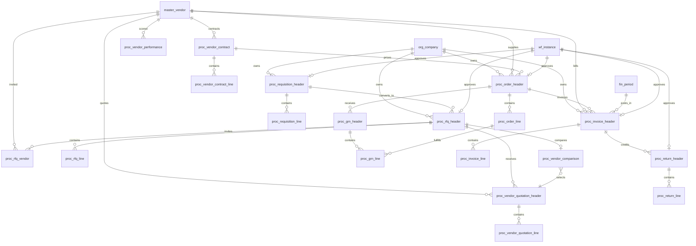

# ERD_06 — Procurement Domain

**Document:** Enterprise ERD — Procurement Domain  
**Version:** 1.0  
**Status:** Locked — Ready for Sprint 6 Implementation Planning  
**Schema:** `procurement`  
**Table Prefix:** `proc_`  
**Aligned To:** BRD v1.0 · FRD-07 · SDD v1.1 · DBS v1.1 · Architecture Lock v1.1  
**Functional Requirements:** [FRD-07 Procurement Domain](../02_FRD/FRD-07-Procurement-Domain.md)  
**Classification:** Internal — Confidential  

---

## 1. Module Overview

The Procurement Domain is the **procure-to-pay transaction engine** for purchase requisitions, RFQs, vendor quotations, purchase orders, goods receipts (GRN), purchase invoicing, purchase returns, vendor contracts, and vendor performance. It consumes master data (vendor, product, tax, currency, warehouse) and posts expense/inventory and AP to Finance (ERD_04) on invoice confirmation (and reverse on return).

**Business Tables: 19**  
**Schema: `procurement`**

### Enterprise Procurement Modules (FRD-07)

| # | Module | Primary Tables | Primary Consumers |
|---|--------|----------------|-------------------|
| 1 | Purchase Requisition | `proc_requisition_header`, `proc_requisition_line` | RFQ, Purchase Order |
| 2 | RFQ Management | `proc_rfq_header`, `proc_rfq_line`, `proc_rfq_vendor` | Vendor Quotation |
| 3 | Vendor Quotation | `proc_vendor_quotation_header`, `proc_vendor_quotation_line` | Comparison, PO |
| 4 | Vendor Comparison | `proc_vendor_comparison` | Vendor selection, PO |
| 5 | Purchase Order | `proc_order_header`, `proc_order_line` | GRN, Invoice |
| 6 | Goods Receipt (GRN) | `proc_grn_header`, `proc_grn_line` | Inventory (Sprint 7), Invoice |
| 7 | Vendor Contract | `proc_vendor_contract`, `proc_vendor_contract_line` | PO pricing |
| 8 | Purchase Invoice | `proc_invoice_header`, `proc_invoice_line` | Finance AP |
| 9 | Purchase Return | `proc_return_header`, `proc_return_line` | Finance AP credit, Inventory |
| 10 | Vendor Performance | `proc_vendor_performance` | BI, Vendor scorecards |

**PostgreSQL Schema:** `procurement` per DBS §14  

### Architectural Position

```text
Foundation (ERD_01) ── Workflow, Audit, RBAC, Notification
Organization (ERD_02) ── Company, Branch, Department, Cost Centers
Master Data (ERD_03) ── Vendor, Product, UOM, Currency, Tax, Warehouse, Employee
Finance (ERD_04) ── AP sub-ledger, Journal, Tax register, Periods
        ↓
Procurement (ERD_06) ── PR → RFQ → Quote → PO → GRN → Invoice → Return
        ↓
Inventory (FRD-08 / Sprint 7) · Quality (FRD-14) · BI
```

---

## 2. Scope

### In Scope
- Purchase requisition lifecycle with priority and cost-center attribution (FRD-07 §4)
- RFQ management with invited vendors (FRD-07 §5)
- Vendor quotation capture and line-level pricing (FRD-07 §6)
- Vendor comparison snapshot for recommendation audit (FRD-07 §7)
- Purchase order lifecycle and line fulfillment tracking (FRD-07 §8–9)
- Goods receipt notes linked to POs (FRD-07 §10)
- Vendor contracts with optional line pricing (FRD-07 §11)
- Purchase invoice with Finance AP posting hooks (FRD-07 §12)
- Purchase return (debit note) for AP credit symmetry with Sales returns
- Vendor performance KPI snapshots (FRD-07 §13)
- Workflow approval for PR, RFQ, PO, invoice, return, contract (FRD-07 §15)
- Full audit trail on all procurement transactional changes (FRD-07 §17)
- Multi-currency support via `master_currency` and Finance exchange rates

### Out of Scope (Phase 2 / Separate ERD)
- **Inventory stock tables** (`inv_*`) — FRD-08 / Sprint 7; GRN uses `warehouse_reference` UUID and Inventory Service events only
- **Quality inspection tables** (`qm_*`) — FRD-14; optional `quality_status` / `quality_reference` on GRN line only
- **Bank payment / payment run tables** — Finance / future banking; invoice posts AP only
- **DMS attachment blobs** — FRD-19; optional `attachment_reference` UUID/URI only
- **Budget reservation tables** — Finance budgeting deferred
- **Sales / CRM / Manufacturing** schemas and tables
- SQLAlchemy models, Alembic migrations, application code
- History tables (`hist_*`) — SCD Type 2
- Procurement analytics cubes / materialized reporting views

### Future Integration Notes (Not Aligned FRD Tables)
- **Inventory (FRD-08):** GRN confirmation triggers stock receipt via Inventory Service; return posting triggers stock adjustment — no `inv_*` FK in Sprint 6
- **Quality (FRD-14):** Incoming QC may reference GRN lines via UUID
- **Sales (FRD-06):** Optional future drop-ship via `source_module` / `source_document_id` only

### Assumptions
- Every procurement document is company-scoped; `branch_id` mandatory on all transactional headers/lines per DBS multi-tenancy
- `master_vendor`, `master_product`, `master_uom`, `master_tax`, `master_currency`, `master_warehouse`, `master_employee` are authoritative — no duplicate masters (C-01)
- Physical DELETE prohibited on all procurement business tables
- Posted invoices are immutable — corrections via purchase return documents
- Document numbers auto-generated per company; immutable after submit
- Approved PO required before GRN; cancelled PO cannot receive goods
- Purchase Return included for Finance AP credit-note symmetry (extension beyond FRD-07 §18 informal table list)

### Dependencies

| Upstream | Tables Used |
|----------|-------------|
| ERD_01 Foundation | `sec_tenant`, `sec_user`, `wf_definition`, `wf_instance` |
| ERD_02 Organization | `org_company`, `org_branch`, `org_department`, `org_cost_center` |
| ERD_03 Master Data | `master_vendor`, `master_product`, `master_uom`, `master_currency`, `master_tax`, `master_warehouse`, `master_employee` |
| ERD_04 Finance | `fin_fiscal_year`, `fin_period`, `fin_vendor_ledger`, `fin_journal_header`, `fin_chart_of_account`, `fin_tax_register` |

---

## 3. Table Inventory

| # | Table | Classification | tenant_id | company_id | branch_id | Soft Delete | Version | Workflow |
|---|-------|----------------|-----------|------------|-----------|-------------|---------|----------|
| 1 | `proc_requisition_header` | Transaction | ✅ | ✅ | ✅ | ✅ | ✅ | ✅ |
| 2 | `proc_requisition_line` | Transaction Detail | ✅ | ✅ | ✅ | ✅ | ✅ | — |
| 3 | `proc_rfq_header` | Transaction | ✅ | ✅ | ✅ | ✅ | ✅ | ✅ |
| 4 | `proc_rfq_line` | Transaction Detail | ✅ | ✅ | ✅ | ✅ | ✅ | — |
| 5 | `proc_rfq_vendor` | Link | ✅ | ✅ | ✅ | ✅ | ✅ | — |
| 6 | `proc_vendor_quotation_header` | Transaction | ✅ | ✅ | ✅ | ✅ | ✅ | — |
| 7 | `proc_vendor_quotation_line` | Transaction Detail | ✅ | ✅ | ✅ | ✅ | ✅ | — |
| 8 | `proc_vendor_comparison` | Transaction | ✅ | ✅ | ✅ | ✅ | ✅ | — |
| 9 | `proc_order_header` | Transaction | ✅ | ✅ | ✅ | ✅ | ✅ | ✅ |
| 10 | `proc_order_line` | Transaction Detail | ✅ | ✅ | ✅ | ✅ | ✅ | — |
| 11 | `proc_grn_header` | Transaction | ✅ | ✅ | ✅ | ✅ | ✅ | ✅ |
| 12 | `proc_grn_line` | Transaction Detail | ✅ | ✅ | ✅ | ✅ | ✅ | — |
| 13 | `proc_vendor_contract` | Master / Agreement | ✅ | ✅ | optional | ✅ | ✅ | ✅ |
| 14 | `proc_vendor_contract_line` | Detail | ✅ | ✅ | optional | ✅ | ✅ | — |
| 15 | `proc_invoice_header` | Transaction | ✅ | ✅ | ✅ | ✅ | ✅ | ✅ |
| 16 | `proc_invoice_line` | Transaction Detail | ✅ | ✅ | ✅ | ✅ | ✅ | — |
| 17 | `proc_return_header` | Transaction | ✅ | ✅ | ✅ | ✅ | ✅ | ✅ |
| 18 | `proc_return_line` | Transaction Detail | ✅ | ✅ | ✅ | ✅ | ✅ | — |
| 19 | `proc_vendor_performance` | Analytical Snapshot | ✅ | ✅ | optional | ✅ | ✅ | — |

> **Note:** Posted `proc_invoice_header` rows (`status = 'posted'`) are **immutable** — corrections via `proc_return_header` only.

**Business Tables: 19**  
**Schema: `procurement`**

---

## 4. Entity Relationships



```text
org_company
    ├── proc_requisition_header ── org_department, org_cost_center, master_employee
    │       └── proc_requisition_line ── master_product, master_uom
    │
    ├── proc_rfq_header ── proc_requisition_header
    │       ├── proc_rfq_line ── master_product
    │       ├── proc_rfq_vendor ── master_vendor
    │       ├── proc_vendor_quotation_header ── master_vendor
    │       │       └── proc_vendor_quotation_line
    │       └── proc_vendor_comparison ── selected quotation
    │
    ├── proc_vendor_contract ── master_vendor
    │       └── proc_vendor_contract_line ── master_product
    │
    ├── proc_order_header ── master_vendor, optional PR/RFQ/quote/contract
    │       └── proc_order_line ── master_product
    │
    ├── proc_grn_header ── proc_order_header, warehouse_reference
    │       └── proc_grn_line ── proc_order_line
    │
    ├── proc_invoice_header ── master_vendor, PO/GRN, fin_period
    │       └── proc_invoice_line
    │
    ├── proc_return_header ── proc_invoice_header
    │       └── proc_return_line
    │
    └── proc_vendor_performance ── master_vendor (analytical snapshot)
```

---

## 5. Standard Column Profiles

### 5.1 Transaction Header Profile

Per DBS §29 Transaction Table Standards:

| Column Group | Columns |
|--------------|---------|
| Primary Key | `id UUID` |
| Document | `document_number VARCHAR(50) NOT NULL`, `document_date DATE NOT NULL` |
| Status | `status VARCHAR(30) NOT NULL`, `workflow_status VARCHAR(30)` |
| Tenant Scope | `tenant_id`, `company_id`, `branch_id` |
| Vendor | `vendor_id UUID` (required where applicable) |
| Fiscal | `fiscal_year_id UUID`, `period_id UUID` (invoice/return) |
| Currency | `currency_code VARCHAR(3) NOT NULL`, `exchange_rate NUMERIC(18,8) NOT NULL` |
| Totals | `subtotal_amount`, `discount_amount`, `tax_amount`, `total_amount NUMERIC(18,4)` |
| Source | `source_module VARCHAR(50)`, `source_document_type VARCHAR(50)`, `source_document_id UUID` |
| Workflow | `workflow_instance_id UUID` |
| Audit + Soft Delete + Version | per DBS §28 |

### 5.2 Transaction Line Profile

| Column Group | Columns |
|--------------|---------|
| Primary Key | `id UUID` |
| Parent | `{parent}_header_id UUID NOT NULL` |
| Line Identity | `line_number SMALLINT NOT NULL` |
| Product | `product_id UUID NOT NULL`, `product_code VARCHAR(50)`, `product_name VARCHAR(255)` |
| Quantity | `quantity NUMERIC(18,4) NOT NULL`, `uom_id UUID`, `uom_code VARCHAR(20)` |
| Costing | `unit_cost`, `discount_percent`, `discount_amount`, `tax_amount`, `line_total NUMERIC(18,4)` |
| Tax | `tax_id UUID`, `tax_rate NUMERIC(8,4)` |
| Tenant Scope | `tenant_id`, `company_id`, `branch_id` |
| Audit + Soft Delete + Version | per DBS §28 |

---

## 6. Detailed Table Definitions

---

### 6.1 `proc_requisition_header`

#### 6.1.1 Purpose
Internal purchase request (FRD-07 §4).

#### 6.1.2 Columns

| Column | Type | Nullable | Description |
|--------|------|----------|-------------|
| `id` | UUID | NO | PK |
| `tenant_id` | UUID | NO | FK → `sec_tenant` |
| `company_id` | UUID | NO | FK → `org_company` |
| `branch_id` | UUID | NO | FK → `org_branch` |
| `document_number` | VARCHAR(50) | NO | UK — `PR-YYYY-NNNNNN` |
| `document_date` | DATE | NO | — |
| `requester_id` | UUID | NO | FK → `master_employee` |
| `department_id` | UUID | NO | FK → `org_department` |
| `cost_center_id` | UUID | NO | FK → `org_cost_center` |
| `required_date` | DATE | NO | — |
| `priority` | VARCHAR(20) | NO | low, medium, high, critical |
| `status` | VARCHAR(30) | NO | draft, submitted, approved, rejected, converted_to_rfq, cancelled |
| `workflow_status` | VARCHAR(30) | YES | — |
| `workflow_instance_id` | UUID | YES | FK → `wf_instance` |
| `currency_code` | VARCHAR(3) | NO | — |
| `exchange_rate` | NUMERIC(18,8) | NO | DEFAULT 1 |
| `subtotal_amount` | NUMERIC(18,4) | NO | DEFAULT 0 |
| `tax_amount` | NUMERIC(18,4) | NO | DEFAULT 0 |
| `total_amount` | NUMERIC(18,4) | NO | DEFAULT 0 |
| `notes` | TEXT | YES | — |
| AUDIT_STD + SOFT_DELETE_OPT | | | |

#### 6.1.3 Business Rules
- Requires `PROC_PR_APPROVAL` workflow before conversion to RFQ/PO
- Approved PR may convert to RFQ or direct PO per company policy

---

### 6.2 `proc_requisition_line`

| Column | Type | Nullable | Description |
|--------|------|----------|-------------|
| `id` | UUID | NO | PK |
| `tenant_id` / `company_id` / `branch_id` | UUID | NO | Scope |
| `requisition_header_id` | UUID | NO | FK → `proc_requisition_header` |
| `line_number` | SMALLINT | NO | UK with header |
| `product_id` | UUID | NO | FK → `master_product` |
| `product_code` / `product_name` | VARCHAR | YES | Snapshot |
| `quantity` | NUMERIC(18,4) | NO | Must be > 0 |
| `uom_id` | UUID | NO | FK → `master_uom` |
| `estimated_unit_cost` | NUMERIC(18,4) | YES | — |
| `tax_id` | UUID | YES | FK → `master_tax` |
| `tax_amount` / `line_total` | NUMERIC(18,4) | NO | DEFAULT 0 |
| `required_date` | DATE | YES | Line override |
| `status` | VARCHAR(30) | NO | open, converted, cancelled |
| AUDIT_STD + SOFT_DELETE_OPT | | | |

---

### 6.3 `proc_rfq_header`

| Column | Type | Nullable | Description |
|--------|------|----------|-------------|
| `id` | UUID | NO | PK |
| `tenant_id` / `company_id` / `branch_id` | UUID | NO | Scope |
| `document_number` | VARCHAR(50) | NO | UK — `RFQ-YYYY-NNNNNN` |
| `document_date` | DATE | NO | RFQ date |
| `requisition_header_id` | UUID | YES | FK → `proc_requisition_header` |
| `closing_date` | DATE | NO | Quote deadline |
| `status` | VARCHAR(30) | NO | draft, published, quotes_received, closed, cancelled |
| `workflow_status` | VARCHAR(30) | YES | — |
| `workflow_instance_id` | UUID | YES | FK → `wf_instance` |
| `currency_code` | VARCHAR(3) | NO | — |
| `exchange_rate` | NUMERIC(18,8) | NO | DEFAULT 1 |
| `notes` | TEXT | YES | — |
| AUDIT_STD + SOFT_DELETE_OPT | | | |

---

### 6.4 `proc_rfq_line`

| Column | Type | Nullable | Description |
|--------|------|----------|-------------|
| `id` | UUID | NO | PK |
| Scope columns | UUID | NO | tenant/company/branch |
| `rfq_header_id` | UUID | NO | FK → `proc_rfq_header` |
| `requisition_line_id` | UUID | YES | FK → `proc_requisition_line` |
| `line_number` | SMALLINT | NO | — |
| `product_id` | UUID | NO | FK → `master_product` |
| `quantity` | NUMERIC(18,4) | NO | > 0 |
| `uom_id` | UUID | NO | FK → `master_uom` |
| `target_unit_cost` | NUMERIC(18,4) | YES | Optional target |
| `status` | VARCHAR(30) | NO | open, closed, cancelled |
| AUDIT_STD + SOFT_DELETE_OPT | | | |

---

### 6.5 `proc_rfq_vendor`

| Column | Type | Nullable | Description |
|--------|------|----------|-------------|
| `id` | UUID | NO | PK |
| Scope columns | UUID | NO | — |
| `rfq_header_id` | UUID | NO | FK → `proc_rfq_header` |
| `vendor_id` | UUID | NO | FK → `master_vendor` |
| `invite_status` | VARCHAR(30) | NO | invited, notified, declined |
| `sent_at` | TIMESTAMPTZ | YES | — |
| `responded_at` | TIMESTAMPTZ | YES | — |
| AUDIT_STD + SOFT_DELETE_OPT | | | |

**UK:** `(rfq_header_id, vendor_id)` where not deleted.

---

### 6.6 `proc_vendor_quotation_header`

| Column | Type | Nullable | Description |
|--------|------|----------|-------------|
| `id` | UUID | NO | PK |
| Scope columns | UUID | NO | — |
| `document_number` | VARCHAR(50) | NO | UK — `VQ-YYYY-NNNNNN` |
| `document_date` | DATE | NO | Quote date |
| `rfq_header_id` | UUID | NO | FK → `proc_rfq_header` |
| `vendor_id` | UUID | NO | FK → `master_vendor` |
| `vendor_quote_reference` | VARCHAR(100) | YES | Vendor’s own quote number |
| `valid_until` | DATE | NO | — |
| `payment_terms` | VARCHAR(100) | YES | — |
| `delivery_days` | INTEGER | YES | — |
| `currency_code` | VARCHAR(3) | NO | — |
| `exchange_rate` | NUMERIC(18,8) | NO | DEFAULT 1 |
| `subtotal_amount` / `tax_amount` / `total_amount` | NUMERIC(18,4) | NO | — |
| `status` | VARCHAR(30) | NO | draft, submitted, under_review, selected, rejected, expired |
| `attachment_reference` | UUID | YES | DMS ref (no blob storage) |
| AUDIT_STD + SOFT_DELETE_OPT | | | |

---

### 6.7 `proc_vendor_quotation_line`

| Column | Type | Nullable | Description |
|--------|------|----------|-------------|
| `id` | UUID | NO | PK |
| Scope columns | UUID | NO | — |
| `vendor_quotation_header_id` | UUID | NO | FK → header |
| `rfq_line_id` | UUID | YES | FK → `proc_rfq_line` |
| `line_number` | SMALLINT | NO | — |
| `product_id` | UUID | NO | FK → `master_product` |
| `quantity` | NUMERIC(18,4) | NO | — |
| `uom_id` | UUID | NO | — |
| `unit_cost` | NUMERIC(18,4) | NO | > 0 |
| `lead_time_days` | INTEGER | YES | — |
| `tax_id` / `tax_amount` / `line_total` | mixed | — | — |
| `is_alternate_product` | BOOLEAN | NO | DEFAULT false |
| `status` | VARCHAR(30) | NO | active, rejected |
| AUDIT_STD + SOFT_DELETE_OPT | | | |

---

### 6.8 `proc_vendor_comparison`

#### 6.8.1 Purpose
Persisted recommendation snapshot for RFQ vendor selection audit (FRD-07 §7).

| Column | Type | Nullable | Description |
|--------|------|----------|-------------|
| `id` | UUID | NO | PK |
| Scope columns | UUID | NO | — |
| `document_number` | VARCHAR(50) | YES | Optional `VCMP-YYYY-NNNNNN` |
| `rfq_header_id` | UUID | NO | UK — one active comparison per RFQ |
| `best_price_quotation_id` | UUID | YES | FK → `proc_vendor_quotation_header` |
| `best_delivery_quotation_id` | UUID | YES | FK → quotation |
| `best_overall_quotation_id` | UUID | YES | FK → quotation |
| `selected_quotation_id` | UUID | YES | FK → quotation |
| `score_breakdown` | JSONB | YES | Engine scores for audit |
| `status` | VARCHAR(30) | NO | draft, completed |
| `compared_at` | TIMESTAMPTZ | YES | — |
| AUDIT_STD + SOFT_DELETE_OPT | | | |

---

### 6.9 `proc_order_header`

| Column | Type | Nullable | Description |
|--------|------|----------|-------------|
| `id` | UUID | NO | PK |
| Scope columns | UUID | NO | — |
| `document_number` | VARCHAR(50) | NO | UK — `PO-YYYY-NNNNNN` |
| `document_date` | DATE | NO | — |
| `vendor_id` | UUID | NO | FK → `master_vendor` |
| `requisition_header_id` | UUID | YES | FK → PR |
| `rfq_header_id` | UUID | YES | FK → RFQ |
| `vendor_quotation_header_id` | UUID | YES | FK → selected quote |
| `contract_id` | UUID | YES | FK → `proc_vendor_contract` |
| `payment_terms` | VARCHAR(100) | YES | — |
| `expected_delivery_date` | DATE | YES | — |
| `currency_code` / `exchange_rate` | mixed | NO | — |
| Amount totals | NUMERIC(18,4) | NO | — |
| `received_amount` / `invoiced_amount` | NUMERIC(18,4) | NO | DEFAULT 0 |
| `status` | VARCHAR(30) | NO | draft, submitted, approved, sent, partially_received, received, closed, cancelled |
| `workflow_status` / `workflow_instance_id` | mixed | YES | — |
| AUDIT_STD + SOFT_DELETE_OPT | | | |

#### Business Rules
- Approved/sent/partially_received PO can create GRN
- Cancelled PO cannot receive goods
- High-value PO may require `PROC_PO_HIGH_VALUE` workflow (threshold in `cfg_setting`)

---

### 6.10 `proc_order_line`

| Column | Type | Nullable | Description |
|--------|------|----------|-------------|
| `id` | UUID | NO | PK |
| Scope columns | UUID | NO | — |
| `order_header_id` | UUID | NO | FK → `proc_order_header` |
| `line_number` | SMALLINT | NO | — |
| `product_id` | UUID | NO | FK → `master_product` |
| `quantity` | NUMERIC(18,4) | NO | > 0 |
| `uom_id` | UUID | NO | — |
| `unit_cost` | NUMERIC(18,4) | NO | > 0 |
| Tax / totals | NUMERIC | NO | — |
| `quantity_received` | NUMERIC(18,4) | NO | DEFAULT 0 |
| `quantity_invoiced` | NUMERIC(18,4) | NO | DEFAULT 0 |
| `quantity_returned` | NUMERIC(18,4) | NO | DEFAULT 0 |
| `status` | VARCHAR(30) | NO | open, partially_received, received, closed, cancelled |
| AUDIT_STD + SOFT_DELETE_OPT | | | |

---

### 6.11 `proc_grn_header`

#### 6.11.1 Purpose
Record goods receipt against an approved purchase order (FRD-07 §10).

#### 6.11.2 Columns

| Column | Type | Nullable | Description |
|--------|------|----------|-------------|
| `id` | UUID | NO | PK |
| Scope columns | UUID | NO | — |
| `document_number` | VARCHAR(50) | NO | UK — `GRN-YYYY-NNNNNN` |
| `document_date` | DATE | NO | Receipt date |
| `order_header_id` | UUID | NO | FK → `proc_order_header` |
| `vendor_id` | UUID | NO | FK → `master_vendor` |
| `warehouse_reference` | UUID | NO | Logical ref to `master_warehouse` — **no inventory FK** |
| `status` | VARCHAR(30) | NO | draft, pending, partially_received, received, rejected, cancelled |
| `workflow_status` / `workflow_instance_id` | mixed | YES | — |
| `subtotal_amount` | NUMERIC(18,4) | NO | DEFAULT 0 |
| `notes` | TEXT | YES | — |
| AUDIT_STD + SOFT_DELETE_OPT | | | |

#### 6.11.3 Inventory Integration Rules

**Inventory stock movement SHALL occur only through Inventory Service (Sprint 7).**  
**Procurement must never directly update inventory tables.**

- On GRN confirm/post, Procurement emits a receipt event / calls Inventory Service API only
- No `inv_*` foreign keys and no cross-schema writes from Procurement repositories
- Until Sprint 7, GRN may complete document state without stock ledger updates (feature-flagged)

---

### 6.12 `proc_grn_line`

| Column | Type | Nullable | Description |
|--------|------|----------|-------------|
| `id` | UUID | NO | PK |
| Scope columns | UUID | NO | — |
| `grn_header_id` | UUID | NO | FK → `proc_grn_header` |
| `order_line_id` | UUID | NO | FK → `proc_order_line` |
| `line_number` | SMALLINT | NO | — |
| `product_id` | UUID | NO | — |
| `quantity` | NUMERIC(18,4) | NO | Received qty (> 0, ≤ remaining) |
| `quantity_rejected` | NUMERIC(18,4) | NO | DEFAULT 0 |
| `uom_id` | UUID | NO | — |
| `quality_status` | VARCHAR(30) | YES | pending, accepted, rejected |
| `quality_reference` | UUID | YES | Future QM ref |
| `status` | VARCHAR(30) | NO | pending, received, rejected |
| AUDIT_STD + SOFT_DELETE_OPT | | | |

---

### 6.13 `proc_vendor_contract`

| Column | Type | Nullable | Description |
|--------|------|----------|-------------|
| `id` | UUID | NO | PK |
| `tenant_id` / `company_id` | UUID | NO | — |
| `branch_id` | UUID | YES | Optional |
| `document_number` | VARCHAR(50) | NO | UK — `PCT-YYYY-NNNNNN` |
| `vendor_id` | UUID | NO | FK → `master_vendor` |
| `contract_name` | VARCHAR(255) | NO | — |
| `start_date` / `end_date` | DATE | NO | end ≥ start |
| `contract_value` | NUMERIC(18,4) | YES | — |
| `currency_code` | VARCHAR(3) | NO | — |
| `status` | VARCHAR(30) | NO | draft, active, expired, terminated |
| `workflow_status` / `workflow_instance_id` | mixed | YES | — |
| AUDIT_STD + SOFT_DELETE_OPT | | | |

---

### 6.14 `proc_vendor_contract_line`

| Column | Type | Nullable | Description |
|--------|------|----------|-------------|
| `id` | UUID | NO | PK |
| Scope + optional branch | UUID | — | — |
| `contract_id` | UUID | NO | FK → `proc_vendor_contract` |
| `line_number` | SMALLINT | NO | — |
| `product_id` | UUID | YES | FK → `master_product` |
| `min_quantity` / `max_quantity` | NUMERIC(18,4) | YES | — |
| `unit_cost` | NUMERIC(18,4) | NO | Contracted price |
| `effective_from` / `effective_to` | DATE | YES | — |
| `status` | VARCHAR(30) | NO | active, inactive |
| AUDIT_STD + SOFT_DELETE_OPT | | | |

---

### 6.15 `proc_invoice_header`

| Column | Type | Nullable | Description |
|--------|------|----------|-------------|
| `id` | UUID | NO | PK |
| Scope columns | UUID | NO | — |
| `document_number` | VARCHAR(50) | NO | UK — `PINV-YYYY-NNNNNN` |
| `document_date` | DATE | NO | — |
| `due_date` | DATE | NO | — |
| `vendor_id` | UUID | NO | FK → `master_vendor` |
| `vendor_invoice_number` | VARCHAR(100) | NO | Vendor bill number |
| `order_header_id` | UUID | YES | FK → PO |
| `grn_header_id` | UUID | YES | FK → GRN |
| `fiscal_year_id` / `period_id` | UUID | YES | FK → finance |
| `currency_code` / `exchange_rate` | mixed | NO | — |
| Amount totals / `amount_paid` / `balance_due` | NUMERIC(18,4) | NO | — |
| `match_status` | VARCHAR(30) | NO | unmatched, partial, matched, exception |
| `status` | VARCHAR(30) | NO | draft, submitted, posted, partially_paid, paid, cancelled |
| `workflow_status` / `workflow_instance_id` | mixed | YES | — |
| `finance_ledger_id` | UUID | YES | FK → `fin_vendor_ledger` |
| `finance_journal_id` | UUID | YES | FK → `fin_journal_header` |
| `posting_status` | VARCHAR(30) | YES | pending, posted, failed (retry) |
| AUDIT_STD + SOFT_DELETE_OPT | | | |

**UK:** `(company_id, vendor_id, vendor_invoice_number)` where not deleted.

#### Finance Impact (FRD-07 §12)
On post: Expense / Inventory Dr · Accounts Payable Cr via Finance services (system journal + `fin_vendor_ledger`). Routers must not write Finance ORM directly.

---

### 6.16 `proc_invoice_line`

| Column | Type | Nullable | Description |
|--------|------|----------|-------------|
| `id` | UUID | NO | PK |
| Scope columns | UUID | NO | — |
| `invoice_header_id` | UUID | NO | FK → header |
| `order_line_id` | UUID | YES | FK → `proc_order_line` |
| `grn_line_id` | UUID | YES | FK → `proc_grn_line` |
| `line_number` | SMALLINT | NO | — |
| `product_id` | UUID | NO | — |
| `quantity` / `unit_cost` / tax / `line_total` | NUMERIC | NO | — |
| `expense_account_id` | UUID | YES | FK → `fin_chart_of_account` |
| `status` | VARCHAR(30) | NO | open, posted, cancelled |
| AUDIT_STD + SOFT_DELETE_OPT | | | |

---

### 6.17 `proc_return_header`

| Column | Type | Nullable | Description |
|--------|------|----------|-------------|
| `id` | UUID | NO | PK |
| Scope columns | UUID | NO | — |
| `document_number` | VARCHAR(50) | NO | UK — `PRET-YYYY-NNNNNN` |
| `document_date` | DATE | NO | — |
| `vendor_id` | UUID | NO | FK → `master_vendor` |
| `invoice_header_id` | UUID | NO | FK → `proc_invoice_header` |
| `order_header_id` | UUID | YES | FK → PO |
| `grn_header_id` | UUID | YES | FK → GRN |
| `reason_code` | VARCHAR(50) | YES | — |
| Fiscal / currency / totals | mixed | — | — |
| `status` | VARCHAR(30) | NO | draft, requested, approved, received, posted, closed, cancelled |
| `workflow_status` / `workflow_instance_id` | mixed | YES | — |
| `finance_ledger_id` / `finance_journal_id` | UUID | YES | AP credit posting |
| AUDIT_STD + SOFT_DELETE_OPT | | | |

#### Business Rules
- Requires `PROC_RETURN_APPROVAL` before post
- Return qty ≤ invoiced / received quantities
- Inventory adjustment (if any) only via Inventory Service — never direct table updates

---

### 6.18 `proc_return_line`

| Column | Type | Nullable | Description |
|--------|------|----------|-------------|
| `id` | UUID | NO | PK |
| Scope columns | UUID | NO | — |
| `return_header_id` | UUID | NO | FK → header |
| `invoice_line_id` | UUID | YES | FK → `proc_invoice_line` |
| `order_line_id` | UUID | YES | FK → `proc_order_line` |
| `grn_line_id` | UUID | YES | FK → `proc_grn_line` |
| `line_number` | SMALLINT | NO | — |
| `product_id` | UUID | NO | — |
| `quantity` | NUMERIC(18,4) | NO | — |
| Cost / tax / `line_total` | NUMERIC | NO | — |
| `status` | VARCHAR(30) | NO | requested, received, posted |
| AUDIT_STD + SOFT_DELETE_OPT | | | |

---

### 6.19 `proc_vendor_performance`

#### 6.19.1 Purpose
Vendor scorecard KPIs (FRD-07 §13).

Derived analytical snapshot table.  
Updated by scheduled background jobs.  
Not part of transactional workflow.

| Column | Type | Nullable | Description |
|--------|------|----------|-------------|
| `id` | UUID | NO | PK |
| `tenant_id` / `company_id` | UUID | NO | — |
| `branch_id` | UUID | YES | Optional |
| `vendor_id` | UUID | NO | FK → `master_vendor` |
| `period_code` | VARCHAR(20) | NO | e.g. `2026-Q1`, `2026-07` |
| `on_time_delivery_pct` | NUMERIC(8,4) | YES | — |
| `quality_rating` | NUMERIC(8,4) | YES | — |
| `cost_competitiveness_score` | NUMERIC(8,4) | YES | — |
| `contract_compliance_score` | NUMERIC(8,4) | YES | — |
| `issue_resolution_days` | NUMERIC(8,4) | YES | — |
| `overall_score` | NUMERIC(8,4) | NO | 0–100 |
| `calculated_at` | TIMESTAMPTZ | NO | Job timestamp |
| `status` | VARCHAR(30) | NO | current, superseded |
| AUDIT_STD + SOFT_DELETE_OPT | | | |

**UK:** `(company_id, vendor_id, period_code)` where not deleted.

---

## 7. Primary Keys

| Table | Constraint Name | Column |
|-------|-----------------|--------|
| `proc_requisition_header` | `pk_proc_requisition_header` | `id` |
| `proc_requisition_line` | `pk_proc_requisition_line` | `id` |
| `proc_rfq_header` | `pk_proc_rfq_header` | `id` |
| `proc_rfq_line` | `pk_proc_rfq_line` | `id` |
| `proc_rfq_vendor` | `pk_proc_rfq_vendor` | `id` |
| `proc_vendor_quotation_header` | `pk_proc_vendor_quotation_header` | `id` |
| `proc_vendor_quotation_line` | `pk_proc_vendor_quotation_line` | `id` |
| `proc_vendor_comparison` | `pk_proc_vendor_comparison` | `id` |
| `proc_order_header` | `pk_proc_order_header` | `id` |
| `proc_order_line` | `pk_proc_order_line` | `id` |
| `proc_grn_header` | `pk_proc_grn_header` | `id` |
| `proc_grn_line` | `pk_proc_grn_line` | `id` |
| `proc_vendor_contract` | `pk_proc_vendor_contract` | `id` |
| `proc_vendor_contract_line` | `pk_proc_vendor_contract_line` | `id` |
| `proc_invoice_header` | `pk_proc_invoice_header` | `id` |
| `proc_invoice_line` | `pk_proc_invoice_line` | `id` |
| `proc_return_header` | `pk_proc_return_header` | `id` |
| `proc_return_line` | `pk_proc_return_line` | `id` |
| `proc_vendor_performance` | `pk_proc_vendor_performance` | `id` |

---

## 8. Foreign Keys

| Child Table | Constraint Name | Column | Parent Table |
|-------------|-----------------|--------|--------------|
| `proc_requisition_header` | `fk_proc_prh_tenant` | `tenant_id` | `foundation.sec_tenant` |
| `proc_requisition_header` | `fk_proc_prh_company` | `company_id` | `organization.org_company` |
| `proc_requisition_header` | `fk_proc_prh_branch` | `branch_id` | `organization.org_branch` |
| `proc_requisition_header` | `fk_proc_prh_requester` | `requester_id` | `master.master_employee` |
| `proc_requisition_header` | `fk_proc_prh_department` | `department_id` | `organization.org_department` |
| `proc_requisition_header` | `fk_proc_prh_cc` | `cost_center_id` | `organization.org_cost_center` |
| `proc_requisition_header` | `fk_proc_prh_workflow` | `workflow_instance_id` | `foundation.wf_instance` |
| `proc_requisition_line` | `fk_proc_prl_header` | `requisition_header_id` | `procurement.proc_requisition_header` |
| `proc_requisition_line` | `fk_proc_prl_product` | `product_id` | `master.master_product` |
| `proc_rfq_header` | `fk_proc_rfqh_pr` | `requisition_header_id` | `procurement.proc_requisition_header` |
| `proc_rfq_header` | `fk_proc_rfqh_workflow` | `workflow_instance_id` | `foundation.wf_instance` |
| `proc_rfq_line` | `fk_proc_rfql_header` | `rfq_header_id` | `procurement.proc_rfq_header` |
| `proc_rfq_vendor` | `fk_proc_rfqv_header` | `rfq_header_id` | `procurement.proc_rfq_header` |
| `proc_rfq_vendor` | `fk_proc_rfqv_vendor` | `vendor_id` | `master.master_vendor` |
| `proc_vendor_quotation_header` | `fk_proc_vqh_rfq` | `rfq_header_id` | `procurement.proc_rfq_header` |
| `proc_vendor_quotation_header` | `fk_proc_vqh_vendor` | `vendor_id` | `master.master_vendor` |
| `proc_vendor_quotation_line` | `fk_proc_vql_header` | `vendor_quotation_header_id` | `procurement.proc_vendor_quotation_header` |
| `proc_vendor_comparison` | `fk_proc_vc_rfq` | `rfq_header_id` | `procurement.proc_rfq_header` |
| `proc_vendor_comparison` | `fk_proc_vc_selected` | `selected_quotation_id` | `procurement.proc_vendor_quotation_header` |
| `proc_order_header` | `fk_proc_oh_vendor` | `vendor_id` | `master.master_vendor` |
| `proc_order_header` | `fk_proc_oh_contract` | `contract_id` | `procurement.proc_vendor_contract` |
| `proc_order_header` | `fk_proc_oh_workflow` | `workflow_instance_id` | `foundation.wf_instance` |
| `proc_order_line` | `fk_proc_ol_header` | `order_header_id` | `procurement.proc_order_header` |
| `proc_grn_header` | `fk_proc_gh_order` | `order_header_id` | `procurement.proc_order_header` |
| `proc_grn_line` | `fk_proc_gl_header` | `grn_header_id` | `procurement.proc_grn_header` |
| `proc_grn_line` | `fk_proc_gl_order_line` | `order_line_id` | `procurement.proc_order_line` |
| `proc_vendor_contract` | `fk_proc_vct_vendor` | `vendor_id` | `master.master_vendor` |
| `proc_vendor_contract_line` | `fk_proc_vctl_contract` | `contract_id` | `procurement.proc_vendor_contract` |
| `proc_invoice_header` | `fk_proc_ih_vendor` | `vendor_id` | `master.master_vendor` |
| `proc_invoice_header` | `fk_proc_ih_order` | `order_header_id` | `procurement.proc_order_header` |
| `proc_invoice_header` | `fk_proc_ih_grn` | `grn_header_id` | `procurement.proc_grn_header` |
| `proc_invoice_header` | `fk_proc_ih_period` | `period_id` | `finance.fin_period` |
| `proc_invoice_header` | `fk_proc_ih_ledger` | `finance_ledger_id` | `finance.fin_vendor_ledger` |
| `proc_invoice_header` | `fk_proc_ih_journal` | `finance_journal_id` | `finance.fin_journal_header` |
| `proc_invoice_line` | `fk_proc_il_header` | `invoice_header_id` | `procurement.proc_invoice_header` |
| `proc_invoice_line` | `fk_proc_il_expense_acct` | `expense_account_id` | `finance.fin_chart_of_account` |
| `proc_return_header` | `fk_proc_rh_invoice` | `invoice_header_id` | `procurement.proc_invoice_header` |
| `proc_return_header` | `fk_proc_rh_period` | `period_id` | `finance.fin_period` |
| `proc_return_line` | `fk_proc_rl_header` | `return_header_id` | `procurement.proc_return_header` |
| `proc_vendor_performance` | `fk_proc_vp_vendor` | `vendor_id` | `master.master_vendor` |

> All `proc_*` tables include `fk_*_tenant` → `sec_tenant(id)` and `fk_*_company` → `org_company(id)`. Transactional tables include `fk_*_branch` → `org_branch(id)`.

**No FK to:** `sales_*`, `inv_*`, `crm_*`, DMS tables.

---

## 9. Indexes & Constraints

### 9.1 Unique Constraints

| Table | Columns |
|-------|---------|
| Document headers | `(company_id, document_number)` where not deleted |
| `proc_invoice_header` | `(company_id, vendor_id, vendor_invoice_number)` |
| `proc_rfq_vendor` | `(rfq_header_id, vendor_id)` |
| All lines | `(header_id, line_number)` |
| `proc_vendor_comparison` | `(rfq_header_id)` active |
| `proc_vendor_contract` | `(company_id, document_number)` |
| `proc_vendor_performance` | `(company_id, vendor_id, period_code)` |

### 9.2 Check Constraints

- Line `quantity > 0`; PO `unit_cost > 0`
- Contract `end_date >= start_date`
- Quotation `valid_until >= document_date`
- Performance `overall_score` between 0 and 100

### 9.3 Recommended Indexes

- All FK columns
- `(tenant_id, company_id, status)` on transactional headers
- `(vendor_id, status)` on PO / invoice / GRN
- `(order_header_id)` on GRN / invoice
- `(closing_date)` on RFQ for expiry jobs
- Partial indexes on `is_deleted = false` for list APIs

---

## 10. Document Numbering

| Document | Format | UK Scope |
|----------|--------|----------|
| Purchase Requisition | `PR-YYYY-NNNNNN` | company |
| RFQ | `RFQ-YYYY-NNNNNN` | company |
| Vendor Quotation | `VQ-YYYY-NNNNNN` | company |
| Vendor Comparison | `VCMP-YYYY-NNNNNN` | company (optional) |
| Purchase Order | `PO-YYYY-NNNNNN` | company |
| GRN | `GRN-YYYY-NNNNNN` | company |
| Purchase Invoice | `PINV-YYYY-NNNNNN` | company |
| Purchase Return | `PRET-YYYY-NNNNNN` | company |
| Vendor Contract | `PCT-YYYY-NNNNNN` | company |

Numbers are company-scoped, auto-generated, and immutable after submit.

---

## 11. Status Lifecycles

| Entity | Statuses |
|--------|----------|
| PR | draft, submitted, approved, rejected, converted_to_rfq, cancelled |
| RFQ | draft, published, quotes_received, closed, cancelled |
| Vendor Quotation | draft, submitted, under_review, selected, rejected, expired |
| Comparison | draft, completed |
| PO | draft, submitted, approved, sent, partially_received, received, closed, cancelled |
| GRN | draft, pending, partially_received, received, rejected, cancelled |
| Contract | draft, active, expired, terminated |
| Invoice | draft, submitted, posted, partially_paid, paid, cancelled |
| Return | draft, requested, approved, received, posted, closed, cancelled |

PR priority: `low | medium | high | critical`.

---

## 12. Approval Workflow Integration

| Workflow Code | Document | Path (FRD-07 §15) |
|---------------|----------|-------------------|
| `PROC_PR_APPROVAL` | Requisition | Employee → Manager |
| `PROC_RFQ_APPROVAL` | RFQ publish | Procurement Executive → Procurement Manager |
| `PROC_PO_APPROVAL` | PO | Buyer → Procurement Manager → Finance Manager |
| `PROC_PO_HIGH_VALUE` | High-value PO | + CFO (threshold in `cfg_setting`) |
| `PROC_INVOICE_APPROVAL` | Invoice | Finance review before post |
| `PROC_RETURN_APPROVAL` | Return | Procurement Manager → Finance Manager |
| `PROC_CONTRACT_APPROVAL` | Contract | Procurement → Finance |

- `workflow_instance_id` → `foundation.wf_instance.id`
- Segregation of duties: creator cannot approve own PO / invoice / return

---

## 13. Audit Strategy

| Layer | Mechanism |
|-------|-----------|
| Row audit | `created_at/by`, `updated_at/by`, `version` on all tables |
| Soft delete | `is_deleted`, `deleted_at`, `deleted_by` — no physical DELETE |
| Business audit | `AuditService` on create/update/submit/approve/post |
| Immutable posted | Invoice/return posted rows; corrections via compensating documents |
| Decision audit | `proc_vendor_comparison` + quotation selection events |
| Notifications | PR submitted, RFQ published, quote received, PO approved, GRN created, invoice due (FRD-07 §16) |

---

## 14. Tenant / Company / Branch Isolation

| Rule | Application |
|------|-------------|
| `tenant_id` | Mandatory on all `proc_*` tables |
| `company_id` | Books, numbering, and vendor-invoice uniqueness boundary |
| `branch_id` | Mandatory on transactional headers/lines; optional on contract and performance |
| Repository | Scoped repository pattern (mirror Sales/Finance) |
| RBAC | `procurement.*` permissions |

### 14.1 Planned RBAC Permissions (Sprint 6)

| Resource | Permissions |
|----------|-------------|
| `procurement.requisition` | read, create, update, delete, submit, approve, convert |
| `procurement.rfq` | read, create, update, publish, close |
| `procurement.vendor_quotation` | read, create, update, select |
| `procurement.order` | read, create, update, submit, approve, cancel, send |
| `procurement.grn` | read, create, update, confirm |
| `procurement.invoice` | read, create, update, submit, approve, post, cancel |
| `procurement.return` | read, create, update, submit, approve, receive, post |
| `procurement.contract` | read, create, update, submit, approve |
| `procurement.performance` | read |
| `procurement.report` | read, export |

---

## 15. Migration Order

| Order | Revision ID | Migration | Tables / Actions |
|-------|-------------|-----------|------------------|
| 56 | `0056_create_procurement_schema` | Create schema | `procurement` |
| 57 | `0057_proc_requisition_header` | Requisition headers | `proc_requisition_header` |
| 58 | `0058_proc_requisition_line` | Requisition lines | `proc_requisition_line` |
| 59 | `0059_proc_rfq_header` | RFQ headers | `proc_rfq_header` |
| 60 | `0060_proc_rfq_line` | RFQ lines | `proc_rfq_line` |
| 61 | `0061_proc_rfq_vendor` | RFQ vendors | `proc_rfq_vendor` |
| 62 | `0062_proc_vendor_quotation_header` | Vendor quote headers | `proc_vendor_quotation_header` |
| 63 | `0063_proc_vendor_quotation_line` | Vendor quote lines | `proc_vendor_quotation_line` |
| 64 | `0064_proc_vendor_comparison` | Comparison | `proc_vendor_comparison` |
| 65 | `0065_proc_order_header` | PO headers | `proc_order_header` |
| 66 | `0066_proc_order_line` | PO lines | `proc_order_line` |
| 67 | `0067_proc_grn_header` | GRN headers | `proc_grn_header` |
| 68 | `0068_proc_grn_line` | GRN lines | `proc_grn_line` |
| 69 | `0069_proc_vendor_contract` | Contracts | `proc_vendor_contract` |
| 70 | `0070_proc_vendor_contract_line` | Contract lines | `proc_vendor_contract_line` |
| 71 | `0071_proc_invoice_header` | Invoice headers | `proc_invoice_header` |
| 72 | `0072_proc_invoice_line` | Invoice lines | `proc_invoice_line` |
| 73 | `0073_proc_return_header` | Return headers | `proc_return_header` |
| 74 | `0074_proc_return_line` | Return lines | `proc_return_line` |
| 75 | `0075_proc_vendor_performance` | Performance | `proc_vendor_performance` |
| 76 | `0076_seed_proc_permissions` | RBAC seed | Permissions / roles |
| 77 | `0077_seed_proc_workflows` | Workflow seed | Workflow definitions |

**Dependency order rationale:**
1. Schema → PR → RFQ → vendor quotations → comparison
2. Contracts before PO (optional FK)
3. PO before GRN and invoice
4. Invoice before return
5. Performance snapshot last among tables
6. Seeds after all tables created

Prior Alembic head: `0055_seed_sales_workflows`.

---

## 16. Cross Module Dependencies

### 16.1 Upstream (Procurement Consumes)

| Module | FRD | Provides | Integration Pattern |
|--------|-----|----------|---------------------|
| Foundation | FRD-01 | tenant, user, workflow, audit, RBAC, settings | Direct FK |
| Organization | FRD-02 | company, branch, department, cost centers | Direct FK |
| Master Data | FRD-03 | vendor, product, uom, currency, tax, warehouse, employee | Direct FK — C-01 |
| Finance | FRD-04 | fiscal year, period, COA, AP ledger | FK on invoice/return; posting API |

### 16.2 Downstream (Procurement Provides)

| Module | FRD | Procurement Tables Used | Integration Pattern |
|--------|-----|-------------------------|---------------------|
| Finance | FRD-04 | `proc_invoice_header`, `proc_return_header` | Event-driven journal / AP posting |
| Inventory | FRD-08 | `proc_grn_header`, `proc_return_header` | Receipt/return via Inventory Service only |
| BI & Analytics | FRD-18 | All `proc_*` transactional + performance | Read-only reporting |

### 16.3 Future / Out-of-Scope Integrations

| Module | FRD | Notes |
|--------|-----|-------|
| Quality | FRD-14 | GRN line `quality_reference` UUID |
| Sales | FRD-06 | Drop-ship via `source_*` only — no cross-FK |
| Banking | — | Payment runs not in Procurement schema |

**Rule (C-01):** Procurement consumes vendor/product masters via FK/service — no duplicate master tables in `procurement` schema.

---

## 17. Phase Gate Checklist

| # | Gate Criterion | Status |
|---|----------------|--------|
| 1 | Business tables = **19**; schema = **`procurement`** | ✅ |
| 2 | Prefix `proc_` defined | ✅ |
| 3 | Aligned to FRD-07; Purchase Return documented for AP symmetry | ✅ |
| 4 | All 19 tables have PK, FK, index, and status lifecycle | ✅ |
| 5 | Finance AP posting integration documented (invoice + return) | ✅ |
| 6 | GRN inventory rule: Inventory Service only; no direct inventory updates | ✅ |
| 7 | Vendor performance documented as derived analytical snapshot | ✅ |
| 8 | Workflow codes defined for approval documents | ✅ |
| 9 | Migration order `0056`–`0077` with revision IDs ≤ 32 chars | ✅ |
| 10 | Inventory, quality, banking, CRM excluded from schema | ✅ |
| 11 | Cross-module dependencies documented | ✅ |
| 12 | RBAC permissions and audit strategy defined | ✅ |

### ERD Phase Gate — Procurement Summary

| Metric | Value |
|--------|-------|
| Business Tables | **19** |
| Schema | **`procurement`** |
| Prefix | `proc_` |
| Migration range | `0056` – `0077` |
| Prior head | `0055_seed_sales_workflows` |

---

## Document Control

| Version | Date | Change |
|---------|------|--------|
| 1.0 | 2026-07-13 | Initial ERD_06 Procurement from approved Sprint 6 planning |

---

**ERD_06 Procurement locked for Sprint 6 implementation planning.**
