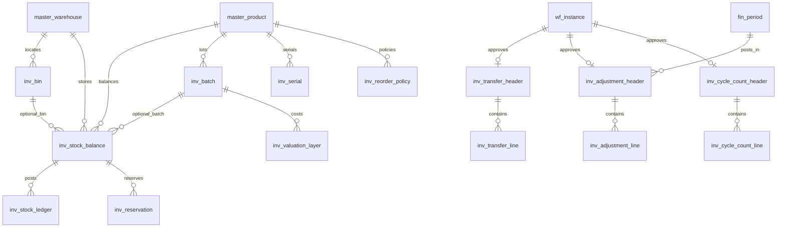

# ERD_07 — Inventory & Warehouse Domain

**Document:** Enterprise ERD — Inventory & Warehouse Domain  
**Version:** 1.0  
**Status:** Locked — Ready for Sprint 7 Implementation Planning  
**Schema:** `inventory`  
**Table Prefix:** `inv_`  
**Aligned To:** BRD v1.0 · FRD-08 · SDD v1.1 · DBS v1.1 · Architecture Lock v1.1  
**Functional Requirements:** [FRD-08 Inventory & Warehouse Domain](../02_FRD/FRD-08-Inventory-Warehouse-Domain.md)  
**Classification:** Internal — Confidential  
**Prior Release:** [ERP Core v1.1-beta](../07_RELEASES/ERP_Core_v1.1-beta.md)  

---

## 1. Module Overview

The Inventory & Warehouse Domain is the **stock control and warehouse operations engine** for on-hand balances, reservations, stock ledger, goods receipt/issue, transfers, adjustments, batch/serial tracking, cycle counting, and FIFO valuation. It is the **sole writer** of stock quantities. Procurement and Sales integrate only through the Inventory Service (ports introduced in Sprint 5–6 become real adapters in Sprint 7).

**Business Tables: 14**  
**Schema: `inventory`**

### Enterprise Inventory Modules (FRD-08)

| # | Module | Primary Tables | Primary Consumers |
|---|--------|----------------|-------------------|
| 1 | Bin / Location Management | `inv_bin` | Stock balance, transfer, putaway |
| 2 | Stock Balance (ATP) | `inv_stock_balance` | Sales reservation, dashboards |
| 3 | Stock Ledger | `inv_stock_ledger` | Audit, valuation, BI |
| 4 | Reservation | `inv_reservation` | Sales order, future Manufacturing |
| 5 | Warehouse Transfer | `inv_transfer_header`, `inv_transfer_line` | Multi-warehouse ops |
| 6 | Stock Adjustment | `inv_adjustment_header`, `inv_adjustment_line` | Cycle count, damage/loss |
| 7 | Batch Tracking | `inv_batch` | Receipt, issue, expiry alerts |
| 8 | Serial Tracking | `inv_serial` | Serialized products |
| 9 | Cycle Counting | `inv_cycle_count_header`, `inv_cycle_count_line` | Accuracy, adjustments |
| 10 | Stock Valuation (FIFO) | `inv_valuation_layer` | COGS, inventory asset |

**PostgreSQL Schema:** `inventory` per DBS §14  

### Architectural Position

```text
Foundation (ERD_01) ── Workflow, Audit, RBAC, Notification
Organization (ERD_02) ── Company, Branch
Master Data (ERD_03) ── Product, UOM, Warehouse (authoritative)
Finance (ERD_04) ── Periods, Journal, Inventory asset / COGS
Sales (ERD_05) ── Reserve on confirm · Issue on delivery · Receive on return
Procurement (ERD_06) ── Receive on GRN · Issue on purchase return
        ↓
Inventory (ERD_07) ── Balance · Ledger · Transfer · Adjustment · FIFO
        ↓
Manufacturing (FRD-13) · Quality (FRD-14) · BI (future)
```

---

## 2. Scope

### In Scope
- Bin hierarchy under `master_warehouse` (FRD-08 §5–6)
- Stock balances: on_hand, reserved, available (FRD-08 §4)
- Append-only stock ledger for every quantity change (FRD-08 §7)
- Reservations for sales (and extensible source modules) (FRD-08 §15)
- Goods receipt / goods issue via Inventory Service (GRN, delivery, returns)
- Warehouse and bin transfers with approval workflow (FRD-08 §8)
- Stock adjustments with approval (FRD-08 §9)
- Batch and serial tracking (FRD-08 §10–11)
- Cycle counting with variance approval (FRD-08 §13)
- FIFO valuation layers (FRD-08 §14 recommended method)
- Finance system-journal hooks for COGS / inventory write-off/gain
- Workflow, audit, RBAC, Celery jobs (low stock, expiry, posting retry)

### Out of Scope (Phase 2 / Separate ERD)
- **Duplicate warehouse master** — `master_warehouse` is authoritative (C-01); no `inv_warehouse`
- **Full barcode print/scan subsystem** — optional `barcode_value` attributes only; no `inv_barcode` table
- **Advanced WMS** — wave picking, putaway optimization, labor management
- **Manufacturing WIP / BOM tables** (`mfg_*`) — FRD-13; source_module hooks only
- **Quality Management tables** (`qm_*`) — FRD-14; quarantine bin + quality_status only
- **LIFO valuation** — deferred; weighted average optional via company config later
- **Separate `inv_valuation_posting` table** — Finance journal IDs stored on adjustment/ledger context
- SQLAlchemy models, Alembic migrations, application code (implementation sprint)
- Analytics cubes / `ana_fact_inventory`

### Future Integration Notes
- **Manufacturing (FRD-13):** Component issue / FG receipt via same Inventory Service with `source_module = manufacturing`
- **Quality (FRD-14):** Inspection release moves stock from quarantine bin/status to available
- **SCM (FRD-15):** Network visibility read-only over balances

### Assumptions
- **Only Inventory Service** writes `inv_*` tables — Procurement and Sales must not update inventory ORM
- Warehouse identity = `master.master_warehouse.id` (C-01)
- Available qty = `on_hand_qty - reserved_qty` (hard block when available would go negative, unless company policy allows backorder — default hard block)
- Stock ledger rows are **append-only** — corrections via reversing ledger entries
- Soft delete applies to bins, batches, serials, and document headers/lines — **not** to posted ledger rows
- Document numbers company-scoped and immutable after submit
- Perpetual inventory: quantity (and FIFO layer cost) updated at GRN receipt; sales issue consumes FIFO layers

### Dependencies

| Upstream | Tables Used |
|----------|-------------|
| ERD_01 Foundation | `sec_tenant`, `sec_user`, `wf_definition`, `wf_instance` |
| ERD_02 Organization | `org_company`, `org_branch` |
| ERD_03 Master Data | `master_product`, `master_uom`, `master_warehouse` |
| ERD_04 Finance | `fin_fiscal_year`, `fin_period`, `fin_journal_header`, `fin_chart_of_account` |
| ERD_05 Sales | Logical source docs only (UUID refs) — order, delivery, return |
| ERD_06 Procurement | Logical source docs only (UUID refs) — GRN, purchase return |

---

## 3. Table Inventory

| # | Table | Classification | tenant_id | company_id | branch_id | Soft Delete | Version | Workflow |
|---|-------|----------------|-----------|------------|-----------|-------------|---------|----------|
| 1 | `inv_bin` | Location Master | ✅ | ✅ | optional | ✅ | ✅ | — |
| 2 | `inv_batch` | Lot Master | ✅ | ✅ | optional | ✅ | ✅ | — |
| 3 | `inv_serial` | Serial Master | ✅ | ✅ | optional | ✅ | ✅ | — |
| 4 | `inv_stock_balance` | Balance Snapshot | ✅ | ✅ | ✅ | ✅ | ✅ | — |
| 5 | `inv_stock_ledger` | Posted Ledger | ✅ | ✅ | ✅ | — *(immutable)* | — | — |
| 6 | `inv_reservation` | Reservation | ✅ | ✅ | ✅ | ✅ | ✅ | — |
| 7 | `inv_transfer_header` | Transaction | ✅ | ✅ | ✅ | ✅ | ✅ | ✅ |
| 8 | `inv_transfer_line` | Transaction Detail | ✅ | ✅ | ✅ | ✅ | ✅ | — |
| 9 | `inv_adjustment_header` | Transaction | ✅ | ✅ | ✅ | ✅ | ✅ | ✅ |
| 10 | `inv_adjustment_line` | Transaction Detail | ✅ | ✅ | ✅ | ✅ | ✅ | — |
| 11 | `inv_cycle_count_header` | Transaction | ✅ | ✅ | ✅ | ✅ | ✅ | ✅ |
| 12 | `inv_cycle_count_line` | Transaction Detail | ✅ | ✅ | ✅ | ✅ | ✅ | — |
| 13 | `inv_valuation_layer` | Cost Layer (FIFO) | ✅ | ✅ | ✅ | ✅ | ✅ | — |
| 14 | `inv_reorder_policy` | Policy Master | ✅ | ✅ | optional | ✅ | ✅ | — |

> **Note:** `inv_stock_ledger` rows are **immutable** after insert — no soft delete; reverse via offsetting ledger entry.

**Business Tables: 14**  
**Schema: `inventory`**

---

## 4. Entity Relationships



```text
master_warehouse
    ├── inv_bin
    ├── inv_stock_balance ── master_product, inv_bin?, inv_batch?
    │       ├── inv_stock_ledger (append-only)
    │       └── inv_reservation ── source_module + source UUIDs
    ├── inv_batch / inv_serial
    ├── inv_valuation_layer ── FIFO remaining qty + unit_cost
    ├── inv_reorder_policy
    ├── inv_transfer_header / line
    ├── inv_adjustment_header / line
    └── inv_cycle_count_header / line
```

### Warehouse Hierarchy

```text
org_company
  └── org_branch
        └── master_warehouse          (ERD_03 — authoritative)
              └── inv_bin             (aisle / rack / shelf / bin)
```

---

## 5. Standard Column Profiles

### 5.1 Inventory Master Profile (Bin, Batch, Serial, Reorder Policy)

| Column Group | Columns |
|--------------|---------|
| Primary Key | `id UUID` |
| Tenant / Company | `tenant_id`, `company_id` |
| Business Key | code / number fields per entity |
| Status | `status VARCHAR(30)` |
| Audit + Soft Delete + Version | per DBS §28 |

### 5.2 Transaction Header Profile (Transfer, Adjustment, Cycle Count)

| Column Group | Columns |
|--------------|---------|
| Primary Key | `id UUID` |
| Document | `document_number`, `document_date` |
| Status / Workflow | `status`, `workflow_status`, `workflow_instance_id` |
| Scope | `tenant_id`, `company_id`, `branch_id` |
| Warehouse | `warehouse_id` and/or from/to warehouse |
| Audit + Soft Delete + Version | per DBS §28 |

### 5.3 Stock Ledger Profile

| Column Group | Columns |
|--------------|---------|
| Primary Key | `id UUID` |
| Scope | `tenant_id`, `company_id`, `branch_id` |
| Product / Location | `product_id`, `warehouse_id`, `bin_id?`, `batch_id?`, `serial_id?` |
| Movement | `movement_type`, `quantity_in`, `quantity_out`, `uom_id` |
| Source | `source_module`, `source_document_type`, `source_document_id`, `source_line_id` |
| Cost | `unit_cost`, `total_cost` (base currency) |
| Timestamp | `posted_at`, `posted_by` |
| No soft delete | Reversal = new opposite row with `reversal_of_ledger_id` |

---

## 6. Detailed Table Definitions

---

### 6.1 `inv_bin`

#### Purpose
Precise storage location under a warehouse (FRD-08 §6).

| Column | Type | Nullable | Description |
|--------|------|----------|-------------|
| `id` | UUID | NO | PK |
| `tenant_id` / `company_id` | UUID | NO | Scope |
| `branch_id` | UUID | YES | Optional |
| `warehouse_id` | UUID | NO | FK → `master.master_warehouse` |
| `bin_code` | VARCHAR(50) | NO | UK per warehouse — e.g. `BIN-A01-R01-S02-10` |
| `bin_name` | VARCHAR(255) | YES | — |
| `aisle` / `rack` / `shelf` | VARCHAR(30) | YES | Hierarchy attributes |
| `parent_bin_id` | UUID | YES | FK → `inv_bin` (optional tree) |
| `bin_type` | VARCHAR(30) | NO | storage, quarantine, staging, in_transit |
| `status` | VARCHAR(30) | NO | active, inactive, blocked |
| AUDIT_STD + SOFT_DELETE_OPT | | | |

**UK:** `(warehouse_id, bin_code)` where not deleted.

---

### 6.2 `inv_batch`

#### Purpose
Lot/batch identity for products requiring batch control (FRD-08 §10).

| Column | Type | Nullable | Description |
|--------|------|----------|-------------|
| `id` | UUID | NO | PK |
| Scope | UUID | NO | tenant/company |
| `product_id` | UUID | NO | FK → `master_product` |
| `batch_number` | VARCHAR(50) | NO | UK per company+product — `BATCH-YYYY-NNNNNN` |
| `manufacturing_date` | DATE | YES | — |
| `expiry_date` | DATE | YES | — |
| `barcode_value` | VARCHAR(100) | YES | Optional scan code |
| `status` | VARCHAR(30) | NO | active, expired, quarantined, closed |
| AUDIT_STD + SOFT_DELETE_OPT | | | |

---

### 6.3 `inv_serial`

#### Purpose
Unique item tracking (FRD-08 §11).

| Column | Type | Nullable | Description |
|--------|------|----------|-------------|
| `id` | UUID | NO | PK |
| Scope | UUID | NO | — |
| `product_id` | UUID | NO | FK → `master_product` |
| `serial_number` | VARCHAR(100) | NO | UK per company — `SN-YYYY-NNNNNN` |
| `batch_id` | UUID | YES | FK → `inv_batch` |
| `warehouse_id` | UUID | YES | Current location |
| `bin_id` | UUID | YES | FK → `inv_bin` |
| `status` | VARCHAR(30) | NO | available, reserved, issued, returned, scrapped |
| `barcode_value` | VARCHAR(100) | YES | — |
| AUDIT_STD + SOFT_DELETE_OPT | | | |

---

### 6.4 `inv_stock_balance`

#### Purpose
Current stock repository (FRD-08 §4).

| Column | Type | Nullable | Description |
|--------|------|----------|-------------|
| `id` | UUID | NO | PK |
| Scope | UUID | NO | tenant/company/branch |
| `warehouse_id` | UUID | NO | FK → `master_warehouse` |
| `bin_id` | UUID | YES | FK → `inv_bin` — NULL = warehouse-level |
| `product_id` | UUID | NO | FK → `master_product` |
| `batch_id` | UUID | YES | FK → `inv_batch` |
| `uom_id` | UUID | NO | FK → `master_uom` (base UOM) |
| `on_hand_qty` | NUMERIC(18,4) | NO | DEFAULT 0 |
| `reserved_qty` | NUMERIC(18,4) | NO | DEFAULT 0 |
| `available_qty` | NUMERIC(18,4) | NO | `on_hand - reserved` (maintained) |
| `quality_status` | VARCHAR(30) | NO | available, quarantine, rejected |
| `status` | VARCHAR(30) | NO | active, blocked |
| AUDIT_STD + SOFT_DELETE_OPT + version | | | |

**UK:** `(company_id, warehouse_id, product_id, COALESCE(bin_id, zero_uuid), COALESCE(batch_id, zero_uuid), quality_status)` where not deleted.

**Business rule:** `available_qty = on_hand_qty - reserved_qty`; reject transactions that would make `available_qty < 0` (default policy).

---

### 6.5 `inv_stock_ledger`

#### Purpose
Immutable stock movement ledger (FRD-08 §7). Every quantity change creates ledger entry/entries.

| Column | Type | Nullable | Description |
|--------|------|----------|-------------|
| `id` | UUID | NO | PK |
| Scope | UUID | NO | tenant/company/branch |
| `entry_number` | VARCHAR(50) | NO | UK per company |
| `posted_at` | TIMESTAMPTZ | NO | — |
| `posted_by` | UUID | YES | FK → `sec_user` |
| `product_id` / `warehouse_id` / `uom_id` | UUID | NO | — |
| `bin_id` / `batch_id` / `serial_id` | UUID | YES | — |
| `movement_type` | VARCHAR(30) | NO | See §11 |
| `quantity_in` | NUMERIC(18,4) | NO | DEFAULT 0 |
| `quantity_out` | NUMERIC(18,4) | NO | DEFAULT 0 |
| `unit_cost` / `total_cost` | NUMERIC(18,4) | YES | Base currency |
| `source_module` | VARCHAR(50) | NO | procurement, sales, inventory, manufacturing |
| `source_document_type` | VARCHAR(50) | NO | grn, delivery, transfer, adjustment, … |
| `source_document_id` | UUID | NO | — |
| `source_line_id` | UUID | YES | — |
| `reversal_of_ledger_id` | UUID | YES | FK → self |
| `finance_journal_id` | UUID | YES | FK → `fin_journal_header` when valued |

**Constraints:** Exactly one of `quantity_in` / `quantity_out` > 0 per row (or allow both 0 only for memo reservation lines if used). Prefer separate in/out rows.

**No soft delete.**

---

### 6.6 `inv_reservation`

#### Purpose
Reserve stock for sales (and future production/projects) (FRD-08 §15).

| Column | Type | Nullable | Description |
|--------|------|----------|-------------|
| `id` | UUID | NO | PK |
| Scope | UUID | NO | — |
| `warehouse_id` / `product_id` / `uom_id` | UUID | NO | — |
| `bin_id` / `batch_id` | UUID | YES | — |
| `quantity_reserved` | NUMERIC(18,4) | NO | — |
| `quantity_issued` | NUMERIC(18,4) | NO | DEFAULT 0 |
| `source_module` | VARCHAR(50) | NO | sales, manufacturing, project |
| `source_document_type` | VARCHAR(50) | NO | sales_order, … |
| `source_document_id` | UUID | NO | — |
| `source_line_id` | UUID | YES | — |
| `status` | VARCHAR(30) | NO | active, partially_issued, fulfilled, released, cancelled |
| `reserved_at` / `released_at` | TIMESTAMPTZ | YES | — |
| AUDIT_STD + SOFT_DELETE_OPT | | | |

**Rule:** Reserved quantity cannot be reserved or sold again.

---

### 6.7 `inv_transfer_header` / 6.8 `inv_transfer_line`

#### Purpose
Move inventory between warehouses or bins (FRD-08 §8).

**Header**

| Column | Type | Nullable | Description |
|--------|------|----------|-------------|
| `id` | UUID | NO | PK |
| Scope | UUID | NO | — |
| `document_number` | VARCHAR(50) | NO | UK — `TRF-YYYY-NNNNNN` |
| `document_date` | DATE | NO | — |
| `transfer_type` | VARCHAR(30) | NO | warehouse, bin, branch |
| `from_warehouse_id` / `to_warehouse_id` | UUID | NO | FK → `master_warehouse` |
| `status` | VARCHAR(30) | NO | draft, submitted, approved, in_transit, received, closed, cancelled |
| `workflow_status` / `workflow_instance_id` | mixed | YES | — |
| `shipped_at` / `received_at` | TIMESTAMPTZ | YES | — |
| AUDIT_STD + SOFT_DELETE_OPT | | | |

**Line:** product, qty, uom, from_bin, to_bin, batch_id, serial refs, status.

**Workflow:** Requested → Approved → In Transit → Received → Closed.

---

### 6.9 `inv_adjustment_header` / 6.10 `inv_adjustment_line`

#### Purpose
Correct inventory discrepancies (FRD-08 §9). Approval required.

| Header fields | Notes |
|---------------|-------|
| `document_number` | `ADJ-YYYY-NNNNNN` |
| `warehouse_id` | — |
| `reason_code` | damage, loss, shrinkage, count_error, expiry, other |
| `status` | draft, submitted, approved, posted, cancelled |
| `fiscal_year_id` / `period_id` | Required for valued post |
| `finance_journal_id` | Set on post |
| Workflow | `INV_ADJUSTMENT_APPROVAL` |

**Line:** product, signed qty (or direction in/out), bin, batch, unit_cost override optional.

---

### 6.11 `inv_cycle_count_header` / 6.12 `inv_cycle_count_line`

#### Purpose
Inventory verification (FRD-08 §13).

| Header | Notes |
|--------|-------|
| `document_number` | `CNT-YYYY-NNNNNN` |
| `count_type` | daily, weekly, monthly, annual |
| `warehouse_id` | — |
| `status` | draft, in_progress, submitted, approved, posted, cancelled |
| Workflow | `INV_CYCLE_COUNT_APPROVAL` for variances |

**Line:** product, system_qty, counted_qty, variance_qty, variance_type (`match`, `shortage`, `excess`), optional link to generated adjustment.

---

### 6.13 `inv_valuation_layer`

#### Purpose
FIFO cost layers (FRD-08 §14). Default valuation method: **FIFO**.

| Column | Type | Nullable | Description |
|--------|------|----------|-------------|
| `id` | UUID | NO | PK |
| Scope | UUID | NO | — |
| `warehouse_id` / `product_id` | UUID | NO | — |
| `batch_id` | UUID | YES | — |
| `received_at` | TIMESTAMPTZ | NO | Layer age for FIFO |
| `original_qty` / `remaining_qty` | NUMERIC(18,4) | NO | — |
| `unit_cost` | NUMERIC(18,4) | NO | Base currency |
| `currency_code` | VARCHAR(3) | NO | — |
| `source_module` / `source_document_id` | mixed | NO | Typically GRN |
| `status` | VARCHAR(30) | NO | open, depleted, reversed |
| AUDIT_STD + SOFT_DELETE_OPT | | | |

**Issue costing:** Consume oldest open layers first; post COGS/inventory via Finance on sales issue / write-off.

**Company config (future):** `fifo` (default) \| `weighted_average` — WA may reuse single layer or balance cost field in a later revision; ERD locks FIFO table now.

---

### 6.14 `inv_reorder_policy`

#### Purpose
Support low-stock alerts and planning thresholds.

| Column | Type | Nullable | Description |
|--------|------|----------|-------------|
| `id` | UUID | NO | PK |
| Scope | UUID | NO | tenant/company |
| `warehouse_id` / `product_id` | UUID | NO | — |
| `reorder_point` | NUMERIC(18,4) | NO | Alert when available ≤ point |
| `safety_stock` | NUMERIC(18,4) | YES | — |
| `reorder_qty` | NUMERIC(18,4) | YES | Suggested PR qty |
| `status` | VARCHAR(30) | NO | active, inactive |
| AUDIT_STD + SOFT_DELETE_OPT | | | |

**UK:** `(company_id, warehouse_id, product_id)` where not deleted.

---

## 7. Primary Keys

| Table | Constraint Name | Column |
|-------|-----------------|--------|
| `inv_bin` | `pk_inv_bin` | `id` |
| `inv_batch` | `pk_inv_batch` | `id` |
| `inv_serial` | `pk_inv_serial` | `id` |
| `inv_stock_balance` | `pk_inv_stock_balance` | `id` |
| `inv_stock_ledger` | `pk_inv_stock_ledger` | `id` |
| `inv_reservation` | `pk_inv_reservation` | `id` |
| `inv_transfer_header` | `pk_inv_transfer_header` | `id` |
| `inv_transfer_line` | `pk_inv_transfer_line` | `id` |
| `inv_adjustment_header` | `pk_inv_adjustment_header` | `id` |
| `inv_adjustment_line` | `pk_inv_adjustment_line` | `id` |
| `inv_cycle_count_header` | `pk_inv_cycle_count_header` | `id` |
| `inv_cycle_count_line` | `pk_inv_cycle_count_line` | `id` |
| `inv_valuation_layer` | `pk_inv_valuation_layer` | `id` |
| `inv_reorder_policy` | `pk_inv_reorder_policy` | `id` |

---

## 8. Foreign Keys

| Child | Column | Parent |
|-------|--------|--------|
| `inv_bin` | `warehouse_id` | `master.master_warehouse` |
| `inv_bin` | `parent_bin_id` | `inventory.inv_bin` |
| `inv_batch` / `inv_serial` | `product_id` | `master.master_product` |
| `inv_stock_balance` | `warehouse_id`, `product_id`, `uom_id`, `bin_id`, `batch_id` | master / inv_* |
| `inv_stock_ledger` | product/warehouse/bin/batch/serial | as above |
| `inv_stock_ledger` | `finance_journal_id` | `finance.fin_journal_header` |
| `inv_reservation` | warehouse/product | master |
| Transfer / adjustment / count | warehouse(s), workflow_instance_id | master / foundation |
| Adjustment | `period_id`, `finance_journal_id` | finance |
| `inv_valuation_layer` | warehouse/product/batch | master / inv_batch |
| `inv_reorder_policy` | warehouse/product | master |

**No FK to:** `sales_*`, `proc_*`, `mfg_*`, `qm_*` — source documents referenced by UUID + `source_module` only.

All `inv_*` tables: `tenant_id` → `sec_tenant`, `company_id` → `org_company`. Transactional tables: `branch_id` → `org_branch`.

---

## 9. Indexes & Constraints

### Unique
- Document headers: `(company_id, document_number)`
- `inv_bin`: `(warehouse_id, bin_code)`
- `inv_batch`: `(company_id, product_id, batch_number)`
- `inv_serial`: `(company_id, serial_number)`
- `inv_stock_balance`: grain UK (§6.4)
- `inv_reorder_policy`: `(company_id, warehouse_id, product_id)`
- `inv_stock_ledger`: `(company_id, entry_number)`
- Lines: `(header_id, line_number)`

### Check
- Quantities ≥ 0 on balances and reservation remaining
- Ledger: not both in and out positive on same row (or enforce via service)
- `expiry_date >= manufacturing_date` when both set

### Indexes
- All FKs
- `(tenant_id, company_id, warehouse_id, product_id)` on balance and ledger
- `(source_module, source_document_id)` on ledger and reservation (idempotency)
- `(expiry_date)` on batch for alert jobs
- `(status)` on open reservations and open valuation layers

---

## 10. Document Numbering

| Document | Format | UK Scope |
|----------|--------|----------|
| Stock Ledger Entry | `ILE-YYYY-NNNNNN` | company |
| Transfer | `TRF-YYYY-NNNNNN` | company |
| Adjustment | `ADJ-YYYY-NNNNNN` | company |
| Cycle Count | `CNT-YYYY-NNNNNN` | company |
| Batch | `BATCH-YYYY-NNNNNN` | company + product |
| Serial | `SN-YYYY-NNNNNN` | company |

---

## 11. Status Lifecycles & Movement Types

### Movement Types (`inv_stock_ledger.movement_type`)
`receipt`, `issue`, `transfer_out`, `transfer_in`, `adjustment_in`, `adjustment_out`, `return_in`, `return_out`, `count_gain`, `count_loss`

### Document Statuses
| Entity | Statuses |
|--------|----------|
| Transfer | draft, submitted, approved, in_transit, received, closed, cancelled |
| Adjustment | draft, submitted, approved, posted, cancelled |
| Cycle Count | draft, in_progress, submitted, approved, posted, cancelled |
| Reservation | active, partially_issued, fulfilled, released, cancelled |
| Batch | active, expired, quarantined, closed |
| Serial | available, reserved, issued, returned, scrapped |

---

## 12. Stock Movement Strategy (Service Events)

| Trigger | Inventory API | Ledger | Balance |
|---------|---------------|--------|---------|
| Proc GRN confirm | `receive_goods` | +receipt | on_hand ↑; FIFO layer create |
| Proc purchase return | `issue_purchase_return` | −issue / return_out | on_hand ↓ |
| Sales order confirm | `reserve` | — (or memo) | reserved ↑ |
| Sales order cancel | `release_reservation` | — | reserved ↓ |
| Sales delivery confirm | `issue_goods` | −issue | on_hand ↓, reserved ↓; FIFO consume |
| Sales return receive | `receive_sales_return` | +receipt | on_hand ↑ |
| Transfer ship / receive | `transfer_ship` / `transfer_receive` | out + in | from ↓ / to ↑ |
| Adjustment post | `adjust` | ± | on_hand ± |
| Cycle count post | variance → adjust or count_* | ± | on_hand ± |

**Idempotency:** unique processing key on `(source_module, source_document_type, source_document_id[, line_id])`.

**Concurrency:** optimistic `version` on `inv_stock_balance` (and/or row lock).

---

## 13. Integration Specifications

### 13.1 Procurement (ERD_06)
- **Only** Inventory Service updates stock — replace Sprint 6 `NoOpInventoryAdapter`
- GRN `warehouse_reference` → `warehouse_id`
- Same DB transaction preferred for GRN confirm + receive_goods

### 13.2 Sales (ERD_05)
- Order confirm → reserve; update Sales `reservation_status` via callback
- Delivery confirm → issue against reservation
- Return → receive_sales_return (often quarantine bin)

### 13.3 Finance (ERD_04)
- Sales issue: COGS Dr / Inventory Cr (system journal)
- Adjustment loss/gain: expense/income ↔ inventory
- Respect `fin_period.inventory_closed`
- Pattern: `InventoryPostingService` → `PostingService.post_system_journal`

### 13.4 Manufacturing / Quality (Future)
- `source_module = manufacturing` on reservation/issue/receipt — no `mfg_*` tables
- Quarantine via `bin_type` / `quality_status`; QM UUID refs only

---

## 14. Approval Workflow Integration

| Workflow Code | Document | Path (FRD-08 §17) |
|---------------|----------|-------------------|
| `INV_TRANSFER_APPROVAL` | Transfer | Requester → Warehouse Manager |
| `INV_ADJUSTMENT_APPROVAL` | Adjustment | Warehouse Exec → Manager → Finance Review |
| `INV_CYCLE_COUNT_APPROVAL` | Cycle count variance | Counter → Manager |

---

## 15. Audit Strategy

| Layer | Mechanism |
|-------|-----------|
| Row audit | Standard columns on mutable tables |
| Ledger | Append-only + source document traceability |
| Business audit | `AuditService` on reserve/receive/issue/transfer/adjust/count |
| Notifications | Low stock, transfer approved, adjustment posted, count variance, batch expiry (FRD-08 §18) |

---

## 16. Tenant / Company / Branch Isolation

| Rule | Application |
|------|-------------|
| `tenant_id` | All tables |
| `company_id` | Stock and numbering boundary |
| `branch_id` | Mandatory on balances, ledger, reservations, transactional docs |
| Repository | `InvScopedRepository` pattern |
| RBAC | `inventory.*` permissions |

### 16.1 Planned RBAC Permissions (Sprint 7)

| Resource | Permissions |
|----------|-------------|
| `inventory.stock` | read, export |
| `inventory.bin` | read, create, update |
| `inventory.batch` | read, create, update |
| `inventory.serial` | read, create, update |
| `inventory.reservation` | read, create, release |
| `inventory.transfer` | read, create, update, submit, approve, ship, receive |
| `inventory.adjustment` | read, create, update, submit, approve, post |
| `inventory.cycle_count` | read, create, update, submit, approve, post |
| `inventory.valuation` | read, run |
| `inventory.reorder_policy` | read, create, update |
| `inventory.report` | read, export |

**Roles:** `WAREHOUSE_EXECUTIVE`, `WAREHOUSE_MANAGER`, `INVENTORY_CONTROLLER` (+ Finance review for adjustments).

---

## 17. Migration Order

Prior Alembic head: **`0077_seed_proc_workflows`**.

| Order | Revision ID (≤32 chars) | Migration | Tables / Actions |
|-------|-------------------------|-----------|------------------|
| 78 | `0078_create_inventory_schema` | Create schema | `inventory` |
| 79 | `0079_inv_bin` | Bins | `inv_bin` |
| 80 | `0080_inv_batch` | Batches | `inv_batch` |
| 81 | `0081_inv_serial` | Serials | `inv_serial` |
| 82 | `0082_inv_stock_balance` | Balances | `inv_stock_balance` |
| 83 | `0083_inv_stock_ledger` | Ledger | `inv_stock_ledger` |
| 84 | `0084_inv_reservation` | Reservations | `inv_reservation` |
| 85 | `0085_inv_transfer_header` | Transfer H | `inv_transfer_header` |
| 86 | `0086_inv_transfer_line` | Transfer L | `inv_transfer_line` |
| 87 | `0087_inv_adjustment_header` | Adjustment H | `inv_adjustment_header` |
| 88 | `0088_inv_adjustment_line` | Adjustment L | `inv_adjustment_line` |
| 89 | `0089_inv_cycle_count_header` | Count H | `inv_cycle_count_header` |
| 90 | `0090_inv_cycle_count_line` | Count L | `inv_cycle_count_line` |
| 91 | `0091_inv_valuation_layer` | FIFO layers | `inv_valuation_layer` |
| 92 | `0092_inv_reorder_policy` | Reorder policy | `inv_reorder_policy` |
| 93 | `0093_seed_inv_permissions` | RBAC seed | Permissions / roles |
| 94 | `0094_seed_inv_workflows` | Workflow seed | Workflow definitions |

**Dependency order rationale:**
1. Schema → location/identity (bin, batch, serial)
2. Balance → ledger → reservation
3. Transfer / adjustment / cycle count documents
4. Valuation layers + reorder policy
5. Seeds last

**Planned head after Sprint 7:** `0094_seed_inv_workflows`

---

## 18. Cross Module Dependencies

### 18.1 Upstream (Inventory Consumes)

| Module | FRD | Provides | Pattern |
|--------|-----|----------|---------|
| Foundation | FRD-01 | tenant, user, workflow, audit, RBAC | Direct FK |
| Organization | FRD-02 | company, branch | Direct FK |
| Master Data | FRD-03 | product, uom, warehouse | Direct FK — C-01 |
| Finance | FRD-04 | period, COA, journal posting API | FK + posting service |

### 18.2 Upstream Event Sources (No FK)

| Module | FRD | Events |
|--------|-----|--------|
| Sales | FRD-06 | reserve, release, issue, sales-return receipt |
| Procurement | FRD-07 | GRN receipt, purchase-return issue |

### 18.3 Downstream

| Module | FRD | Pattern |
|--------|-----|---------|
| Finance | FRD-04 | Inventory/COGS system journals |
| BI | FRD-18 | Read-only ledger/balance |
| Manufacturing / Quality | FRD-13 / 14 | Future source_module / quarantine |

**Rule:** Inventory is the only module allowed to mutate `inv_*` stock state.

---

## 19. API Boundaries (Planned)

**Mount:** `/inventory`

| Area | Routes |
|------|--------|
| Stock | `GET /stock`, `GET /stock/ledger` |
| Bins / Batches / Serials | CRUD |
| Reservations | create / release (often internal) |
| Transfers | CRUD + submit / approve / ship / receive |
| Adjustments | CRUD + submit / approve / post |
| Cycle counts | CRUD + submit / approve / post |
| Reorder policies | CRUD |
| Valuation | query layers / run tools |

Cross-module: in-process Inventory application services (modular monolith), not shared repositories.

---

## 20. Celery / Background Jobs (Planned)

| Task | Purpose |
|------|---------|
| `inventory.low_stock_alerts` | available ≤ reorder_point |
| `inventory.batch_expiry_alerts` | Expiry window |
| `inventory.recompute_available` | Integrity repair |
| `inventory.retry_finance_posting` | Failed journals |
| `inventory.cycle_count_reminders` | Scheduled counts |

---

## 21. Phase Gate Checklist

| # | Gate Criterion | Status |
|---|----------------|--------|
| 1 | Business tables = **14**; schema = **`inventory`** | ✅ |
| 2 | Prefix `inv_` defined | ✅ |
| 3 | `master_warehouse` reused — no `inv_warehouse` | ✅ |
| 4 | Aligned to FRD-08; FIFO default documented | ✅ |
| 5 | Ledger append-only; ATP = on_hand − reserved | ✅ |
| 6 | Proc/Sales integration via Inventory Service only | ✅ |
| 7 | Manufacturing/Quality hooks without new schemas | ✅ |
| 8 | Migration order `0078`–`0094`, revision IDs ≤ 32 chars | ✅ |
| 9 | Workflows + RBAC + Celery documented | ✅ |
| 10 | Cross-module dependencies documented | ✅ |

### ERD Phase Gate — Inventory Summary

| Metric | Value |
|--------|-------|
| Business Tables | **14** |
| Schema | **`inventory`** |
| Prefix | `inv_` |
| Migration range | `0078` – `0094` |
| Prior head | `0077_seed_proc_workflows` |
| Planned head | `0094_seed_inv_workflows` |

---

## Document Control

| Version | Date | Change |
|---------|------|--------|
| 1.0 | 2026-07-13 | Initial ERD_07 Inventory from approved Sprint 7 planning |

---

**ERD_07 Inventory locked for Sprint 7 implementation planning.**
