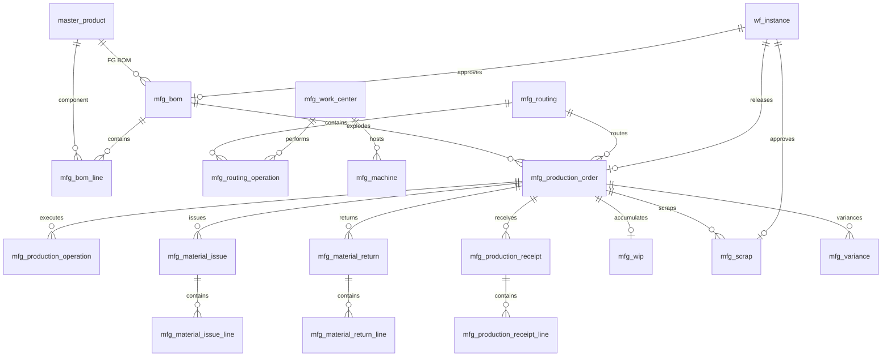

# ERD_08 — Manufacturing & Production Domain

**Document:** Enterprise ERD — Manufacturing & Production Domain  
**Version:** 1.0  
**Status:** Locked — Ready for Sprint 8 Implementation Planning  
**Schema:** `manufacturing`  
**Table Prefix:** `mfg_`  
**Aligned To:** BRD v1.0 · FRD-13 · SDD v1.1 · DBS v1.1 · Architecture Lock v1.1  
**Functional Requirements:** [FRD-13 Manufacturing Domain](../02_FRD/FRD-13-Manufacturing-Domain.md)  
**Classification:** Internal — Confidential  
**Prior Release:** [ERP Core v1.2-beta](../07_RELEASES/ERP_Core_v1.2-beta.md)  

---

## 1. Module Overview

The Manufacturing & Production Domain converts **raw materials into finished goods** through BOM, routing, work centers, machines, production orders, shop-floor operations, material issue/return, production receipt, WIP, scrap, and production variance. It does **not** write `inv_*` stock tables — all material movements go through the **Inventory Service** (`source_module = manufacturing`). Valued WIP / scrap / FG postings go through **Finance** system journals.

**Business Tables: 17**  
**Schema: `manufacturing`**

### Enterprise Manufacturing Modules (FRD-13)

| # | Module | Primary Tables | Primary Consumers |
|---|--------|----------------|-------------------|
| 1 | Bill of Materials | `mfg_bom`, `mfg_bom_line` | Production order explode, MRP (future) |
| 2 | Routing | `mfg_routing`, `mfg_routing_operation` | Production operations |
| 3 | Work Center | `mfg_work_center` | Capacity, operations |
| 4 | Machine | `mfg_machine` | Shop floor status |
| 5 | Production Order | `mfg_production_order` | Issue, receipt, WIP, scrap |
| 6 | Production Operation | `mfg_production_operation` | Shop floor execution |
| 7 | Material Issue | `mfg_material_issue`, `mfg_material_issue_line` | Inventory issue → WIP |
| 8 | Material Return | `mfg_material_return`, `mfg_material_return_line` | Inventory receipt from WIP |
| 9 | Production Receipt | `mfg_production_receipt`, `mfg_production_receipt_line` | FG into Inventory |
| 10 | WIP | `mfg_wip` | Cost roll-up, Finance |
| 11 | Scrap | `mfg_scrap` | Scrap expense posting |
| 12 | Production Variance | `mfg_variance` | Std vs actual cost |

**PostgreSQL Schema:** `manufacturing` per DBS §14  

### Architectural Position

```text
Foundation (ERD_01) ── Workflow, Audit, RBAC, Notification
Organization (ERD_02) ── Company, Branch, Cost Center
Master Data (ERD_03) ── Product, UOM, Warehouse, Employee
Finance (ERD_04) ── Periods, Journal, WIP / FG / Scrap COA
Procurement (ERD_06) ── Optional demand / PR from shortage (UUID refs)
Inventory (ERD_07) ── Reserve · Issue · Receive (sole stock writer)
        ↓
Manufacturing (ERD_08) ── BOM · Routing · WO · Issue · Receipt · WIP
        ↓
Quality (FRD-14) · BI (future)
```

---

## 2. Scope

### In Scope
- BOM with revision / version control; one **active** BOM per product (FRD-13 §4–5)
- BOM component lines: qty, UOM, scrap %, optional alternate product
- Routing and routing operations with work center, setup/run time (FRD-13 §6)
- Work centers and machines; machine shop-floor status (FRD-13 §7, §13)
- Production order (work order) lifecycle (FRD-13 §10)
- Production order operations for shop-floor execution (FRD-13 §12–13)
- Material issue to production and material return from production (FRD-13 §11)
- Finished goods / production receipt into inventory (FRD-13 §15)
- WIP cost accumulation and production variance (FRD-13 §18–19)
- Scrap recording with approval and finance impact (FRD-13 §16)
- Inventory Service integration only (no direct `inv_*` ORM writes)
- Finance system-journal hooks: WIP Dr / RM Cr; FG Dr / WIP Cr; Scrap Expense Dr / Inventory or WIP Cr
- Workflow, audit, RBAC, Celery (capacity alerts, WIP reconcile, posting retry)

### Out of Scope (Phase 2 / Separate ERD)
- **Full MRP run tables** (`mfg_mrp_run`, `mfg_mrp_requirement`) — FRD-13 §9; shortage → PR via service + UUID refs only in Sprint 8
- **Production plan schedule tables** (`mfg_production_plan`) — FRD-13 §8 deferred; demand refs optional on production order
- **Rework order tables** — FRD-13 §17; Phase 2 (defect → rework WO via source refs)
- **Quality Management tables** (`qm_*`) — FRD-14; optional `quality_status` / `quality_reference` on receipt/scrap only
- **Advanced APS / finite capacity optimizer** — utilization fields and Celery alerts only
- **Duplicate product/warehouse masters** — C-01; use `master_*`
- SQLAlchemy models, Alembic migrations, application code (implementation sprint)
- Analytics cubes / `ana_fact_production`

### Future Integration Notes
- **Quality (FRD-14):** In-process / final QC references production order / receipt UUIDs
- **MRP Phase 2:** Explode BOM × planned qty against Inventory ATP + open PO; create `proc_requisition` via Procurement Service
- **Sales:** Optional make-to-order via `source_module` / `source_document_id` on production order (no FK)

### Assumptions
- **Only Inventory Service** mutates stock; Manufacturing calls receive/issue/reserve ports
- **Only Finance PostingService** posts GL; Manufacturing stores `finance_journal_id` refs
- Production order number company-scoped: `WO-YYYY-NNNNNN`
- BOM number: `BOM-YYYY-NNNNNN`; only one `status = active` per `(company_id, product_id)` where not deleted
- Soft delete on mutable masters/documents; WIP balance rows updated in place with version; scrap/variance soft-deletable until posted
- Document numbers immutable after submit/release
- Default costing: **standard + actual roll-up on WIP**; variance captured on close

### Dependencies

| Upstream | Tables Used |
|----------|-------------|
| ERD_01 Foundation | `sec_tenant`, `sec_user`, `wf_definition`, `wf_instance` |
| ERD_02 Organization | `org_company`, `org_branch`, `org_cost_center` |
| ERD_03 Master Data | `master_product`, `master_uom`, `master_warehouse`, `master_employee` |
| ERD_04 Finance | `fin_fiscal_year`, `fin_period`, `fin_journal_header`, `fin_chart_of_account` |
| ERD_06 Procurement | Logical UUID refs only (PR from shortage — Phase 2) |
| ERD_07 Inventory | Inventory Service API only — no FK to `inv_*` |

---

## 3. Table Inventory

| # | Table | Classification | tenant_id | company_id | branch_id | Soft Delete | Version | Workflow |
|---|-------|----------------|-----------|------------|-----------|-------------|---------|----------|
| 1 | `mfg_bom` | Engineering Master | ✅ | ✅ | optional | ✅ | ✅ | ✅ |
| 2 | `mfg_bom_line` | Engineering Detail | ✅ | ✅ | optional | ✅ | ✅ | — |
| 3 | `mfg_routing` | Engineering Master | ✅ | ✅ | optional | ✅ | ✅ | — |
| 4 | `mfg_routing_operation` | Engineering Detail | ✅ | ✅ | optional | ✅ | ✅ | — |
| 5 | `mfg_work_center` | Resource Master | ✅ | ✅ | optional | ✅ | ✅ | — |
| 6 | `mfg_machine` | Resource Master | ✅ | ✅ | optional | ✅ | ✅ | — |
| 7 | `mfg_production_order` | Transaction | ✅ | ✅ | ✅ | ✅ | ✅ | ✅ |
| 8 | `mfg_production_operation` | Transaction Detail | ✅ | ✅ | ✅ | ✅ | ✅ | — |
| 9 | `mfg_material_issue` | Transaction | ✅ | ✅ | ✅ | ✅ | ✅ | — |
| 10 | `mfg_material_issue_line` | Transaction Detail | ✅ | ✅ | ✅ | ✅ | ✅ | — |
| 11 | `mfg_material_return` | Transaction | ✅ | ✅ | ✅ | ✅ | ✅ | — |
| 12 | `mfg_material_return_line` | Transaction Detail | ✅ | ✅ | ✅ | ✅ | ✅ | — |
| 13 | `mfg_production_receipt` | Transaction | ✅ | ✅ | ✅ | ✅ | ✅ | — |
| 14 | `mfg_production_receipt_line` | Transaction Detail | ✅ | ✅ | ✅ | ✅ | ✅ | — |
| 15 | `mfg_wip` | Cost Balance | ✅ | ✅ | ✅ | ✅ | ✅ | — |
| 16 | `mfg_scrap` | Transaction | ✅ | ✅ | ✅ | ✅ | ✅ | ✅ |
| 17 | `mfg_variance` | Cost Transaction | ✅ | ✅ | ✅ | ✅ | ✅ | — |

> **Note:** Routing uses status lifecycle (`draft` / `active` / `obsolete`) without a dedicated workflow seed in Sprint 8. FRD-13 §21 approval paths covered: BOM, WO release, scrap.

**Business Tables: 17**  
**Schema: `manufacturing`**

---

## 4. Entity Relationships



```text
master_product (FG)
    └── mfg_bom (revision / version)
            └── mfg_bom_line → master_product (RM/component)

mfg_routing
    └── mfg_routing_operation → mfg_work_center
mfg_work_center
    └── mfg_machine

mfg_production_order → bom_id, routing_id, warehouse_id
    ├── mfg_production_operation → work_center / machine
    ├── mfg_material_issue / line ── Inventory issue
    ├── mfg_material_return / line ── Inventory receipt
    ├── mfg_production_receipt / line ── Inventory FG receipt
    ├── mfg_wip (1:1 open balance per order)
    ├── mfg_scrap
    └── mfg_variance
```

---

## 5. Standard Column Profiles

### 5.1 Manufacturing Master Profile (BOM, Routing, Work Center, Machine)

| Column Group | Columns |
|--------------|---------|
| Primary Key | `id UUID` |
| Tenant / Company | `tenant_id`, `company_id` |
| Business Key | code / number fields |
| Status | `status VARCHAR(30)` |
| Audit + Soft Delete + Version | per DBS §28 |

### 5.2 Transaction Header Profile (Production Order, Issue, Return, Receipt, Scrap)

| Column Group | Columns |
|--------------|---------|
| Primary Key | `id UUID` |
| Document | `document_number`, `document_date` |
| Status / Workflow | `status`, `workflow_status`, `workflow_instance_id` (where applicable) |
| Scope | `tenant_id`, `company_id`, `branch_id` |
| Warehouse | `warehouse_id` → `master_warehouse` |
| Audit + Soft Delete + Version | per DBS §28 |

### 5.3 WIP / Variance Profile

| Column Group | Columns |
|--------------|---------|
| Scope | tenant / company / branch |
| Order link | `production_order_id` |
| Cost buckets | material, labor, overhead, total |
| Finance | `period_id`, `finance_journal_id` optional |

---

## 6. Detailed Table Definitions

### 6.1 `mfg_bom`

#### Purpose
Finished-good structure header with revision control (FRD-13 §4–5).

| Column | Type | Nullable | Description |
|--------|------|----------|-------------|
| `id` | UUID | NO | PK |
| `tenant_id` / `company_id` | UUID | NO | Scope |
| `branch_id` | UUID | YES | Optional |
| `bom_number` | VARCHAR(50) | NO | UK per company — `BOM-YYYY-NNNNNN` |
| `product_id` | UUID | NO | FK → `master_product` (finished good) |
| `revision` | VARCHAR(30) | NO | Version label — e.g. `A`, `1.0` |
| `effective_from` | DATE | NO | — |
| `effective_to` | DATE | YES | — |
| `status` | VARCHAR(30) | NO | draft, active, obsolete |
| `workflow_status` / `workflow_instance_id` | mixed | YES | BOM approval |
| `notes` | TEXT | YES | — |
| AUDIT_STD + SOFT_DELETE_OPT + version | | | |

**UK:** `(company_id, bom_number)` where not deleted.  
**Business UK (service-enforced):** at most one `active` BOM per `(company_id, product_id)`.

---

### 6.2 `mfg_bom_line`

| Column | Type | Nullable | Description |
|--------|------|----------|-------------|
| `id` | UUID | NO | PK |
| Scope | UUID | NO | tenant/company |
| `bom_id` | UUID | NO | FK → `mfg_bom` |
| `line_number` | SMALLINT | NO | UK with bom_id |
| `component_product_id` | UUID | NO | FK → `master_product` |
| `quantity` | NUMERIC(18,4) | NO | Per 1 FG base UOM |
| `uom_id` | UUID | NO | FK → `master_uom` |
| `scrap_percent` | NUMERIC(9,4) | NO | DEFAULT 0 |
| `alternate_product_id` | UUID | YES | FK → `master_product` |
| `is_optional` | BOOLEAN | NO | DEFAULT false |
| `status` | VARCHAR(30) | NO | active, inactive |
| AUDIT_STD + SOFT_DELETE_OPT | | | |

**UK:** `(bom_id, line_number)`

---

### 6.3 `mfg_routing`

| Column | Type | Nullable | Description |
|--------|------|----------|-------------|
| `id` | UUID | NO | PK |
| Scope | UUID | NO | tenant/company |
| `branch_id` | UUID | YES | Optional |
| `routing_code` | VARCHAR(50) | NO | UK per company — `RTG-YYYY-NNNNNN` |
| `routing_name` | VARCHAR(255) | YES | — |
| `product_id` | UUID | YES | Optional default FG link |
| `status` | VARCHAR(30) | NO | draft, active, obsolete |
| `notes` | TEXT | YES | — |
| AUDIT_STD + SOFT_DELETE_OPT + version | | | |

**UK:** `(company_id, routing_code)` where not deleted.

---

### 6.4 `mfg_routing_operation`

| Column | Type | Nullable | Description |
|--------|------|----------|-------------|
| `id` | UUID | NO | PK |
| Scope | UUID | NO | — |
| `routing_id` | UUID | NO | FK → `mfg_routing` |
| `operation_seq` | SMALLINT | NO | UK with routing_id |
| `operation_code` | VARCHAR(50) | NO | — |
| `operation_name` | VARCHAR(255) | YES | — |
| `work_center_id` | UUID | NO | FK → `mfg_work_center` |
| `setup_time_minutes` | NUMERIC(18,4) | NO | DEFAULT 0 |
| `run_time_minutes` | NUMERIC(18,4) | NO | Per unit |
| `status` | VARCHAR(30) | NO | active, inactive |
| AUDIT_STD + SOFT_DELETE_OPT | | | |

**UK:** `(routing_id, operation_seq)`

---

### 6.5 `mfg_work_center`

| Column | Type | Nullable | Description |
|--------|------|----------|-------------|
| `id` | UUID | NO | PK |
| Scope | UUID | NO | — |
| `branch_id` | UUID | YES | Optional |
| `work_center_code` | VARCHAR(50) | NO | UK per company |
| `work_center_name` | VARCHAR(255) | YES | — |
| `work_center_type` | VARCHAR(30) | NO | machine, assembly_line, packaging_line, inspection_station |
| `capacity_per_shift` | NUMERIC(18,4) | YES | — |
| `shift_count` | SMALLINT | NO | DEFAULT 1 |
| `status` | VARCHAR(30) | NO | active, inactive, maintenance |
| AUDIT_STD + SOFT_DELETE_OPT + version | | | |

**UK:** `(company_id, work_center_code)` where not deleted.

---

### 6.6 `mfg_machine`

| Column | Type | Nullable | Description |
|--------|------|----------|-------------|
| `id` | UUID | NO | PK |
| Scope | UUID | NO | — |
| `branch_id` | UUID | YES | Optional |
| `machine_code` | VARCHAR(50) | NO | UK per company |
| `machine_name` | VARCHAR(255) | YES | — |
| `work_center_id` | UUID | NO | FK → `mfg_work_center` |
| `status` | VARCHAR(30) | NO | idle, running, maintenance, breakdown |
| `last_status_at` | TIMESTAMPTZ | YES | — |
| AUDIT_STD + SOFT_DELETE_OPT + version | | | |

**UK:** `(company_id, machine_code)` where not deleted.

---

### 6.7 `mfg_production_order`

#### Purpose
Work order / production job (FRD-13 §10).

| Column | Type | Nullable | Description |
|--------|------|----------|-------------|
| `id` | UUID | NO | PK |
| Scope | UUID | NO | tenant/company/branch |
| `document_number` | VARCHAR(50) | NO | `WO-YYYY-NNNNNN` |
| `document_date` | DATE | NO | — |
| `product_id` | UUID | NO | FG |
| `bom_id` | UUID | NO | FK → exploded BOM |
| `routing_id` | UUID | YES | FK → `mfg_routing` |
| `warehouse_id` | UUID | NO | FK → `master_warehouse` |
| `planned_qty` | NUMERIC(18,4) | NO | — |
| `completed_qty` | NUMERIC(18,4) | NO | DEFAULT 0 |
| `scrapped_qty` | NUMERIC(18,4) | NO | DEFAULT 0 |
| `uom_id` | UUID | NO | FG UOM |
| `planned_start` / `planned_end` | TIMESTAMPTZ | YES | — |
| `actual_start` / `actual_end` | TIMESTAMPTZ | YES | — |
| `status` | VARCHAR(30) | NO | draft, released, in_progress, completed, closed, cancelled |
| `workflow_status` / `workflow_instance_id` | mixed | YES | Release approval |
| `cost_center_id` | UUID | YES | FK → `org_cost_center` |
| `source_module` / `source_document_id` | mixed | YES | sales_order, plan, manual |
| `fiscal_year_id` / `period_id` | UUID | YES | For valued close |
| AUDIT_STD + SOFT_DELETE_OPT + version | | | |

**Statuses:** draft → released → in_progress → completed → closed | cancelled  

---

### 6.8 `mfg_production_operation`

Shop-floor step instance copied/derived from routing.

| Column | Type | Nullable | Description |
|--------|------|----------|-------------|
| `id` | UUID | NO | PK |
| Scope | UUID | NO | tenant/company/branch |
| `production_order_id` | UUID | NO | FK → `mfg_production_order` |
| `operation_seq` | SMALLINT | NO | — |
| `routing_operation_id` | UUID | YES | FK → `mfg_routing_operation` |
| `work_center_id` | UUID | YES | FK → `mfg_work_center` |
| `machine_id` | UUID | YES | FK → `mfg_machine` |
| `operator_employee_id` | UUID | YES | FK → `master_employee` |
| `planned_qty` / `produced_qty` / `rejected_qty` | NUMERIC(18,4) | NO | Defaults 0 where applicable |
| `setup_time_actual` / `run_time_actual` | NUMERIC(18,4) | YES | Minutes |
| `status` | VARCHAR(30) | NO | pending, in_progress, completed, skipped |
| AUDIT_STD + SOFT_DELETE_OPT | | | |

**UK:** `(production_order_id, operation_seq)`

---

### 6.9 `mfg_material_issue` / 6.10 `mfg_material_issue_line`

**Header**

| Column | Notes |
|--------|-------|
| `document_number` | `MI-YYYY-NNNNNN` |
| `document_date` | DATE |
| `production_order_id` | FK |
| `warehouse_id` | FK → `master_warehouse` |
| `status` | draft, confirmed, cancelled |
| `issued_at` / `issued_by` | Confirm metadata |

**Line:** `line_number`, `component_product_id`, `quantity`, `uom_id`, optional `bom_line_id`, optional logical `batch_reference` / `bin_reference` (UUID, no `inv_*` FK), optional `inventory_event_id` for idempotency.

**On confirm:** Inventory Service `issue_goods` (`source_module=manufacturing`, `source_document_type=material_issue`); WIP material cost ↑.

---

### 6.11 `mfg_material_return` / 6.12 `mfg_material_return_line`

Mirror of issue; `MR-YYYY-NNNNNN`. Confirm → Inventory `receive_goods` / return_in; WIP material cost ↓.

---

### 6.13 `mfg_production_receipt` / 6.14 `mfg_production_receipt_line`

**Header:** `FGR-YYYY-NNNNNN`, `production_order_id`, `warehouse_id`, `status` draft/confirmed/cancelled, `received_at`.

**Line:** FG `product_id`, `quantity`, `uom_id`, optional `unit_cost` from WIP absorption, optional `quality_status` / `quality_reference` (FRD-14 hooks).

**On confirm:** Inventory `receive_goods` (FG); WIP relief; update `completed_qty` on order.

---

### 6.15 `mfg_wip`

#### Purpose
Open WIP cost balance per production order (FRD-13 §18–19).

| Column | Type | Nullable | Description |
|--------|------|----------|-------------|
| `id` | UUID | NO | PK |
| Scope | UUID | NO | tenant/company/branch |
| `production_order_id` | UUID | NO | UK — one open WIP row per order |
| `material_cost` | NUMERIC(18,4) | NO | DEFAULT 0 |
| `labor_cost` | NUMERIC(18,4) | NO | DEFAULT 0 |
| `overhead_cost` | NUMERIC(18,4) | NO | DEFAULT 0 |
| `total_cost` | NUMERIC(18,4) | NO | Maintained sum |
| `status` | VARCHAR(30) | NO | open, relieved, closed |
| `period_id` | UUID | YES | FK → `fin_period` |
| AUDIT_STD + SOFT_DELETE_OPT + version | | | |

**UK:** `(production_order_id)` where not deleted (service: one open row).

---

### 6.16 `mfg_scrap`

| Column | Notes |
|--------|-------|
| `document_number` | `SCR-YYYY-NNNNNN` |
| `document_date` | DATE |
| `production_order_id` | FK |
| `scrap_type` | material, process, damaged |
| `product_id` / `quantity` / `uom_id` | — |
| `reason_code` | VARCHAR(50) |
| `unit_cost` / `total_cost` | Cost impact |
| `status` | draft, submitted, approved, posted, cancelled |
| `workflow_*` | Scrap approval |
| `finance_journal_id` | On post |
| `period_id` | Required to post |
| AUDIT_STD + SOFT_DELETE_OPT | | |

---

### 6.17 `mfg_variance`

| Column | Notes |
|--------|-------|
| `production_order_id` | FK |
| `variance_type` | material, labor, overhead, quantity |
| `standard_amount` / `actual_amount` / `variance_amount` | NUMERIC |
| `status` | open, posted |
| `finance_journal_id` | Optional |
| Created on order **close** when std vs actual differs | |

---

## 7. Primary Keys

| Table | Constraint Name | Column |
|-------|-----------------|--------|
| `mfg_bom` | `pk_mfg_bom` | `id` |
| `mfg_bom_line` | `pk_mfg_bom_line` | `id` |
| `mfg_routing` | `pk_mfg_routing` | `id` |
| `mfg_routing_operation` | `pk_mfg_routing_operation` | `id` |
| `mfg_work_center` | `pk_mfg_work_center` | `id` |
| `mfg_machine` | `pk_mfg_machine` | `id` |
| `mfg_production_order` | `pk_mfg_production_order` | `id` |
| `mfg_production_operation` | `pk_mfg_production_operation` | `id` |
| `mfg_material_issue` | `pk_mfg_material_issue` | `id` |
| `mfg_material_issue_line` | `pk_mfg_material_issue_line` | `id` |
| `mfg_material_return` | `pk_mfg_material_return` | `id` |
| `mfg_material_return_line` | `pk_mfg_material_return_line` | `id` |
| `mfg_production_receipt` | `pk_mfg_production_receipt` | `id` |
| `mfg_production_receipt_line` | `pk_mfg_prod_receipt_line` | `id` |
| `mfg_wip` | `pk_mfg_wip` | `id` |
| `mfg_scrap` | `pk_mfg_scrap` | `id` |
| `mfg_variance` | `pk_mfg_variance` | `id` |

---

## 8. Foreign Keys

| Child | Column | Parent |
|-------|--------|--------|
| BOM / lines / orders | `product_id`, `component_product_id` | `master.master_product` |
| All qty lines | `uom_id` | `master.master_uom` |
| Orders / issue / receipt | `warehouse_id` | `master.master_warehouse` |
| Operations | `operator_employee_id` | `master.master_employee` |
| Internal | bom→lines, routing→ops, WC→machine, order→ops/issue/return/receipt/wip/scrap/variance | `manufacturing.*` |
| Workflow | `workflow_instance_id` | `foundation.wf_instance` |
| Finance | `period_id`, `finance_journal_id` | `finance.*` |
| Org | `tenant_id`, `company_id`, `branch_id`, `cost_center_id` | foundation / organization |

**No FK to:** `inv_*`, `proc_*`, `sales_*`, `qm_*` — UUID + `source_module` only.

All `mfg_*` tables: `tenant_id` → `sec_tenant`, `company_id` → `org_company`. Transactional tables: `branch_id` → `org_branch`.

---

## 9. Indexes & Constraints

### Unique
- Document headers: `(company_id, document_number)`
- `mfg_bom`: `(company_id, bom_number)`; service: one active per product
- `mfg_routing`: `(company_id, routing_code)`
- `mfg_work_center` / `mfg_machine`: company + code
- Lines: `(header_id, line_number)` / `(bom_id, line_number)` / `(routing_id, operation_seq)` / `(production_order_id, operation_seq)`
- `mfg_wip`: `(production_order_id)` where not deleted

### Check
- Quantities > 0 on issues/receipts; scrap qty ≥ 0
- `scrap_percent` between 0 and 100
- Status enums per entity

### Indexes
- All FKs
- `(tenant_id, company_id, product_id)` on BOM and production order
- `(production_order_id, status)` on issue/receipt/scrap
- `(status)` on machines for shop-floor monitoring

---

## 10. Document Numbering

| Document | Format | UK Scope |
|----------|--------|----------|
| BOM | `BOM-YYYY-NNNNNN` | company |
| Routing | `RTG-YYYY-NNNNNN` | company |
| Production Order | `WO-YYYY-NNNNNN` | company |
| Material Issue | `MI-YYYY-NNNNNN` | company |
| Material Return | `MR-YYYY-NNNNNN` | company |
| Production Receipt | `FGR-YYYY-NNNNNN` | company |
| Scrap | `SCR-YYYY-NNNNNN` | company |

---

## 11. Status Lifecycles

| Entity | Statuses |
|--------|----------|
| BOM / Routing | draft, active, obsolete |
| Production Order | draft, released, in_progress, completed, closed, cancelled |
| Production Operation | pending, in_progress, completed, skipped |
| Material Issue / Return / Receipt | draft, confirmed, cancelled |
| Scrap | draft, submitted, approved, posted, cancelled |
| Machine | idle, running, maintenance, breakdown |
| Work Center | active, inactive, maintenance |
| WIP | open, relieved, closed |
| Variance | open, posted |

---

## 12. Stock & Cost Movement Strategy

| Trigger | Inventory API | Finance (system journal) | WIP |
|---------|---------------|--------------------------|-----|
| Material issue confirm | `issue_goods` (RM) | Dr WIP / Cr Inventory | material_cost ↑ |
| Material return confirm | `receive_goods` (RM) | reverse / Dr Inventory Cr WIP | material_cost ↓ |
| Production receipt confirm | `receive_goods` (FG) | Dr FG Inventory / Cr WIP | relieve proportional cost |
| Scrap post | issue or write-off path | Dr Scrap Expense / Cr WIP or Inventory | adjust |
| Order close | — | variance journals | status closed |

**Idempotency:** `(source_module, source_document_type, source_document_id[, line_id])` on Inventory side.  
**Concurrency:** optimistic `version` on `mfg_wip` and production order qty fields.

---

## 13. Integration Specifications

### 13.1 Inventory (ERD_07)
- Manufacturing **must not** write `inv_*`
- Issue / return / FG receipt via Inventory Application Service
- Optional reserve components on WO release (`source_module=manufacturing`)

### 13.2 Finance (ERD_04)
- `ManufacturingPostingService` → `PostingService.post_system_journal`
- Respect `fin_period` open / inventory-closed flags as applicable
- Store `finance_journal_id` on scrap, variance, and optionally WIP relief docs

### 13.3 Procurement (ERD_06)
- Phase 2 MRP: create PR via Procurement Service when shortages detected — UUID refs only on production order / future MRP tables

### 13.4 Foundation / Organization / Master Data
- Workflow, audit, RBAC, notifications
- Company/branch/cost center scope
- Product, UOM, warehouse, employee masters (C-01)

---

## 14. Approval Workflow Integration

| Workflow Code | Document | Path (FRD-13 §21) |
|---------------|----------|-------------------|
| `MFG_BOM_APPROVAL` | BOM | Engineer → Production Manager |
| `MFG_WO_RELEASE` | Production Order | Production Manager |
| `MFG_SCRAP_APPROVAL` | Scrap | Supervisor → Production Manager → Finance |

> Production Plan Approval (FRD-13 §21) deferred with plan tables (Phase 2).

---

## 15. Audit Strategy

| Layer | Mechanism |
|-------|-----------|
| Row audit | Standard columns on mutable tables |
| Business audit | `AuditService` on BOM activate, WO release, issue/receipt confirm, scrap post, order close |
| Notifications | WO released, production completed, machine breakdown, scrap threshold, capacity overload (FRD-13 §22) |

---

## 16. Tenant / Company / Branch Isolation

| Rule | Application |
|------|-------------|
| `tenant_id` | All tables |
| `company_id` | Numbering and BOM/WO boundary |
| `branch_id` | Mandatory on production orders and transactional docs |
| Repository | `MfgScopedRepository` pattern |
| RBAC | `manufacturing.*` permissions |

### 16.1 Planned RBAC Permissions (Sprint 8)

| Resource | Permissions |
|----------|-------------|
| `manufacturing.bom` | read, create, update, submit, approve |
| `manufacturing.routing` | read, create, update |
| `manufacturing.work_center` | read, create, update |
| `manufacturing.machine` | read, create, update |
| `manufacturing.production_order` | read, create, update, submit, release, complete, close, cancel |
| `manufacturing.material_issue` | read, create, confirm |
| `manufacturing.material_return` | read, create, confirm |
| `manufacturing.production_receipt` | read, create, confirm |
| `manufacturing.scrap` | read, create, submit, approve, post |
| `manufacturing.wip` | read |
| `manufacturing.variance` | read, post |
| `manufacturing.report` | read, export |

**Roles:** `PRODUCTION_ENGINEER`, `PRODUCTION_SUPERVISOR`, `PRODUCTION_MANAGER`, `SHOP_FLOOR_OPERATOR` (+ Finance for scrap post).

---

## 17. Migration Order

Prior Alembic head: **`0094_seed_inv_workflows`**.

| Order | Revision ID (≤32 chars) | Migration | Tables / Actions |
|-------|-------------------------|-----------|------------------|
| 95 | `0095_create_mfg_schema` | Create schema | `manufacturing` |
| 96 | `0096_mfg_work_center` | Work centers | `mfg_work_center` |
| 97 | `0097_mfg_machine` | Machines | `mfg_machine` |
| 98 | `0098_mfg_bom` | BOM H | `mfg_bom` |
| 99 | `0099_mfg_bom_line` | BOM L | `mfg_bom_line` |
| 100 | `0100_mfg_routing` | Routing H | `mfg_routing` |
| 101 | `0101_mfg_routing_operation` | Routing L | `mfg_routing_operation` |
| 102 | `0102_mfg_production_order` | WO | `mfg_production_order` |
| 103 | `0103_mfg_production_operation` | WO ops | `mfg_production_operation` |
| 104 | `0104_mfg_material_issue` | Issue H | `mfg_material_issue` |
| 105 | `0105_mfg_material_issue_line` | Issue L | `mfg_material_issue_line` |
| 106 | `0106_mfg_material_return` | Return H | `mfg_material_return` |
| 107 | `0107_mfg_material_return_line` | Return L | `mfg_material_return_line` |
| 108 | `0108_mfg_production_receipt` | Receipt H | `mfg_production_receipt` |
| 109 | `0109_mfg_prod_receipt_line` | Receipt L | `mfg_production_receipt_line` |
| 110 | `0110_mfg_wip` | WIP | `mfg_wip` |
| 111 | `0111_mfg_scrap` | Scrap | `mfg_scrap` |
| 112 | `0112_mfg_variance` | Variance | `mfg_variance` |
| 113 | `0113_seed_mfg_permissions` | RBAC | Permissions / roles |
| 114 | `0114_seed_mfg_workflows` | Workflows | BOM / WO / Scrap |

**Dependency order:** schema → resources → BOM/routing → production order → material docs → WIP/scrap/variance → seeds.

**Planned head after Sprint 8:** `0114_seed_mfg_workflows`

---

## 18. Cross Module Dependencies

### 18.1 Upstream (Manufacturing Consumes)

| Module | FRD | Provides | Pattern |
|--------|-----|----------|---------|
| Foundation | FRD-01 | tenant, user, workflow, audit, RBAC | Direct FK |
| Organization | FRD-02 | company, branch, cost center | Direct FK |
| Master Data | FRD-03 | product, uom, warehouse, employee | Direct FK — C-01 |
| Finance | FRD-04 | period, journal posting API | FK + posting service |
| Inventory | FRD-08 | stock issue/receipt/reserve | Application service only |
| Procurement | FRD-07 | optional PR creation (Phase 2) | Service + UUID |

### 18.2 Downstream

| Module | FRD | Pattern |
|--------|-----|---------|
| Quality | FRD-14 | UUID refs to WO / receipt |
| BI | FRD-18 | Read-only production facts |

**Rule:** Manufacturing never bypasses Inventory or Finance engines for stock or GL.

---

## 19. API Boundaries (Planned)

**Mount:** `/manufacturing`

| Area | Routes |
|------|--------|
| BOM | CRUD + submit / approve / activate |
| Routing / Work Centers / Machines | CRUD |
| Production Orders | CRUD + release / start / complete / close / cancel |
| Operations | update progress / complete |
| Material Issues / Returns | CRUD + confirm |
| Production Receipts | CRUD + confirm |
| Scrap | CRUD + submit / approve / post |
| WIP / Variance | read / post variance |
| Reports | BOM, WO, cost, scrap, machine utilization |

Normalize FRD loose paths under `/manufacturing/*` (modular monolith style).

---

## 20. Celery / Background Jobs (Planned)

| Task | Purpose |
|------|---------|
| `manufacturing.machine_breakdown_alerts` | Status = breakdown notifications |
| `manufacturing.capacity_overload_alerts` | Utilization vs capacity |
| `manufacturing.wip_reconcile` | WIP vs issue/receipt/scrap integrity |
| `manufacturing.retry_finance_posting` | Failed system journals |
| `manufacturing.scrap_threshold_alerts` | Scrap % vs policy |

---

## 21. Phase Gate Checklist

| # | Gate Criterion | Status |
|---|----------------|--------|
| 1 | Business tables = **17**; schema = **`manufacturing`** | ✅ |
| 2 | Prefix `mfg_` defined | ✅ |
| 3 | Aligned to FRD-13; BOM version + WO + shop floor covered | ✅ |
| 4 | Inventory-only stock writes; Finance system journals | ✅ |
| 5 | MRP / plan / rework deferred without blocking Sprint 8 | ✅ |
| 6 | Migration order `0095`–`0114`, revision IDs ≤ 32 chars | ✅ |
| 7 | Workflows + RBAC + Celery documented | ✅ |
| 8 | Cross-module dependencies documented | ✅ |
| 9 | Routing workflow flag consistent with §14 seeds (no phantom workflow) | ✅ |

### ERD Phase Gate — Manufacturing Summary

| Metric | Value |
|--------|-------|
| Business Tables | **17** |
| Schema | **`manufacturing`** |
| Prefix | `mfg_` |
| Migration range | `0095` – `0114` |
| Prior head | `0094_seed_inv_workflows` |
| Planned head | `0114_seed_mfg_workflows` |

---

## Document Control

| Version | Date | Change |
|---------|------|--------|
| 1.0 | 2026-07-13 | Initial ERD_08 Manufacturing from FRD-13; architecture review editorial lock (routing workflow clarified) |

---

**ERD_08 Manufacturing locked for Sprint 8 implementation planning.**
