# ERD_11 — Human Resource Management (HRMS) Domain

**Document:** Enterprise ERD — Human Resource Management Domain  
**Version:** 1.0  
**Status:** Locked — Ready for Sprint 11 Implementation Planning  
**Schema:** `hr`  
**Table Prefix:** `hr_`  
**Aligned To:** BRD v1.0 · FRD-09 · SDD v1.1 · DBS v1.1 · Architecture Lock v1.1  
**Functional Requirements:** [FRD-09 HR Domain](../02_FRD/FRD-09-HR-Domain.md)  
**Classification:** Internal — Confidential  
**Prior Release:** [ERP Core v1.5-beta](../07_RELEASES/ERP_Core_v1.5-beta.md)  

---

## 1. Module Overview

The Human Resource Management (HRMS) Domain manages the **employee lifecycle after identity is established in Master Data**: HR profile extension, employment terms, department / designation assignment history, attendance, leave types / balances / requests, shifts and shift assignment, holiday calendars, employee documents, performance reviews (goals · appraisal), training and training attendance, and separation / exit clearance.

HRMS **consumes only** Foundation, Organization, and Master Data. HRMS **must never duplicate employee master** — authoritative employee identity remains **`master_employee` (C-01)**. HR tables reference `master_employee.id` via FK. Department structure remains **`org_department`** (no `hr_department` master). Designation becomes a structured HR catalog (`hr_designation`) with assignment history; `master_employee.designation` may continue as a denormalized label updated via Master Data service on assignment change (optional orchestration — HR never ORM-writes `master_*` except through Master Data services when identity updates are required).

Payroll **runs / payslips / GL postings** belong to FRD-10 Payroll and are **out of scope** for Sprint 11 Phase 1 — employment may store contractual pay band / CTC metadata only as HR foundation fields.

**Business Tables: 19**  
**Schema: `hr`**

### Enterprise HR Modules (FRD-09 · Sprint 11 focus)

| # | Module | Primary Tables | Primary Consumers |
|---|--------|----------------|-------------------|
| 1 | Designation Catalog | `hr_designation` | Assignments, employment |
| 2 | Employee HR Profile | `hr_employee_profile` | ESS, HR ops |
| 3 | Employment | `hr_employment` | Contracts, probation, separation |
| 4 | Department Assignment | `hr_department_assignment` | Org movement history |
| 5 | Designation Assignment | `hr_designation_assignment` | Title history |
| 6 | Shift Management | `hr_shift`, `hr_shift_assignment` | Rosters, attendance |
| 7 | Holiday Calendar | `hr_holiday_calendar` | Attendance / leave rules |
| 8 | Leave Management | `hr_leave_type`, `hr_leave_balance`, `hr_leave_request` | ESS, managers |
| 9 | Attendance | `hr_attendance` | Daily time capture |
| 10 | Employee Documents | `hr_employee_document` | Compliance / onboarding |
| 11 | Performance | `hr_performance_review`, `hr_goal`, `hr_appraisal` | Reviews |
| 12 | Training | `hr_training`, `hr_training_attendance` | L&D |
| 13 | Separation | `hr_separation` | Exit workflow |

**PostgreSQL Schema:** `hr` (Sprint 11 introduction)

### Architectural Position

```text
Foundation (ERD_01) ── Workflow, Audit, RBAC, Notification
Organization (ERD_02) ── Company, Branch, Department
Master Data (ERD_03) ── master_employee (C-01 identity)
        ↓
HR (ERD_11) ── Profile · Employment · Attendance · Leave · Shift · Performance · Training · Separation
        ↓
Payroll (FRD-10, future) · BI (future)
```

---

## 2. Scope

### In Scope
- Structured **designation** catalog and assignment history — FRD-09 §9
- **HR employee profile** 1:1 with `master_employee` (emergency contact, blood group, nationality, etc.) — FRD-09 §9 / ESS
- **Employment** records (type: permanent / contract / intern / consultant; joining / probation / confirmation / end) — FRD-09 §9
- **Department assignment** history against `org_department` — no duplicate department master
- **Designation assignment** history against `hr_designation`
- **Attendance** daily records (present / absent / half_day / wfh / holiday) with check-in / check-out / hours — FRD-09 §10
- **Leave types**, **balances**, **requests** with manager approval workflow — FRD-09 §11, §18
- **Shifts** and **shift assignments** — FRD-09 §12
- **Holiday calendar** (company/year; holiday date list as structured JSONB Phase 1) — Sprint 11 roadmap
- **Employee documents** metadata (URI / type / expiry) — no blob store duplication
- **Performance review** cycles, **goals**, **appraisal** ratings — FRD-09 §13 (foundation)
- **Training** programs and **training attendance** — FRD-09 §14
- **Separation** requests (resignation / termination / retirement) with clearance workflow — FRD-09 §16, §18
- Workflow, audit, RBAC, notifications, Celery stubs

### Out of Scope (Phase 2 / Separate ERD)
- **Full recruitment suite** (`hr_job_requisition`, `hr_candidate`, `hr_interview`, `hr_offer`, onboarding checklist tables) — FRD-09 §4–§8; Phase 2
- **Full Payroll domain** (payslip, earnings/deductions, statutory, GL) — FRD-10
- **Biometric device registry / raw punch tables** — attendance stores source enum only
- **Duplicate `hr_employee` / `hr_department` masters** — C-01 / Org ownership forbidden
- **Duplicate `sec_user` creation tables** — onboarding may call Foundation user service; no HR user table
- Direct writes to `crm_*`, `sales_*`, `fin_*`, `qm_*`, `inv_*`, `mfg_*`, `proc_*`
- SQLAlchemy models, Alembic migrations, application code (implementation sprint)
- Analytics cubes / `ana_fact_hr`

### Assumptions
- Employee identity lifecycle status on **`master_employee.status`** remains authoritative for “active / resigned / terminated”; HR separation updates identity via **Master Data service** (never direct ORM to `master_*` from HR repositories)
- Soft delete + version on mutable HR tables
- Leave balance decremented only on approved leave (service transaction)
- One open active `hr_employment` per `master_employee` (service-enforced)
- Branch mandatory on transactional HR documents; catalogs may be company-scoped
- Document numbers company-scoped

### Dependencies

| Upstream | Tables / Services Used |
|----------|------------------------|
| ERD_01 Foundation | `sec_tenant`, `sec_user`, `wf_definition`, `wf_instance` |
| ERD_02 Organization | `org_company`, `org_branch`, `org_department` |
| ERD_03 Master Data | **`master_employee`** (C-01) via FK + Master Data service for identity updates |

---

## 3. Table Inventory

| # | Table | Classification | tenant_id | company_id | branch_id | Soft Delete | Version | Workflow |
|---|-------|----------------|-----------|------------|-----------|-------------|---------|----------|
| 1 | `hr_designation` | Catalog Master | ✅ | ✅ | optional | ✅ | ✅ | — |
| 2 | `hr_employee_profile` | Profile Extension | ✅ | ✅ | ✅ | ✅ | ✅ | — |
| 3 | `hr_employment` | Transaction | ✅ | ✅ | ✅ | ✅ | ✅ | — |
| 4 | `hr_department_assignment` | History | ✅ | ✅ | ✅ | ✅ | ✅ | — |
| 5 | `hr_designation_assignment` | History | ✅ | ✅ | ✅ | ✅ | ✅ | — |
| 6 | `hr_shift` | Catalog Master | ✅ | ✅ | optional | ✅ | ✅ | — |
| 7 | `hr_shift_assignment` | Transaction | ✅ | ✅ | ✅ | ✅ | ✅ | ✅ |
| 8 | `hr_holiday_calendar` | Catalog Master | ✅ | ✅ | optional | ✅ | ✅ | — |
| 9 | `hr_leave_type` | Catalog Master | ✅ | ✅ | optional | ✅ | ✅ | — |
| 10 | `hr_leave_balance` | Balance Snapshot | ✅ | ✅ | ✅ | ✅ | ✅ | — |
| 11 | `hr_leave_request` | Transaction | ✅ | ✅ | ✅ | ✅ | ✅ | ✅ |
| 12 | `hr_attendance` | Transaction | ✅ | ✅ | ✅ | ✅ | ✅ | — |
| 13 | `hr_employee_document` | Document Meta | ✅ | ✅ | ✅ | ✅ | ✅ | — |
| 14 | `hr_performance_review` | Transaction | ✅ | ✅ | ✅ | ✅ | ✅ | ✅ |
| 15 | `hr_goal` | Transaction Detail | ✅ | ✅ | ✅ | ✅ | ✅ | — |
| 16 | `hr_appraisal` | Transaction Detail | ✅ | ✅ | ✅ | ✅ | ✅ | — |
| 17 | `hr_training` | Catalog / Event | ✅ | ✅ | optional | ✅ | ✅ | — |
| 18 | `hr_training_attendance` | Transaction | ✅ | ✅ | ✅ | ✅ | ✅ | — |
| 19 | `hr_separation` | Transaction | ✅ | ✅ | ✅ | ✅ | ✅ | ✅ |

**Business Tables: 19**  
**Schema: `hr`**

---

## 4. Entity Relationships

```mermaid
erDiagram
    master_employee ||--o| hr_employee_profile : extends
    master_employee ||--o{ hr_employment : employs
    master_employee ||--o{ hr_department_assignment : assigned
    org_department ||--o{ hr_department_assignment : department
    hr_designation ||--o{ hr_designation_assignment : title
    master_employee ||--o{ hr_designation_assignment : holds
    hr_shift ||--o{ hr_shift_assignment : schedule
    master_employee ||--o{ hr_shift_assignment : works
    master_employee ||--o{ hr_attendance : clocks
    hr_leave_type ||--o{ hr_leave_balance : balances
    hr_leave_type ||--o{ hr_leave_request : requests
    master_employee ||--o{ hr_leave_balance : holds
    master_employee ||--o{ hr_leave_request : applies
    master_employee ||--o{ hr_employee_document : owns
    master_employee ||--o{ hr_performance_review : reviewed
    hr_performance_review ||--o{ hr_goal : goals
    hr_performance_review ||--o{ hr_appraisal : ratings
    hr_training ||--o{ hr_training_attendance : attendees
    master_employee ||--o{ hr_training_attendance : attends
    master_employee ||--o{ hr_separation : exits
    hr_holiday_calendar ||--o{ hr_attendance : informs
```



```text
master_employee (C-01)
    ├── hr_employee_profile (1:1)
    ├── hr_employment (1:N historical; 1 active)
    ├── hr_department_assignment → org_department
    ├── hr_designation_assignment → hr_designation
    ├── hr_shift_assignment → hr_shift
    ├── hr_attendance
    ├── hr_leave_balance / hr_leave_request → hr_leave_type
    ├── hr_employee_document
    ├── hr_performance_review → hr_goal / hr_appraisal
    ├── hr_training_attendance → hr_training
    └── hr_separation

hr_holiday_calendar (company / year)
```

---

## 5. Standard Column Profiles

### 5.1 HR Catalog Profile (Designation, Shift, Leave Type, Holiday Calendar, Training)

| Column Group | Columns |
|--------------|---------|
| Primary Key | `id UUID` |
| Tenant / Company | `tenant_id`, `company_id` |
| Business Key | code fields |
| Status | `status VARCHAR(30)` |
| Audit + Soft Delete + Version | per DBS §28 |

### 5.2 HR Transaction Header Profile (Employment, Leave Request, Attendance, Performance Review, Separation)

| Column Group | Columns |
|--------------|---------|
| Primary Key | `id UUID` |
| Document | `document_number` where applicable, dates |
| Status / Workflow | `status`, optional `workflow_status`, `workflow_instance_id` |
| Scope | `tenant_id`, `company_id`, `branch_id` |
| Employee | `employee_id` FK → `master_employee` |
| Audit + Soft Delete + Version | per DBS §28 |

### 5.3 HR History / Balance Profile (Assignments, Leave Balance, Goals, Appraisal, Training Attendance)

| Column Group | Columns |
|--------------|---------|
| Scope | tenant / company / branch |
| Parent FKs | employee / review / training / leave_type |
| Effective dates | `effective_from` / `effective_to` or period |
| Soft delete + version | yes |

---

## 6. Detailed Table Definitions

### 6.1 `hr_designation`

| Column | Type | Nullable | Description |
|--------|------|----------|-------------|
| `id` | UUID | NO | PK |
| `tenant_id` / `company_id` | UUID | NO | Scope |
| `branch_id` | UUID | YES | Optional |
| `designation_code` | VARCHAR(50) | NO | UK — `DES-…` |
| `designation_name` | VARCHAR(255) | NO | — |
| `job_level` | VARCHAR(30) | YES | junior, mid, senior, lead, exec |
| `status` | VARCHAR(30) | NO | active, inactive |
| AUDIT_STD + SOFT_DELETE_OPT + version | | | |

**UK:** `(company_id, designation_code)` where not deleted.

---

### 6.2 `hr_employee_profile`

| Column | Notes |
|--------|-------|
| `employee_id` | FK → `master_employee` — **UK 1:1** per company/tenant |
| Scope | tenant / company / **branch mandatory** |
| `date_of_birth` | DATE optional |
| `gender` | VARCHAR optional |
| `marital_status` | VARCHAR optional |
| `nationality` | VARCHAR optional |
| `blood_group` | VARCHAR optional |
| `emergency_contact_name` / `emergency_contact_mobile` | |
| `permanent_address_json` / `current_address_json` | JSONB |
| `status` | active, inactive |
| **Rule:** No PII duplication of name/email/mobile already on `master_employee` |

---

### 6.3 `hr_employment`

| Column | Notes |
|--------|-------|
| `document_number` | `EMPL-YYYY-NNNNNN` optional employment contract ref |
| `employee_id` | FK → `master_employee` |
| `employment_type` | permanent, contract, intern, consultant — FRD-09 §9 |
| `date_of_joining` | DATE |
| `probation_end_date` | DATE optional |
| `confirmation_date` | DATE optional |
| `contract_end_date` | DATE optional |
| `notice_period_days` | SMALLINT optional |
| `ctc_amount` / `currency_code` | Foundation pay band only (not payroll run) |
| `work_location_text` | optional |
| `status` | draft, active, probation, confirmed, ended, cancelled |
| **Service UK:** at most one `status in (active, probation, confirmed)` per employee |

---

### 6.4 `hr_department_assignment`

| Column | Notes |
|--------|-------|
| `employee_id` | FK → `master_employee` |
| `department_id` | FK → `org_department` |
| `effective_from` / `effective_to` | DATE (to null = current) |
| `is_primary` | BOOLEAN |
| `assigned_by_employee_id` | FK optional |
| `status` | active, ended |
| **Rule:** does not create departments — Org owns `org_department` |

---

### 6.5 `hr_designation_assignment`

| Column | Notes |
|--------|-------|
| `employee_id` | FK |
| `designation_id` | FK → `hr_designation` |
| `effective_from` / `effective_to` | DATE |
| `is_primary` | BOOLEAN |
| `status` | active, ended |
| On activate: optional Master Data service to sync `master_employee.designation` label |

---

### 6.6 `hr_shift`

| Column | Notes |
|--------|-------|
| `shift_code` | UK — `SFT-…` |
| `shift_name` | General, Morning, Evening, Night, Rotational — FRD-09 §12 |
| `shift_type` | general, morning, evening, night, rotational |
| `start_time` / `end_time` | TIME |
| `grace_minutes` | SMALLINT DEFAULT 0 |
| `break_minutes` | SMALLINT optional |
| `is_overnight` | BOOLEAN DEFAULT false |
| `status` | active, inactive |

---

### 6.7 `hr_shift_assignment`

| Column | Notes |
|--------|-------|
| `document_number` optional / soft | `SFA-YYYY-NNNNNN` |
| `employee_id`, `shift_id` | FKs |
| `effective_from` / `effective_to` | DATE |
| `status` | draft, submitted, approved, active, ended, cancelled |
| `workflow_*` | Shift change approval — FRD-09 §18 |

---

### 6.8 `hr_holiday_calendar`

| Column | Notes |
|--------|-------|
| `calendar_code` | UK — `HOL-YYYY` or code |
| `calendar_name` | — |
| `calendar_year` | SMALLINT |
| `holidays_json` | JSONB array `{date,name,type}` Phase 1 |
| `status` | draft, published, archived |
| **UK (service):** one published calendar per `(company_id, calendar_year)` |

---

### 6.9 `hr_leave_type`

| Column | Notes |
|--------|-------|
| `leave_type_code` | UK — CL, SL, EL, ML, PL, UL … |
| `leave_type_name` | Casual, Sick, Earned, Maternity, Paternity, Unpaid |
| `is_paid` | BOOLEAN |
| `max_days_per_year` | NUMERIC(9,2) optional |
| `requires_attachment` | BOOLEAN DEFAULT false |
| `status` | active, inactive |

---

### 6.10 `hr_leave_balance`

| Column | Notes |
|--------|-------|
| `employee_id`, `leave_type_id` | FKs |
| `balance_year` | SMALLINT |
| `opening_balance` / `accrued` / `used` / `closing_balance` | NUMERIC(9,2) |
| `status` | open, closed |
| **UK:** `(company_id, employee_id, leave_type_id, balance_year)` where not deleted |

---

### 6.11 `hr_leave_request`

| Column | Notes |
|--------|-------|
| `document_number` | `LVE-YYYY-NNNNNN` |
| `employee_id`, `leave_type_id` | FKs |
| `start_date` / `end_date` | DATE |
| `days_count` | NUMERIC(9,2) |
| `reason` | TEXT |
| `status` | draft, submitted, approved, rejected, cancelled — FRD-09 §11 |
| `workflow_*` | Employee → Reporting Manager |
| `approver_employee_id` | optional |
| `decided_at` | TIMESTAMPTZ |
| On approve: decrement `hr_leave_balance.used` / `closing_balance` (service) |

---

### 6.12 `hr_attendance`

| Column | Notes |
|--------|-------|
| Soft UK or `ATT-YYYY-NNNNNN` optional | Prefer UK `(employee_id, attendance_date)` |
| `employee_id` | FK |
| `attendance_date` | DATE |
| `check_in_at` / `check_out_at` | TIMESTAMPTZ optional |
| `total_hours` | NUMERIC(9,2) optional |
| `attendance_status` | present, absent, half_day, work_from_home, holiday — FRD-09 §10 |
| `source` | manual, biometric, mobile, web, device |
| `shift_id` | FK optional |
| `status` | recorded, adjusted, locked |
| `notes` | TEXT |

---

### 6.13 `hr_employee_document`

| Column | Notes |
|--------|-------|
| `document_number` | `EDOC-YYYY-NNNNNN` |
| `employee_id` | FK |
| `document_type` | id_proof, address_proof, contract, certificate, other |
| `document_name` | VARCHAR |
| `storage_uri` | VARCHAR — external / foundation attachment URI |
| `issued_on` / `expires_on` | DATE optional |
| `verification_status` | pending, verified, rejected |
| `status` | active, archived |

---

### 6.14 `hr_performance_review`

| Column | Notes |
|--------|-------|
| `document_number` | `PRF-YYYY-NNNNNN` |
| `employee_id` | FK subject |
| `reviewer_employee_id` | FK |
| `review_cycle` | monthly, quarterly, half_yearly, yearly — FRD-09 §13 |
| `period_start` / `period_end` | DATE |
| `status` | draft, in_progress, submitted, approved, closed, cancelled |
| `workflow_*` | optional manager → HR |
| `overall_rating` | SMALLINT 1–5 optional |

---

### 6.15 `hr_goal`

| Column | Notes |
|--------|-------|
| `performance_review_id` | FK |
| `employee_id` | FK (denormalized for query) |
| `sequence_no` | SMALLINT |
| `goal_title` / `goal_description` | |
| `target_value` / `actual_value` | NUMERIC optional |
| `weight_percent` | NUMERIC(5,2) optional |
| `status` | open, achieved, missed, cancelled |

---

### 6.16 `hr_appraisal`

| Column | Notes |
|--------|-------|
| `performance_review_id` | FK |
| `employee_id` | FK |
| `sequence_no` | SMALLINT |
| `appraisal_area` | goals, kpi, competency, behavior, attendance — FRD-09 §13 |
| `rating` | SMALLINT 1–5 |
| `comments` | TEXT |
| `status` | draft, final |

---

### 6.17 `hr_training`

| Column | Notes |
|--------|-------|
| `training_code` | `TRN-YYYY-NNNNNN` |
| `training_name` | |
| `training_type` | technical, compliance, soft_skills, leadership — FRD-09 §14 |
| `trainer_name` / `trainer_employee_id` | optional |
| `start_date` / `end_date` | DATE |
| `status` | planned, in_progress, completed, cancelled |

---

### 6.18 `hr_training_attendance`

| Column | Notes |
|--------|-------|
| `training_id`, `employee_id` | FKs |
| `attendance_status` | registered, attended, absent, completed |
| `completion_percent` | NUMERIC(5,2) optional |
| `certificate_uri` | optional |
| `status` | active, cancelled |
| **UK:** `(training_id, employee_id)` where not deleted |

---

### 6.19 `hr_separation`

| Column | Notes |
|--------|-------|
| `document_number` | `SEP-YYYY-NNNNNN` |
| `employee_id` | FK |
| `separation_type` | resignation, termination, retirement — FRD-09 §16 |
| `requested_last_working_date` / `approved_last_working_date` | DATE |
| `reason` | TEXT |
| `status` | draft, submitted, manager_approved, hr_approved, completed, cancelled |
| `workflow_*` | Employee → Manager → HR — FRD-09 §18 |
| `clearance_json` | JSONB Phase 1 checklist (asset return, KT, clearance) |
| On complete: Master Data service sets `master_employee.status` + `date_of_leaving` |

---

## 7. Primary Keys

| Table | Constraint Name | Column |
|-------|-----------------|--------|
| `hr_designation` | `pk_hr_designation` | `id` |
| `hr_employee_profile` | `pk_hr_employee_profile` | `id` |
| `hr_employment` | `pk_hr_employment` | `id` |
| `hr_department_assignment` | `pk_hr_department_assignment` | `id` |
| `hr_designation_assignment` | `pk_hr_designation_assignment` | `id` |
| `hr_shift` | `pk_hr_shift` | `id` |
| `hr_shift_assignment` | `pk_hr_shift_assignment` | `id` |
| `hr_holiday_calendar` | `pk_hr_holiday_calendar` | `id` |
| `hr_leave_type` | `pk_hr_leave_type` | `id` |
| `hr_leave_balance` | `pk_hr_leave_balance` | `id` |
| `hr_leave_request` | `pk_hr_leave_request` | `id` |
| `hr_attendance` | `pk_hr_attendance` | `id` |
| `hr_employee_document` | `pk_hr_employee_document` | `id` |
| `hr_performance_review` | `pk_hr_performance_review` | `id` |
| `hr_goal` | `pk_hr_goal` | `id` |
| `hr_appraisal` | `pk_hr_appraisal` | `id` |
| `hr_training` | `pk_hr_training` | `id` |
| `hr_training_attendance` | `pk_hr_training_attendance` | `id` |
| `hr_separation` | `pk_hr_separation` | `id` |

---

## 8. Foreign Keys

| Child | Column | Parent |
|-------|--------|--------|
| Most HR tables | `employee_id` | `master.master_employee` |
| Department assignment | `department_id` | `organization.org_department` |
| Designation assignment | `designation_id` | `hr.hr_designation` |
| Shift assignment / attendance | `shift_id` | `hr.hr_shift` |
| Leave balance / request | `leave_type_id` | `hr.hr_leave_type` |
| Goals / appraisal | `performance_review_id` | `hr.hr_performance_review` |
| Training attendance | `training_id` | `hr.hr_training` |
| Workflow | `workflow_instance_id` | `foundation.wf_instance` |
| Org scope | `tenant_id`, `company_id`, `branch_id` | foundation / organization |

**No FK to:** `crm_*`, `sales_*`, `fin_*`, `qm_*`, `inv_*`, `mfg_*`, `proc_*`.  
**No HR duplicate of:** `master_employee`, `org_department`.

---

## 9. Indexes & Constraints

### Unique
- Catalog codes: `(company_id, designation_code|shift_code|leave_type_code|training_code|calendar_code)`
- Profile: `(employee_id)` 1:1
- Attendance: `(company_id, employee_id, attendance_date)` where not deleted
- Leave balance: `(company_id, employee_id, leave_type_id, balance_year)`
- Training attendance: `(training_id, employee_id)`
- Document / leave / review / separation headers: `(company_id, document_number)`

### Check
- Ratings 1–5; leave days > 0; `end_date >= start_date`
- Employment / leave / separation / attendance status enums
- `closing_balance = opening + accrued - used` (service; optional DB check)

### Indexes
- All FKs
- `(tenant_id, company_id, employee_id, status)` on transactional headers
- `(attendance_date)`, `(start_date, end_date)` on leave
- `(effective_from)` on assignments

---

## 10. Document Numbering

| Document | Format | UK Scope |
|----------|--------|----------|
| Employment | `EMPL-YYYY-NNNNNN` | company |
| Leave Request | `LVE-YYYY-NNNNNN` | company |
| Shift Assignment | `SFA-YYYY-NNNNNN` | company |
| Employee Document | `EDOC-YYYY-NNNNNN` | company |
| Performance Review | `PRF-YYYY-NNNNNN` | company |
| Training | `TRN-YYYY-NNNNNN` | company |
| Separation | `SEP-YYYY-NNNNNN` | company |
| Designation / Shift / Leave Type | Stable codes | company |

---

## 11. Status Lifecycles

| Entity | Statuses |
|--------|----------|
| Designation / Shift / Leave Type | active ↔ inactive |
| Holiday Calendar | draft → published → archived |
| Employment | draft → probation / active → confirmed → ended \| cancelled |
| Assignments | active → ended |
| Leave Request | draft → submitted → approved \| rejected \| cancelled |
| Shift Assignment | draft → submitted → approved → active → ended \| cancelled |
| Attendance | recorded → adjusted → locked |
| Performance Review | draft → in_progress → submitted → approved → closed \| cancelled |
| Goal | open → achieved \| missed \| cancelled |
| Appraisal | draft → final |
| Training | planned → in_progress → completed \| cancelled |
| Training Attendance | registered → attended / absent → completed |
| Separation | draft → submitted → manager_approved → hr_approved → completed \| cancelled |
| Document | active → archived; verification pending → verified \| rejected |

---

## 12. Approval Workflow Integration

| Workflow Code | Document | Path (FRD-09 §18) |
|---------------|----------|-------------------|
| `HR_LEAVE_APPROVAL` | Leave Request | Employee → Reporting Manager |
| `HR_SHIFT_CHANGE` | Shift Assignment | Employee → Manager → HR |
| `HR_SEPARATION_APPROVAL` | Separation | Employee → Manager → HR |
| `HR_PERFORMANCE_APPROVAL` | Performance Review | Reviewer → HR (optional) |

> Recruitment workflows (requisition / offer) deferred with recruitment tables to Phase 2.

---

## 13. Audit Strategy

| Layer | Mechanism |
|-------|-----------|
| Row audit | Standard columns on all mutable HR tables |
| Business audit | `AuditService` on leave approve, attendance adjust, employment end, separation complete, performance approve |
| Notifications | Leave approved, training assigned, performance review due, separation status — FRD-09 §19 |

---

## 14. Tenant / Company / Branch Isolation

| Rule | Application |
|------|-------------|
| `tenant_id` | All tables |
| `company_id` | Numbering / HR org boundary |
| `branch_id` | Mandatory on profile, employment, attendance, leave, assignments, documents, reviews, separation |
| Repository | `HrScopedRepository` pattern |
| RBAC | `hr.*` permissions |

### Planned RBAC (Sprint 11)

| Resource | Permissions |
|----------|-------------|
| `hr.designation` / `hr.shift` / `hr.leave_type` / `hr.holiday_calendar` | read, create, update |
| `hr.employee_profile` / `hr.employment` | read, create, update |
| `hr.attendance` | read, create, update, lock |
| `hr.leave` | read, create, submit, approve |
| `hr.shift_assignment` | read, create, submit, approve |
| `hr.document` | read, create, verify |
| `hr.performance` | read, create, submit, approve |
| `hr.training` | read, create, update, assign |
| `hr.separation` | read, create, submit, approve, complete |
| `hr.report` | read, export |

**Roles:** `HR_EMPLOYEE` (ESS), `HR_MANAGER`, `HR_EXECUTIVE`, `HR_ADMIN` (`status='active'`).

---

## 15. Migration Order

Prior Alembic head: **`0156_seed_crm_workflows`**.

| Order | Revision ID (≤32 chars) | Migration | Tables / Actions |
|-------|-------------------------|-----------|------------------|
| 157 | `0157_create_hr_schema` | Create schema | `hr` |
| 158 | `0158_hr_designation` | Catalog | `hr_designation` |
| 159 | `0159_hr_employee_profile` | Profile | `hr_employee_profile` |
| 160 | `0160_hr_employment` | Employment | `hr_employment` |
| 161 | `0161_hr_department_assignment` | Dept hist | `hr_department_assignment` |
| 162 | `0162_hr_designation_assignment` | Desig hist | `hr_designation_assignment` |
| 163 | `0163_hr_shift` | Shift | `hr_shift` |
| 164 | `0164_hr_shift_assignment` | Shift asg | `hr_shift_assignment` |
| 165 | `0165_hr_holiday_calendar` | Holidays | `hr_holiday_calendar` |
| 166 | `0166_hr_leave_type` | Leave type | `hr_leave_type` |
| 167 | `0167_hr_leave_balance` | Balance | `hr_leave_balance` |
| 168 | `0168_hr_leave_request` | Leave req | `hr_leave_request` |
| 169 | `0169_hr_attendance` | Attendance | `hr_attendance` |
| 170 | `0170_hr_employee_document` | Documents | `hr_employee_document` |
| 171 | `0171_hr_performance_review` | Review H | `hr_performance_review` |
| 172 | `0172_hr_goal` | Goals | `hr_goal` |
| 173 | `0173_hr_appraisal` | Appraisal | `hr_appraisal` |
| 174 | `0174_hr_training` | Training | `hr_training` |
| 175 | `0175_hr_training_attendance` | Train att | `hr_training_attendance` |
| 176 | `0176_hr_separation` | Separation | `hr_separation` |
| 177 | `0177_seed_hr_permissions` | RBAC | Permissions / roles |
| 178 | `0178_seed_hr_workflows` | Workflows | Leave / Shift / Separation / Performance |

**Dependency order:** schema → designation → profile/employment → assignments → shift/calendar → leave stack → attendance/documents → performance children → training → separation → seeds.

**Planned head after Sprint 11:** `0178_seed_hr_workflows`

---

## 16. Cross Module Dependencies

### 16.1 Upstream (HR Consumes)

| Module | Provides | Pattern |
|--------|----------|---------|
| Foundation | tenant, user, workflow, audit, RBAC, notification | Direct FK / services |
| Organization | company, branch, **department** | Direct FK |
| Master Data | **`master_employee`** | Direct FK + **Master Data service** for identity status / leaving date / designation label sync |

### 16.2 Downstream

| Module | Pattern |
|--------|---------|
| Payroll (FRD-10) | Reads employment / attendance / leave facts; HR does not post payroll GL |
| BI | Read-only HR attrition / attendance / leave facts |

**Rule:** HR never creates a second employee master. HR never writes peer domain tables. Identity updates go through Master Data application services only.

---

## 17. Phase Gate Checklist

| # | Gate Criterion | Status |
|---|----------------|--------|
| 1 | Business tables = **19** (within 18–22); schema = **`hr`** | ✅ |
| 2 | Prefix `hr_` defined | ✅ |
| 3 | Aligned to FRD-09 Sprint 11 scope (attendance, leave, shift, performance foundation, training, separation) | ✅ |
| 4 | No duplicate employee master; C-01 `master_employee` only | ✅ |
| 5 | No duplicate department master; uses `org_department` | ✅ |
| 6 | Consumes Foundation · Organization · Master Data only | ✅ |
| 7 | Migration order `0157`–`0178`, revision IDs ≤ 32 chars | ✅ |
| 8 | Workflows + RBAC + audit documented | ✅ |
| 9 | Recruitment + full Payroll deferred without blocking Sprint 11 | ✅ |
| 10 | No Architecture Lock changes; Architecture Lock v1.1 preserved | ✅ |

### ERD Phase Gate — HR Summary

| Metric | Value |
|--------|-------|
| Business Tables | **19** |
| Schema | **`hr`** |
| Prefix | `hr_` |
| Migration range | `0157` – `0178` |
| Prior head | `0156_seed_crm_workflows` |
| Planned head | `0178_seed_hr_workflows` |

---

## Document Control

| Version | Date | Change |
|---------|------|--------|
| 1.0 | 2026-07-14 | Initial ERD_11 HRMS from FRD-09; architecture review editorial lock (status locked for Sprint 11 planning) |

---

**ERD_11 HRMS locked for Sprint 11 implementation planning.**
