# ERD_12 — Payroll Management Domain

**Document:** Enterprise ERD — Payroll Management Domain  
**Version:** 1.0  
**Status:** Locked — Ready for Sprint 12 Implementation Planning  
**Schema:** `payroll`  
**Table Prefix:** `pay_`  
**Aligned To:** BRD v1.0 · FRD-10 · SDD v1.1 · DBS v1.1 · Architecture Lock v1.1  
**Functional Requirements:** [FRD-10 Payroll Domain](../02_FRD/FRD-10-Payroll-Domain.md)  
**Classification:** Internal — Confidential  
**Prior Release:** [ERP Core v1.6-beta](../07_RELEASES/ERP_Core_v1.6-beta.md)  

---

## 1. Module Overview

The Payroll Management Domain manages **employee compensation computation, statutory compliance, payslip generation, and accounting event export** for a multi-company ERP. Payroll executes the compensation lifecycle after HR has established employment / attendance / leave facts and Master Data has established employee identity.

Payroll **depends on** Foundation, Organization, Master Data, Finance, and HR. For operational payroll inputs it **consumes HR only** for employment, attendance, and leave — it **must never duplicate** employee, department, attendance, or leave masters/tables. Authoritative employee identity remains **`master_employee` (C-01)**. Department structure remains **`org_department`**.

**Finance remains the only accounting system.** Payroll never ORM-writes `fin_*` tables. GL posting occurs **only** through `PostingService.post_system_journal()`. Payroll stores accounting cross-refs (`finance_journal_id`) and posting intent rows in `pay_payroll_posting`.

Inventory, Manufacturing, Procurement, CRM, and Quality remain **isolated** — no `inv_*` / `mfg_*` / `proc_*` / `crm_*` / `qm_*` FKs or writes.

**Business Tables: 20**  
**Schema: `payroll`**

### Enterprise Payroll Modules (FRD-10 · Sprint 12 focus)

| # | Module | Primary Tables | Primary Consumers |
|---|--------|----------------|-------------------|
| 1 | Payroll Period | `pay_payroll_period` | Runs, payslips, close |
| 2 | Salary Structure Catalog | `pay_salary_structure`, `pay_salary_structure_line` | Employee salary assignment |
| 3 | Component Catalog | `pay_salary_component`, `pay_earning_type`, `pay_deduction_type` | Structure / run computation |
| 4 | Employee Salary | `pay_employee_salary`, `pay_employee_salary_component` | Run input |
| 5 | Payroll Processing | `pay_payroll_run`, `pay_payroll_run_line` | Approval · payslip · posting |
| 6 | Payslip | `pay_payslip` | ESS · bank export |
| 7 | Tax & Statutory | `pay_tax_configuration`, `pay_statutory_contribution` | Compliance |
| 8 | Variable Pay | `pay_bonus`, `pay_reimbursement`, `pay_payroll_adjustment` | Run inclusion |
| 9 | Loans & Advances | `pay_loan`, `pay_loan_installment` | Recovery on run |
| 10 | Accounting Export | `pay_payroll_posting`, `pay_payroll_summary` | Finance posting · BI |

**PostgreSQL Schema:** `payroll` (Sprint 12 introduction)

### Architectural Position

```text
Foundation (ERD_01) ── Workflow, Audit, RBAC, Notification
Organization (ERD_02) ── Company, Branch, Department
Master Data (ERD_03) ── master_employee (C-01 identity)
HR (ERD_11) ── Employment · Attendance · Leave (read facts only)
Finance (ERD_04) ── PostingService only (no direct fin_* writes)
        ↓
Payroll (ERD_12) ── Structures · Runs · Payslips · Statutory · Loans · Posting Export
        ↓
Bank file export (Phase 1 meta) · BI (future)
```

---

## 2. Scope

### In Scope
- **Payroll periods** (open → processing → approved → closed) — FRD-10 §6
- **Salary structures** with structure lines linked to catalog components — FRD-10 §4
- **Salary / earning / deduction component catalogs** — FRD-10 §5, §8, §9
- **Employee salary assignment** (effective dating) + component overrides — FRD-10 §4
- **Payroll run** generation from HR employment / attendance / leave + salary + loans + reimbursements + bonuses + adjustments — FRD-10 §7
- **Payslip** generation and issuance metadata — FRD-10 §13
- **Tax configuration** (slabs / professional tax / income tax parameters as structured JSONB Phase 1) — FRD-10 §12
- **Statutory contributions** (PF / ESI / similar employer+employee rates) — FRD-10 §5, §12
- **Bonus**, **reimbursement**, **payroll adjustment** with workflow where required — FRD-10 §8, §11
- **Loans / advances** and **installment** recovery schedule — FRD-10 §10
- **Payroll posting** orchestration row calling Finance `PostingService` — FRD-10 §15
- **Payroll summary** aggregates per run / period / department for reports — FRD-10 §23
- Workflow, audit, RBAC, notifications, Celery stubs (planning)

### Out of Scope (Phase 2 / Separate)
- Full **bank transfer / payment file** registry tables (`pay_bank_transfer`) — Phase 1: payment status / export URI on payslip
- Full **tax declaration / Form-16 annual pack** document suite — Phase 1: `pay_tax_configuration` only
- Country-specific statutory engines beyond configurable rates (India PF/ESI/PT baseline)
- Duplicate `pay_employee` / `pay_department` / `pay_attendance` / `pay_leave` — **forbidden (C-01 / HR ownership)**
- Direct writes to `fin_*`, `hr_*` (except read), `inv_*`, `mfg_*`, `proc_*`, `crm_*`, `qm_*`, `sales_*`
- SQLAlchemy models, Alembic migrations, application code (implementation sprint)
- Analytics cubes / `ana_fact_payroll`

### Assumptions
- Employee identity on **`master_employee`** remains authoritative; Payroll never creates employees
- Active employment / LOP days / approved leave days are **read from HR services** at run time (snapshot stored on run line)
- Soft delete + version on mutable pay tables
- One open / processing run per `(company_id, payroll_period_id)` (service-enforced)
- Branch mandatory on transactional documents; catalogs company-scoped
- Document numbers company-scoped
- Period close blocked until posting succeeded (or explicitly waived by Finance role — service rule)

### Dependencies

| Upstream | Tables / Services Used |
|----------|------------------------|
| ERD_01 Foundation | `sec_tenant`, `sec_user`, `wf_definition`, `wf_instance` |
| ERD_02 Organization | `org_company`, `org_branch`, `org_department` |
| ERD_03 Master Data | **`master_employee`** (C-01) via FK |
| ERD_04 Finance | `PostingService.post_system_journal()`; optional FK refs to `fin_journal_header`, `fin_period`, `fin_chart_of_account` for mapping — **no direct fin writes** |
| ERD_11 HR | Read employment / attendance / leave facts via **HR application services / integration read ports** |

---

## 3. Table Inventory

| # | Table | Classification | tenant_id | company_id | branch_id | Soft Delete | Version | Workflow |
|---|-------|----------------|-----------|------------|-----------|-------------|---------|----------|
| 1 | `pay_payroll_period` | Calendar Master | ✅ | ✅ | optional | ✅ | ✅ | — |
| 2 | `pay_salary_structure` | Catalog Master | ✅ | ✅ | optional | ✅ | ✅ | — |
| 3 | `pay_salary_component` | Catalog Master | ✅ | ✅ | optional | ✅ | ✅ | — |
| 4 | `pay_salary_structure_line` | Catalog Detail | ✅ | ✅ | — | ✅ | ✅ | — |
| 5 | `pay_employee_salary` | Assignment | ✅ | ✅ | ✅ | ✅ | ✅ | — |
| 6 | `pay_employee_salary_component` | Assignment Detail | ✅ | ✅ | ✅ | ✅ | ✅ | — |
| 7 | `pay_earning_type` | Catalog Master | ✅ | ✅ | optional | ✅ | ✅ | — |
| 8 | `pay_deduction_type` | Catalog Master | ✅ | ✅ | optional | ✅ | ✅ | — |
| 9 | `pay_payroll_run` | Transaction Header | ✅ | ✅ | ✅ | ✅ | ✅ | ✅ |
| 10 | `pay_payroll_run_line` | Transaction Detail | ✅ | ✅ | ✅ | ✅ | ✅ | — |
| 11 | `pay_payslip` | Transaction | ✅ | ✅ | ✅ | ✅ | ✅ | — |
| 12 | `pay_tax_configuration` | Catalog Master | ✅ | ✅ | optional | ✅ | ✅ | — |
| 13 | `pay_statutory_contribution` | Catalog / Rate | ✅ | ✅ | optional | ✅ | ✅ | — |
| 14 | `pay_bonus` | Transaction | ✅ | ✅ | ✅ | ✅ | ✅ | ✅ |
| 15 | `pay_reimbursement` | Transaction | ✅ | ✅ | ✅ | ✅ | ✅ | ✅ |
| 16 | `pay_loan` | Transaction | ✅ | ✅ | ✅ | ✅ | ✅ | ✅ |
| 17 | `pay_loan_installment` | Schedule Detail | ✅ | ✅ | ✅ | ✅ | ✅ | — |
| 18 | `pay_payroll_adjustment` | Transaction | ✅ | ✅ | ✅ | ✅ | ✅ | — |
| 19 | `pay_payroll_posting` | Integration | ✅ | ✅ | ✅ | ✅ | ✅ | ✅ |
| 20 | `pay_payroll_summary` | Aggregate Snapshot | ✅ | ✅ | optional | ✅ | ✅ | — |

**Business Tables: 20**  
**Schema: `payroll`**

---

## 4. Entity Relationships

```mermaid
erDiagram
    master_employee ||--o{ pay_employee_salary : compensated
    master_employee ||--o{ pay_payroll_run_line : paid
    master_employee ||--o{ pay_payslip : receives
    master_employee ||--o{ pay_bonus : awarded
    master_employee ||--o{ pay_reimbursement : claims
    master_employee ||--o{ pay_loan : borrows
    org_department ||--o{ pay_payroll_run_line : costed
    pay_salary_structure ||--o{ pay_salary_structure_line : contains
    pay_salary_component ||--o{ pay_salary_structure_line : defines
    pay_salary_structure ||--o{ pay_employee_salary : assigned
    pay_employee_salary ||--o{ pay_employee_salary_component : overrides
    pay_salary_component ||--o{ pay_employee_salary_component : component
    pay_earning_type ||--o{ pay_salary_component : classifies
    pay_deduction_type ||--o{ pay_salary_component : classifies
    pay_payroll_period ||--o{ pay_payroll_run : bounds
    pay_payroll_run ||--o{ pay_payroll_run_line : lines
    pay_payroll_run ||--o{ pay_payslip : generates
    pay_payroll_run_line ||--o| pay_payslip : one_slip
    pay_payroll_run ||--o{ pay_payroll_posting : posts
    pay_payroll_run ||--o{ pay_payroll_summary : summarizes
    pay_loan ||--o{ pay_loan_installment : schedule
    pay_payroll_period ||--o{ pay_loan_installment : due_in
    pay_payroll_period ||--o{ pay_bonus : includes
    pay_payroll_period ||--o{ pay_reimbursement : includes
    pay_payroll_period ||--o{ pay_payroll_adjustment : includes
    pay_tax_configuration ||--o{ pay_payroll_run : informs
    pay_statutory_contribution ||--o{ pay_payroll_run_line : applied
```



```text
master_employee (C-01)
    ├── pay_employee_salary → pay_salary_structure
    │       └── pay_employee_salary_component → pay_salary_component
    ├── pay_payroll_run_line → pay_payroll_run → pay_payroll_period
    ├── pay_payslip
    ├── pay_bonus / pay_reimbursement / pay_payroll_adjustment
    └── pay_loan → pay_loan_installment

pay_salary_structure → pay_salary_structure_line → pay_salary_component
pay_salary_component → pay_earning_type | pay_deduction_type

pay_payroll_run
    ├── pay_payroll_run_line (1:N)
    ├── pay_payslip (1:N; typically 1:1 with line)
    ├── pay_payroll_posting (1:N posting attempts / journals)
    └── pay_payroll_summary (1:N rollups)

HR (read-only via services): hr_employment, hr_attendance, hr_leave_request
Finance (write via PostingService only): fin_journal_header (ref stored)
```

---

## 5. Standard Column Profiles

### 5.1 Payroll Catalog Profile (Structure, Component, Earning/Deduction Type, Tax Config, Statutory, Period)

| Column Group | Columns |
|--------------|---------|
| Primary Key | `id UUID` |
| Tenant / Company | `tenant_id`, `company_id` |
| Business Key | code fields |
| Status | `status VARCHAR(30)` |
| Audit + Soft Delete + Version | per DBS §28 |

### 5.2 Payroll Transaction Header Profile (Run, Bonus, Reimbursement, Loan, Adjustment, Posting)

| Column Group | Columns |
|--------------|---------|
| Primary Key | `id UUID` |
| Document | `document_number` where applicable |
| Status / Workflow | `status`, optional `workflow_status`, `workflow_instance_id` |
| Scope | `tenant_id`, `company_id`, `branch_id` |
| Employee | `employee_id` FK → `master_employee` (where applicable) |
| Audit + Soft Delete + Version | per DBS §28 |

### 5.3 Payroll Detail / Schedule Profile (Structure Line, Employee Component, Run Line, Installment, Summary)

| Column Group | Columns |
|--------------|---------|
| Scope | tenant / company / branch (as applicable) |
| Parent FKs | structure / salary / run / loan / period |
| Amounts | `NUMERIC(18,4)` with `currency_code` on header |
| Soft delete + version | yes |

---

## 6. Detailed Table Definitions

### 6.1 `pay_payroll_period`

| Column | Type | Nullable | Description |
|--------|------|----------|-------------|
| `id` | UUID | NO | PK |
| `tenant_id` / `company_id` | UUID | NO | Scope |
| `branch_id` | UUID | YES | Optional |
| `period_code` | VARCHAR(50) | NO | UK — `PP-YYYY-MM` |
| `period_name` | VARCHAR(255) | NO | — |
| `payroll_year` | SMALLINT | NO | Calendar / fiscal pay year |
| `payroll_month` | SMALLINT | NO | 1–12 |
| `start_date` / `end_date` | DATE | NO | Attendance cut-off window |
| `payment_date` | DATE | YES | Planned credit date |
| `status` | VARCHAR(30) | NO | open, processing, approved, closed, cancelled |
| AUDIT_STD + SOFT_DELETE_OPT + version | | | |

**UK:** `(company_id, period_code)` where not deleted.  
**Service UK:** one non-cancelled period per `(company_id, payroll_year, payroll_month)`.

---

### 6.2 `pay_salary_structure`

| Column | Notes |
|--------|-------|
| `structure_code` | UK — `SAL-…` — FRD-10 §4 |
| `structure_name` | — |
| `effective_from` / `effective_to` | DATE |
| `currency_code` | VARCHAR(10) |
| `status` | draft, active, inactive |

---

### 6.3 `pay_salary_component`

| Column | Notes |
|--------|-------|
| `component_code` | UK — BASIC, HRA, PF, … |
| `component_name` | — |
| `component_class` | earning, deduction, employer_contribution |
| `earning_type_id` / `deduction_type_id` | FK optional (XOR by class) |
| `calculation_method` | fixed, percentage, formula |
| `percentage_base_component_id` | FK optional self-ref |
| `is_taxable` / `is_statutory` | BOOLEAN |
| `gl_expense_account_id` / `gl_liability_account_id` | UUID optional → Finance COA (no write) |
| `status` | active, inactive |

---

### 6.4 `pay_salary_structure_line`

| Column | Notes |
|--------|-------|
| `salary_structure_id` | FK |
| `salary_component_id` | FK |
| `sequence_no` | SMALLINT |
| `default_amount` / `default_percent` | NUMERIC optional |
| `is_mandatory` | BOOLEAN |
| `status` | active, inactive |
| **UK:** `(salary_structure_id, salary_component_id)` where not deleted |

---

### 6.5 `pay_employee_salary`

| Column | Notes |
|--------|-------|
| `document_number` | `ESAL-YYYY-NNNNNN` optional |
| `employee_id` | FK → `master_employee` |
| `salary_structure_id` | FK |
| `employment_id` | UUID — HR `hr_employment.id` **UUID ref (prefer FK if Sprint policy allows peer FK)** |
| `department_id` | FK → `org_department` optional snapshot |
| `effective_from` / `effective_to` | DATE |
| `ctc_amount` / `gross_amount` | NUMERIC |
| `currency_code` | VARCHAR(10) |
| `status` | draft, active, ended, cancelled |
| **Service UK:** at most one `status=active` per employee |

> `employment_id` is populated from HR employment fact; Payroll never invents employment.

---

### 6.6 `pay_employee_salary_component`

| Column | Notes |
|--------|-------|
| `employee_salary_id` | FK |
| `employee_id` | FK (denormalized) |
| `salary_component_id` | FK |
| `amount` / `percent` | NUMERIC |
| `override_flag` | BOOLEAN — employee-level override of structure default |
| `status` | active, inactive |
| **UK:** `(employee_salary_id, salary_component_id)` |

---

### 6.7 `pay_earning_type`

| Column | Notes |
|--------|-------|
| `earning_type_code` | UK — FIXED, VARIABLE, OVERTIME, BONUS, … |
| `earning_type_name` | — |
| `is_recurring` | BOOLEAN |
| `status` | active, inactive |

---

### 6.8 `pay_deduction_type`

| Column | Notes |
|--------|-------|
| `deduction_type_code` | UK — STATUTORY, VOLUNTARY, RECOVERY, … |
| `deduction_type_name` | — |
| `is_statutory` | BOOLEAN |
| `status` | active, inactive |

---

### 6.9 `pay_payroll_run`

| Column | Notes |
|--------|-------|
| `document_number` | `PRUN-YYYY-NNNNNN` |
| `payroll_period_id` | FK |
| `run_date` | DATE |
| `run_type` | regular, off_cycle, final_settlement |
| `employee_count` | INT |
| `total_gross` / `total_deduction` / `total_net` / `total_employer_cost` | NUMERIC |
| `currency_code` | VARCHAR(10) |
| `status` | draft, calculated, submitted, approved, posted, paid, cancelled |
| `workflow_*` | Payroll approval — FRD-10 §17 |
| On calculate: read HR attendance / leave / employment via HR services; snapshot LOP / paid days on lines |

---

### 6.10 `pay_payroll_run_line`

| Column | Notes |
|--------|-------|
| `payroll_run_id` | FK |
| `employee_id` | FK |
| `employee_salary_id` | FK optional |
| `department_id` | FK → `org_department` optional |
| `employment_id` | UUID HR ref |
| `paid_days` / `lop_days` / `leave_days` | NUMERIC(9,2) — from HR facts |
| `gross_earnings` / `total_deductions` / `net_pay` / `employer_contribution` | NUMERIC |
| `component_breakdown_json` | JSONB Phase 1 component amounts |
| `status` | calculated, adjusted, locked, cancelled |

---

### 6.11 `pay_payslip`

| Column | Notes |
|--------|-------|
| `document_number` | `PS-YYYY-NNNNNN` — FRD-10 §13 |
| `payroll_run_id` / `payroll_run_line_id` | FKs |
| `employee_id` | FK |
| `payroll_period_id` | FK |
| `gross_salary` / `total_deductions` / `net_salary` | NUMERIC |
| `payslip_json` | JSONB printable snapshot |
| `issued_at` | TIMESTAMPTZ |
| `delivery_status` | pending, emailed, viewed, failed |
| `payment_status` | unpaid, processing, paid, failed |
| `bank_export_uri` | optional Phase 1 export location |
| `status` | generated, issued, void |

---

### 6.12 `pay_tax_configuration`

| Column | Notes |
|--------|-------|
| `tax_config_code` | UK — `TAX-IN-YYYY` |
| `tax_config_name` | — |
| `tax_type` | income_tax, professional_tax, other |
| `effective_from` / `effective_to` | DATE |
| `slabs_json` | JSONB array `{from,to,rate}` Phase 1 — FRD-10 §12 |
| `status` | draft, active, archived |

---

### 6.13 `pay_statutory_contribution`

| Column | Notes |
|--------|-------|
| `contribution_code` | UK — PF, ESI, … |
| `contribution_name` | — |
| `employee_rate_percent` / `employer_rate_percent` | NUMERIC(9,4) |
| `wage_ceiling_amount` | NUMERIC optional |
| `effective_from` / `effective_to` | DATE |
| `salary_component_id` | FK optional mapping |
| `status` | active, inactive |

---

### 6.14 `pay_bonus`

| Column | Notes |
|--------|-------|
| `document_number` | `BON-YYYY-NNNNNN` |
| `employee_id` | FK |
| `payroll_period_id` | FK optional (inclusion period) |
| `bonus_type` | festival, performance, retention, other |
| `amount` | NUMERIC |
| `status` | draft, submitted, approved, paid, rejected, cancelled |
| `workflow_*` | Bonus approval |

---

### 6.15 `pay_reimbursement`

| Column | Notes |
|--------|-------|
| `document_number` | `REIM-YYYY-NNNNNN` |
| `employee_id` | FK |
| `payroll_period_id` | FK optional |
| `reimbursement_type` | travel, internet, medical, training, mobile, other — FRD-10 §11 |
| `claim_amount` / `approved_amount` | NUMERIC |
| `status` | draft, submitted, manager_approved, finance_approved, paid, rejected, cancelled |
| `workflow_*` | Reimbursement path (Employee → Manager → Finance) — may share bonus-style seed or dedicated WF in Phase 1.5 |

> Phase 1 workflow seed focuses on Payroll / Posting / Bonus / Loan per ERD gate; reimbursement may use `PAY_BONUS_APPROVAL`-equivalent or `PAY_REIMBURSEMENT_APPROVAL` if revision budget allows (document as optional seed extension).

---

### 6.16 `pay_loan`

| Column | Notes |
|--------|-------|
| `document_number` | `LOAN-YYYY-NNNNNN` |
| `employee_id` | FK |
| `loan_type` | personal, salary_advance, emergency — FRD-10 §10 |
| `principal_amount` / `emi_amount` / `interest_rate` | NUMERIC |
| `installment_count` | SMALLINT |
| `start_date` / `end_date` | DATE |
| `outstanding_amount` | NUMERIC |
| `status` | draft, submitted, approved, active, closed, rejected, cancelled |
| `workflow_*` | Loan approval — FRD-10 §17 |

---

### 6.17 `pay_loan_installment`

| Column | Notes |
|--------|-------|
| `loan_id` | FK |
| `employee_id` | FK |
| `installment_no` | SMALLINT |
| `due_date` | DATE |
| `payroll_period_id` | FK optional target recovery period |
| `due_amount` / `paid_amount` | NUMERIC |
| `payroll_run_line_id` | FK optional when recovered |
| `status` | scheduled, recovered, waived, overdue, cancelled |
| **UK:** `(loan_id, installment_no)` |

---

### 6.18 `pay_payroll_adjustment`

| Column | Notes |
|--------|-------|
| `document_number` | `PADJ-YYYY-NNNNNN` |
| `employee_id` | FK |
| `payroll_period_id` | FK |
| `salary_component_id` | FK optional |
| `adjustment_type` | earning, deduction |
| `amount` | NUMERIC |
| `reason` | TEXT |
| `status` | draft, applied, cancelled |

---

### 6.19 `pay_payroll_posting`

| Column | Notes |
|--------|-------|
| `document_number` | `PPOST-YYYY-NNNNNN` |
| `payroll_run_id` | FK |
| `payroll_period_id` | FK |
| `fiscal_year_id` / `period_id` | UUID refs → Finance fiscal/period (FK allowed for open-period validation) |
| `posting_type` | salary_expense, salary_payment |
| `debit_total` / `credit_total` | NUMERIC |
| `finance_journal_id` | UUID FK → `fin_journal_header` **after** successful PostingService call |
| `idempotency_key` | VARCHAR(100) — `(source_module=payroll, source_document_type, source_document_id)` |
| `status` | draft, submitted, posted, failed, reversed |
| `workflow_*` | Payroll posting approval |
| `error_message` | TEXT optional |
| **Rule:** create/update of `fin_*` rows **only** inside Finance `PostingService.post_system_journal()` |

**Accounting intent (FRD-10 §15):**  
- Salary expense: Salary Expense Dr · Payroll Liability Cr  
- Salary payment: Payroll Liability Dr · Bank Cr  

---

### 6.20 `pay_payroll_summary`

| Column | Notes |
|--------|-------|
| `payroll_run_id` | FK |
| `payroll_period_id` | FK |
| `department_id` | FK → `org_department` optional (null = company rollup) |
| `employee_count` | INT |
| `total_gross` / `total_deduction` / `total_net` / `total_employer_cost` | NUMERIC |
| `summary_json` | JSONB optional breakdown |
| `status` | draft, finalized |
| **UK:** `(payroll_run_id, department_id)` with nulls treated as company total (service-enforced) |

---

## 7. Primary Keys

| Table | Constraint Name | Column |
|-------|-----------------|--------|
| `pay_payroll_period` | `pk_pay_payroll_period` | `id` |
| `pay_salary_structure` | `pk_pay_salary_structure` | `id` |
| `pay_salary_component` | `pk_pay_salary_component` | `id` |
| `pay_salary_structure_line` | `pk_pay_salary_structure_line` | `id` |
| `pay_employee_salary` | `pk_pay_employee_salary` | `id` |
| `pay_employee_salary_component` | `pk_pay_emp_salary_comp` | `id` |
| `pay_earning_type` | `pk_pay_earning_type` | `id` |
| `pay_deduction_type` | `pk_pay_deduction_type` | `id` |
| `pay_payroll_run` | `pk_pay_payroll_run` | `id` |
| `pay_payroll_run_line` | `pk_pay_payroll_run_line` | `id` |
| `pay_payslip` | `pk_pay_payslip` | `id` |
| `pay_tax_configuration` | `pk_pay_tax_configuration` | `id` |
| `pay_statutory_contribution` | `pk_pay_statutory_contrib` | `id` |
| `pay_bonus` | `pk_pay_bonus` | `id` |
| `pay_reimbursement` | `pk_pay_reimbursement` | `id` |
| `pay_loan` | `pk_pay_loan` | `id` |
| `pay_loan_installment` | `pk_pay_loan_installment` | `id` |
| `pay_payroll_adjustment` | `pk_pay_payroll_adjustment` | `id` |
| `pay_payroll_posting` | `pk_pay_payroll_posting` | `id` |
| `pay_payroll_summary` | `pk_pay_payroll_summary` | `id` |

---

## 8. Foreign Keys

| Child | Column | Parent |
|-------|--------|--------|
| Most employee-scoped pay tables | `employee_id` | `master.master_employee` |
| Department snapshots | `department_id` | `organization.org_department` |
| Structure lines / employee components | `salary_structure_id` / `salary_component_id` | `payroll.pay_*` |
| Run / payslip / summary / posting | `payroll_period_id` / `payroll_run_id` | `payroll.pay_*` |
| Payslip | `payroll_run_line_id` | `payroll.pay_payroll_run_line` |
| Installment | `loan_id` | `payroll.pay_loan` |
| Posting | `finance_journal_id` | `finance.fin_journal_header` (SET NULL / RESTRICT per DBS) |
| Workflow | `workflow_instance_id` | `foundation.wf_instance` |
| Org scope | `tenant_id`, `company_id`, `branch_id` | foundation / organization |

**No FK to:** `inv_*`, `mfg_*`, `proc_*`, `crm_*`, `qm_*`, `sales_*`.  
**HR:** `employment_id` stored as UUID referencing `hr.hr_employment` — prefer **UUID without FK** (application integrity via HR service) to keep HR read-adapter pattern clean; optional FK allowed if implementation sprint locks peer-schema FKs.

**No Payroll duplicates of:** `master_employee`, `org_department`, `hr_attendance`, `hr_leave_*`, `hr_employment` as master tables.

---

## 9. Indexes & Constraints

### Unique
- Catalog codes: `(company_id, *_code)` where not deleted
- Period: `(company_id, period_code)`; service UK on year+month
- Structure line / employee component / loan installment as above
- Run / payslip / loan / bonus / reimbursement / adjustment / posting headers: `(company_id, document_number)`
- Payslip: soft UK `(payroll_run_line_id)` 1:1
- Posting: `idempotency_key` unique per tenant/company

### Check
- Amounts ≥ 0 where applicable; `end_date >= start_date`
- Status enums per §11
- `component_class` XOR earning/deduction type presence
- Run totals consistency enforced in service (optional DB check deferred)

### Indexes
- All FKs
- `(tenant_id, company_id, employee_id, status)` on transactional headers
- `(payroll_period_id, status)` on runs
- `(due_date)`, `(payroll_period_id)` on installments

---

## 10. Document Numbering

| Document | Format | UK Scope |
|----------|--------|----------|
| Payroll Run | `PRUN-YYYY-NNNNNN` | company |
| Payslip | `PS-YYYY-NNNNNN` | company |
| Employee Salary | `ESAL-YYYY-NNNNNN` | company |
| Bonus | `BON-YYYY-NNNNNN` | company |
| Reimbursement | `REIM-YYYY-NNNNNN` | company |
| Loan | `LOAN-YYYY-NNNNNN` | company |
| Adjustment | `PADJ-YYYY-NNNNNN` | company |
| Posting | `PPOST-YYYY-NNNNNN` | company |
| Period / Structure / Component codes | Stable codes | company |

---

## 11. Status Lifecycles

| Entity | Statuses |
|--------|----------|
| Payroll Period | open → processing → approved → closed \| cancelled |
| Salary Structure | draft → active ↔ inactive |
| Components / Types / Statutory | active ↔ inactive |
| Tax Configuration | draft → active → archived |
| Employee Salary | draft → active → ended \| cancelled |
| Payroll Run | draft → calculated → submitted → approved → posted → paid \| cancelled |
| Run Line | calculated → adjusted → locked \| cancelled |
| Payslip | generated → issued \| void |
| Bonus | draft → submitted → approved → paid \| rejected \| cancelled |
| Reimbursement | draft → submitted → manager_approved → finance_approved → paid \| rejected \| cancelled |
| Loan | draft → submitted → approved → active → closed \| rejected \| cancelled |
| Loan Installment | scheduled → recovered \| waived \| overdue \| cancelled |
| Adjustment | draft → applied \| cancelled |
| Posting | draft → submitted → posted \| failed \| reversed |
| Summary | draft → finalized |

---

## 12. Approval Workflow Integration

| Workflow Code | Document | Path (FRD-10 §17) |
|---------------|----------|-------------------|
| `PAY_PAYROLL_APPROVAL` | Payroll Run | Payroll Executive → Payroll Manager → Finance Reviewer |
| `PAY_PAYROLL_POSTING` | Payroll Posting | Payroll Manager → Finance Payroll Reviewer |
| `PAY_BONUS_APPROVAL` | Bonus | Submitter → Manager → HR/Payroll Admin |
| `PAY_LOAN_APPROVAL` | Loan | Employee → Manager → HR/Payroll Admin |

> Reimbursement approval (Employee → Manager → Finance) is in FRD scope; Phase 1 may reuse bonus workflow pattern or add `PAY_REIMBURSEMENT_APPROVAL` in implementation without schema change.

---

## 13. Audit Strategy

| Layer | Mechanism |
|-------|-----------|
| Row audit | Standard columns on all mutable pay tables |
| Business audit | `AuditService` on run calculate/approve, posting success/fail, loan approve, bonus approve, salary structure activate |
| Notifications | Payroll processed, payslip generated, loan approved, reimbursement approved, salary paid — FRD-10 §18 |

---

## 14. Tenant / Company / Branch Isolation

| Rule | Application |
|------|-------------|
| `tenant_id` | All tables |
| `company_id` | Numbering / payroll legal entity boundary |
| `branch_id` | Mandatory on runs, payslips, loans, bonuses, reimbursements, employee salary |
| Repository | `PayScopedRepository` pattern |
| RBAC | `payroll.*` permissions |

### Planned RBAC (Sprint 12)

| Resource | Permissions |
|----------|-------------|
| `payroll.period` / `payroll.structure` / `payroll.component` | read, create, update |
| `payroll.employee_salary` | read, create, update |
| `payroll.run` | read, create, calculate, submit, approve |
| `payroll.payslip` | read, issue, export |
| `payroll.bonus` / `payroll.reimbursement` / `payroll.loan` | read, create, submit, approve |
| `payroll.adjustment` | read, create, apply |
| `payroll.posting` | read, submit, approve, post |
| `payroll.tax` / `payroll.statutory` | read, create, update |
| `payroll.report` | read, export |

**Roles** (`status='active'`):

| Role | Intent |
|------|--------|
| `PAYROLL_EXECUTIVE` | Calculate runs, maintain structures, ESS support ops |
| `PAYROLL_MANAGER` | Approve runs, bonuses, loans; submit posting |
| `HR_PAYROLL_ADMIN` | Cross HR–Payroll admin (structures, loans, bonus) |
| `FINANCE_PAYROLL_REVIEWER` | Approve / execute payroll posting; period financial review |

---

## 15. Migration Order

Prior Alembic head: **`0178_seed_hr_workflows`**.

Revision budget **`0179`–`0200` (22 revisions)**. Schema + 20 tables + permissions + workflows = 23 logical steps → **`pay_earning_type` and `pay_deduction_type` share one migration**.

| Order | Revision ID (≤32 chars) | Migration | Tables / Actions |
|-------|-------------------------|-----------|------------------|
| 179 | `0179_create_payroll_schema` | Create schema | `payroll` |
| 180 | `0180_pay_payroll_period` | Period | `pay_payroll_period` |
| 181 | `0181_pay_earn_deduct_types` | Catalogs | `pay_earning_type`, `pay_deduction_type` |
| 182 | `0182_pay_salary_component` | Component | `pay_salary_component` |
| 183 | `0183_pay_salary_structure` | Structure | `pay_salary_structure` |
| 184 | `0184_pay_sal_struct_line` | Structure lines | `pay_salary_structure_line` |
| 185 | `0185_pay_employee_salary` | Emp salary | `pay_employee_salary` |
| 186 | `0186_pay_emp_salary_comp` | Emp components | `pay_employee_salary_component` |
| 187 | `0187_pay_tax_configuration` | Tax | `pay_tax_configuration` |
| 188 | `0188_pay_statutory_contrib` | Statutory | `pay_statutory_contribution` |
| 189 | `0189_pay_payroll_run` | Run H | `pay_payroll_run` |
| 190 | `0190_pay_payroll_run_line` | Run lines | `pay_payroll_run_line` |
| 191 | `0191_pay_payslip` | Payslip | `pay_payslip` |
| 192 | `0192_pay_bonus` | Bonus | `pay_bonus` |
| 193 | `0193_pay_reimbursement` | Reimburse | `pay_reimbursement` |
| 194 | `0194_pay_loan` | Loan | `pay_loan` |
| 195 | `0195_pay_loan_installment` | Installments | `pay_loan_installment` |
| 196 | `0196_pay_payroll_adjustment` | Adjustments | `pay_payroll_adjustment` |
| 197 | `0197_pay_payroll_posting` | Posting | `pay_payroll_posting` |
| 198 | `0198_pay_payroll_summary` | Summary | `pay_payroll_summary` |
| 199 | `0199_seed_payroll_permissions` | RBAC | Permissions / roles |
| 200 | `0200_seed_payroll_workflows` | Workflows | Payroll / Posting / Bonus / Loan |

**Dependency order:** schema → period → earning/deduction types → component → structure → structure line → employee salary stack → tax/statutory → run → run line → payslip → variable pay / loans → adjustment → posting → summary → seeds.

**Planned head after Sprint 12:** `0200_seed_payroll_workflows`

---

## 16. Cross Module Dependencies

### 16.1 Upstream (Payroll Consumes)

| Module | Provides | Pattern |
|--------|----------|---------|
| Foundation | tenant, user, workflow, audit, RBAC, notification | Direct FK / services |
| Organization | company, branch, **department** | Direct FK |
| Master Data | **`master_employee`** | Direct FK (C-01) |
| HR | employment, attendance, leave **facts** | **HR services / integration read ports only** — no HR table duplication; no HR writes |
| Finance | COA / period validation; **`PostingService.post_system_journal()`** | Adapter only; store `finance_journal_id` |

### 16.2 Downstream

| Module | Pattern |
|--------|---------|
| BI | Read-only payroll cost / headcount facts |
| Bank / payment rails | Payslip export URI / payment status (Phase 1) |

### 16.3 Hard Rules

| Rule | Enforcement |
|------|-------------|
| C-01 | Only `master_employee` for identity |
| No department duplicate | Only `org_department` |
| No attendance / leave duplicate | HR owns facts; Payroll snapshots days on run line |
| No direct Finance writes | Only `PostingService.post_system_journal()` |
| Isolated peers | No writes/FKs to Inventory, Manufacturing, Procurement, CRM, Quality |

---

## 17. Phase Gate Checklist

| # | Gate Criterion | Status |
|---|----------------|--------|
| 1 | Business tables = **20** (within 18–20); schema = **`payroll`** | ✅ |
| 2 | Prefix `pay_` defined | ✅ |
| 3 | Aligned to FRD-10 (structures, runs, payslips, loans, tax/statutory, posting) | ✅ |
| 4 | No duplicate employee / department / attendance / leave masters | ✅ |
| 5 | Consumes HR for operational facts; Master Data for identity | ✅ |
| 6 | Finance posting only via PostingService | ✅ |
| 7 | Migration order `0179`–`0200`, revision IDs ≤ 32 chars | ✅ |
| 8 | Workflows + RBAC + audit documented | ✅ |
| 9 | Bank transfer registry / full tax declaration deferred without blocking Sprint 12 | ✅ |
| 10 | No Architecture Lock changes; Architecture Lock v1.1 preserved | ✅ |

### ERD Phase Gate — Payroll Summary

| Metric | Value |
|--------|-------|
| Business Tables | **20** |
| Schema | **`payroll`** |
| Prefix | `pay_` |
| Migration range | `0179` – `0200` |
| Prior head | `0178_seed_hr_workflows` |
| Planned head | `0200_seed_payroll_workflows` |

---

## 18. Document Control

| Version | Date | Change |
|---------|------|--------|
| 1.0 | 2026-07-14 | Initial ERD_12 Payroll from FRD-10; architecture review editorial lock (status locked for Sprint 12 implementation planning) |

---

**ERD_12 Payroll Management is locked and ready for Sprint 12 implementation planning.**
