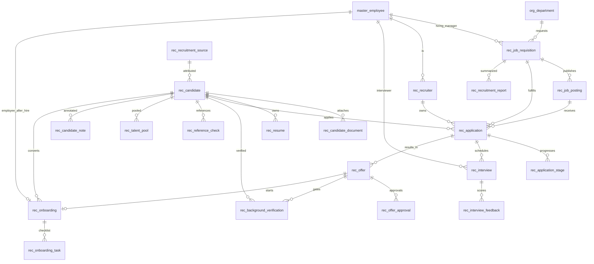

# ERD_13 — Recruitment & Talent Acquisition Domain

**Document:** Enterprise ERD — Recruitment & Talent Acquisition Domain  
**Version:** 1.0  
**Status:** Locked — Ready for Sprint 13 Implementation Planning  
**Schema:** `recruitment`  
**Table Prefix:** `rec_`  
**Aligned To:** BRD v1.0 · FRD-11 Recruitment & Talent Acquisition · SDD v1.1 · DBS v1.1 · Architecture Lock v1.1  
**Functional Sources:** FRD-09 §§4–8 (Recruitment · Candidate · Interview · Offer · Onboarding deferred from HR) · Sprint 13 product track  
**Classification:** Internal — Confidential  
**Prior Release:** [ERP Core v1.7-beta](../07_RELEASES/ERP_Core_v1.7-beta.md)  

> **FRD numbering note:** Repo `FRD-11` is currently Project Management; recruitment business intent lives in FRD-09 §§4–8 (deferred from ERD_11). This ERD follows the Sprint 13 product labeling (**FRD-11 Recruitment & Talent Acquisition**) as requested.

---

## 1. Module Overview

The Recruitment & Talent Acquisition Domain manages the **hire-to-onboard funnel**: job requisitions and postings, candidate intake, applications and stage progression, interviews and feedback, offers and approvals, background / reference checks, talent pools, and **pre-employee onboarding** — ending only when a candidate is converted to **`master_employee` (C-01)** through Master Data services, then handed to HR / Payroll via **integration ports** (never direct `hr_*` / `pay_*` writes).

Recruitment **depends on** Foundation, Organization, Master Data, HR (read + onboarding request orchestration), and Payroll (**read-only** where offer / salary-band mapping is required). It **must never duplicate** employee, department, designation, or company masters. Authoritative employee identity remains **`master_employee`**. Department remains **`org_department`**. Designation remains **`hr_designation`** (UUID / read reference only). Company / branch remain Organization masters.

**Candidate is not an employee.** Identity conversion occurs **only after hire acceptance** during onboarding completion via Master Data `EmployeeService` (or equivalent). Recruitment stores `employee_id` only **after** that creation succeeds.

Inventory, Manufacturing, Procurement, Sales, Quality, and Finance journaling remain **isolated** — no writes; CRM may be referenced only as optional campaign UUID (no `crm_*` FK).

**Business Tables: 20**  
**Schema: `recruitment`**

### Enterprise Recruitment Modules (FRD-11 · Sprint 13 focus)

| # | Module | Primary Tables | Primary Consumers |
|---|--------|----------------|-------------------|
| 1 | Requisition & Posting | `rec_job_requisition`, `rec_job_posting` | Hiring managers · recruiters |
| 2 | Candidate Master | `rec_candidate`, `rec_candidate_document`, `rec_resume` | Screening · ATS |
| 3 | Application Pipeline | `rec_application`, `rec_application_stage` | Stage board · SLA |
| 4 | Interview | `rec_interview`, `rec_interview_feedback` | Interviewers · feedback |
| 5 | Offer & Approvals | `rec_offer`, `rec_offer_approval` | Compensation · legal |
| 6 | Verification | `rec_background_verification`, `rec_reference_check` | Compliance |
| 7 | Recruiter & Sources | `rec_recruiter`, `rec_recruitment_source` | Attribution · capacity |
| 8 | Talent Pool & Notes | `rec_talent_pool`, `rec_candidate_note` | Future hire · collaboration |
| 9 | Onboarding Handoff | `rec_onboarding`, `rec_onboarding_task` | Master Data + HR request |
| 10 | Reporting Snapshot | `rec_recruitment_report` | BI · leadership |

**PostgreSQL Schema:** `recruitment` (Sprint 13 introduction)

### Architectural Position

```text
Foundation (ERD_01) ── Workflow, Audit, RBAC, Notification
Organization (ERD_02) ── Company, Branch, Department
Master Data (ERD_03) ── master_employee (C-01) — created only at hire completion
HR (ERD_11) ── hr_designation (read); employment/profile created via HR services only
Payroll (ERD_12) ── read-only salary-band / structure hints (optional UUID) — no pay_* writes
CRM (ERD_10) ── optional campaign UUID (no crm_* FK)
        ↓
Recruitment (ERD_13) ── Requisition → Candidate → Application → Interview → Offer → BGV → Onboard
        ↓
master_employee (create) → HR onboarding/employment request → Payroll salary setup (downstream)
```

---

## 2. Scope

### In Scope
- **Job requisitions** with openings, department, designation, hiring manager — FRD-09 §4
- **Job postings** published from approved requisitions (internal / external / agency)
- **Candidates** as pre-employee persons (not `master_employee`) — FRD-09 §5
- **Candidate documents** and **resume** storage metadata (URI / checksum; blob in DMS later)
- **Applications** linking candidate ↔ posting / requisition
- **Application stages** (pipeline history) — applied → screening → interview → offer → hired / rejected / hold
- **Interviews** and **interview feedback** — FRD-09 §6
- **Offers** and **offer approval** trail — FRD-09 §7
- **Background verification** and **reference checks**
- **Recruiter** directory (employee-backed) and **recruitment sources**
- **Talent pool** membership for passive / future candidates
- **Candidate notes** (collaboration trail)
- **Onboarding** header + **onboarding tasks**; completion creates employee via Master Data and requests HR employment — FRD-09 §8
- **Recruitment report** aggregate snapshots (funnel / time-to-hire / source ROI)
- Workflow, audit, RBAC, notifications, Celery stubs (planning)

### Out of Scope (Phase 2 / Separate)
- Full **DMS binary store** — Phase 1: URI / content hash on document / resume
- **Agency billing / placement fee GL** (Finance journals) — deferred
- Duplicate `rec_employee` / `rec_department` / `rec_designation` / `rec_company` — **forbidden (C-01)**
- Direct writes to `hr_*`, `pay_*`, `fin_*`, `inv_*`, `mfg_*`, `proc_*`, `crm_*`, `qm_*`, `sales_*`
- `master_customer` usage for candidates — **forbidden**
- SQLAlchemy models, Alembic migrations, application code (implementation sprint)
- Analytics cubes / `ana_fact_recruitment`

### Assumptions
- Candidate identity lives only in `rec_candidate` until onboarding completion creates **`master_employee`**
- `department_id` → `org_department` only; `designation_id` → UUID ref to `hr.hr_designation` (prefer **no FK write path**; optional peer FK read-only)
- Hiring manager / recruiter users are existing **`master_employee`** rows (employees recruiting)
- Soft delete + version on mutable recruitment tables
- Document numbers company-scoped
- Onboarding completion is the **only** path that may call Master Data employee creation and HR onboarding/employment integration services
- Payroll may be **read** for structure/band hints on offers; **never** write `pay_*`

### Dependencies

| Upstream | Tables / Services Used |
|----------|------------------------|
| ERD_01 Foundation | `sec_tenant`, `sec_user`, `wf_definition`, `wf_instance` |
| ERD_02 Organization | `org_company`, `org_branch`, `org_department` |
| ERD_03 Master Data | **`master_employee`** — FK for hiring manager / recruiter; **create only at hire via services** |
| ERD_11 HR | `hr_designation` read; **HRIntegrationService / onboarding request** — **no HR table writes from Recruitment repos** |
| ERD_12 Payroll | Optional read of salary structure/band metadata — **no `pay_*` writes** |
| ERD_10 CRM | Optional `crm_campaign_id` UUID — **no `crm_*` FK** |

---

## 3. Table Inventory

| # | Table | Classification | tenant_id | company_id | branch_id | Soft Delete | Version | Workflow |
|---|-------|----------------|-----------|------------|-----------|-------------|---------|----------|
| 1 | `rec_job_requisition` | Transaction Header | ✅ | ✅ | ✅ | ✅ | ✅ | ✅ |
| 2 | `rec_job_posting` | Transaction | ✅ | ✅ | optional | ✅ | ✅ | — |
| 3 | `rec_candidate` | Party Pre-Master | ✅ | ✅ | optional | ✅ | ✅ | — |
| 4 | `rec_candidate_document` | Document | ✅ | ✅ | optional | ✅ | ✅ | — |
| 5 | `rec_resume` | Document | ✅ | ✅ | optional | ✅ | ✅ | — |
| 6 | `rec_application` | Transaction | ✅ | ✅ | ✅ | ✅ | ✅ | — |
| 7 | `rec_application_stage` | Pipeline Detail | ✅ | ✅ | optional | ✅ | ✅ | — |
| 8 | `rec_interview` | Transaction | ✅ | ✅ | ✅ | ✅ | ✅ | — |
| 9 | `rec_interview_feedback` | Detail | ✅ | ✅ | optional | ✅ | ✅ | — |
| 10 | `rec_offer` | Transaction Header | ✅ | ✅ | ✅ | ✅ | ✅ | ✅ |
| 11 | `rec_offer_approval` | Approval Detail | ✅ | ✅ | optional | ✅ | ✅ | — |
| 12 | `rec_background_verification` | Transaction | ✅ | ✅ | ✅ | ✅ | ✅ | ✅ |
| 13 | `rec_reference_check` | Transaction | ✅ | ✅ | optional | ✅ | ✅ | — |
| 14 | `rec_recruiter` | Catalog / Staff | ✅ | ✅ | optional | ✅ | ✅ | — |
| 15 | `rec_recruitment_source` | Catalog Master | ✅ | ✅ | optional | ✅ | ✅ | — |
| 16 | `rec_talent_pool` | Membership | ✅ | ✅ | optional | ✅ | ✅ | — |
| 17 | `rec_candidate_note` | Collaboration | ✅ | ✅ | optional | ✅ | ✅ | — |
| 18 | `rec_onboarding` | Transaction Header | ✅ | ✅ | ✅ | ✅ | ✅ | ✅ |
| 19 | `rec_onboarding_task` | Checklist Detail | ✅ | ✅ | optional | ✅ | ✅ | — |
| 20 | `rec_recruitment_report` | Aggregate Snapshot | ✅ | ✅ | optional | ✅ | ✅ | — |

**Business Tables: 20**  
**Schema: `recruitment`**

---

## 4. Entity Relationships



```text
org_company / org_branch / org_department
    └── rec_job_requisition → rec_job_posting
            └── rec_application ← rec_candidate
                    ├── rec_application_stage (history)
                    ├── rec_interview → rec_interview_feedback
                    ├── rec_offer → rec_offer_approval
                    ├── rec_background_verification
                    ├── rec_reference_check
                    └── rec_onboarding → rec_onboarding_task
                            └── AFTER success: master_employee created (C-01)
                                └── HR service: employment / profile request (no hr_* ORM write)
                                └── Payroll handoff (downstream; no pay_* write here)

rec_candidate
    ├── rec_resume / rec_candidate_document
    ├── rec_talent_pool
    └── rec_candidate_note

rec_recruitment_source → rec_candidate / rec_application
rec_recruiter → master_employee (staff)
hr_designation (read UUID) → requisition / offer / onboarding position title
Optional: crm_campaign_id UUID on posting (no FK)
Optional: pay_salary_structure_id UUID on offer (no FK / no pay write)
```

---

## 5. Standard Column Profiles

### 5.1 Recruitment Catalog Profile (Source, Recruiter, Talent Pool membership keys)

| Column Group | Columns |
|--------------|---------|
| Primary Key | `id UUID` |
| Tenant / Company | `tenant_id`, `company_id` |
| Business Key | code fields |
| Status | `status VARCHAR(30)` |
| Audit + Soft Delete + Version | per DBS §28 |

### 5.2 Recruitment Transaction Header Profile (Requisition, Application, Interview, Offer, BGV, Onboarding)

| Column Group | Columns |
|--------------|---------|
| Primary Key | `id UUID` |
| Document | `document_number` where applicable |
| Status / Workflow | `status`, optional `workflow_status`, `workflow_instance_id` |
| Scope | `tenant_id`, `company_id`, `branch_id` |
| Org refs | `department_id` → `org_department`; `designation_id` UUID → `hr_designation` |
| People refs | candidate_id and/or employee_id (employee only post-hire / staff roles) |
| Audit + Soft Delete + Version | per DBS §28 |

### 5.3 Recruitment Detail / Document / Snapshot Profile (Stage, Feedback, Approval, Task, Report, Docs)

| Column Group | Columns |
|--------------|---------|
| Scope | tenant / company / branch (as applicable) |
| Parent FKs | application / interview / offer / onboarding / candidate |
| Payloads | JSONB for scores, checklist config, report metrics (Phase 1) |
| Soft delete + version | yes |

---

## 6. Detailed Table Definitions

### 6.1 `rec_job_requisition`

| Column | Type | Nullable | Description |
|--------|------|----------|-------------|
| `id` | UUID | NO | PK |
| `tenant_id` / `company_id` / `branch_id` | UUID | NO | Scope (branch mandatory) |
| `document_number` | VARCHAR(50) | NO | `REQ-YYYY-NNNNNN` — FRD-09 §4 |
| `requisition_title` | VARCHAR(255) | NO | Position title text |
| `department_id` | UUID | NO | FK → `org_department` |
| `designation_id` | UUID | YES | UUID → `hr.hr_designation` (read; prefer no write FK) |
| `employment_type` | VARCHAR(30) | NO | permanent, contract, intern, consultant |
| `openings_count` | SMALLINT | NO | Headcount requested |
| `filled_count` | SMALLINT | NO | Default 0 |
| `hiring_manager_employee_id` | UUID | NO | FK → `master_employee` |
| `recruiter_id` | UUID | YES | FK → `rec_recruiter` |
| `priority` | VARCHAR(20) | NO | low, medium, high, critical |
| `target_hire_date` | DATE | YES | — |
| `min_experience_years` / `max_experience_years` | NUMERIC(5,2) | YES | — |
| `salary_band_min` / `salary_band_max` | NUMERIC(18,4) | YES | Indicative |
| `currency_code` | VARCHAR(10) | YES | — |
| `job_description` | TEXT | YES | — |
| `justification` | TEXT | YES | Business case |
| `status` | VARCHAR(30) | NO | draft, submitted, approved, open, on_hold, filled, closed, cancelled, rejected |
| `workflow_*` | | | Job approval |
| AUDIT_STD + SOFT_DELETE_OPT + version | | | |

**UK:** `(company_id, document_number)` where not deleted.

---

### 6.2 `rec_job_posting`

| Column | Notes |
|--------|-------|
| `document_number` | `POST-YYYY-NNNNNN` |
| `job_requisition_id` | FK |
| `posting_title` | VARCHAR |
| `channel` | internal, career_site, job_board, agency, referral, campus, other |
| `recruitment_source_id` | FK optional default source |
| `publish_from` / `publish_to` | DATE/TIMESTAMPTZ |
| `external_url` | optional |
| `crm_campaign_id` | UUID **optional — no `crm_*` FK** |
| `status` | draft, published, paused, closed, cancelled |

---

### 6.3 `rec_candidate`

| Column | Notes |
|--------|-------|
| `candidate_code` | UK — `CAN-NNNNNN` — FRD-09 §5 |
| `first_name` / `last_name` / `full_name` | — |
| `email` / `mobile` | UK soft uniqueness per company (service) |
| `current_title` / `current_employer` | optional |
| `total_experience_years` | NUMERIC |
| `highest_education` | VARCHAR |
| `recruitment_source_id` | FK optional |
| `primary_recruiter_id` | FK → `rec_recruiter` optional |
| `employee_id` | FK → `master_employee` **NULL until hired** |
| `status` | prospect, applied, screening, interview, selected, offered, hired, rejected, on_hold, withdrawn, blacklisted |
| **Rule:** never treat candidate as employee until `employee_id` set via onboarding |

---

### 6.4 `rec_candidate_document`

| Column | Notes |
|--------|-------|
| `candidate_id` | FK |
| `document_type` | identity, education, experience, portfolio, other |
| `document_name` | — |
| `storage_uri` | URI / object key |
| `content_hash` | VARCHAR optional |
| `mime_type` / `file_size_bytes` | optional |
| `verified_flag` | BOOLEAN |
| `status` | uploaded, verified, rejected, archived |

---

### 6.5 `rec_resume`

| Column | Notes |
|--------|-------|
| `candidate_id` | FK |
| `version_no` | SMALLINT |
| `storage_uri` | — |
| `content_hash` | — |
| `parsed_skills_json` | JSONB Phase 1 skill tags |
| `is_primary` | BOOLEAN |
| `status` | active, superseded, archived |
| **UK:** `(candidate_id, version_no)` |

---

### 6.6 `rec_application`

| Column | Notes |
|--------|-------|
| `document_number` | `APP-YYYY-NNNNNN` |
| `candidate_id` | FK |
| `job_requisition_id` | FK |
| `job_posting_id` | FK optional |
| `recruitment_source_id` | FK optional (override attribution) |
| `recruiter_id` | FK optional owner |
| `applied_at` | TIMESTAMPTZ |
| `current_stage_code` | VARCHAR — denormalized current stage |
| `rejection_reason` | TEXT optional |
| `status` | applied, screening, interview, selected, offer, hired, rejected, on_hold, withdrawn |
| **Service UK:** one active non-terminal application per `(candidate_id, job_requisition_id)` |

---

### 6.7 `rec_application_stage`

| Column | Notes |
|--------|-------|
| `application_id` | FK |
| `stage_code` | applied, screening, interview, selected, offer, hired, rejected, on_hold |
| `stage_name` | display |
| `sequence_no` | SMALLINT |
| `entered_at` / `exited_at` | TIMESTAMPTZ |
| `changed_by_user_id` | UUID → `sec_user` |
| `notes` | TEXT optional |
| `status` | active, completed, skipped, cancelled |

---

### 6.8 `rec_interview`

| Column | Notes |
|--------|-------|
| `document_number` | `INTV-YYYY-NNNNNN` |
| `application_id` | FK |
| `candidate_id` | FK (denormalized) |
| `interview_type` | hr_round, technical, manager, final, other — FRD-09 §6 |
| `scheduled_at` | TIMESTAMPTZ |
| `duration_minutes` | SMALLINT |
| `location` / `meeting_url` | optional |
| `interviewer_employee_id` | FK → `master_employee` |
| `panel_json` | JSONB optional additional interviewers |
| `result` | pending, pass, fail, hold — FRD-09 §6 |
| `status` | scheduled, completed, cancelled, no_show |

---

### 6.9 `rec_interview_feedback`

| Column | Notes |
|--------|-------|
| `interview_id` | FK |
| `interviewer_employee_id` | FK → `master_employee` |
| `overall_score` | NUMERIC(5,2) |
| `recommendation` | strong_hire, hire, no_hire, hold |
| `competency_scores_json` | JSONB |
| `comments` | TEXT |
| `submitted_at` | TIMESTAMPTZ |
| `status` | draft, submitted, locked |
| **UK:** `(interview_id, interviewer_employee_id)` where not deleted |

---

### 6.10 `rec_offer`

| Column | Notes |
|--------|-------|
| `document_number` | `OFF-YYYY-NNNNNN` — FRD-09 §7 |
| `application_id` / `candidate_id` / `job_requisition_id` | FKs |
| `department_id` | FK → `org_department` |
| `designation_id` | UUID → `hr_designation` |
| `offered_ctc` / `offered_gross` | NUMERIC |
| `currency_code` | VARCHAR |
| `joining_date` | DATE |
| `offer_valid_until` | DATE |
| `employment_type` | permanent, contract, intern, consultant |
| `salary_structure_id` | UUID **optional read-hint → payroll.pay_salary_structure — no FK / no pay write** |
| `offer_letter_uri` | optional |
| `status` | draft, submitted, approved, sent, accepted, rejected, expired, withdrawn, cancelled |
| `workflow_*` | Offer approval |

---

### 6.11 `rec_offer_approval`

| Column | Notes |
|--------|-------|
| `offer_id` | FK |
| `approver_employee_id` | FK → `master_employee` |
| `approval_level` | SMALLINT |
| `decision` | pending, approved, rejected |
| `decided_at` | TIMESTAMPTZ |
| `comments` | TEXT |
| `status` | pending, completed, skipped, cancelled |
| **UK:** `(offer_id, approval_level)` |

---

### 6.12 `rec_background_verification`

| Column | Notes |
|--------|-------|
| `document_number` | `BGV-YYYY-NNNNNN` |
| `candidate_id` / `offer_id` / `application_id` | FKs (offer preferred gate) |
| `vendor_name` | optional agency |
| `verification_scope_json` | JSONB — identity, education, employment, criminal, address |
| `initiated_at` / `completed_at` | TIMESTAMPTZ |
| `result` | pending, clear, adverse, inconclusive |
| `report_uri` | optional |
| `status` | draft, submitted, in_progress, cleared, failed, waived, cancelled |
| `workflow_*` | Background approval |

---

### 6.13 `rec_reference_check`

| Column | Notes |
|--------|-------|
| `candidate_id` / `application_id` | FKs |
| `reference_name` / `reference_org` / `reference_email` / `reference_phone` | — |
| `relationship` | manager, peer, client, academic, other |
| `feedback_summary` | TEXT |
| `rating` | NUMERIC optional |
| `checked_at` | TIMESTAMPTZ |
| `checked_by_employee_id` | FK optional → `master_employee` |
| `status` | pending, contacted, completed, declined, cancelled |

---

### 6.14 `rec_recruiter`

| Column | Notes |
|--------|-------|
| `recruiter_code` | UK — `RCR-…` |
| `employee_id` | FK → `master_employee` **mandatory** — recruiter is an employee |
| `display_name` | — |
| `max_open_requisitions` | SMALLINT optional capacity |
| `status` | active, inactive |
| **UK:** `(company_id, employee_id)` one active recruiter profile |

---

### 6.15 `rec_recruitment_source`

| Column | Notes |
|--------|-------|
| `source_code` | UK — REFERRAL, LINKEDIN, NAUKRI, CAMPUS, AGENCY, CAREER_SITE, … |
| `source_name` | — |
| `source_type` | organic, paid, agency, referral, campus, internal |
| `is_active` | BOOLEAN (or status) |
| `status` | active, inactive |

---

### 6.16 `rec_talent_pool`

| Column | Notes |
|--------|-------|
| `pool_code` | UK — `POOL-…` (or membership under named pool) |
| `pool_name` | — |
| `candidate_id` | FK — membership row pattern: one row per candidate-in-pool |
| `skill_tags_json` | JSONB |
| `availability` | passive, active, do_not_contact |
| `added_at` | TIMESTAMPTZ |
| `status` | active, removed, hired_out |
| **UK:** `(company_id, pool_code, candidate_id)` for membership |

> Phase 1 models talent pool as **named pool + membership** on one table (pool attributes denormalized per membership or `pool_code` shared). No separate `rec_talent_pool_member` to stay at 20 tables.

---

### 6.17 `rec_candidate_note`

| Column | Notes |
|--------|-------|
| `candidate_id` | FK |
| `application_id` | FK optional context |
| `author_user_id` | UUID → `sec_user` |
| `note_type` | general, screening, risk, compensation, other |
| `note_text` | TEXT |
| `is_private` | BOOLEAN — visible to recruiter roles only when true |
| `status` | active, archived |

---

### 6.18 `rec_onboarding`

| Column | Notes |
|--------|-------|
| `document_number` | `ONB-YYYY-NNNNNN` |
| `offer_id` / `candidate_id` / `application_id` | FKs |
| `job_requisition_id` | FK |
| `department_id` | FK → `org_department` |
| `designation_id` | UUID → `hr_designation` |
| `planned_joining_date` / `actual_joining_date` | DATE |
| `employee_id` | FK → `master_employee` **NULL until conversion** |
| `hr_employment_request_id` | UUID — opaque response from HR integration (**no `hr_*` FK**) |
| `payroll_handoff_status` | not_required, pending, completed, failed — **metadata only; no pay write** |
| `status` | draft, submitted, in_progress, completed, cancelled, failed |
| `workflow_*` | Onboarding approval |
| **Hard rule on complete:** (1) Master Data create `master_employee`; (2) set `employee_id`; (3) call HR service to create employment/profile/onboarding request; (4) optionally notify Payroll setup queue — **never ORM-write `hr_*` / `pay_*`** |

---

### 6.19 `rec_onboarding_task`

| Column | Notes |
|--------|-------|
| `onboarding_id` | FK |
| `task_code` | DOC_VERIFY, ASSET, ACCOUNT, TRAINING, MANAGER_ASSIGN, … — FRD-09 §8 |
| `task_name` | — |
| `sequence_no` | SMALLINT |
| `is_mandatory` | BOOLEAN |
| `due_date` | DATE optional |
| `completed_at` | TIMESTAMPTZ |
| `assignee_employee_id` | FK optional → `master_employee` |
| `completion_notes` | TEXT |
| `status` | pending, in_progress, completed, waived, blocked, cancelled |
| **UK:** `(onboarding_id, task_code)` |

---

### 6.20 `rec_recruitment_report`

| Column | Notes |
|--------|-------|
| `report_code` | UK — period + type key |
| `report_type` | funnel, time_to_hire, source_roi, recruiter_productivity |
| `period_start` / `period_end` | DATE |
| `department_id` | FK optional → `org_department` |
| `job_requisition_id` | FK optional |
| `metrics_json` | JSONB — applications, interviews, offers, hires, avg_days, etc. |
| `generated_at` | TIMESTAMPTZ |
| `status` | draft, finalized |
| **UK:** `(company_id, report_code)` |

---

## 7. Primary Keys

| Table | Constraint Name | Column |
|-------|-----------------|--------|
| `rec_job_requisition` | `pk_rec_job_requisition` | `id` |
| `rec_job_posting` | `pk_rec_job_posting` | `id` |
| `rec_candidate` | `pk_rec_candidate` | `id` |
| `rec_candidate_document` | `pk_rec_candidate_document` | `id` |
| `rec_resume` | `pk_rec_resume` | `id` |
| `rec_application` | `pk_rec_application` | `id` |
| `rec_application_stage` | `pk_rec_application_stage` | `id` |
| `rec_interview` | `pk_rec_interview` | `id` |
| `rec_interview_feedback` | `pk_rec_interview_feedback` | `id` |
| `rec_offer` | `pk_rec_offer` | `id` |
| `rec_offer_approval` | `pk_rec_offer_approval` | `id` |
| `rec_background_verification` | `pk_rec_background_verif` | `id` |
| `rec_reference_check` | `pk_rec_reference_check` | `id` |
| `rec_recruiter` | `pk_rec_recruiter` | `id` |
| `rec_recruitment_source` | `pk_rec_recruitment_source` | `id` |
| `rec_talent_pool` | `pk_rec_talent_pool` | `id` |
| `rec_candidate_note` | `pk_rec_candidate_note` | `id` |
| `rec_onboarding` | `pk_rec_onboarding` | `id` |
| `rec_onboarding_task` | `pk_rec_onboarding_task` | `id` |
| `rec_recruitment_report` | `pk_rec_recruitment_report` | `id` |

---

## 8. Foreign Keys

| Child | Column | Parent |
|-------|--------|--------|
| Requisition / application / offer / onboarding | `department_id` | `organization.org_department` |
| Hiring manager / interviewer / recruiter.employee / onboarding.employee | `*_employee_id` / `employee_id` | `master.master_employee` |
| Posting / application / offer / interview / onboarding | `job_requisition_id` | `recruitment.rec_job_requisition` |
| Application | `job_posting_id` | `recruitment.rec_job_posting` |
| Most candidate-scoped tables | `candidate_id` | `recruitment.rec_candidate` |
| Stages / interviews / offers | `application_id` | `recruitment.rec_application` |
| Feedback | `interview_id` | `recruitment.rec_interview` |
| Offer approvals / BGV | `offer_id` | `recruitment.rec_offer` |
| Onboarding tasks | `onboarding_id` | `recruitment.rec_onboarding` |
| Source attribution | `recruitment_source_id` | `recruitment.rec_recruitment_source` |
| Recruiter ownership | `recruiter_id` | `recruitment.rec_recruiter` |
| Workflow | `workflow_instance_id` | `foundation.wf_instance` |
| Org scope | `tenant_id`, `company_id`, `branch_id` | foundation / organization |

**No FK to:** `inv_*`, `mfg_*`, `proc_*`, `crm_*`, `qm_*`, `sales_*`, `pay_*`, `fin_*`.  
**HR:** `designation_id` and `hr_employment_request_id` stored as **UUID refs** — prefer **no FK** to `hr_*` (integration integrity via HR services). Optional read-only FK to `hr.hr_designation` allowed if implementation locks peer-schema FK policy.  
**Payroll:** `salary_structure_id` on offer is **UUID only** — no `pay_*` FK.  
**CRM:** `crm_campaign_id` UUID only — no `crm_*` FK.  
**No Recruitment duplicates of:** `master_employee`, `org_department`, `org_company`, `hr_designation`.

---

## 9. Indexes & Constraints

### Unique
- Requisition / posting / application / interview / offer / BGV / onboarding: `(company_id, document_number)`
- Candidate: `(company_id, candidate_code)`; soft UK email/mobile via service
- Source / recruiter / report / pool membership codes as defined in §6
- Resume `(candidate_id, version_no)`; feedback `(interview_id, interviewer_employee_id)`; offer approval `(offer_id, approval_level)`; onboarding task `(onboarding_id, task_code)`

### Check
- `openings_count > 0`; `filled_count >= 0`; `filled_count <= openings_count` (service may relax during cancel)
- `offer_valid_until >= joining_date` optional soft rule
- Status enums per §11
- `employee_id` on candidate/onboarding only set when status ∈ {hired, completed}

### Indexes
- All FKs
- `(tenant_id, company_id, status)` on requisition / application / offer / onboarding
- `(candidate_id, status)` on application
- `(job_requisition_id, status)` on application / posting
- `(scheduled_at)` on interview
- `(joining_date)` on offer / onboarding

---

## 10. Document Numbering

| Document | Format | UK Scope |
|----------|--------|----------|
| Job Requisition | `REQ-YYYY-NNNNNN` | company |
| Job Posting | `POST-YYYY-NNNNNN` | company |
| Candidate | `CAN-NNNNNN` | company |
| Application | `APP-YYYY-NNNNNN` | company |
| Interview | `INTV-YYYY-NNNNNN` | company |
| Offer | `OFF-YYYY-NNNNNN` | company |
| Background Verification | `BGV-YYYY-NNNNNN` | company |
| Onboarding | `ONB-YYYY-NNNNNN` | company |
| Recruiter / Source / Pool / Report codes | Stable codes | company |

---

## 11. Status Lifecycles

| Entity | Statuses |
|--------|----------|
| Job Requisition | draft → submitted → approved → open → filled / closed \| on_hold \| rejected \| cancelled |
| Job Posting | draft → published ↔ paused → closed \| cancelled |
| Candidate | prospect → applied → screening → interview → selected → offered → hired \| rejected \| on_hold \| withdrawn \| blacklisted |
| Application | applied → screening → interview → selected → offer → hired \| rejected \| on_hold \| withdrawn |
| Application Stage | active → completed \| skipped \| cancelled |
| Interview | scheduled → completed \| cancelled \| no_show |
| Interview Feedback | draft → submitted → locked |
| Offer | draft → submitted → approved → sent → accepted \| rejected \| expired \| withdrawn \| cancelled |
| Offer Approval | pending → completed \| skipped \| cancelled |
| Background Verification | draft → submitted → in_progress → cleared \| failed \| waived \| cancelled |
| Reference Check | pending → contacted → completed \| declined \| cancelled |
| Recruiter / Source | active ↔ inactive |
| Talent Pool membership | active → removed \| hired_out |
| Candidate Note | active → archived |
| Onboarding | draft → submitted → in_progress → completed \| failed \| cancelled |
| Onboarding Task | pending → in_progress → completed \| waived \| blocked \| cancelled |
| Recruitment Report | draft → finalized |

---

## 12. Approval Workflow Integration

| Workflow Code | Document | Path |
|---------------|----------|------|
| `REC_JOB_APPROVAL` | Job Requisition | Hiring Manager → Recruitment Manager → (optional) HR Onboarding Admin |
| `REC_OFFER_APPROVAL` | Offer | Recruiter → Hiring Manager → Recruitment Manager |
| `REC_BACKGROUND_APPROVAL` | Background Verification | Recruiter → Recruitment Manager → HR Onboarding |
| `REC_ONBOARDING_APPROVAL` | Onboarding | HR Onboarding → Hiring Manager → Recruitment Manager |

Seed workflows only; instance rows use Foundation `wf_instance`.

---

## 13. Audit Strategy

| Layer | Mechanism |
|-------|-----------|
| Row audit | Standard columns on all mutable `rec_*` tables |
| Business audit | `AuditService` on requisition approve, offer approve/send/accept, BGV clear/fail, onboarding complete (employee create), candidate hire conversion |
| Notifications | Requisition approved, interview scheduled, offer sent/accepted, BGV result, onboarding completed / failed — Foundation notification service |

---

## 14. Tenant / Company / Branch Isolation

| Rule | Application |
|------|-------------|
| `tenant_id` | All tables |
| `company_id` | Numbering / hiring legal entity boundary |
| `branch_id` | Mandatory on requisition, application, interview, offer, BGV, onboarding |
| Repository | `RecScopedRepository` pattern |
| RBAC | `recruitment.*` permissions |

### Planned RBAC (Sprint 13)

| Resource | Permissions |
|----------|-------------|
| `recruitment.requisition` | read, create, update, submit, approve |
| `recruitment.posting` | read, create, publish, close |
| `recruitment.candidate` | read, create, update |
| `recruitment.application` | read, create, update, advance, reject |
| `recruitment.interview` | read, create, schedule, complete |
| `recruitment.offer` | read, create, submit, approve, send |
| `recruitment.verification` | read, create, submit, approve |
| `recruitment.onboarding` | read, create, submit, approve, complete |
| `recruitment.talent_pool` | read, create, update |
| `recruitment.report` | read, export |

**Roles** (`status='active'`):

| Role | Intent |
|------|--------|
| `RECRUITER` | Own pipeline: candidates, applications, interviews, draft offers |
| `RECRUITMENT_MANAGER` | Approve requisitions / offers / BGV; capacity & source governance |
| `HR_ONBOARDING` | Onboarding checklist, employee conversion orchestration, HR handoff |
| `HIRING_MANAGER` | Raise / approve requisitions; interview; accept hire decisions |

---

## 15. Migration Order

Prior Alembic head: **`0200_seed_payroll_workflows`**.

Revision budget **`0201`–`0222` (22 revisions)**. Schema + 20 tables + permissions + workflows = 23 logical steps → **`rec_candidate_document` and `rec_resume` share one migration**.

| Order | Revision ID (≤32 chars) | Migration | Tables / Actions |
|-------|-------------------------|-----------|------------------|
| 201 | `0201_create_recruitment_schema` | Create schema | `recruitment` |
| 202 | `0202_rec_job_requisition` | Requisition | `rec_job_requisition` |
| 203 | `0203_rec_job_posting` | Posting | `rec_job_posting` |
| 204 | `0204_rec_recruitment_source` | Source catalog | `rec_recruitment_source` |
| 205 | `0205_rec_recruiter` | Recruiter | `rec_recruiter` |
| 206 | `0206_rec_candidate` | Candidate | `rec_candidate` |
| 207 | `0207_rec_cand_doc_resume` | Documents | `rec_candidate_document`, `rec_resume` |
| 208 | `0208_rec_application` | Application | `rec_application` |
| 209 | `0209_rec_application_stage` | Stages | `rec_application_stage` |
| 210 | `0210_rec_interview` | Interview | `rec_interview` |
| 211 | `0211_rec_interview_feedback` | Feedback | `rec_interview_feedback` |
| 212 | `0212_rec_offer` | Offer | `rec_offer` |
| 213 | `0213_rec_offer_approval` | Offer approval | `rec_offer_approval` |
| 214 | `0214_rec_background_verif` | BGV | `rec_background_verification` |
| 215 | `0215_rec_reference_check` | References | `rec_reference_check` |
| 216 | `0216_rec_talent_pool` | Talent pool | `rec_talent_pool` |
| 217 | `0217_rec_candidate_note` | Notes | `rec_candidate_note` |
| 218 | `0218_rec_onboarding` | Onboarding | `rec_onboarding` |
| 219 | `0219_rec_onboarding_task` | Tasks | `rec_onboarding_task` |
| 220 | `0220_rec_recruitment_report` | Report | `rec_recruitment_report` |
| 221 | `0221_seed_rec_permissions` | RBAC | Permissions / roles |
| 222 | `0222_seed_recruitment_workflows` | Workflows | Job / Offer / BGV / Onboarding |

**Dependency order:** schema → requisition → posting → source/recruiter → candidate → docs/resume → application → stage → interview → feedback → offer → offer approval → BGV → reference → talent pool → notes → onboarding → tasks → report → seeds.

**Planned head after Sprint 13:** `0222_seed_recruitment_workflows`

---

## 16. Cross Module Dependencies

### 16.1 Upstream (Recruitment Consumes)

| Module | Provides | Pattern |
|--------|----------|---------|
| Foundation | tenant, user, workflow, audit, RBAC, notification | Direct FK / services |
| Organization | company, branch, **department** | Direct FK |
| Master Data | **`master_employee`** for staff roles; **create employee only at onboarding complete** | FK + **EmployeeService adapter** |
| HR | **`hr_designation` read**; employment / profile **via HR integration service only** | UUID / service — **no `hr_*` ORM writes** |
| Payroll | Optional salary structure/band **read hints** | UUID only — **no `pay_*` writes** |
| CRM | Optional campaign attribution | UUID only — **no `crm_*` FK** |

### 16.2 Downstream

| Module | Pattern |
|--------|---------|
| HR | Receives onboarding/employment **request** after employee create |
| Payroll | Receives **handoff signal** after employee exists (downstream salary assignment) — Recruitment does not write payroll |
| BI | Read-only funnel / time-to-hire / source metrics |

### 16.3 Hard Rules

| Rule | Enforcement |
|------|-------------|
| C-01 | Employee identity only via `master_employee`; candidate ≠ employee until hire |
| No department / company / designation duplicate | `org_department` · `org_company` · `hr_designation` only |
| No `master_customer` for candidates | Forbidden |
| Candidate → employee only through onboarding completion | Service orchestrator |
| No direct HR / Payroll writes | Adapters / integration services only |
| Isolated peers | No writes/FKs to Inventory, Procurement, Manufacturing, CRM (FK), Quality, Finance journals |

---

## 17. Phase Gate Checklist

| # | Gate Criterion | Status |
|---|----------------|--------|
| 1 | Business tables = **20**; schema = **`recruitment`** | ✅ |
| 2 | Prefix `rec_` defined | ✅ |
| 3 | Aligned to Recruitment FRD intent (requisition → hire → onboard) | ✅ |
| 4 | No duplicate employee / department / designation / company masters | ✅ |
| 5 | Candidate becomes employee only after hiring/onboarding | ✅ |
| 6 | Never write HR or Payroll tables directly | ✅ |
| 7 | Migration order `0201`–`0222`, revision IDs ≤ 32 chars | ✅ |
| 8 | Workflows + RBAC + audit documented | ✅ |
| 9 | CRM UUID-only; no `crm_*` FK | ✅ |
| 10 | Architecture Lock v1.1 preserved; no prior module redesign | ✅ |

### ERD Phase Gate — Recruitment Summary

| Metric | Value |
|--------|-------|
| Business Tables | **20** |
| Schema | **`recruitment`** |
| Prefix | `rec_` |
| Migration range | `0201` – `0222` |
| Prior head | `0200_seed_payroll_workflows` |
| Planned head | `0222_seed_recruitment_workflows` |
| Document Status | **Locked — Ready for Sprint 13 Implementation Planning** |

---

## 18. Document Control

| Version | Date | Change |
|---------|------|--------|
| 1.0 | 2026-07-14 | Initial ERD_13 Recruitment & Talent Acquisition; architecture review editorial lock (status locked for Sprint 13 implementation planning) |

---

**ERD_13 Recruitment & Talent Acquisition is locked and ready for Sprint 13 implementation planning.**
