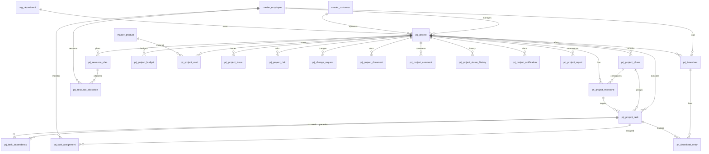

# ERD_14 — Project Management Domain

**Document:** Enterprise ERD — Project Management Domain  
**Version:** 1.0  
**Status:** Locked — Ready for Sprint 14 Implementation Planning  
**Schema:** `project`  
**Table Prefix:** `prj_`  
**Aligned To:** BRD v1.0 · FRD-11 Project Management · SDD v1.1 · DBS v1.1 · Architecture Lock v1.1  
**Functional Requirements:** [FRD-11 Project Management Domain](../02_FRD/FRD-11-Project-Management-Domain.md)  
**Classification:** Internal — Confidential  
**Prior Release:** [ERP Core v1.8-beta](../07_RELEASES/ERP_Core_v1.8-beta.md)  

---

## 1. Module Overview

The Project Management Domain manages the **project lifecycle from initiation through closure**: project master, WBS (phases · milestones · tasks), dependencies and assignments, resource planning and allocation, timesheets, budgets and actual costs, issues and risks, change requests, collaboration (documents / comments), status history, in-module notifications, and reporting snapshots — for multi-company ERP delivery, customer, and internal initiatives.

Project Management **depends on** Foundation, Organization, Master Data, and Finance (posting adapter). It **consumes existing masters only (C-01)** — **`master_employee`**, **`master_customer`**, **`master_product`**, and **`org_department`**. It **must never duplicate** employee, customer, product, department, or company masters.

**Finance remains the only accounting system.** Project never ORM-writes `fin_*` tables. Budget linkage and cost journals use **`finance_budget_id` / `finance_journal_id` UUIDs**; GL posting occurs **only** through `PostingService.post_system_journal()`.

HR, Payroll, CRM, Procurement, Inventory, Manufacturing, Quality, and Recruitment remain **isolated** except authorized UUID read-refs / service reads — **no FKs** to `crm_*` / `proc_*` / `inv_*` / `mfg_*` / `qm_*` / `pay_*` / `rec_*`, and **no `hr_*` / `pay_*` / `rec_*` writes**.

**Business Tables: 20**  
**Schema: `project`**

### Enterprise Project Modules (FRD-11 · Sprint 14 focus)

| # | Module | Primary Tables | Primary Consumers |
|---|--------|----------------|-------------------|
| 1 | Project Master | `prj_project` | PMO · sponsors |
| 2 | WBS Structure | `prj_project_phase`, `prj_project_milestone`, `prj_project_task` | Planners · delivery |
| 3 | Task Graph | `prj_task_dependency`, `prj_task_assignment` | Schedulers · members |
| 4 | Time Capture | `prj_timesheet`, `prj_timesheet_entry` | Members · managers |
| 5 | Resources | `prj_resource_plan`, `prj_resource_allocation` | Resource managers |
| 6 | Financial Control | `prj_project_budget`, `prj_project_cost` | PM · Finance |
| 7 | Issues & Risks | `prj_project_issue`, `prj_project_risk` | PM · risk owners |
| 8 | Governance | `prj_change_request` | Change board |
| 9 | Collaboration | `prj_project_document`, `prj_project_comment`, `prj_project_status_history`, `prj_project_notification` | Team · audit |
| 10 | Reporting | `prj_project_report` | Leadership · BI |

**PostgreSQL Schema:** `project` (Sprint 14 introduction)

### Architectural Position

```text
Foundation (ERD_01) ── Workflow, Audit, RBAC, Notification
Organization (ERD_02) ── Company, Branch, Department
Master Data (ERD_03) ── master_employee · master_customer · master_product (C-01)
Finance (ERD_04) ── PostingService only (no direct fin_* writes)
HR / Payroll ── employee refs; labor cost read-only (no hr_*/pay_* writes)
CRM / Proc / Inv / MFG / QM ── optional UUID refs only (no FK / no writes)
Recruitment ── no integration writes
        ↓
Project (ERD_14) ── Project · WBS · Tasks · Time · Resources · Budget/Cost · Risk · Change · Reports
        ↓
Billing / profitability (Phase 1.5+ via Sales/Finance services) · BI
```

### API Mount (planned)

**`/api/v1/projects`** — routers for all aggregates (projects, phases, milestones, tasks, task-dependencies, task-assignments, timesheets, timesheet-entries, resource-plans, resource-allocations, project-budgets, project-costs, project-issues, project-risks, change-requests, project-documents, project-comments, project-status-history, project-notifications, reports).

---

## 2. Scope

### In Scope
- **Projects** with type, manager, customer, dates, budget headline — FRD-11 §4
- **Phases · milestones · tasks** WBS hierarchy — FRD-11 §5–§7
- **Task dependencies** and **task assignments** (employee-backed)
- **Timesheets** + **timesheet entries** (daily hours ≤ 24 — service rule) — FRD-11 §9
- **Resource plan** and **resource allocation** (allocation ≤ 100% — service rule) — FRD-11 §8
- **Project budget** lines (labor / materials / travel / software / hardware / other) — FRD-11 §10
- **Project cost** actuals with optional Finance journal ref after PostingService — FRD-11 §11
- **Issues**, **risks**, **change requests** — FRD-11 §14 + governance
- **Documents**, **comments**, **status history**, **project notifications**
- **Project report** aggregate snapshots (health / budget variance / profitability KPIs) — FRD-11 §13
- Workflow, audit, RBAC, notifications, Celery stubs (planning)

### Out of Scope (Phase 2 / Separate)
- Full **project billing / invoice registry** tables (`prj_project_billing`) — Phase 1: billing metadata / Sales invoice UUID on project or milestone
- Duplicate `prj_employee` / `prj_customer` / `prj_department` / `prj_product` — **forbidden (C-01)**
- Direct writes to `fin_*`, `hr_*`, `pay_*`, `crm_*`, `proc_*`, `inv_*`, `mfg_*`, `qm_*`, `rec_*`, `sales_*`
- SQLAlchemy models, Alembic migrations, application code (implementation sprint)
- Analytics cubes / `ana_fact_project`

### Assumptions / Business Rules
- Project identity lives in `prj_project`; people identity only via **`master_employee`**
- Customer linkage via **`master_customer`** FK (optional for internal projects); CRM opportunity/customer UUIDs optional **without CRM FK**
- Product/material references via **`master_product`** where needed (cost / document context)
- Department via **`org_department`** only
- Soft delete + version on mutable project tables
- Document numbers company-scoped
- One active **project manager** employee per project (service-enforced)
- Cost posting: create `prj_project_cost` intent → Finance `PostingService.post_system_journal()` → store `finance_journal_id`
- Budget registration may store `finance_budget_id` UUID after Finance budget service (no `fin_*` ORM from Project repos)

### Dependencies

| Upstream | Tables / Services Used |
|----------|------------------------|
| ERD_01 Foundation | `sec_tenant`, `sec_user`, `wf_definition`, `wf_instance` |
| ERD_02 Organization | `org_company`, `org_branch`, `org_department` |
| ERD_03 Master Data | **`master_employee`**, **`master_customer`**, **`master_product`** |
| ERD_04 Finance | **`PostingService.post_system_journal()`**; `finance_budget_id` / `finance_journal_id` UUID storage |
| ERD_12 Payroll | Optional **read-only** labor rate / cost hints — **no `pay_*` writes** |
| ERD_11 HR | Employee refs only — **no `hr_*` writes** |
| ERD_10 CRM | Optional `crm_opportunity_id` / `crm_customer_id` UUID — **no FK** |
| ERD_06 Procurement | Optional PR / PO UUID — **no FK** |
| ERD_07 Inventory | Optional material issue / receipt UUID — **no FK** |
| ERD_08 Manufacturing | Optional production order UUID — **no FK** |
| ERD_09 Quality | Optional inspection UUID — **no FK** |

---

## 3. Table Inventory

| # | Table | Classification | tenant_id | company_id | branch_id | Soft Delete | Version | Workflow |
|---|-------|----------------|-----------|------------|-----------|-------------|---------|----------|
| 1 | `prj_project` | Transaction Header | ✅ | ✅ | ✅ | ✅ | ✅ | ✅ |
| 2 | `prj_project_phase` | WBS | ✅ | ✅ | optional | ✅ | ✅ | — |
| 3 | `prj_project_milestone` | WBS | ✅ | ✅ | optional | ✅ | ✅ | — |
| 4 | `prj_project_task` | WBS / Work | ✅ | ✅ | ✅ | ✅ | ✅ | ✅ |
| 5 | `prj_task_dependency` | Graph Detail | ✅ | ✅ | — | ✅ | ✅ | — |
| 6 | `prj_task_assignment` | Assignment | ✅ | ✅ | optional | ✅ | ✅ | — |
| 7 | `prj_timesheet` | Transaction Header | ✅ | ✅ | ✅ | ✅ | ✅ | ✅ |
| 8 | `prj_timesheet_entry` | Detail | ✅ | ✅ | ✅ | ✅ | ✅ | — |
| 9 | `prj_resource_plan` | Plan Header | ✅ | ✅ | optional | ✅ | ✅ | — |
| 10 | `prj_resource_allocation` | Allocation | ✅ | ✅ | optional | ✅ | ✅ | — |
| 11 | `prj_project_budget` | Financial | ✅ | ✅ | optional | ✅ | ✅ | ✅ |
| 12 | `prj_project_cost` | Financial | ✅ | ✅ | ✅ | ✅ | ✅ | — |
| 13 | `prj_project_issue` | Issue | ✅ | ✅ | optional | ✅ | ✅ | — |
| 14 | `prj_project_risk` | Risk | ✅ | ✅ | optional | ✅ | ✅ | — |
| 15 | `prj_change_request` | Governance | ✅ | ✅ | ✅ | ✅ | ✅ | ✅ |
| 16 | `prj_project_document` | Document | ✅ | ✅ | optional | ✅ | ✅ | — |
| 17 | `prj_project_comment` | Collaboration | ✅ | ✅ | optional | ✅ | ✅ | — |
| 18 | `prj_project_status_history` | Audit Trail | ✅ | ✅ | optional | ✅ | ✅ | — |
| 19 | `prj_project_notification` | Notification | ✅ | ✅ | optional | ✅ | ✅ | — |
| 20 | `prj_project_report` | Aggregate Snapshot | ✅ | ✅ | optional | ✅ | ✅ | — |

**Business Tables: 20**  
**Schema: `project`**

---

## 4. Entity Relationships



```text
org_company / org_branch / org_department
master_employee / master_customer / master_product
    └── prj_project
            ├── prj_project_phase
            │       └── prj_project_milestone
            ├── prj_project_task
            │       ├── prj_task_dependency (from_task → to_task)
            │       ├── prj_task_assignment → master_employee
            │       └── prj_timesheet_entry ← prj_timesheet → master_employee
            ├── prj_resource_plan → prj_resource_allocation → master_employee
            ├── prj_project_budget (finance_budget_id UUID)
            ├── prj_project_cost (finance_journal_id UUID after PostingService)
            ├── prj_project_issue / prj_project_risk
            ├── prj_change_request
            ├── prj_project_document / prj_project_comment
            ├── prj_project_status_history / prj_project_notification
            └── prj_project_report

Optional UUID-only (no FK): crm_opportunity_id, crm_customer_id,
  purchase_request_id, purchase_order_id, material_issue_id, material_receipt_id,
  production_order_id, quality_inspection_id
```

---

## 5. Standard Column Profiles

### 5.1 Project Catalog / Structure Profile (Phase, Milestone, Resource Plan, Risk/Issue registries)

| Column Group | Columns |
|--------------|---------|
| Primary Key | `id UUID` |
| Tenant / Company | `tenant_id`, `company_id` |
| Parent | `project_id` FK |
| Status | `status VARCHAR(30)` |
| Audit + Soft Delete + Version | per DBS §28 |

### 5.2 Project Transaction Header Profile (Project, Task, Timesheet, Budget, Change Request, Cost)

| Column Group | Columns |
|--------------|---------|
| Primary Key | `id UUID` |
| Document | `document_number` / `project_code` where applicable |
| Status / Workflow | `status`, optional `workflow_status`, `workflow_instance_id` |
| Scope | `tenant_id`, `company_id`, `branch_id` |
| People / Org | `*_employee_id` → `master_employee`; `department_id` → `org_department` |
| Audit + Soft Delete + Version | per DBS §28 |

### 5.3 Project Detail / Snapshot Profile (Dependency, Assignment, Entry, Allocation, Comment, History, Notification, Report)

| Column Group | Columns |
|--------------|---------|
| Scope | tenant / company / branch (as applicable) |
| Parent FKs | project / task / timesheet / plan |
| Amounts / hours | `NUMERIC` with checks in service |
| Soft delete + version | yes |

---

## 6. Detailed Table Definitions

### 6.1 `prj_project`

| Column | Type | Nullable | Description |
|--------|------|----------|-------------|
| `id` | UUID | NO | PK |
| `tenant_id` / `company_id` / `branch_id` | UUID | NO | Scope |
| `project_code` | VARCHAR(50) | NO | UK — `PRJ-YYYY-NNNNNN` — FRD-11 §4 |
| `project_name` | VARCHAR(255) | NO | — |
| `project_type` | VARCHAR(40) | NO | internal, customer, rnd, implementation, support |
| `customer_id` | UUID | YES | FK → `master_customer` (optional for internal) |
| `department_id` | UUID | YES | FK → `org_department` |
| `project_manager_employee_id` | UUID | NO | FK → `master_employee` |
| `sponsor_employee_id` | UUID | YES | FK → `master_employee` |
| `planned_start_date` / `planned_end_date` | DATE | NO | — |
| `actual_start_date` / `actual_end_date` | DATE | YES | — |
| `budget_amount` | NUMERIC(18,4) | YES | Headline budget |
| `currency_code` | VARCHAR(10) | NO | — |
| `billing_type` | VARCHAR(30) | YES | fixed_price, time_material, milestone, retainer — FRD-11 §12 |
| `crm_opportunity_id` / `crm_customer_id` | UUID | YES | **UUID only — no CRM FK** |
| `health_status` | VARCHAR(20) | YES | green, amber, red |
| `description` | TEXT | YES | — |
| `status` | VARCHAR(30) | NO | draft, submitted, approved, in_progress, on_hold, completed, cancelled, closed |
| `workflow_*` | | | Project approval / closure |
| AUDIT_STD + SOFT_DELETE_OPT + version | | | |

**UK:** `(company_id, project_code)` where not deleted.

---

### 6.2 `prj_project_phase`

| Column | Notes |
|--------|-------|
| `project_id` | FK |
| `phase_code` | UK within project — `PH-01` |
| `phase_name` | — |
| `sequence_no` | SMALLINT |
| `planned_start_date` / `planned_end_date` | DATE |
| `status` | planned, active, completed, cancelled |
| **UK:** `(project_id, phase_code)` |

---

### 6.3 `prj_project_milestone`

| Column | Notes |
|--------|-------|
| `project_id` / `phase_id` | FKs (`phase_id` optional) |
| `milestone_code` | UK within project |
| `milestone_name` | — |
| `owner_employee_id` | FK → `master_employee` optional |
| `due_date` | DATE |
| `achieved_at` | TIMESTAMPTZ optional |
| `status` | planned, achieved, delayed, cancelled — FRD-11 §7 |

---

### 6.4 `prj_project_task`

| Column | Notes |
|--------|-------|
| `document_number` | `TASK-YYYY-NNNNNN` optional |
| `project_id` / `phase_id` / `milestone_id` | FKs (phase/milestone optional) |
| `parent_task_id` | UUID self-FK optional (sub-task) |
| `task_name` | — |
| `priority` | low, medium, high, critical — FRD-11 §6 |
| `planned_start_date` / `due_date` | DATE |
| `estimated_hours` / `actual_hours` | NUMERIC |
| `percent_complete` | NUMERIC(5,2) |
| `status` | open, in_progress, blocked, completed, cancelled + workflow submitted/approved for gated tasks |
| `workflow_*` | Task approval (when gated) |

---

### 6.5 `prj_task_dependency`

| Column | Notes |
|--------|-------|
| `project_id` | FK (denormalized) |
| `from_task_id` / `to_task_id` | FK → `prj_project_task` |
| `dependency_type` | finish_to_start, start_to_start, finish_to_finish, start_to_finish |
| `lag_days` | SMALLINT default 0 |
| `status` | active, inactive |
| **UK:** `(from_task_id, to_task_id, dependency_type)` |
| **Rule:** no self-dependency; cycle detection in service |

---

### 6.6 `prj_task_assignment`

| Column | Notes |
|--------|-------|
| `task_id` / `project_id` | FKs |
| `employee_id` | FK → `master_employee` |
| `role_on_task` | owner, contributor, reviewer |
| `allocation_percent` | NUMERIC(5,2) optional |
| `assigned_at` | TIMESTAMPTZ |
| `status` | active, completed, removed |
| **UK:** `(task_id, employee_id)` where active |

---

### 6.7 `prj_timesheet`

| Column | Notes |
|--------|-------|
| `document_number` | `TS-YYYY-NNNNNN` |
| `employee_id` | FK → `master_employee` |
| `project_id` | FK optional (header may span one project; entries carry project/task) |
| `period_start` / `period_end` | DATE |
| `total_hours` | NUMERIC |
| `status` | draft, submitted, approved, rejected, cancelled — FRD-11 §9 |
| `workflow_*` | May reuse task/manager approval path; Phase 1 timesheet approval via manager workflow step or dedicated extension |

---

### 6.8 `prj_timesheet_entry`

| Column | Notes |
|--------|-------|
| `timesheet_id` | FK |
| `project_id` / `task_id` | FKs |
| `employee_id` | FK (denormalized) |
| `work_date` | DATE |
| `hours_worked` | NUMERIC(5,2) — ≤ 24 per day service UK |
| `description` | TEXT optional |
| `status` | draft, locked, cancelled |
| **Service UK:** sum(`hours_worked`) per `(employee_id, work_date)` ≤ 24 |

---

### 6.9 `prj_resource_plan`

| Column | Notes |
|--------|-------|
| `document_number` | `RPLAN-YYYY-NNNNNN` |
| `project_id` | FK |
| `plan_name` | — |
| `planned_from` / `planned_to` | DATE |
| `status` | draft, active, closed, cancelled |

---

### 6.10 `prj_resource_allocation`

| Column | Notes |
|--------|-------|
| `resource_plan_id` / `project_id` | FKs |
| `employee_id` | FK → `master_employee` |
| `resource_type` | employee, contractor, consultant, vendor — FRD-11 §8 |
| `allocation_percent` | NUMERIC(5,2) |
| `start_date` / `end_date` | DATE |
| `status` | planned, active, completed, cancelled |
| **Service rule:** overlapping allocations for employee across projects ≤ 100% |

---

### 6.11 `prj_project_budget`

| Column | Notes |
|--------|-------|
| `document_number` | `PBUD-YYYY-NNNNNN` |
| `project_id` | FK |
| `budget_type` | labor, materials, travel, software, hardware, other — FRD-11 §10 |
| `budget_amount` | NUMERIC(18,4) |
| `currency_code` | VARCHAR |
| `fiscal_year_id` | UUID optional Finance fiscal ref (**no write**) |
| `cost_center_code` | VARCHAR optional |
| `finance_budget_id` | UUID **optional — Finance budget ref; no fin_* ORM write** |
| `status` | draft, submitted, approved, active, closed, rejected, cancelled |
| `workflow_*` | Budget approval |

---

### 6.12 `prj_project_cost`

| Column | Notes |
|--------|-------|
| `document_number` | `PCOST-YYYY-NNNNNN` |
| `project_id` | FK |
| `cost_source` | payroll, procurement, expense, asset, vendor_bill, manual — FRD-11 §11 |
| `cost_amount` | NUMERIC(18,4) |
| `currency_code` | VARCHAR |
| `cost_date` | DATE |
| `employee_id` | FK optional (labor) |
| `product_id` | FK optional → `master_product` |
| `timesheet_entry_id` | FK optional |
| `purchase_request_id` / `purchase_order_id` | UUID **no FK** |
| `material_issue_id` / `material_receipt_id` | UUID **no FK** |
| `production_order_id` / `quality_inspection_id` | UUID **no FK** |
| `finance_journal_id` | UUID **after** successful `PostingService.post_system_journal()` |
| `idempotency_key` | VARCHAR(100) |
| `status` | draft, posted, failed, reversed, cancelled |
| **Rule:** no direct `fin_*` writes |

---

### 6.13 `prj_project_issue`

| Column | Notes |
|--------|-------|
| `document_number` | `PISS-YYYY-NNNNNN` |
| `project_id` / `task_id` | FKs (`task_id` optional) |
| `issue_title` | — |
| `severity` | low, medium, high, critical |
| `owner_employee_id` | FK optional |
| `opened_at` / `resolved_at` | TIMESTAMPTZ |
| `status` | open, in_progress, resolved, closed, cancelled |

---

### 6.14 `prj_project_risk`

| Column | Notes |
|--------|-------|
| `document_number` | `PRISK-YYYY-NNNNNN` |
| `project_id` | FK |
| `risk_name` | — |
| `impact` / `probability` | VARCHAR — low, medium, high, critical — FRD-11 §14 |
| `risk_level` | derived or stored — low, medium, high, critical |
| `owner_employee_id` | FK optional |
| `mitigation_plan` | TEXT |
| `review_date` | DATE |
| `status` | identified, mitigating, accepted, closed, cancelled |

---

### 6.15 `prj_change_request`

| Column | Notes |
|--------|-------|
| `document_number` | `PCR-YYYY-NNNNNN` |
| `project_id` | FK |
| `change_title` | — |
| `change_type` | scope, schedule, budget, resource, other |
| `requested_by_employee_id` | FK → `master_employee` |
| `impact_summary` | TEXT |
| `budget_impact_amount` | NUMERIC optional |
| `schedule_impact_days` | SMALLINT optional |
| `status` | draft, submitted, approved, rejected, implemented, cancelled |
| `workflow_*` | Change request approval |

---

### 6.16 `prj_project_document`

| Column | Notes |
|--------|-------|
| `project_id` | FK |
| `task_id` / `milestone_id` | FK optional |
| `document_type` | brd, design, report, contract, other |
| `document_name` | — |
| `storage_uri` / `content_hash` | Phase 1 metadata (DMS later) |
| `uploaded_by_employee_id` | FK optional |
| `status` | active, superseded, archived |

---

### 6.17 `prj_project_comment`

| Column | Notes |
|--------|-------|
| `project_id` | FK |
| `task_id` / `issue_id` / `risk_id` | optional context FKs / UUIDs |
| `author_user_id` | UUID → `sec_user` |
| `comment_text` | TEXT |
| `status` | active, edited, deleted_soft |

---

### 6.18 `prj_project_status_history`

| Column | Notes |
|--------|-------|
| `project_id` | FK |
| `from_status` / `to_status` | VARCHAR |
| `changed_at` | TIMESTAMPTZ |
| `changed_by_user_id` | UUID → `sec_user` |
| `reason` | TEXT optional |
| `status` | recorded (immutable preferred; soft-delete only for GDPR erasure) |

---

### 6.19 `prj_project_notification`

| Column | Notes |
|--------|-------|
| `project_id` | FK |
| `notification_type` | task_due, milestone, budget_exceeded, risk_review, timesheet, other — FRD-11 §17 |
| `recipient_user_id` / `recipient_employee_id` | UUID refs |
| `payload_json` | JSONB |
| `sent_at` | TIMESTAMPTZ |
| `delivery_status` | pending, sent, failed, read |
| `status` | active, archived |

> Complements Foundation notification service; module table stores project-scoped delivery ledger for retries / audit.

---

### 6.20 `prj_project_report`

| Column | Notes |
|--------|-------|
| `report_code` | UK — period + type key |
| `project_id` | FK optional (null = company portfolio) |
| `report_type` | health, budget_variance, profitability, resource_utilization, time_summary |
| `period_start` / `period_end` | DATE |
| `metrics_json` | JSONB — budget, cost, margin, overdue tasks, etc. — FRD-11 §13 |
| `generated_at` | TIMESTAMPTZ |
| `status` | draft, finalized |
| **UK:** `(company_id, report_code)` |

---

## 7. Primary Keys

| Table | Constraint Name | Column |
|-------|-----------------|--------|
| `prj_project` | `pk_prj_project` | `id` |
| `prj_project_phase` | `pk_prj_project_phase` | `id` |
| `prj_project_milestone` | `pk_prj_project_milestone` | `id` |
| `prj_project_task` | `pk_prj_project_task` | `id` |
| `prj_task_dependency` | `pk_prj_task_dependency` | `id` |
| `prj_task_assignment` | `pk_prj_task_assignment` | `id` |
| `prj_timesheet` | `pk_prj_timesheet` | `id` |
| `prj_timesheet_entry` | `pk_prj_timesheet_entry` | `id` |
| `prj_resource_plan` | `pk_prj_resource_plan` | `id` |
| `prj_resource_allocation` | `pk_prj_resource_allocation` | `id` |
| `prj_project_budget` | `pk_prj_project_budget` | `id` |
| `prj_project_cost` | `pk_prj_project_cost` | `id` |
| `prj_project_issue` | `pk_prj_project_issue` | `id` |
| `prj_project_risk` | `pk_prj_project_risk` | `id` |
| `prj_change_request` | `pk_prj_change_request` | `id` |
| `prj_project_document` | `pk_prj_project_document` | `id` |
| `prj_project_comment` | `pk_prj_project_comment` | `id` |
| `prj_project_status_history` | `pk_prj_project_status_hist` | `id` |
| `prj_project_notification` | `pk_prj_project_notification` | `id` |
| `prj_project_report` | `pk_prj_project_report` | `id` |

---

## 8. Foreign Keys

| Child | Column | Parent |
|-------|--------|--------|
| Project / budgets / costs / WBS | `project_id` | `project.prj_project` |
| Project | `customer_id` | `master.master_customer` |
| Project / costs / assignments | `*_employee_id` / `employee_id` | `master.master_employee` |
| Project | `department_id` | `organization.org_department` |
| Cost (material) | `product_id` | `master.master_product` |
| Phase / milestone / task children | `phase_id` / `milestone_id` / `task_id` | `project.prj_*` |
| Dependency | `from_task_id` / `to_task_id` | `project.prj_project_task` |
| Timesheet entries | `timesheet_id` | `project.prj_timesheet` |
| Allocations | `resource_plan_id` | `project.prj_resource_plan` |
| Workflow | `workflow_instance_id` | `foundation.wf_instance` |
| Org scope | `tenant_id`, `company_id`, `branch_id` | foundation / organization |

**No FK to:** `crm_*`, `proc_*`, `inv_*`, `mfg_*`, `qm_*`, `pay_*`, `hr_*`, `rec_*`, `sales_*`.  
**Finance:** `finance_budget_id` / `finance_journal_id` are **UUID refs only** (optional peer FK to `fin_*` allowed only if implementation locks read-ref policy; **writes only via PostingService**).  
**No Project duplicates of:** `master_employee`, `master_customer`, `master_product`, `org_department`, `org_company`.

---

## 9. Indexes & Constraints

### Unique
- Project: `(company_id, project_code)`
- Phase: `(project_id, phase_code)`; Milestone: `(project_id, milestone_code)`
- Document headers: `(company_id, document_number)` for timesheet, budget, cost, issue, risk, change, resource plan, task (when numbered)
- Dependency / assignment / report UK as §6
- Cost: `idempotency_key` unique per tenant/company

### Check
- `planned_end_date >= planned_start_date`
- `hours_worked > 0`; allocation_percent between 0 and 100
- Status enums per §11
- Dependency `from_task_id <> to_task_id`

### Indexes
- All FKs
- `(tenant_id, company_id, status)` on project / task / timesheet / budget / change
- `(employee_id, work_date)` on timesheet_entry
- `(project_id, due_date)` on task / milestone
- `(review_date)` on risk

---

## 10. Document Numbering / Naming Convention

| Document | Format | UK Scope |
|----------|--------|----------|
| Project | `PRJ-YYYY-NNNNNN` | company |
| Task | `TASK-YYYY-NNNNNN` | company |
| Timesheet | `TS-YYYY-NNNNNN` | company |
| Resource Plan | `RPLAN-YYYY-NNNNNN` | company |
| Budget | `PBUD-YYYY-NNNNNN` | company |
| Cost | `PCOST-YYYY-NNNNNN` | company |
| Issue | `PISS-YYYY-NNNNNN` | company |
| Risk | `PRISK-YYYY-NNNNNN` | company |
| Change Request | `PCR-YYYY-NNNNNN` | company |
| Phase / Milestone / Report codes | Stable codes | project / company |

**Naming:** schema `project`; tables `prj_*`; ORM `Prj*`; module package `modules/project`; API prefix `/projects`; permissions `project.*`; workflows `PRJ_*`.

---

## 11. Status Lifecycles

| Entity | Statuses |
|--------|----------|
| Project | draft → submitted → approved → in_progress → completed → closed \| on_hold \| cancelled |
| Phase | planned → active → completed \| cancelled |
| Milestone | planned → achieved \| delayed \| cancelled |
| Task | open → in_progress → blocked → completed \| cancelled (+ submitted/approved when gated) |
| Task Dependency / Assignment | active ↔ inactive / removed |
| Timesheet | draft → submitted → approved \| rejected \| cancelled |
| Timesheet Entry | draft → locked \| cancelled |
| Resource Plan | draft → active → closed \| cancelled |
| Resource Allocation | planned → active → completed \| cancelled |
| Budget | draft → submitted → approved → active → closed \| rejected \| cancelled |
| Cost | draft → posted \| failed \| reversed \| cancelled |
| Issue | open → in_progress → resolved → closed \| cancelled |
| Risk | identified → mitigating → accepted → closed \| cancelled |
| Change Request | draft → submitted → approved → implemented \| rejected \| cancelled |
| Document | active → superseded → archived |
| Comment | active → edited \| deleted_soft |
| Notification | active → archived |
| Report | draft → finalized |

---

## 12. Approval Workflow Integration (Workflow Matrix)

| Workflow Code | Document | Path (FRD-11 §16) |
|---------------|----------|-------------------|
| `PRJ_PROJECT_APPROVAL` | Project | Project Manager → Department Head → Finance |
| `PRJ_TASK_APPROVAL` | Project Task (gated) | Assignee / Coordinator → Project Manager |
| `PRJ_BUDGET_APPROVAL` | Project Budget | Project Manager → Finance |
| `PRJ_CHANGE_REQUEST_APPROVAL` | Change Request | Requestor → Project Manager → Sponsor / Finance (when budget impact) |
| `PRJ_PROJECT_CLOSURE` | Project | Project Manager → Project Admin → Finance review |

Seed workflows only; instance rows use Foundation `wf_instance`. Timesheet approval (Employee → Manager) may share `PRJ_TASK_APPROVAL` pattern or add `PRJ_TIMESHEET_APPROVAL` in implementation without schema change.

---

## 13. Audit Strategy

| Layer | Mechanism |
|-------|-----------|
| Row audit | Standard columns on all mutable `prj_*` tables |
| Status history | `prj_project_status_history` on project status transitions |
| Business audit | `AuditService` on project approve, budget approve, change approve, timesheet approve, cost post success/fail, closure |
| Notifications | Task due, milestone achieved, budget exceeded, risk review, timesheet submitted — Foundation + `prj_project_notification` ledger — FRD-11 §17–§18 |

---

## 14. Tenant / Company / Branch Isolation + RBAC Matrix

| Rule | Application |
|------|-------------|
| `tenant_id` | All tables |
| `company_id` | Numbering / PMO legal entity boundary |
| `branch_id` | Mandatory on project, task, timesheet, cost, change request |
| Repository | `PrjScopedRepository` pattern |
| RBAC | `project.*` permissions |

### Planned RBAC (Sprint 14)

| Resource | Permissions |
|----------|-------------|
| `project.project` | read, create, update, submit, approve, close |
| `project.phase` / `project.milestone` / `project.task` | read, create, update, complete, approve |
| `project.timesheet` | read, create, submit, approve |
| `project.resource` | read, create, update |
| `project.budget` | read, create, submit, approve |
| `project.cost` | read, create, post |
| `project.issue` / `project.risk` | read, create, update |
| `project.change_request` | read, create, submit, approve |
| `project.document` / `project.comment` | read, create, update |
| `project.report` | read, export |

**Roles** (`status='active'`):

| Role | Intent |
|------|--------|
| `PROJECT_MANAGER` | Own projects: plan WBS, approve tasks/changes, drive closure |
| `PROJECT_COORDINATOR` | Schedule, assignments, timesheet chase, document hygiene |
| `PROJECT_MEMBER` | Assigned tasks, timesheets, comments |
| `PROJECT_ADMIN` | Cross-project admin, workflow seed ops, closure / portfolio controls |

---

## 15. Migration Order

Prior Alembic head: **`0222_seed_recruitment_workflows`**.

Revision budget **`0223`–`0244` (22 revisions)**. Schema + 20 tables + permissions + workflows = 23 logical steps → **`prj_task_dependency` and `prj_task_assignment` share one migration**.

| Order | Revision ID (≤32 chars) | Migration | Tables / Actions |
|-------|-------------------------|-----------|------------------|
| 223 | `0223_create_project_schema` | Create schema | `project` |
| 224 | `0224_prj_project` | Project | `prj_project` |
| 225 | `0225_prj_project_phase` | Phase | `prj_project_phase` |
| 226 | `0226_prj_project_milestone` | Milestone | `prj_project_milestone` |
| 227 | `0227_prj_project_task` | Task | `prj_project_task` |
| 228 | `0228_prj_task_dep_assign` | Graph | `prj_task_dependency`, `prj_task_assignment` |
| 229 | `0229_prj_timesheet` | Timesheet H | `prj_timesheet` |
| 230 | `0230_prj_timesheet_entry` | Timesheet L | `prj_timesheet_entry` |
| 231 | `0231_prj_resource_plan` | Resource plan | `prj_resource_plan` |
| 232 | `0232_prj_resource_allocation` | Allocation | `prj_resource_allocation` |
| 233 | `0233_prj_project_budget` | Budget | `prj_project_budget` |
| 234 | `0234_prj_project_cost` | Cost | `prj_project_cost` |
| 235 | `0235_prj_project_issue` | Issue | `prj_project_issue` |
| 236 | `0236_prj_project_risk` | Risk | `prj_project_risk` |
| 237 | `0237_prj_change_request` | Change | `prj_change_request` |
| 238 | `0238_prj_project_document` | Document | `prj_project_document` |
| 239 | `0239_prj_project_comment` | Comment | `prj_project_comment` |
| 240 | `0240_prj_project_status_hist` | History | `prj_project_status_history` |
| 241 | `0241_prj_project_notification` | Notification | `prj_project_notification` |
| 242 | `0242_prj_project_report` | Report | `prj_project_report` |
| 243 | `0243_seed_project_permissions` | RBAC | Permissions / roles |
| 244 | `0244_seed_project_workflows` | Workflows | Project / Task / Budget / Change / Closure |

**Dependency order:** schema → project → phase → milestone → task → dependency/assignment → timesheet stack → resource plan/allocation → budget → cost → issue → risk → change → document → comment → status history → notification → report → seeds.

**Planned head after Sprint 14:** `0244_seed_project_workflows`

### Celery task stubs (planning)

| Task name | Purpose |
|-----------|---------|
| `project.deadline_reminders` | Task / milestone due alerts |
| `project.timesheet_reminders` | Missing / draft timesheet chase |
| `project.budget_threshold_alerts` | Budget vs cost threshold breach |
| `project.risk_review_notifications` | Risk review_date due |
| `project.project_health_refresh` | Recompute health_status / report snapshots |
| `project.retry_finance_posting` | Retry failed `prj_project_cost` PostingService calls |

---

## 16. Cross Module Dependencies

### 16.1 Upstream (Project Consumes)

| Module | Provides | Pattern |
|--------|----------|---------|
| Foundation | tenant, user, workflow, audit, RBAC, notification | Direct FK / services |
| Organization | company, branch, **department** | Direct FK |
| Master Data | **employee · customer · product** | Direct FK (C-01) |
| Finance | **`PostingService.post_system_journal()`**; budget UUID | Adapter; store `finance_*_id` only |
| Payroll | Labor cost **read** | Read port — **no `pay_*` writes** |
| HR | Employee identity continuity | FK via master only — **no `hr_*` writes** |
| CRM | Opportunity / customer attribution | UUID only — **no FK** |
| Procurement / Inventory / MFG / Quality | Operational document trail | UUID only — **no FK** |

### 16.2 Downstream

| Module | Pattern |
|--------|---------|
| Sales / Finance billing | Milestone / T&M billing via services (Phase 1.5) |
| BI | Read-only project health / cost / utilization |

### 16.3 Hard Rules (Architecture Compliance)

| Rule | Enforcement |
|------|-------------|
| C-01 | Only `master_employee` / `master_customer` / `master_product` for those entities |
| No department duplicate | Only `org_department` |
| No Finance ORM writes | Only `PostingService.post_system_journal()` |
| No HR / Payroll / Recruitment writes | Adapters / UUID refs only |
| Peer isolation | No FKs/writes to CRM, Procurement, Inventory, Manufacturing, Quality |
| Architecture Lock v1.1 | Unchanged; Modular Monolith · Clean Architecture · DDD preserved |

---

## 17. Phase Gate Checklist

| # | Gate Criterion | Status |
|---|----------------|--------|
| 1 | Business tables = **20**; schema = **`project`** | ✅ |
| 2 | Prefix `prj_` defined | ✅ |
| 3 | Aligned to FRD-11 (WBS, tasks, timesheets, budget/cost, risks) | ✅ |
| 4 | Consumes masters only (C-01); no duplicate employee/customer/product/department | ✅ |
| 5 | Finance posting only via PostingService; store finance UUID refs | ✅ |
| 6 | CRM / Proc / Inv / MFG / QM UUID-only; no FKs; no Recruitment writes | ✅ |
| 7 | Migration order `0223`–`0244`, revision IDs ≤ 32 chars | ✅ |
| 8 | Workflows + RBAC + API mount + Celery stubs documented | ✅ |
| 9 | Billing registry deferred without blocking Sprint 14 | ✅ |
| 10 | Architecture Lock v1.1 preserved; no prior module redesign | ✅ |

### ERD Phase Gate — Project Summary

| Metric | Value |
|--------|-------|
| Business Tables | **20** |
| Schema | **`project`** |
| Prefix | `prj_` |
| API mount | `/api/v1/projects` |
| Migration range | `0223` – `0244` |
| Prior head | `0222_seed_recruitment_workflows` |
| Planned head | `0244_seed_project_workflows` |
| Document Status | **Locked — Ready for Sprint 14 Implementation Planning** |

---

## 18. Document Control

| Version | Date | Change |
|---------|------|--------|
| 1.0 | 2026-07-14 | Initial ERD_14 Project Management; architecture review editorial lock (status locked for Sprint 14 implementation planning) |

---

**ERD_14 Project Management is locked and ready for Sprint 14 implementation planning.**
