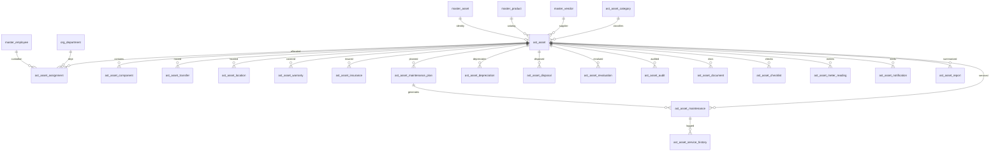

# ERD_15 — Asset Management Domain

**Document:** Enterprise ERD — Asset Management Domain  
**Version:** 1.0  
**Status:** Locked — Ready for Sprint 15 Implementation Planning  
**Schema:** `asset`  
**Table Prefix:** `ast_`  
**Aligned To:** BRD v1.0 · FRD-12 Asset Management · SDD v1.1 · DBS v1.1 · Architecture Lock v1.1  
**Functional Requirements:** [FRD-12 Asset Management Domain](../02_FRD/FRD-12-Asset-Management-Domain.md)  
**Classification:** Internal — Confidential  
**Prior Release:** [ERP Core v1.9-beta](../07_RELEASES/ERP_Core_v1.9-beta.md)  

> **C-01 note:** Platform identity for assets remains **`master.master_asset`**. `ast_asset` is the **operational lifecycle register** (1:1 / N:1 via `master_asset_id`). Supplier party is **`master.master_vendor`** (FRD “supplier” synonym — no new `master_supplier` table).

---

## 1. Module Overview

The Asset Management Domain manages the **physical and digital asset lifecycle**: categorization, registration, components, assignment / transfer / location tracking, warranty and insurance, preventive / corrective maintenance and service history, depreciation schedules, disposal and revaluation, physical audits, checklists and meter readings, documents, notifications, and reporting — from purchase/capitalization readiness through disposal.

Asset Management **depends on** Foundation, Organization, Master Data, and Finance (posting adapter). It **consumes existing masters only (C-01)** — **`master_asset`** (identity), **`master_employee`**, **`master_product`**, **`master_vendor`** (supplier), and **`org_department`**. It **must never duplicate** asset, employee, product, vendor/supplier, department, or company masters.

**Finance remains the only accounting system.** Asset never ORM-writes `fin_*` tables. Depreciation / disposal / revaluation journals use **`finance_journal_id`** (and optional **`depreciation_batch_id`** UUID); GL posting occurs **only** through `PostingService.post_system_journal()`.

Procurement, Inventory, HR, Payroll, Project, Manufacturing, Quality, CRM, and Recruitment remain **isolated** except authorized UUID / employee-assignment refs — **no FKs** to `proc_*` / `inv_*` / `prj_*` / `mfg_*` / `qm_*` / `pay_*` / `hr_*` / `crm_*` / `rec_*`, and **no peer ORM writes**.

**Business Tables: 20**  
**Schema: `asset`**

### Enterprise Asset Modules (FRD-12 · Sprint 15 focus)

| # | Module | Primary Tables | Primary Consumers |
|---|--------|----------------|-------------------|
| 1 | Category & Register | `ast_asset_category`, `ast_asset`, `ast_asset_component` | Asset managers |
| 2 | Custody & Movement | `ast_asset_assignment`, `ast_asset_transfer`, `ast_asset_location` | Custodians · admin |
| 3 | Protection | `ast_asset_warranty`, `ast_asset_insurance` | Compliance |
| 4 | Maintenance | `ast_asset_maintenance_plan`, `ast_asset_maintenance`, `ast_asset_service_history` | Facilities · vendors |
| 5 | Valuation | `ast_asset_depreciation`, `ast_asset_disposal`, `ast_asset_revaluation` | Finance · Asset Admin |
| 6 | Assurance | `ast_asset_audit`, `ast_asset_checklist`, `ast_asset_meter_reading` | Auditors |
| 7 | Collaboration | `ast_asset_document`, `ast_asset_notification` | Team · ops |
| 8 | Reporting | `ast_asset_report` | Leadership · BI |

**PostgreSQL Schema:** `asset` (Sprint 15 introduction)

### Architectural Position

```text
Foundation (ERD_01) ── Workflow, Audit, RBAC, Notification
Organization (ERD_02) ── Company, Branch, Department
Master Data (ERD_03) ── master_asset (C-01 identity) · master_employee · master_product · master_vendor
Finance (ERD_04) ── PostingService only (no direct fin_* writes)
Procurement / Inventory ── acquisition & issue/receipt UUID refs (no FK / no writes)
HR / Payroll ── employee assignment; optional labor read (no hr_*/pay_* writes)
Project / MFG / QM ── optional UUID refs only
CRM / Recruitment ── no writes
        ↓
Asset (ERD_15) ── Category · Register · Assignment · Maintenance · Depreciation · Disposal · Audit · Reports
        ↓
Finance GL events · Service / Helpdesk consumers (future)
```

### API Mount (planned)

**`/api/v1/assets`** — routers for all aggregates (asset-categories, assets, asset-components, asset-assignments, asset-transfers, asset-locations, asset-warranties, asset-insurances, maintenance-plans, asset-maintenances, service-histories, asset-depreciations, asset-disposals, asset-revaluations, asset-audits, asset-documents, asset-checklists, meter-readings, asset-notifications, reports).

---

## 2. Scope

### In Scope
- **Asset categories** and **asset registration** linked to **`master_asset`** — FRD-12 §4–§5
- **Components** (BOM-like subordinate parts of an asset)
- **Assignment** to employee / department / location (shared-asset rule) — FRD-12 §6
- **Transfer** and **location** history / current location tracking — FRD-12 §7
- **Warranty** and **insurance** policies with expiry
- **Maintenance plans**, **maintenance work orders**, **service history** — FRD-12 §8
- **Depreciation** schedule / run rows with Finance posting — FRD-12 §9
- **Disposal** and **revaluation** with workflow and Finance posting
- **Physical asset audits**, **checklists**, **meter readings**
- **Documents**, **notifications**, **reports**
- Workflow, audit, RBAC, Celery stubs (planning)

### Out of Scope (Phase 2 / Separate)
- Full **lease accounting sub-ledger** tables — Phase 1: `asset_type=leased` flag + metadata
- Duplicate `ast_employee` / `ast_product` / `ast_vendor` / `ast_department` / second asset identity master — **forbidden (C-01)**
- Direct writes to `fin_*`, `hr_*`, `pay_*`, `proc_*`, `inv_*`, `prj_*`, `mfg_*`, `qm_*`, `crm_*`, `rec_*`, `sales_*`
- SQLAlchemy models, Alembic migrations, application code (implementation sprint)
- Analytics cubes / `ana_fact_asset`

### Assumptions / Business Rules
- **Identity:** registering an operational asset creates/links **`master_asset`** via Master Data `AssetService` (never invent a second identity table owned solely inside Asset without master linkage)
- `ast_asset.master_asset_id` FK → `master.master_asset` is mandatory for approved/active assets
- `ast_asset_category` is an Asset-domain catalog (not a Master Data table); category label may sync to `master_asset.asset_category` via service
- Supplier references use **`master_vendor`** (supplier synonym)
- Soft delete + version on mutable asset tables
- Document numbers company-scoped
- One **active exclusive** employee assignment per asset unless `is_shared=true` — FRD-12 §6
- Depreciation / disposal / revaluation: create Asset row → Finance `PostingService.post_system_journal()` → store `finance_journal_id`

### Dependencies

| Upstream | Tables / Services Used |
|----------|------------------------|
| ERD_01 Foundation | `sec_tenant`, `sec_user`, `wf_definition`, `wf_instance` |
| ERD_02 Organization | `org_company`, `org_branch`, `org_department` (optional `org_location` UUID) |
| ERD_03 Master Data | **`master_asset`**, **`master_employee`**, **`master_product`**, **`master_vendor`** |
| ERD_04 Finance | **`PostingService.post_system_journal()`**; `finance_journal_id` / `depreciation_batch_id` UUID storage |
| ERD_06 Procurement | Optional `purchase_order_id` / `grn_id` UUID — **no FK** |
| ERD_07 Inventory | Optional `inventory_receipt_id` / `inventory_issue_id` UUID — **no FK** |
| ERD_14 Project | Optional `project_id` UUID — **no FK** |
| ERD_08 Manufacturing | Optional `production_order_id` UUID — **no FK** |
| ERD_09 Quality | Optional `quality_inspection_id` UUID — **no FK** |
| ERD_11 HR | Employee assignment via master only — **no `hr_*` writes** |
| ERD_12 Payroll | Optional labor **read** — **no `pay_*` writes** |

---

## 3. Table Inventory

| # | Table | Classification | tenant_id | company_id | branch_id | Soft Delete | Version | Workflow |
|---|-------|----------------|-----------|------------|-----------|-------------|---------|----------|
| 1 | `ast_asset_category` | Catalog Master | ✅ | ✅ | optional | ✅ | ✅ | — |
| 2 | `ast_asset` | Transaction / Register | ✅ | ✅ | ✅ | ✅ | ✅ | ✅ |
| 3 | `ast_asset_component` | Detail | ✅ | ✅ | optional | ✅ | ✅ | — |
| 4 | `ast_asset_assignment` | Assignment | ✅ | ✅ | ✅ | ✅ | ✅ | ✅ |
| 5 | `ast_asset_transfer` | Transaction | ✅ | ✅ | ✅ | ✅ | ✅ | — |
| 6 | `ast_asset_location` | Tracking | ✅ | ✅ | optional | ✅ | ✅ | — |
| 7 | `ast_asset_warranty` | Policy | ✅ | ✅ | optional | ✅ | ✅ | — |
| 8 | `ast_asset_insurance` | Policy | ✅ | ✅ | optional | ✅ | ✅ | — |
| 9 | `ast_asset_maintenance_plan` | Plan | ✅ | ✅ | optional | ✅ | ✅ | — |
| 10 | `ast_asset_maintenance` | Work Order | ✅ | ✅ | ✅ | ✅ | ✅ | ✅ |
| 11 | `ast_asset_service_history` | History | ✅ | ✅ | optional | ✅ | ✅ | — |
| 12 | `ast_asset_depreciation` | Financial | ✅ | ✅ | optional | ✅ | ✅ | — |
| 13 | `ast_asset_disposal` | Transaction | ✅ | ✅ | ✅ | ✅ | ✅ | ✅ |
| 14 | `ast_asset_revaluation` | Transaction | ✅ | ✅ | ✅ | ✅ | ✅ | ✅ |
| 15 | `ast_asset_audit` | Assurance | ✅ | ✅ | ✅ | ✅ | ✅ | — |
| 16 | `ast_asset_document` | Document | ✅ | ✅ | optional | ✅ | ✅ | — |
| 17 | `ast_asset_checklist` | Checklist | ✅ | ✅ | optional | ✅ | ✅ | — |
| 18 | `ast_asset_meter_reading` | Meter | ✅ | ✅ | optional | ✅ | ✅ | — |
| 19 | `ast_asset_notification` | Notification | ✅ | ✅ | optional | ✅ | ✅ | — |
| 20 | `ast_asset_report` | Aggregate Snapshot | ✅ | ✅ | optional | ✅ | ✅ | — |

**Business Tables: 20**  
**Schema: `asset`**

---

## 4. Entity Relationships



```text
org_company / org_branch / org_department
master_asset (C-01) ←── ast_asset (operational register)
master_employee / master_product / master_vendor
    └── ast_asset_category → ast_asset
            ├── ast_asset_component
            ├── ast_asset_assignment → master_employee / org_department
            ├── ast_asset_transfer / ast_asset_location
            ├── ast_asset_warranty / ast_asset_insurance
            ├── ast_asset_maintenance_plan → ast_asset_maintenance → ast_asset_service_history
            ├── ast_asset_depreciation (finance_journal_id / depreciation_batch_id UUID)
            ├── ast_asset_disposal / ast_asset_revaluation (finance_journal_id after PostingService)
            ├── ast_asset_audit / ast_asset_checklist / ast_asset_meter_reading
            ├── ast_asset_document / ast_asset_notification
            └── ast_asset_report

Optional UUID-only (no FK): purchase_order_id, grn_id, inventory_receipt_id,
  inventory_issue_id, project_id, production_order_id, quality_inspection_id
```

---

## 5. Standard Column Profiles

### 5.1 Asset Catalog Profile (Category)

| Column Group | Columns |
|--------------|---------|
| Primary Key | `id UUID` |
| Tenant / Company | `tenant_id`, `company_id` |
| Business Key | `category_code` |
| Status | `status VARCHAR(30)` |
| Audit + Soft Delete + Version | per DBS §28 |

### 5.2 Asset Transaction Header Profile (Asset, Assignment, Maintenance, Disposal, Revaluation, Transfer, Audit)

| Column Group | Columns |
|--------------|---------|
| Primary Key | `id UUID` |
| Document | `document_number` / `asset_code` where applicable |
| Status / Workflow | `status`, optional `workflow_status`, `workflow_instance_id` |
| Scope | `tenant_id`, `company_id`, `branch_id` |
| Asset FK | `asset_id` → `ast_asset` (or self register) |
| People / Org | `*_employee_id` → `master_employee`; `department_id` → `org_department` |
| Audit + Soft Delete + Version | per DBS §28 |

### 5.3 Asset Detail / Policy / Snapshot Profile (Component, Warranty, Insurance, Plan, History, Doc, Checklist, Meter, Notification, Report, Depreciation)

| Column Group | Columns |
|--------------|---------|
| Scope | tenant / company / branch (as applicable) |
| Parent FKs | asset / maintenance / plan |
| Money / dates | `NUMERIC(18,4)`, DATE / TIMESTAMPTZ |
| Soft delete + version | yes |

---

## 6. Detailed Table Definitions

### 6.1 `ast_asset_category`

| Column | Notes |
|--------|-------|
| `category_code` | UK — IT, FURNITURE, VEHICLE, MACHINERY, INFRA, SOFTWARE — FRD-12 §4 |
| `category_name` | — |
| `default_useful_life_months` | INT optional |
| `default_depreciation_method` | straight_line, wdv, units_of_production |
| `gl_asset_account_id` / `gl_accum_depr_account_id` / `gl_expense_account_id` | UUID optional Finance COA refs (**no write**) |
| `status` | active, inactive |
| **UK:** `(company_id, category_code)` |

---

### 6.2 `ast_asset`

| Column | Type | Nullable | Description |
|--------|------|----------|-------------|
| `id` | UUID | NO | PK |
| `tenant_id` / `company_id` / `branch_id` | UUID | NO | Scope |
| `document_number` / `asset_code` | VARCHAR(50) | NO | `AST-YYYY-NNNNNN` — FRD-12 §4 |
| `asset_name` | VARCHAR(255) | NO | — |
| `asset_category_id` | UUID | NO | FK → `ast_asset_category` |
| `asset_type` | VARCHAR(40) | NO | fixed, consumable, digital, leased — FRD-12 §5 |
| `master_asset_id` | UUID | YES | FK → `master.master_asset` — **mandatory when approved/active (C-01)** |
| `product_id` | UUID | YES | FK → `master_product` |
| `supplier_vendor_id` | UUID | YES | FK → `master_vendor` |
| `serial_number` / `barcode` / `qr_code` / `rfid_tag` | VARCHAR | YES | Tracking — FRD-12 §7 |
| `purchase_date` | DATE | YES | — |
| `purchase_cost` / `current_book_value` / `salvage_value` | NUMERIC(18,4) | YES | — |
| `currency_code` | VARCHAR(10) | NO | — |
| `depreciation_method` | VARCHAR(40) | YES | straight_line, wdv, units_of_production |
| `useful_life_months` | INT | YES | — |
| `department_id` | UUID | YES | FK → `org_department` (home dept) |
| `custodian_employee_id` | UUID | YES | FK → `master_employee` (denormalized current) |
| `purchase_order_id` / `grn_id` | UUID | YES | **UUID only — no proc FK** |
| `inventory_receipt_id` / `inventory_issue_id` | UUID | YES | **UUID only — no inv FK** |
| `project_id` | UUID | YES | **UUID only — no prj FK** |
| `production_order_id` / `quality_inspection_id` | UUID | YES | **UUID only — no FK** |
| `is_shared` | BOOLEAN | NO | default false — FRD-12 §6 |
| `status` | VARCHAR(30) | NO | draft, submitted, approved, active, in_maintenance, transferred, disposed, written_off, cancelled |
| `workflow_*` | | | Asset approval |
| AUDIT_STD + SOFT_DELETE_OPT + version | | | |

**UK:** `(company_id, asset_code)` where not deleted.  
**Hard rule on approve:** ensure `master_asset` exists via Master Data service; set `master_asset_id`.

---

### 6.3 `ast_asset_component`

| Column | Notes |
|--------|-------|
| `asset_id` | FK parent |
| `component_code` / `component_name` | — |
| `product_id` | FK optional → `master_product` |
| `serial_number` | optional |
| `quantity` | NUMERIC |
| `status` | active, replaced, disposed |
| **UK:** `(asset_id, component_code)` |

---

### 6.4 `ast_asset_assignment`

| Column | Notes |
|--------|-------|
| `document_number` | `AASN-YYYY-NNNNNN` |
| `asset_id` | FK |
| `allocation_type` | employee, department, project, branch, warehouse — FRD-12 §6 |
| `employee_id` | FK optional → `master_employee` |
| `department_id` | FK optional → `org_department` |
| `project_id` | UUID optional — **no FK** |
| `allocated_at` / `expected_return_at` / `returned_at` | TIMESTAMPTZ / DATE |
| `status` | draft, submitted, approved, active, returned, cancelled |
| `workflow_*` | Assignment approval |
| **Service rule:** no second active exclusive assignment unless asset `is_shared` |

---

### 6.5 `ast_asset_transfer`

| Column | Notes |
|--------|-------|
| `document_number` | `ATRF-YYYY-NNNNNN` |
| `asset_id` | FK |
| `from_branch_id` / `to_branch_id` | UUID org branch |
| `from_department_id` / `to_department_id` | FK optional org_department |
| `from_employee_id` / `to_employee_id` | FK optional master_employee |
| `transferred_at` | TIMESTAMPTZ |
| `reason` | TEXT |
| `status` | draft, completed, cancelled |

---

### 6.6 `ast_asset_location`

| Column | Notes |
|--------|-------|
| `asset_id` | FK |
| `location_label` | VARCHAR — building / floor / room / bin |
| `org_location_id` | UUID optional → org_location (**prefer UUID; optional FK if org_location available**) |
| `effective_from` / `effective_to` | TIMESTAMPTZ |
| `is_current` | BOOLEAN |
| `status` | active, historical |

---

### 6.7 `ast_asset_warranty`

| Column | Notes |
|--------|-------|
| `asset_id` | FK |
| `vendor_id` | FK optional → `master_vendor` |
| `warranty_type` | manufacturer, extended, service |
| `start_date` / `end_date` | DATE |
| `coverage_notes` | TEXT |
| `status` | active, expired, void |

---

### 6.8 `ast_asset_insurance`

| Column | Notes |
|--------|-------|
| `asset_id` | FK |
| `policy_number` | VARCHAR |
| `insurer_name` | VARCHAR |
| `vendor_id` | FK optional → `master_vendor` |
| `coverage_amount` | NUMERIC |
| `start_date` / `end_date` | DATE |
| `status` | active, expired, cancelled |

---

### 6.9 `ast_asset_maintenance_plan`

| Column | Notes |
|--------|-------|
| `document_number` | `AMPL-YYYY-NNNNNN` |
| `asset_id` | FK |
| `plan_name` | — |
| `maintenance_type` | preventive, corrective, emergency, annual_service — FRD-12 §8 |
| `frequency_days` / `frequency_meter_units` | optional |
| `next_due_date` | DATE |
| `status` | draft, active, paused, closed |

---

### 6.10 `ast_asset_maintenance`

| Column | Notes |
|--------|-------|
| `document_number` | `AMNT-YYYY-NNNNNN` |
| `asset_id` / `maintenance_plan_id` | FKs (`plan_id` optional) |
| `maintenance_type` | preventive, corrective, emergency, annual_service |
| `scheduled_date` / `completed_date` | DATE |
| `vendor_id` | FK optional → `master_vendor` |
| `cost_amount` | NUMERIC |
| `technician_employee_id` | FK optional |
| `quality_inspection_id` | UUID **no FK** |
| `status` | draft, submitted, approved, scheduled, in_progress, completed, cancelled |
| `workflow_*` | Maintenance approval |

---

### 6.11 `ast_asset_service_history`

| Column | Notes |
|--------|-------|
| `asset_id` / `maintenance_id` | FKs |
| `service_summary` | TEXT |
| `parts_replaced_json` | JSONB optional |
| `cost_amount` | NUMERIC |
| `serviced_at` | TIMESTAMPTZ |
| `status` | recorded |

---

### 6.12 `ast_asset_depreciation`

| Column | Notes |
|--------|-------|
| `document_number` | `ADEP-YYYY-NNNNNN` |
| `asset_id` | FK |
| `period_year` / `period_month` | SMALLINT |
| `method` | straight_line, wdv, units_of_production |
| `depreciation_amount` / `book_value_after` | NUMERIC |
| `units_produced` | NUMERIC optional |
| `depreciation_batch_id` | UUID **batch grouping — no fin_* write** |
| `finance_journal_id` | UUID **after** `PostingService.post_system_journal()` |
| `idempotency_key` | VARCHAR(100) |
| `status` | draft, calculated, posted, failed, reversed |
| **UK soft:** `(asset_id, period_year, period_month)` for non-reversed |

---

### 6.13 `ast_asset_disposal`

| Column | Notes |
|--------|-------|
| `document_number` | `ADISP-YYYY-NNNNNN` |
| `asset_id` | FK |
| `disposal_type` | sale, scrap, donation, write_off |
| `disposal_date` | DATE |
| `proceeds_amount` / `book_value_at_disposal` | NUMERIC |
| `finance_journal_id` | UUID after PostingService |
| `status` | draft, submitted, approved, posted, cancelled |
| `workflow_*` | Disposal approval |
| On complete: update `ast_asset.status` + Master Data asset status via service |

---

### 6.14 `ast_asset_revaluation`

| Column | Notes |
|--------|-------|
| `document_number` | `AREV-YYYY-NNNNNN` |
| `asset_id` | FK |
| `revaluation_date` | DATE |
| `old_book_value` / `new_book_value` | NUMERIC |
| `reason` | TEXT |
| `finance_journal_id` | UUID after PostingService |
| `status` | draft, submitted, approved, posted, cancelled |
| `workflow_*` | Revaluation approval |

---

### 6.15 `ast_asset_audit`

| Column | Notes |
|--------|-------|
| `document_number` | `AAUD-YYYY-NNNNNN` |
| `asset_id` | FK optional (null = company sweep header style — Phase 1 prefer per-asset rows) |
| `audit_date` | DATE |
| `auditor_employee_id` | FK → `master_employee` |
| `found_status` | found, missing, damaged, relocated |
| `notes` | TEXT |
| `status` | planned, in_progress, completed, cancelled |

---

### 6.16 `ast_asset_document`

| Column | Notes |
|--------|-------|
| `asset_id` | FK |
| `document_type` | invoice, warranty, insurance, manual, photo, other |
| `document_name` | — |
| `storage_uri` / `content_hash` | Phase 1 metadata |
| `status` | active, superseded, archived |

---

### 6.17 `ast_asset_checklist`

| Column | Notes |
|--------|-------|
| `asset_id` / `maintenance_id` / `audit_id` | optional parent FKs |
| `checklist_code` / `checklist_name` | — |
| `items_json` | JSONB checklist items + results |
| `completed_at` | TIMESTAMPTZ |
| `status` | draft, completed, cancelled |

---

### 6.18 `ast_asset_meter_reading`

| Column | Notes |
|--------|-------|
| `asset_id` | FK |
| `meter_type` | odometer, runtime_hours, cycle_count, other |
| `reading_value` | NUMERIC |
| `reading_at` | TIMESTAMPTZ |
| `recorded_by_employee_id` | FK optional |
| `status` | recorded, void |
| **Service rule:** reading_value non-decreasing per meter_type (where applicable) |

---

### 6.19 `ast_asset_notification`

| Column | Notes |
|--------|-------|
| `asset_id` | FK |
| `notification_type` | maintenance_due, warranty_expiry, insurance_expiry, audit_due, depreciation, other |
| `recipient_user_id` / `recipient_employee_id` | UUID refs |
| `payload_json` | JSONB |
| `sent_at` | TIMESTAMPTZ |
| `delivery_status` | pending, sent, failed, read |
| `status` | active, archived |

---

### 6.20 `ast_asset_report`

| Column | Notes |
|--------|-------|
| `report_code` | UK |
| `report_type` | register, depreciation_schedule, utilization, maintenance_due, insurance_expiry, audit_variance |
| `period_start` / `period_end` | DATE |
| `department_id` / `category_id` | optional filters |
| `metrics_json` | JSONB |
| `generated_at` | TIMESTAMPTZ |
| `status` | draft, finalized |
| **UK:** `(company_id, report_code)` |

---

## 7. Primary Keys

| Table | Constraint Name | Column |
|-------|-----------------|--------|
| `ast_asset_category` | `pk_ast_asset_category` | `id` |
| `ast_asset` | `pk_ast_asset` | `id` |
| `ast_asset_component` | `pk_ast_asset_component` | `id` |
| `ast_asset_assignment` | `pk_ast_asset_assignment` | `id` |
| `ast_asset_transfer` | `pk_ast_asset_transfer` | `id` |
| `ast_asset_location` | `pk_ast_asset_location` | `id` |
| `ast_asset_warranty` | `pk_ast_asset_warranty` | `id` |
| `ast_asset_insurance` | `pk_ast_asset_insurance` | `id` |
| `ast_asset_maintenance_plan` | `pk_ast_asset_maint_plan` | `id` |
| `ast_asset_maintenance` | `pk_ast_asset_maintenance` | `id` |
| `ast_asset_service_history` | `pk_ast_asset_svc_history` | `id` |
| `ast_asset_depreciation` | `pk_ast_asset_depreciation` | `id` |
| `ast_asset_disposal` | `pk_ast_asset_disposal` | `id` |
| `ast_asset_revaluation` | `pk_ast_asset_revaluation` | `id` |
| `ast_asset_audit` | `pk_ast_asset_audit` | `id` |
| `ast_asset_document` | `pk_ast_asset_document` | `id` |
| `ast_asset_checklist` | `pk_ast_asset_checklist` | `id` |
| `ast_asset_meter_reading` | `pk_ast_asset_meter_reading` | `id` |
| `ast_asset_notification` | `pk_ast_asset_notification` | `id` |
| `ast_asset_report` | `pk_ast_asset_report` | `id` |

---

## 8. Foreign Keys

| Child | Column | Parent |
|-------|--------|--------|
| Asset | `master_asset_id` | `master.master_asset` |
| Asset / components | `product_id` | `master.master_product` |
| Asset / warranty / insurance / maintenance | `*_vendor_id` / `supplier_vendor_id` | `master.master_vendor` |
| Assignments / custodians / auditors | `*_employee_id` | `master.master_employee` |
| Asset / assignment | `department_id` | `organization.org_department` |
| Most detail tables | `asset_id` | `asset.ast_asset` |
| Asset | `asset_category_id` | `asset.ast_asset_category` |
| Maintenance | `maintenance_plan_id` | `asset.ast_asset_maintenance_plan` |
| Service history | `maintenance_id` | `asset.ast_asset_maintenance` |
| Workflow | `workflow_instance_id` | `foundation.wf_instance` |
| Org scope | `tenant_id`, `company_id`, `branch_id` | foundation / organization |

**No FK to:** `proc_*`, `inv_*`, `prj_*`, `mfg_*`, `qm_*`, `pay_*`, `hr_*`, `crm_*`, `rec_*`, `sales_*`.  
**Finance:** `finance_journal_id` / `depreciation_batch_id` are **UUID refs only**; **writes only via PostingService**.  
**No Asset duplicates of:** `master_asset`, `master_employee`, `master_product`, `master_vendor`, `org_department`, `org_company`.

---

## 9. Indexes & Constraints

### Unique
- Category / asset codes: `(company_id, *_code)`
- Document headers: `(company_id, document_number)` for assignment, transfer, maintenance, plan, disposal, revaluation, audit, depreciation
- Component `(asset_id, component_code)`; report `(company_id, report_code)`
- Depreciation period soft UK; cost posting `idempotency_key`

### Check
- `purchase_cost >= 0`; `end_date >= start_date` on warranty/insurance
- Status enums per §11
- Assignment XOR rules soft-enforced in service (employee vs department vs project)

### Indexes
- All FKs
- `(tenant_id, company_id, status)` on asset / maintenance / disposal
- `(asset_id, is_current)` on location
- `(end_date)` on warranty / insurance
- `(next_due_date)` on maintenance plan
- `(period_year, period_month)` on depreciation

---

## 10. Document Numbering / Naming Convention

| Document | Format | UK Scope |
|----------|--------|----------|
| Asset | `AST-YYYY-NNNNNN` | company |
| Assignment | `AASN-YYYY-NNNNNN` | company |
| Transfer | `ATRF-YYYY-NNNNNN` | company |
| Maintenance Plan | `AMPL-YYYY-NNNNNN` | company |
| Maintenance | `AMNT-YYYY-NNNNNN` | company |
| Depreciation | `ADEP-YYYY-NNNNNN` | company |
| Disposal | `ADISP-YYYY-NNNNNN` | company |
| Revaluation | `AREV-YYYY-NNNNNN` | company |
| Audit | `AAUD-YYYY-NNNNNN` | company |
| Category / Report codes | Stable codes | company |

**Naming:** schema `asset`; tables `ast_*`; ORM `Ast*`; module package `modules/asset`; API prefix `/assets`; permissions `asset.*`; workflows `AST_*`.

---

## 11. Status Lifecycles

| Entity | Statuses |
|--------|----------|
| Category | active ↔ inactive |
| Asset | draft → submitted → approved → active → in_maintenance / transferred → disposed / written_off \| cancelled |
| Component | active → replaced \| disposed |
| Assignment | draft → submitted → approved → active → returned \| cancelled |
| Transfer | draft → completed \| cancelled |
| Location | active → historical |
| Warranty / Insurance | active → expired \| void/cancelled |
| Maintenance Plan | draft → active ↔ paused → closed |
| Maintenance | draft → submitted → approved → scheduled → in_progress → completed \| cancelled |
| Service History | recorded |
| Depreciation | draft → calculated → posted \| failed \| reversed |
| Disposal / Revaluation | draft → submitted → approved → posted \| cancelled |
| Audit | planned → in_progress → completed \| cancelled |
| Document | active → superseded → archived |
| Checklist | draft → completed \| cancelled |
| Meter Reading | recorded \| void |
| Notification | active → archived |
| Report | draft → finalized |

---

## 12. Approval Workflow Integration (Workflow Matrix)

| Workflow Code | Document | Path |
|---------------|----------|------|
| `AST_ASSET_APPROVAL` | Asset | Asset Executive → Asset Manager → (optional) Finance for capitalization |
| `AST_ASSIGNMENT_APPROVAL` | Asset Assignment | Requestor → Custodian Manager → Asset Manager |
| `AST_MAINTENANCE_APPROVAL` | Asset Maintenance | Technician / Executive → Asset Manager |
| `AST_DISPOSAL_APPROVAL` | Asset Disposal | Asset Manager → Asset Admin → Finance |
| `AST_REVALUATION_APPROVAL` | Asset Revaluation | Asset Manager → Finance → Asset Admin |

Seed workflows only; instance rows use Foundation `wf_instance`.

---

## 13. Audit Strategy

| Layer | Mechanism |
|-------|-----------|
| Row audit | Standard columns on all mutable `ast_*` tables |
| Business audit | `AuditService` on asset approve, assignment approve, maintenance complete, depreciation post, disposal/revaluation post, physical audit complete |
| Notifications | Maintenance due, warranty/insurance expiry, audit reminders — Foundation + `ast_asset_notification` |

---

## 14. Tenant / Company / Branch Isolation + RBAC Matrix

| Rule | Application |
|------|-------------|
| `tenant_id` | All tables |
| `company_id` | Numbering / capitalization entity boundary |
| `branch_id` | Mandatory on asset, assignment, transfer, maintenance, disposal, revaluation, audit |
| Repository | `AstScopedRepository` pattern |
| RBAC | `asset.*` permissions |

### Planned RBAC (Sprint 15)

| Resource | Permissions |
|----------|-------------|
| `asset.category` | read, create, update |
| `asset.asset` | read, create, update, submit, approve |
| `asset.assignment` | read, create, submit, approve, return |
| `asset.transfer` / `asset.location` | read, create, complete |
| `asset.warranty` / `asset.insurance` | read, create, update |
| `asset.maintenance` | read, create, submit, approve, complete |
| `asset.depreciation` | read, calculate, post |
| `asset.disposal` / `asset.revaluation` | read, create, submit, approve, post |
| `asset.audit` | read, create, complete |
| `asset.document` / `asset.checklist` / `asset.meter` | read, create, update |
| `asset.report` | read, export |

**Roles** (`status='active'`):

| Role | Intent |
|------|--------|
| `ASSET_MANAGER` | Approve assets / assignments / maintenance; drive disposal |
| `ASSET_EXECUTIVE` | Day-to-day register, transfers, warranty/insurance, work orders |
| `ASSET_AUDITOR` | Physical audits, variance reporting, read-heavy assurance |
| `ASSET_ADMIN` | Cross-company admin, category governance, closure / write-off ops |

---

## 15. Migration Order

Prior Alembic head: **`0244_seed_project_workflows`**.

Revision budget **`0245`–`0266` (22 revisions)**. Schema + 20 tables + permissions + workflows = 23 logical steps → **`ast_asset_warranty` and `ast_asset_insurance` share one migration**.

| Order | Revision ID (≤32 chars) | Migration | Tables / Actions |
|-------|-------------------------|-----------|------------------|
| 245 | `0245_create_asset_schema` | Create schema | `asset` |
| 246 | `0246_ast_asset_category` | Category | `ast_asset_category` |
| 247 | `0247_ast_asset` | Register | `ast_asset` |
| 248 | `0248_ast_asset_component` | Components | `ast_asset_component` |
| 249 | `0249_ast_asset_assignment` | Assignment | `ast_asset_assignment` |
| 250 | `0250_ast_asset_transfer` | Transfer | `ast_asset_transfer` |
| 251 | `0251_ast_asset_location` | Location | `ast_asset_location` |
| 252 | `0252_ast_warranty_insurance` | Policies | `ast_asset_warranty`, `ast_asset_insurance` |
| 253 | `0253_ast_maint_plan` | Plan | `ast_asset_maintenance_plan` |
| 254 | `0254_ast_asset_maintenance` | Maintenance | `ast_asset_maintenance` |
| 255 | `0255_ast_service_history` | History | `ast_asset_service_history` |
| 256 | `0256_ast_asset_depreciation` | Depreciation | `ast_asset_depreciation` |
| 257 | `0257_ast_asset_disposal` | Disposal | `ast_asset_disposal` |
| 258 | `0258_ast_asset_revaluation` | Revaluation | `ast_asset_revaluation` |
| 259 | `0259_ast_asset_audit` | Audit | `ast_asset_audit` |
| 260 | `0260_ast_asset_document` | Document | `ast_asset_document` |
| 261 | `0261_ast_asset_checklist` | Checklist | `ast_asset_checklist` |
| 262 | `0262_ast_meter_reading` | Meter | `ast_asset_meter_reading` |
| 263 | `0263_ast_asset_notification` | Notification | `ast_asset_notification` |
| 264 | `0264_ast_asset_report` | Report | `ast_asset_report` |
| 265 | `0265_seed_asset_permissions` | RBAC | Permissions / roles |
| 266 | `0266_seed_asset_workflows` | Workflows | Asset / Assignment / Maintenance / Disposal / Revaluation |

**Dependency order:** schema → category → asset → component → custody/movement → policies → maintenance stack → valuation → assurance → docs/checklist/meter → notification → report → seeds.

**Planned head after Sprint 15:** `0266_seed_asset_workflows`

### Celery task stubs (planning)

| Task name | Purpose |
|-----------|---------|
| `asset.maintenance_due_alerts` | Plan next_due_date chase |
| `asset.warranty_expiry_alerts` | Warranty end_date alerts |
| `asset.insurance_expiry_alerts` | Insurance end_date alerts |
| `asset.depreciation_scheduler` | Period depreciation calculation / post queue |
| `asset.asset_audit_reminders` | Planned audit follow-ups |
| `asset.retry_finance_posting` | Retry failed depreciation / disposal / revaluation posts |

---

## 16. Cross Module Dependencies

### 16.1 Upstream (Asset Consumes)

| Module | Provides | Pattern |
|--------|----------|---------|
| Foundation | tenant, user, workflow, audit, RBAC, notification | Direct FK / services |
| Organization | company, branch, **department** | Direct FK |
| Master Data | **`master_asset` · employee · product · vendor** | FK + AssetService for identity create/update (C-01) |
| Finance | **`PostingService.post_system_journal()`** | Adapter; store `finance_journal_id` / `depreciation_batch_id` |
| Procurement / Inventory | Acquisition & stock movement trail | UUID only — **no FK** |
| Project / MFG / Quality | Optional operational context | UUID only — **no FK** |
| HR / Payroll | Assignment continuity; optional labor read | Master FK / read port — **no writes** |

### 16.2 Downstream

| Module | Pattern |
|--------|---------|
| Finance fixed-asset accounting | Journals from Asset posting intents |
| Service / Helpdesk (future) | Read asset register / maintenance history |
| BI | Read-only register / depreciation / utilization |

### 16.3 Hard Rules (Architecture Compliance)

| Rule | Enforcement |
|------|-------------|
| C-01 | Asset identity via `master_asset`; people/product/vendor via masters; no duplicate masters |
| Supplier synonym | Use `master_vendor` — do not create `master_supplier` |
| No Finance ORM writes | Only `PostingService.post_system_journal()` |
| Peer isolation | UUID-only for Proc / Inv / Project / MFG / QM; no CRM / Recruitment writes |
| Architecture Lock v1.1 | Unchanged; Modular Monolith · Clean Architecture · DDD preserved |

---

## 17. Phase Gate Checklist

| # | Gate Criterion | Status |
|---|----------------|--------|
| 1 | Business tables = **20**; schema = **`asset`** | ✅ |
| 2 | Prefix `ast_` defined | ✅ |
| 3 | Aligned to FRD-12 (register, allocation, maintenance, depreciation, disposal) | ✅ |
| 4 | Consumes masters only (C-01); `master_asset` remains authoritative identity | ✅ |
| 5 | Finance posting only via PostingService; store finance UUID refs | ✅ |
| 6 | Proc / Inv / Project / MFG / QM UUID-only; no CRM / Recruitment writes | ✅ |
| 7 | Migration order `0245`–`0266`, revision IDs ≤ 32 chars | ✅ |
| 8 | Workflows + RBAC + API mount + Celery stubs documented | ✅ |
| 9 | Lease sub-ledger deferred without blocking Sprint 15 | ✅ |
| 10 | Architecture Lock v1.1 preserved; no prior module redesign | ✅ |

### ERD Phase Gate — Asset Summary

| Metric | Value |
|--------|-------|
| Business Tables | **20** |
| Schema | **`asset`** |
| Prefix | `ast_` |
| API mount | `/api/v1/assets` |
| Migration range | `0245` – `0266` |
| Prior head | `0244_seed_project_workflows` |
| Planned head | `0266_seed_asset_workflows` |
| Document Status | **Locked — Ready for Sprint 15 Implementation Planning** |

---

## 18. Document Control

| Version | Date | Change |
|---------|------|--------|
| 1.0 | 2026-07-14 | Initial ERD_15 Asset Management; architecture review editorial lock (status locked for Sprint 15 implementation planning) |

---

**ERD_15 Asset Management is locked and ready for Sprint 15 implementation planning.**
