# ERD_16 — Service Management Domain

**Document:** Enterprise ERD — Service Management Domain  
**Version:** 1.0  
**Status:** Locked — Ready for Sprint 16 Implementation Planning  
**Schema:** `service`  
**Table Prefix:** `svc_`  
**Aligned To:** BRD v1.0 · FRD-16 Service Management · SDD v1.1 · DBS v1.1 · Architecture Lock v1.1  
**Functional Requirements:** [FRD-16 Service Management Domain](../02_FRD/FRD-16-Service-Management-Domain.md)  
**Classification:** Internal — Confidential  
**Prior Release:** [ERP Core v1.10-beta](../07_RELEASES/ERP_Core_v1.10-beta.md)  

> **C-01 note:** Customer, employee, asset identity, and product catalog remain **`master.master_customer`**, **`master.master_employee`**, **`master.master_asset`**, and **`master.master_product`**. Service Management **never** invents parallel masters. Optional operational Asset register / maintenance-plan context uses **`asset_id` / `maintenance_plan_id` UUID only** — **no FK to `ast_*`**.

---

## 1. Module Overview

The Service Management Domain manages **service delivery and maintenance operations**: service categorization, customer service requests, tickets, technician assignment and scheduling, work orders / tasks / checklists, field visits, materials and time / expense capture, SLA and escalation, feedback and resolution, service contracts, documents, notifications, and reporting — from request intake through completion and billing readiness.

Service Management **depends on** Foundation, Organization, and Master Data. It **consumes existing masters only (C-01)** — **`master_customer`**, **`master_employee`**, **`master_asset`**, **`master_product`**, and **`org_department`**. It **must never duplicate** customer, employee, asset, product, department, or company masters.

**Finance remains the only accounting system.** Service never ORM-writes `fin_*` tables. Billable / recoverable postings use **`finance_journal_id`**; GL posting occurs **only** through `PostingService.post_system_journal()`.

Asset, CRM, Project, Inventory, Procurement, Manufacturing, Quality, HR, Payroll, and Recruitment remain **isolated** except authorized UUID / employee refs — **no FKs** to `ast_*` / `crm_*` / `prj_*` / `inv_*` / `proc_*` / `mfg_*` / `qm_*` / `hr_*` / `pay_*` / `rec_*`, and **no peer ORM writes**.

**Business Tables: 20**  
**Schema: `service`**

### Enterprise Service Modules (FRD-16 · Sprint 16 focus)

| # | Module | Primary Tables | Primary Consumers |
|---|--------|----------------|-------------------|
| 1 | Catalog & Intake | `svc_service_category`, `svc_service_request`, `svc_service_ticket` | Coordinators · portal |
| 2 | Dispatch | `svc_service_assignment`, `svc_service_schedule` | Dispatch · engineers |
| 3 | Execution | `svc_service_work_order`, `svc_service_task`, `svc_service_checklist`, `svc_service_visit` | Field service |
| 4 | Cost Capture | `svc_service_material`, `svc_service_time_entry`, `svc_service_expense` | Billing · inventory trail |
| 5 | SLA & Quality | `svc_service_sla`, `svc_service_escalation`, `svc_service_feedback`, `svc_service_resolution` | Managers · CX |
| 6 | Commercial | `svc_service_contract` | Account / AMC |
| 7 | Collaboration | `svc_service_document`, `svc_service_notification` | Team · customer |
| 8 | Reporting | `svc_service_report` | Leadership · BI |

**PostgreSQL Schema:** `service` (Sprint 16 introduction)

### Architectural Position

```text
Foundation (ERD_01) ── Workflow, Audit, RBAC, Notification
Organization (ERD_02) ── Company, Branch, Department
Master Data (ERD_03) ── master_customer · master_employee · master_asset · master_product (C-01)
Finance (ERD_04) ── PostingService only (no direct fin_* writes)
Asset (ERD_15) ── asset_id / maintenance_plan_id UUID only (no ast_* FK)
CRM / Project / Inventory / Procurement / MFG / QM ── optional UUID refs (no FK / no writes)
HR / Payroll ── employee FK via master; optional labor read (no hr_*/pay_* writes)
Recruitment ── no writes
        ↓
Service (ERD_16) ── Category · Request · Ticket · Assignment · WO · SLA · Contract · Reports
        ↓
Finance AR / revenue events · Helpdesk consumers (future · FRD-17)
```

### API Mount (planned)

**`/api/v1/service`** — routers for all aggregates (service-categories, service-requests, service-tickets, service-assignments, service-schedules, work-orders, service-tasks, service-checklists, service-visits, service-materials, time-entries, service-expenses, service-slas, service-escalations, service-feedback, service-resolutions, service-documents, service-notifications, service-contracts, reports).

---

## 2. Scope

### In Scope
- **Service categories** and **service request** intake — FRD-16 §4
- **Tickets** as triage / queue units linked to requests
- **Assignment** and **schedule** for technicians — FRD-16 §10–§11
- **Work orders**, **tasks**, **checklists**, **visits** — FRD-16 §6–§9
- **Materials**, **time entries**, **expenses** (parts / labor / cost) — FRD-16 §12 · §14
- **SLA** policies / status and **escalation** — FRD-16 §13
- **Feedback** and **resolution** / closure
- **Service contracts** (AMC / warranty / support / managed) — FRD-16 §5
- **Documents**, **notifications**, **reports**
- Workflow, audit, RBAC, Celery stubs (planning)

### Out of Scope (Phase 2 / Separate)
- Full **Helpdesk / omnichannel desk** product (FRD-17) — Phase 1: optional ticket bridge fields only
- Advanced **route optimization / geo-tracking platform** — Phase 1: lat/long metadata stubs only
- Duplicate `svc_customer` / `svc_employee` / `svc_asset` / `svc_product` / `svc_department` masters — **forbidden (C-01)**
- Direct writes to `fin_*`, `ast_*`, `crm_*`, `prj_*`, `inv_*`, `proc_*`, `mfg_*`, `qm_*`, `hr_*`, `pay_*`, `rec_*`, `sales_*`
- SQLAlchemy models, Alembic migrations, application code (implementation sprint)
- Analytics cubes / `ana_fact_service`

### Assumptions / Business Rules
- **Identity:** customers / employees / assets / products always resolve through Master Data services (C-01)
- `svc_service_category` is a Service-domain catalog (not a Master Data table)
- Optional `master_asset_id` FK → `master.master_asset` when asset identity is known
- Optional `asset_id` / `maintenance_plan_id` are **UUID-only** links to Asset operational tables — **no `ast_*` FK**
- Soft delete + version on mutable service tables
- Document numbers company-scoped (`SR-YYYY-NNNNNN`, `WO-SRV-YYYY-NNNNNN`, `SC-YYYY-NNNNNN` — FRD-16)
- No overlapping active exclusive technician assignments for the same time window — FRD-16 §11
- Billable expense / service revenue: create Service row → Finance `PostingService.post_system_journal()` → store `finance_journal_id`

### Dependencies

| Upstream | Tables / Services Used |
|----------|------------------------|
| ERD_01 Foundation | `sec_tenant`, `sec_user`, `wf_definition`, `wf_instance` |
| ERD_02 Organization | `org_company`, `org_branch`, `org_department` |
| ERD_03 Master Data | **`master_customer`**, **`master_employee`**, **`master_asset`**, **`master_product`** |
| ERD_04 Finance | **`PostingService.post_system_journal()`**; `finance_journal_id` UUID storage |
| ERD_15 Asset | Optional `asset_id` / `maintenance_plan_id` UUID — **no FK** |
| ERD_05 CRM | Optional `crm_opportunity_id` / `crm_customer_id` UUID — **no FK** |
| ERD_14 Project | Optional `project_id` UUID — **no FK** |
| ERD_07 Inventory | Optional `inventory_issue_id` / `inventory_receipt_id` UUID — **no FK** |
| ERD_06 Procurement | Optional `purchase_order_id` UUID — **no FK** |
| ERD_08 Manufacturing | Optional `production_order_id` UUID — **no FK** |
| ERD_09 Quality | Optional `quality_inspection_id` UUID — **no FK** |
| ERD_11 HR | Employee via master only — **no `hr_*` writes** |
| ERD_12 Payroll | Optional labor **read** — **no `pay_*` writes** |
| ERD_13 Recruitment | **No writes** |

---

## 3. Table Inventory

| # | Table | Classification | tenant_id | company_id | branch_id | Soft Delete | Version | Workflow |
|---|-------|----------------|-----------|------------|-----------|-------------|---------|----------|
| 1 | `svc_service_category` | Catalog Master | ✅ | ✅ | optional | ✅ | ✅ | — |
| 2 | `svc_service_request` | Transaction | ✅ | ✅ | ✅ | ✅ | ✅ | ✅ |
| 3 | `svc_service_ticket` | Transaction | ✅ | ✅ | ✅ | ✅ | ✅ | — |
| 4 | `svc_service_assignment` | Assignment | ✅ | ✅ | ✅ | ✅ | ✅ | — |
| 5 | `svc_service_schedule` | Schedule | ✅ | ✅ | ✅ | ✅ | ✅ | — |
| 6 | `svc_service_work_order` | Work Order | ✅ | ✅ | ✅ | ✅ | ✅ | ✅ |
| 7 | `svc_service_task` | Detail | ✅ | ✅ | optional | ✅ | ✅ | — |
| 8 | `svc_service_checklist` | Checklist | ✅ | ✅ | optional | ✅ | ✅ | — |
| 9 | `svc_service_visit` | Field Visit | ✅ | ✅ | ✅ | ✅ | ✅ | — |
| 10 | `svc_service_material` | Detail | ✅ | ✅ | optional | ✅ | ✅ | — |
| 11 | `svc_service_time_entry` | Labor | ✅ | ✅ | optional | ✅ | ✅ | — |
| 12 | `svc_service_expense` | Cost / Financial | ✅ | ✅ | ✅ | ✅ | ✅ | — |
| 13 | `svc_service_sla` | Policy | ✅ | ✅ | optional | ✅ | ✅ | — |
| 14 | `svc_service_escalation` | Event | ✅ | ✅ | ✅ | ✅ | ✅ | ✅ |
| 15 | `svc_service_feedback` | Quality | ✅ | ✅ | optional | ✅ | ✅ | — |
| 16 | `svc_service_resolution` | Closure | ✅ | ✅ | ✅ | ✅ | ✅ | ✅ |
| 17 | `svc_service_document` | Document | ✅ | ✅ | optional | ✅ | ✅ | — |
| 18 | `svc_service_notification` | Notification | ✅ | ✅ | optional | ✅ | ✅ | — |
| 19 | `svc_service_contract` | Contract | ✅ | ✅ | ✅ | ✅ | ✅ | ✅ |
| 20 | `svc_service_report` | Aggregate Snapshot | ✅ | ✅ | optional | ✅ | ✅ | — |

**Business Tables: 20**  
**Schema: `service`**

---

## 4. Entity Relationships

```mermaid
erDiagram
    master_customer ||--o{ svc_service_request : requests
    master_customer ||--o{ svc_service_contract : contracts
    master_employee ||--o{ svc_service_assignment : technician
    master_employee ||--o{ svc_service_work_order : engineer
    master_asset ||--o{ svc_service_request : asset_identity
    master_product ||--o{ svc_service_material : part
    org_department ||--o{ svc_service_request : owning_dept
    svc_service_category ||--o{ svc_service_request : classifies
    svc_service_contract ||--o{ svc_service_request : covers
    svc_service_contract ||--o{ svc_service_sla : defines
    svc_service_request ||--o{ svc_service_ticket : opens
    svc_service_request ||--o{ svc_service_work_order : executes
    svc_service_ticket ||--o{ svc_service_assignment : dispatched
    svc_service_work_order ||--o{ svc_service_assignment : staffed
    svc_service_work_order ||--o{ svc_service_schedule : planned
    svc_service_work_order ||--o{ svc_service_task : breaks_down
    svc_service_work_order ||--o{ svc_service_checklist : checks
    svc_service_work_order ||--o{ svc_service_visit : visits
    svc_service_work_order ||--o{ svc_service_material : consumes
    svc_service_work_order ||--o{ svc_service_time_entry : logs_time
    svc_service_work_order ||--o{ svc_service_expense : costs
    svc_service_request ||--o{ svc_service_escalation : escalates
    svc_service_sla ||--o{ svc_service_escalation : triggers
    svc_service_request ||--o{ svc_service_feedback : rates
    svc_service_request ||--o{ svc_service_resolution : closes
    svc_service_request ||--o{ svc_service_document : docs
    svc_service_request ||--o{ svc_service_notification : alerts
    svc_service_request ||--o{ svc_service_report : summarized
```



```text
org_company / org_branch / org_department
master_customer / master_employee / master_asset / master_product (C-01)
    └── svc_service_category → svc_service_request ← svc_service_contract
            ├── svc_service_ticket → svc_service_assignment → master_employee
            ├── svc_service_work_order
            │       ├── svc_service_schedule / svc_service_task / svc_service_checklist
            │       ├── svc_service_visit
            │       ├── svc_service_material (product_id) / time_entry / expense (finance_journal_id)
            ├── svc_service_sla → svc_service_escalation
            ├── svc_service_feedback / svc_service_resolution
            ├── svc_service_document / svc_service_notification
            └── svc_service_report

Optional UUID-only (no FK): asset_id, maintenance_plan_id, crm_opportunity_id,
  crm_customer_id, project_id, inventory_issue_id, inventory_receipt_id,
  purchase_order_id, production_order_id, quality_inspection_id
```

---

## 5. Standard Column Profiles

### 5.1 Service Catalog Profile (Category)

| Column Group | Columns |
|--------------|---------|
| Primary Key | `id UUID` |
| Tenant / Company | `tenant_id`, `company_id` |
| Business Key | `category_code` |
| Status | `status VARCHAR(30)` |
| Audit + Soft Delete + Version | per DBS §28 |

### 5.2 Service Transaction Header Profile (Request, Ticket, Work Order, Visit, Escalation, Resolution, Contract)

| Column Group | Columns |
|--------------|---------|
| Primary Key | `id UUID` |
| Document | `document_number` |
| Status / Workflow | `status`, optional `workflow_status`, `workflow_instance_id` |
| Scope | `tenant_id`, `company_id`, `branch_id` |
| Party / Org | `customer_id` → `master_customer`; `*_employee_id` → `master_employee`; `department_id` → `org_department` |
| Audit + Soft Delete + Version | per DBS §28 |

### 5.3 Service Detail / Policy / Snapshot Profile (Assignment, Schedule, Task, Checklist, Material, Time, Expense, SLA, Feedback, Doc, Notification, Report)

| Column Group | Columns |
|--------------|---------|
| Scope | tenant / company / branch (as applicable) |
| Parent FKs | request / ticket / work_order / contract |
| Money / dates | `NUMERIC(18,4)`, DATE / TIMESTAMPTZ |
| Soft delete + version | yes |

---

## 6. Detailed Table Definitions

### 6.1 `svc_service_category`

| Column | Notes |
|--------|-------|
| `category_code` | UK — INSTALL, BREAKDOWN, PREVENTIVE, AMC, CONSULTING, OTHER — FRD-16 |
| `category_name` | — |
| `default_priority` | low, medium, high, critical |
| `default_sla_id` | optional UUID → `svc_service_sla` (soft; set after SLA exists or leave null Phase 1) |
| `is_billable_default` | BOOLEAN |
| `status` | active, inactive |
| **UK:** `(company_id, category_code)` |

---

### 6.2 `svc_service_request`

| Column | Type | Nullable | Description |
|--------|------|----------|-------------|
| `id` | UUID | NO | PK |
| `tenant_id` / `company_id` / `branch_id` | UUID | NO | Scope |
| `document_number` | VARCHAR(50) | NO | `SR-YYYY-NNNNNN` — FRD-16 §4 |
| `category_id` | UUID | NO | FK → `svc_service_category` |
| `customer_id` | UUID | NO | FK → `master_customer` — **C-01** |
| `requested_by_employee_id` | UUID | YES | FK → `master_employee` (internal requester) |
| `department_id` | UUID | YES | FK → `org_department` |
| `contract_id` | UUID | YES | FK → `svc_service_contract` |
| `service_type` | VARCHAR(40) | NO | preventive, corrective, breakdown, installation, inspection, other — FRD-16 §7–§9 |
| `priority` | VARCHAR(20) | NO | low, medium, high, critical |
| `channel` | VARCHAR(40) | YES | portal, email, phone, mobile, helpdesk, manual |
| `subject` / `description` | VARCHAR / TEXT | NO / YES | — |
| `master_asset_id` | UUID | YES | FK → `master.master_asset` — **C-01 identity** |
| `asset_id` | UUID | YES | **UUID only — no `ast_*` FK** (operational Asset register) |
| `maintenance_plan_id` | UUID | YES | **UUID only — no `ast_*` FK** |
| `crm_opportunity_id` / `crm_customer_id` | UUID | YES | **UUID only — no CRM FK** |
| `project_id` | UUID | YES | **UUID only — no prj FK** |
| `requested_at` / `due_at` | TIMESTAMPTZ | YES | — |
| `sla_id` | UUID | YES | FK → `svc_service_sla` |
| `sla_status` | VARCHAR(30) | YES | within_sla, at_risk, breached — FRD-16 §13 |
| `status` | VARCHAR(30) | NO | draft, submitted, approved, new, assigned, in_progress, resolved, closed, cancelled |
| `workflow_*` | | | Service request approval |
| AUDIT_STD + SOFT_DELETE_OPT + version | | | |

**UK:** `(company_id, document_number)` where not deleted.

---

### 6.3 `svc_service_ticket`

| Column | Notes |
|--------|-------|
| `document_number` | `TKT-YYYY-NNNNNN` |
| `request_id` | FK → `svc_service_request` |
| `ticket_type` | incident, request, problem, change |
| `queue_code` | VARCHAR optional |
| `priority` | mirrors / overrides request |
| `owner_employee_id` | FK optional → `master_employee` |
| `opened_at` / `closed_at` | TIMESTAMPTZ |
| `status` | open, pending, in_progress, resolved, closed, cancelled |
| **UK:** `(company_id, document_number)` |

---

### 6.4 `svc_service_assignment`

| Column | Notes |
|--------|-------|
| `document_number` | `SASN-YYYY-NNNNNN` |
| `request_id` / `ticket_id` / `work_order_id` | parent FKs (at least one required — service-enforced) |
| `technician_employee_id` | FK → `master_employee` |
| `role_on_job` | primary, secondary, observer |
| `assigned_at` / `unassigned_at` | TIMESTAMPTZ |
| `status` | draft, active, completed, cancelled |
| **Service rule:** no overlapping exclusive assignments for same technician window — FRD-16 §11 |

---

### 6.5 `svc_service_schedule`

| Column | Notes |
|--------|-------|
| `document_number` | `SSCH-YYYY-NNNNNN` |
| `work_order_id` | FK |
| `technician_employee_id` | FK → `master_employee` |
| `planned_start` / `planned_end` | TIMESTAMPTZ |
| `actual_start` / `actual_end` | TIMESTAMPTZ optional |
| `timezone` | VARCHAR(64) optional |
| `status` | planned, confirmed, in_progress, completed, cancelled |

---

### 6.6 `svc_service_work_order`

| Column | Type | Nullable | Description |
|--------|------|----------|-------------|
| `id` | UUID | NO | PK |
| `document_number` | VARCHAR(50) | NO | `WO-SRV-YYYY-NNNNNN` — FRD-16 §6 |
| `request_id` | UUID | NO | FK → `svc_service_request` |
| `ticket_id` | UUID | YES | FK → `svc_service_ticket` |
| `work_order_type` | VARCHAR(40) | NO | preventive, corrective, breakdown, installation, other |
| `primary_technician_id` | UUID | YES | FK → `master_employee` |
| `scheduled_date` / `completed_date` | DATE | YES | — |
| `asset_id` / `maintenance_plan_id` | UUID | YES | **UUID only — no `ast_*` FK** |
| `inventory_issue_id` / `inventory_receipt_id` | UUID | YES | **UUID only — no inv FK** |
| `purchase_order_id` | UUID | YES | **UUID only — no proc FK** |
| `project_id` | UUID | YES | **UUID only — no prj FK** |
| `production_order_id` / `quality_inspection_id` | UUID | YES | **UUID only — no FK** |
| `estimated_hours` / `actual_hours` | NUMERIC(10,2) | YES | — |
| `status` | VARCHAR(30) | NO | draft, submitted, approved, assigned, in_progress, completed, closed, cancelled |
| `workflow_*` | | | Work order approval |
| AUDIT_STD + SOFT_DELETE_OPT + version | | | |

---

### 6.7 `svc_service_task`

| Column | Notes |
|--------|-------|
| `work_order_id` | FK |
| `task_code` / `task_name` | — |
| `sequence_no` | INT |
| `assignee_employee_id` | FK optional |
| `planned_hours` / `actual_hours` | NUMERIC |
| `status` | pending, in_progress, completed, cancelled, blocked |
| **UK soft:** `(work_order_id, task_code)` |

---

### 6.8 `svc_service_checklist`

| Column | Notes |
|--------|-------|
| `work_order_id` / `visit_id` / `task_id` | optional parent FKs |
| `checklist_code` / `checklist_name` | — |
| `items_json` | JSONB items + pass/fail results |
| `completed_at` | TIMESTAMPTZ |
| `completed_by_employee_id` | FK optional |
| `status` | draft, completed, cancelled |

---

### 6.9 `svc_service_visit`

| Column | Notes |
|--------|-------|
| `document_number` | `SVIS-YYYY-NNNNNN` |
| `work_order_id` | FK |
| `technician_employee_id` | FK → `master_employee` |
| `visit_started_at` / `visit_ended_at` | TIMESTAMPTZ |
| `site_address` | TEXT optional |
| `geo_lat` / `geo_lng` | NUMERIC optional — Phase 1 metadata |
| `customer_signoff_name` | VARCHAR optional |
| `status` | planned, checked_in, completed, cancelled |
| **UK:** `(company_id, document_number)` |

---

### 6.10 `svc_service_material`

| Column | Notes |
|--------|-------|
| `work_order_id` | FK |
| `product_id` | FK → `master_product` — **C-01** |
| `quantity` | NUMERIC(18,4) |
| `unit_cost` / `line_amount` | NUMERIC(18,4) |
| `inventory_issue_id` | UUID **no FK** |
| `status` | reserved, issued, returned, cancelled |

---

### 6.11 `svc_service_time_entry`

| Column | Notes |
|--------|-------|
| `work_order_id` / `task_id` / `visit_id` | parent FKs (work_order required) |
| `employee_id` | FK → `master_employee` |
| `entry_date` | DATE |
| `hours` | NUMERIC(10,2) |
| `is_billable` | BOOLEAN |
| `labor_rate` / `amount` | NUMERIC optional |
| `status` | draft, submitted, approved, void |
| **Note:** payroll cost **read-only** via adapter if needed — **no `pay_*` writes** |

---

### 6.12 `svc_service_expense`

| Column | Notes |
|--------|-------|
| `document_number` | `SEXP-YYYY-NNNNNN` |
| `work_order_id` / `request_id` | FKs |
| `expense_type` | travel, lodging, meal, other, material_surcharge |
| `amount` / `currency_code` | NUMERIC / VARCHAR |
| `incurred_on` | DATE |
| `employee_id` | FK optional |
| `is_billable` | BOOLEAN |
| `finance_journal_id` | UUID **after** `PostingService.post_system_journal()` when posted |
| `status` | draft, submitted, approved, posted, cancelled |
| **UK:** `(company_id, document_number)` |

---

### 6.13 `svc_service_sla`

| Column | Notes |
|--------|-------|
| `sla_code` / `sla_name` | UK `(company_id, sla_code)` |
| `contract_id` | FK optional → `svc_service_contract` |
| `priority` | low, medium, high, critical |
| `response_minutes` / `resolution_minutes` | INT — FRD-16 §13 |
| `business_hours_only` | BOOLEAN |
| `status` | active, inactive |

---

### 6.14 `svc_service_escalation`

| Column | Notes |
|--------|-------|
| `document_number` | `SESC-YYYY-NNNNNN` |
| `request_id` / `ticket_id` / `work_order_id` | parent FKs |
| `sla_id` | FK optional |
| `escalation_level` | SMALLINT — FRD-16 §9 mandatory for breakdown |
| `reason_code` | sla_at_risk, sla_breached, customer_complaint, management |
| `escalated_to_employee_id` | FK → `master_employee` |
| `escalated_at` | TIMESTAMPTZ |
| `status` | open, acknowledged, resolved, cancelled |
| `workflow_*` | SLA escalation path (Agent → Supervisor → Manager) |
| **UK:** `(company_id, document_number)` |

---

### 6.15 `svc_service_feedback`

| Column | Notes |
|--------|-------|
| `request_id` / `work_order_id` | FKs |
| `customer_id` | FK → `master_customer` |
| `rating` | SMALLINT 1–5 |
| `comments` | TEXT |
| `captured_at` | TIMESTAMPTZ |
| `channel` | portal, email, sms, phone |
| `status` | captured, reviewed, archived |

---

### 6.16 `svc_service_resolution`

| Column | Notes |
|--------|-------|
| `document_number` | `SRES-YYYY-NNNNNN` |
| `request_id` | FK |
| `work_order_id` / `ticket_id` | optional FKs |
| `resolution_code` | fixed, workaround, duplicate, cannot_reproduce, other |
| `resolution_summary` | TEXT |
| `resolved_by_employee_id` | FK → `master_employee` |
| `resolved_at` | TIMESTAMPTZ |
| `first_time_fix` | BOOLEAN |
| `status` | draft, submitted, completed, cancelled |
| `workflow_*` | Service completion |
| **UK:** `(company_id, document_number)` |

---

### 6.17 `svc_service_document`

| Column | Notes |
|--------|-------|
| `request_id` / `work_order_id` / `contract_id` / `visit_id` | optional parent FKs |
| `document_type` | photo, report, contract, invoice_copy, customer_signoff, other |
| `document_name` | — |
| `storage_uri` / `content_hash` | Phase 1 metadata |
| `status` | active, superseded, archived |

---

### 6.18 `svc_service_notification`

| Column | Notes |
|--------|-------|
| `request_id` / `work_order_id` / `contract_id` | optional parents |
| `notification_type` | request_assigned, technician_assigned, sla_at_risk, sla_breached, wo_completed, feedback_due, contract_expiry, other — FRD-16 §17 |
| `recipient_user_id` / `recipient_employee_id` / `recipient_customer_id` | UUID refs |
| `payload_json` | JSONB |
| `sent_at` | TIMESTAMPTZ |
| `delivery_status` | pending, sent, failed, read |
| `status` | active, archived |

---

### 6.19 `svc_service_contract`

| Column | Notes |
|--------|-------|
| `document_number` | `SC-YYYY-NNNNNN` — FRD-16 §5 |
| `customer_id` | FK → `master_customer` |
| `contract_type` | amc, warranty, support, managed_services |
| `start_date` / `end_date` | DATE |
| `coverage_notes` | TEXT |
| `default_sla_id` | FK optional → `svc_service_sla` (nullable initially; bind after SLA create) |
| `department_id` | FK optional → `org_department` |
| `crm_opportunity_id` | UUID **no FK** |
| `status` | draft, submitted, approved, active, expired, cancelled |
| `workflow_*` | Service contract approval |
| **UK:** `(company_id, document_number)` |
| **Check:** `end_date >= start_date` |

---

### 6.20 `svc_service_report`

| Column | Notes |
|--------|-------|
| `report_code` | UK |
| `report_type` | request_volume, sla_compliance, technician_utilization, first_time_fix, contract_coverage, backlog |
| `period_start` / `period_end` | DATE |
| `customer_id` / `department_id` / `category_id` | optional filters |
| `metrics_json` | JSONB |
| `generated_at` | TIMESTAMPTZ |
| `status` | draft, finalized |
| **UK:** `(company_id, report_code)` |

---

## 7. Primary Keys

| Table | Constraint Name | Column |
|-------|-----------------|--------|
| `svc_service_category` | `pk_svc_service_category` | `id` |
| `svc_service_request` | `pk_svc_service_request` | `id` |
| `svc_service_ticket` | `pk_svc_service_ticket` | `id` |
| `svc_service_assignment` | `pk_svc_service_assignment` | `id` |
| `svc_service_schedule` | `pk_svc_service_schedule` | `id` |
| `svc_service_work_order` | `pk_svc_service_work_order` | `id` |
| `svc_service_task` | `pk_svc_service_task` | `id` |
| `svc_service_checklist` | `pk_svc_service_checklist` | `id` |
| `svc_service_visit` | `pk_svc_service_visit` | `id` |
| `svc_service_material` | `pk_svc_service_material` | `id` |
| `svc_service_time_entry` | `pk_svc_service_time_entry` | `id` |
| `svc_service_expense` | `pk_svc_service_expense` | `id` |
| `svc_service_sla` | `pk_svc_service_sla` | `id` |
| `svc_service_escalation` | `pk_svc_service_escalation` | `id` |
| `svc_service_feedback` | `pk_svc_service_feedback` | `id` |
| `svc_service_resolution` | `pk_svc_service_resolution` | `id` |
| `svc_service_document` | `pk_svc_service_document` | `id` |
| `svc_service_notification` | `pk_svc_service_notification` | `id` |
| `svc_service_contract` | `pk_svc_service_contract` | `id` |
| `svc_service_report` | `pk_svc_service_report` | `id` |

---

## 8. Foreign Keys

| Child | Column | Parent |
|-------|--------|--------|
| Request / contract / feedback | `customer_id` | `master.master_customer` |
| Assignments / technicians / owners | `*_employee_id` | `master.master_employee` |
| Request | `master_asset_id` | `master.master_asset` |
| Material | `product_id` | `master.master_product` |
| Request / contract | `department_id` | `organization.org_department` |
| Request | `category_id` | `service.svc_service_category` |
| Ticket / WO / assignment / etc. | `request_id` | `service.svc_service_request` |
| WO / assignment | `ticket_id` | `service.svc_service_ticket` |
| Tasks / visits / materials / time / schedule | `work_order_id` | `service.svc_service_work_order` |
| Request / SLA | `contract_id` / `default_sla_id` / `sla_id` | `service.svc_service_contract` / `service.svc_service_sla` |
| Workflow | `workflow_instance_id` | `foundation.wf_instance` |
| Org scope | `tenant_id`, `company_id`, `branch_id` | foundation / organization |

**No FK to:** `ast_*`, `crm_*`, `prj_*`, `inv_*`, `proc_*`, `mfg_*`, `qm_*`, `pay_*`, `hr_*`, `rec_*`, `sales_*`.  
**Finance:** `finance_journal_id` is a **UUID ref only**; **writes only via PostingService**.  
**No Service duplicates of:** `master_customer`, `master_employee`, `master_asset`, `master_product`, `org_department`, `org_company`.

---

## 9. Indexes & Constraints

### Unique
- Category / SLA / report codes: `(company_id, *_code)`
- Document headers: `(company_id, document_number)` for request, ticket, assignment, schedule, work order, visit, expense, escalation, resolution, contract
- Task soft UK `(work_order_id, task_code)`

### Check
- `rating BETWEEN 1 AND 5` on feedback; `hours >= 0`; `end_date >= start_date` on contract
- Status enums per §11
- Assignment parent presence enforced in service layer

### Indexes
- All FKs
- `(tenant_id, company_id, status)` on request / work order / contract
- `(sla_status, due_at)` on request
- `(planned_start, planned_end)` on schedule
- `(end_date)` on contract
- `(technician_employee_id, assigned_at)` on assignment

---

## 10. Document Numbering / Naming Convention

| Document | Format | UK Scope |
|----------|--------|----------|
| Service Request | `SR-YYYY-NNNNNN` | company |
| Ticket | `TKT-YYYY-NNNNNN` | company |
| Assignment | `SASN-YYYY-NNNNNN` | company |
| Schedule | `SSCH-YYYY-NNNNNN` | company |
| Work Order | `WO-SRV-YYYY-NNNNNN` | company |
| Visit | `SVIS-YYYY-NNNNNN` | company |
| Expense | `SEXP-YYYY-NNNNNN` | company |
| Escalation | `SESC-YYYY-NNNNNN` | company |
| Resolution | `SRES-YYYY-NNNNNN` | company |
| Contract | `SC-YYYY-NNNNNN` | company |
| Category / SLA / Report codes | Stable codes | company |

**Naming:** schema `service`; tables `svc_*`; ORM `Svc*`; module package `modules/service`; API prefix `/service`; permissions `service.*`; workflows `SVC_*`.

---

## 11. Status Lifecycles

| Entity | Statuses |
|--------|----------|
| Category | active ↔ inactive |
| Request | draft → submitted → approved → new → assigned → in_progress → resolved → closed \| cancelled |
| Ticket | open → pending → in_progress → resolved → closed \| cancelled |
| Assignment | draft → active → completed \| cancelled |
| Schedule | planned → confirmed → in_progress → completed \| cancelled |
| Work Order | draft → submitted → approved → assigned → in_progress → completed → closed \| cancelled |
| Task | pending → in_progress → completed \| blocked \| cancelled |
| Checklist | draft → completed \| cancelled |
| Visit | planned → checked_in → completed \| cancelled |
| Material | reserved → issued → returned \| cancelled |
| Time Entry | draft → submitted → approved \| void |
| Expense | draft → submitted → approved → posted \| cancelled |
| SLA | active ↔ inactive |
| Escalation | open → acknowledged → resolved \| cancelled |
| Feedback | captured → reviewed → archived |
| Resolution | draft → submitted → completed \| cancelled |
| Document | active → superseded → archived |
| Notification | active → archived |
| Contract | draft → submitted → approved → active → expired \| cancelled |
| Report | draft → finalized |

---

## 12. Approval Workflow Integration (Workflow Matrix)

| Workflow Code | Document | Path |
|---------------|----------|------|
| `SVC_REQUEST_APPROVAL` | Service Request | Coordinator → Service Manager |
| `SVC_WORK_ORDER_APPROVAL` | Work Order | Coordinator → Service Manager — FRD-16 §16 |
| `SVC_COMPLETION_APPROVAL` | Service Resolution / Completion | Engineer → Service Manager → (optional) Customer confirm |
| `SVC_SLA_ESCALATION` | Escalation | Agent → Supervisor → Manager — FRD-16 §16 |
| `SVC_CONTRACT_APPROVAL` | Service Contract | Service Manager → SERVICE_ADMIN → (optional) Finance |

Seed workflows only; instance rows use Foundation `wf_instance`.

---

## 13. Audit Strategy

| Layer | Mechanism |
|-------|-----------|
| Row audit | Standard columns on all mutable `svc_*` tables |
| Business audit | `AuditService` on request approve, WO approve, assignment change, SLA breach / escalation, resolution complete, contract approve, expense post |
| Notifications | Assignment, SLA risk/breach, WO complete, feedback due, contract expiry — Foundation + `svc_service_notification` |

---

## 14. Tenant / Company / Branch Isolation + RBAC Matrix

| Rule | Application |
|------|-------------|
| `tenant_id` | All tables |
| `company_id` | Numbering / commercial entity boundary |
| `branch_id` | Mandatory on request, ticket, assignment, schedule, work order, visit, expense, escalation, resolution, contract |
| Repository | `SvcScopedRepository` pattern |
| RBAC | `service.*` permissions |

### Planned RBAC (Sprint 16)

| Resource | Permissions |
|----------|-------------|
| `service.category` | read, create, update |
| `service.request` | read, create, update, submit, approve |
| `service.ticket` | read, create, update |
| `service.assignment` / `service.schedule` | read, create, update, complete |
| `service.work_order` | read, create, submit, approve, complete |
| `service.task` / `service.checklist` / `service.visit` | read, create, update, complete |
| `service.material` / `service.time_entry` | read, create, update |
| `service.expense` | read, create, submit, approve, post |
| `service.sla` / `service.escalation` | read, create, update, escalate |
| `service.feedback` / `service.resolution` | read, create, complete |
| `service.contract` | read, create, submit, approve |
| `service.document` / `service.notification` | read, create, update |
| `service.report` | read, export |

**Roles** (`status='active'`):

| Role | Intent |
|------|--------|
| `SERVICE_MANAGER` | Approve requests / WOs / contracts; own SLA breaches |
| `SERVICE_ENGINEER` | Field execution — assignments, visits, tasks, time, materials |
| `SERVICE_COORDINATOR` | Intake, scheduling, dispatch, day-to-day queue |
| `SERVICE_ADMIN` | Cross-company admin, category / SLA / contract governance |

---

## 15. Migration Order

Prior Alembic head: **`0266_seed_asset_workflows`**.

Revision budget **`0267`–`0288` (22 revisions)**. Schema + 20 tables + permissions + workflows = 23 logical steps → **`svc_service_time_entry` and `svc_service_expense` share one migration**.

| Order | Revision ID (≤32 chars) | Migration | Tables / Actions |
|-------|-------------------------|-----------|------------------|
| 267 | `0267_create_service_schema` | Create schema | `service` |
| 268 | `0268_svc_service_category` | Category | `svc_service_category` |
| 269 | `0269_svc_service_request` | Request | `svc_service_request` |
| 270 | `0270_svc_service_ticket` | Ticket | `svc_service_ticket` |
| 271 | `0271_svc_service_assignment` | Assignment | `svc_service_assignment` |
| 272 | `0272_svc_service_schedule` | Schedule | `svc_service_schedule` |
| 273 | `0273_svc_service_work_order` | Work Order | `svc_service_work_order` |
| 274 | `0274_svc_service_task` | Task | `svc_service_task` |
| 275 | `0275_svc_service_checklist` | Checklist | `svc_service_checklist` |
| 276 | `0276_svc_service_visit` | Visit | `svc_service_visit` |
| 277 | `0277_svc_service_material` | Material | `svc_service_material` |
| 278 | `0278_svc_time_expense` | Cost capture | `svc_service_time_entry`, `svc_service_expense` |
| 279 | `0279_svc_service_sla` | SLA | `svc_service_sla` |
| 280 | `0280_svc_service_escalation` | Escalation | `svc_service_escalation` |
| 281 | `0281_svc_service_feedback` | Feedback | `svc_service_feedback` |
| 282 | `0282_svc_service_resolution` | Resolution | `svc_service_resolution` |
| 283 | `0283_svc_service_document` | Document | `svc_service_document` |
| 284 | `0284_svc_service_notification` | Notification | `svc_service_notification` |
| 285 | `0285_svc_service_contract` | Contract | `svc_service_contract` |
| 286 | `0286_svc_service_report` | Report | `svc_service_report` |
| 287 | `0287_seed_service_permissions` | RBAC | Permissions / roles |
| 288 | `0288_seed_service_workflows` | Workflows | Request / WO / Completion / Escalation / Contract |

**Dependency order:** schema → category → request → ticket → dispatch → work order stack → cost capture → SLA/escalation → feedback/resolution → docs/notification → contract → report → seeds.

**Note:** `svc_service_request.contract_id` / `sla_id` and `svc_service_contract.default_sla_id` may be added nullable first; enforce binding in services after both parents exist (same pattern as deferred FKs in prior ERDs). Optional follow-up columns via same create migrations with `checkfirst` ORM create is acceptable at implementation.

**Planned head after Sprint 16:** `0288_seed_service_workflows`

### Celery task stubs (planning)

| Task name | Purpose |
|-----------|---------|
| `service.sla_breach_monitor` | Detect at-risk / breached SLA on open requests |
| `service.work_order_reminders` | Overdue / due-today work order chase |
| `service.preventive_service_scheduler` | Generate requests / WOs from preventive plans / contract cadence |
| `service.service_contract_expiry` | Contract end_date alerts |
| `service.customer_feedback_reminders` | Post-resolution feedback chase |
| `service.retry_finance_posting` | Retry failed expense / billable service posts |

---

## 16. Cross Module Dependencies

### 16.1 Upstream (Service Consumes)

| Module | Provides | Pattern |
|--------|----------|---------|
| Foundation | tenant, user, workflow, audit, RBAC, notification | Direct FK / services |
| Organization | company, branch, **department** | Direct FK |
| Master Data | **`master_customer` · employee · asset · product** | FK + services (C-01) |
| Finance | **`PostingService.post_system_journal()`** | Adapter; store `finance_journal_id` |
| Asset | Operational asset / maintenance plan context | UUID only — **no `ast_*` FK** |
| CRM / Project / Inventory / Procurement / MFG / Quality | Optional operational context | UUID only — **no FK** |
| HR / Payroll | Technician continuity; optional labor read | Master FK / read port — **no writes** |
| Recruitment | — | **No writes** |

### 16.2 Downstream

| Module | Pattern |
|--------|---------|
| Finance AR / service revenue | Journals from Service posting intents |
| Helpdesk (FRD-17 · future) | May read / open service tickets |
| BI | Read-only volume / SLA / utilization |

### 16.3 Hard Rules (Architecture Compliance)

| Rule | Enforcement |
|------|-------------|
| C-01 | Customer / employee / asset identity / product via masters only; no duplicate masters |
| Asset isolation | `asset_id` / `maintenance_plan_id` UUID only — **no FK to `ast_*`** |
| No Finance ORM writes | Only `PostingService.post_system_journal()` |
| Peer isolation | UUID-only for CRM / Project / Inv / Proc / MFG / QM; no Recruitment writes; no HR/Payroll writes |
| Architecture Lock v1.1 | Unchanged; Modular Monolith · Clean Architecture · DDD preserved |

---

## 17. Phase Gate Checklist

| # | Gate Criterion | Status |
|---|----------------|--------|
| 1 | Business tables = **20**; schema = **`service`** | ✅ |
| 2 | Prefix `svc_` defined | ✅ |
| 3 | Aligned to FRD-16 (request, contract, WO, SLA, field service, parts, billing readiness) | ✅ |
| 4 | Consumes masters only (C-01) | ✅ |
| 5 | Finance posting only via PostingService; store finance UUID refs | ✅ |
| 6 | Asset / CRM / Project / Inv / Proc / MFG / QM UUID-only; no Recruitment writes | ✅ |
| 7 | Migration order `0267`–`0288`, revision IDs ≤ 32 chars | ✅ |
| 8 | Workflows + RBAC + API mount + Celery stubs documented | ✅ |
| 9 | Helpdesk omnichannel / advanced geo deferred without blocking Sprint 16 | ✅ |
| 10 | Architecture Lock v1.1 preserved; no prior module redesign | ✅ |

### ERD Phase Gate — Service Summary

| Metric | Value |
|--------|-------|
| Business Tables | **20** |
| Schema | **`service`** |
| Prefix | `svc_` |
| API mount | `/api/v1/service` |
| Migration range | `0267` – `0288` |
| Prior head | `0266_seed_asset_workflows` |
| Planned head | `0288_seed_service_workflows` |
| Document Status | **Locked — Ready for Sprint 16 Implementation Planning** |

---

## 18. Document Control

| Version | Date | Change |
|---------|------|--------|
| 1.0 | 2026-07-15 | Initial ERD_16 Service Management; editorial lock (status locked for Sprint 16 implementation planning) |

---

**ERD_16 Service Management is locked and ready for Sprint 16 implementation planning.**
