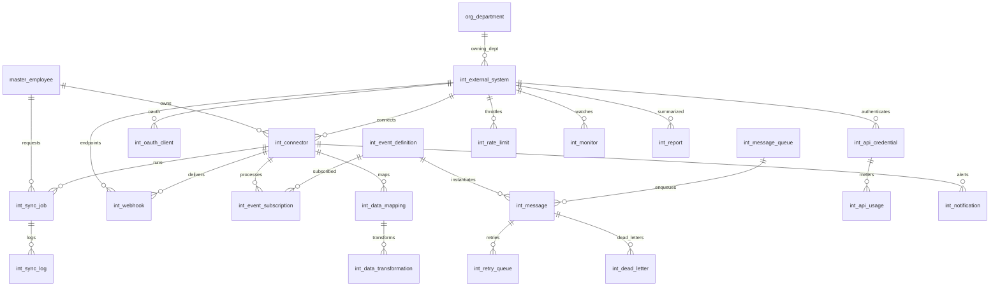

# ERD_21 — Enterprise Integration Hub

**Document:** Enterprise ERD — Enterprise Integration Hub Domain  
**Version:** 1.0  
**Status:** Locked — Ready for Sprint 21 Implementation Planning  
**Schema:** `integration`  
**Table Prefix:** `int_`  
**Aligned To:** BRD v1.0 · FRD-21 Integration Hub & Enterprise Platform Services · SDD v1.1 · DBS v1.1 · Architecture Lock v1.1  
**Functional Requirements:** [FRD-21 Integration Hub & Enterprise Platform Services](../02_FRD/FRD-21-Integration-Hub-Enterprise-Platform-Services.md)  
**Classification:** Internal — Confidential  
**Prior Release:** [ERP Core v1.15-beta](../07_RELEASES/ERP_Core_v1.15-beta.md)  

> **C-01 note:** Party / item identity remains **`master.master_employee`**, **`master.master_customer`**, **`master.master_vendor`**, and **`master.master_product`**. Integration Hub **never** invents parallel masters. **No operational business data** lives in `integration`. Peers communicate via **events · webhooks · REST · UUID refs** — **never** via peer ORM writes.

---

## 1. Functional Overview (Purpose)

The Enterprise Integration Hub provides the **centralized integration platform** for REST connectivity, webhooks, event publish/subscribe, message queues, retry / dead-letter processing, API credentials and OAuth clients, external systems and connectors, scheduled sync, mapping / transformation, sync logs, API usage metering, rate limiting, integration notifications, monitoring, and reporting (FRD-21 §5–§7 · §18–§19).

This module **does not provide business functionality**. It is the **enterprise connectivity layer**. Operational records remain in Sales · Procurement · Inventory · … · Analytics. Integration Hub **orchestrates** exchange only.

Integration Hub **depends on** Foundation, Organization, and Master Data. It **consumes existing masters only (C-01)** — **`master_employee`**, **`master_customer`**, **`master_vendor`**, **`master_product`**, and **`org_department`**.

**Finance remains the only accounting system.** Integration Hub **never** ORM-writes `fin_*` and **does not** call `PostingService`. Finance **may publish events only**.

Every ERP module **may publish events**. The Hub **consumes / routes** events. The Hub **never writes directly** into Sales · Procurement · Inventory · Manufacturing · Quality · CRM · HR · Payroll · Recruitment · Project · Asset · Service · Helpdesk · Document · GRC · Analytics.

**Business Tables: 20**  
**Schema: `integration`**

### Enterprise Integration Modules (FRD-21 · Sprint 21 focus)

| # | Module | Primary Tables | Primary Consumers |
|---|--------|----------------|-------------------|
| 1 | Systems & Connectors | `int_external_system`, `int_connector` | Integration engineers |
| 2 | Security | `int_api_credential`, `int_oauth_client` | API managers |
| 3 | Webhooks & Events | `int_webhook`, `int_event_definition`, `int_event_subscription` | All ERP publishers / external receivers |
| 4 | Messaging | `int_message_queue`, `int_message`, `int_retry_queue`, `int_dead_letter` | Operators · workers |
| 5 | Transform & Sync | `int_data_mapping`, `int_data_transformation`, `int_sync_job`, `int_sync_log` | Stewards · connectors |
| 6 | Governance & Ops | `int_api_usage`, `int_rate_limit`, `int_notification`, `int_monitor`, `int_report` | Admins · SRE |

**PostgreSQL Schema:** `integration` (Sprint 21 introduction)

### Architectural Position

```text
Foundation (ERD_01) ── Workflow, Audit, RBAC, Platform Notification (unchanged owners)
Organization (ERD_02) ── Company, Branch, Department
Master Data (ERD_03) ── employee · customer · vendor · product (C-01)
All ERP domains ── PUBLISH events / CALL REST / RECEIVE webhooks (no Hub peer writes)
Finance (ERD_04) ── PUBLISH events only (no PostingService from Hub)
        ↓
Integration Hub (ERD_21) ── System · Connector · Event · Queue · Sync · DLQ
        ↓
External Systems · Banks · Tax · E-Commerce (FRD-22) · Third parties
```

### API Mount (planned)

**`/api/v1/integration`** — routers for all aggregates (external-systems, connectors, api-credentials, oauth-clients, webhooks, event-definitions, event-subscriptions, message-queues, messages, retry-queues, dead-letters, data-mappings, data-transformations, sync-jobs, sync-logs, api-usages, rate-limits, notifications, monitors, reports).

---

## 2. Scope & Business Rules

### In Scope
- **External systems** and **connectors** (REST / webhook / queue adapters) — FRD-21 §5
- **API credentials** and **OAuth clients**
- **Webhooks** inbound / outbound — FRD-21 §7
- **Event definitions** and **subscriptions** — FRD-21 §6
- **Message queues**, **messages**, **retry**, **dead-letter**
- **Mappings**, **transformations**, **sync jobs**, **sync logs**
- **API usage**, **rate limits**, **notifications**, **monitors**, **reports**
- Workflow, RBAC, Celery stubs (planning)

### Out of Scope (Phase 2 / Separate)
- Replacing Foundation **Workflow Engine / IAM / SSO / Notification Engine** ownership — Hub **uses** Foundation; does not duplicate `wf_*` / `sec_*` masters
- Full **API Gateway product** (Kong / Envoy) — Phase 1: rate limit + usage metadata
- Full **payment / banking / GST vendor SDKs** — Phase 1: connector + credential shells (FRD-21 §13–§15 deferred product embeds)
- Duplicate `int_employee` / `int_customer` / `int_vendor` / `int_product` / `int_department` — **forbidden (C-01)**
- Direct ORM writes to any peer business schema
- SQLAlchemy models, Alembic migrations, application code (implementation sprint)
- E-Commerce channel domain (FRD-22) — consumes Hub later

### Business Rules
1. **No operational business data** in `integration` — payloads are opaque JSON/event envelopes only
2. **C-01:** owners / contacts resolve via Master Data only
3. Soft delete + version on mutable `int_*` tables
4. Numbers company-scoped (`SYS-` / `CON-` / `WHK-` / `EVT-` / `MSG-` / `SYN-` / `DLQ-`)
5. Credentials store **secret ref / vault key** — never plaintext secrets in DB
6. Retry: max attempts + backoff; exhaust → `int_dead_letter`
7. Sync jobs may **push/pull** via connector only — never update peer tables via Hub ORM
8. Finance: events in / events out — **no PostingService**
9. Hub consumes peer events by **subscription**; peers write Hub only through published event APIs / enqueue services (not Hub writing peer DBs)

### Dependencies

| Upstream | Tables / Services Used |
|----------|------------------------|
| ERD_01 Foundation | `sec_tenant`, `sec_user`, `wf_definition`, `wf_instance`, platform audit / notification |
| ERD_02 Organization | `org_company`, `org_branch`, `org_department` |
| ERD_03 Master Data | **`master_employee`**, **`master_customer`**, **`master_vendor`**, **`master_product`** |
| ERD_04–ERD_20 peers | Event publishers / webhook callers — **no peer FKs / no peer writes from Hub** |

---

## 3. Table Inventory

| # | Table | Classification | tenant_id | company_id | Soft Delete | Version | Workflow |
|---|-------|----------------|-----------|------------|-------------|---------|----------|
| 1 | `int_external_system` | Catalog | ✅ | ✅ | ✅ | ✅ | — |
| 2 | `int_connector` | Catalog / Transaction | ✅ | ✅ | ✅ | ✅ | ✅ |
| 3 | `int_api_credential` | Secret Config | ✅ | ✅ | ✅ | ✅ | ✅ |
| 4 | `int_oauth_client` | Secret Config | ✅ | ✅ | ✅ | ✅ | — |
| 5 | `int_webhook` | Config | ✅ | ✅ | ✅ | ✅ | ✅ |
| 6 | `int_event_definition` | Catalog | ✅ | ✅ | ✅ | ✅ | — |
| 7 | `int_event_subscription` | Config | ✅ | ✅ | ✅ | ✅ | — |
| 8 | `int_message_queue` | Catalog | ✅ | ✅ | ✅ | ✅ | — |
| 9 | `int_message` | Message | ✅ | ✅ | ✅ | ✅ | — |
| 10 | `int_retry_queue` | Job | ✅ | ✅ | ✅ | ✅ | ✅ |
| 11 | `int_dead_letter` | Archive | ✅ | ✅ | ✅ | ✅ | — |
| 12 | `int_data_mapping` | Config | ✅ | ✅ | ✅ | ✅ | — |
| 13 | `int_data_transformation` | Config | ✅ | ✅ | ✅ | ✅ | — |
| 14 | `int_sync_job` | Job | ✅ | ✅ | ✅ | ✅ | ✅ |
| 15 | `int_sync_log` | Log | ✅ | ✅ | ✅ | ✅ | — |
| 16 | `int_api_usage` | Meter | ✅ | ✅ | ✅ | ✅ | — |
| 17 | `int_rate_limit` | Config | ✅ | ✅ | ✅ | ✅ | — |
| 18 | `int_notification` | Notification | ✅ | ✅ | ✅ | ✅ | — |
| 19 | `int_monitor` | Health | ✅ | ✅ | ✅ | ✅ | — |
| 20 | `int_report` | Snapshot | ✅ | ✅ | ✅ | ✅ | — |

**Business Tables: 20** · **Schema: `integration`**

---

## 4. Entity Relationships

### Mermaid ER Diagram



### ASCII Relationship Overview

```text
org_company / org_branch / org_department
master_employee / master_customer / master_vendor / master_product (C-01)
    └── int_external_system
            ├── int_connector
            │       ├── int_webhook
            │       ├── int_data_mapping → int_data_transformation
            │       ├── int_sync_job → int_sync_log
            │       └── int_notification
            ├── int_api_credential → int_api_usage / int_rate_limit
            ├── int_oauth_client
            └── int_monitor / int_report
    └── int_event_definition
            └── int_event_subscription
                    └── int_connector
    └── int_message_queue → int_message
            ├── int_retry_queue
            └── int_dead_letter

Optional UUID-only (no FK): source_module_ref_id, entity_ref_id, sales_*, procurement_*,
  inventory_*, manufacturing_*, quality_*, crm_*, hr_*, pay_*, recruitment_*, project_*,
  asset_*, service_*, helpdesk_*, document_*, grc_*, analytics_*, finance_event_ref_id
```

---

## 5. Detailed Table Definitions

### 5.1 `int_external_system`

| Column | Notes |
|--------|-------|
| `system_number` | `SYS-YYYY-NNNNNN` |
| `system_code` / `system_name` | UK `(company_id, system_code)` |
| `system_type` | bank, payment_gateway, tax, ecommerce, crm_external, custom — FRD-21 §5 |
| `base_url` | VARCHAR |
| `environment` | sandbox, production |
| `owner_employee_id` | FK → `master_employee` |
| `department_id` | FK optional → `org_department` |
| `vendor_id` / `customer_id` | FK optional (C-01 party for B2B integrations) |
| `status` | draft, active, inactive, retired |
| **UK:** `(company_id, system_number)` |

---

### 5.2 `int_connector`

| Column | Notes |
|--------|-------|
| `connector_number` | `CON-YYYY-NNNNNN` |
| `connector_code` / `connector_name` | — |
| `external_system_id` | FK → `int_external_system` |
| `connector_protocol` | rest, webhook, queue, sftp, soap |
| `direction` | inbound, outbound, bidirectional |
| `owner_employee_id` | FK → `master_employee` |
| `config_json` | JSONB (endpoints, headers templates — no secrets) |
| `credential_id` / `oauth_client_id` | FK optional |
| `status` | draft, submitted, approved, active, inactive, failed, retired |
| `workflow_*` | Connector approval |
| **UK:** `(company_id, connector_number)` |

---

### 5.3 `int_api_credential`

| Column | Notes |
|--------|-------|
| `credential_number` | `CRD-YYYY-NNNNNN` |
| `external_system_id` | FK |
| `credential_type` | api_key, basic, bearer, custom_header |
| `secret_vault_ref` | VARCHAR — vault/path only |
| `key_hint` | VARCHAR masked hint |
| `expires_at` | TIMESTAMPTZ |
| `rotated_at` | TIMESTAMPTZ |
| `owner_employee_id` | FK → `master_employee` |
| `status` | draft, submitted, approved, active, expired, revoked |
| `workflow_*` | API credential approval |
| **UK:** `(company_id, credential_number)` |

---

### 5.4 `int_oauth_client`

| Column | Notes |
|--------|-------|
| `client_number` | `OAU-YYYY-NNNNNN` |
| `external_system_id` | FK |
| `client_id_public` | VARCHAR |
| `client_secret_vault_ref` | VARCHAR |
| `token_url` / `authorize_url` / `scopes` | — |
| `grant_type` | client_credentials, authorization_code, refresh_token |
| `token_expires_at` | TIMESTAMPTZ |
| `status` | draft, active, revoked |
| **UK:** `(company_id, client_number)` |

---

### 5.5 `int_webhook`

| Column | Notes |
|--------|-------|
| `webhook_number` | `WHK-YYYY-NNNNNN` |
| `external_system_id` / `connector_id` | FK optional/required as applicable |
| `direction` | inbound, outbound |
| `target_url` | VARCHAR |
| `event_definition_id` | FK optional |
| `secret_vault_ref` | signing secret ref |
| `is_enabled` | BOOLEAN |
| `owner_employee_id` | FK |
| `status` | draft, submitted, approved, active, paused, retired |
| `workflow_*` | Webhook approval |
| **UK:** `(company_id, webhook_number)` |

---

### 5.6 `int_event_definition`

| Column | Notes |
|--------|-------|
| `event_code` / `event_name` | UK `(tenant_id, event_code)` or company-scoped |
| `source_module` | foundation, finance, sales, procurement, inventory, manufacturing, quality, crm, hr, payroll, recruitment, project, asset, service, helpdesk, document, grc, analytics, integration, external |
| `payload_schema_json` | JSONB |
| `is_active` | BOOLEAN |
| `version_no` | INT |
| `status` | draft, active, deprecated |

---

### 5.7 `int_event_subscription`

| Column | Notes |
|--------|-------|
| `subscription_number` | `ESB-YYYY-NNNNNN` |
| `event_definition_id` | FK |
| `subscriber_type` | webhook, queue, connector, internal_handler |
| `webhook_id` / `message_queue_id` / `connector_id` | one required (service-enforced) |
| `filter_json` | JSONB |
| `status` | active, paused, cancelled |
| **UK:** `(company_id, subscription_number)` |

---

### 5.8 `int_message_queue`

| Column | Notes |
|--------|-------|
| `queue_code` / `queue_name` | UK `(company_id, queue_code)` |
| `queue_type` | standard, fifo, priority |
| `max_retries` | INT |
| `visibility_timeout_sec` | INT |
| `status` | active, paused, drained |

---

### 5.9 `int_message`

| Column | Notes |
|--------|-------|
| `message_number` | `MSG-YYYY-NNNNNN` |
| `message_queue_id` | FK |
| `event_definition_id` | FK optional |
| `correlation_id` | UUID / VARCHAR |
| `payload_json` | JSONB — opaque envelope |
| `source_module` | VARCHAR |
| `entity_ref_id` | UUID optional — **no peer FK** |
| `priority` | INT |
| `available_at` | TIMESTAMPTZ |
| `status` | queued, processing, succeeded, failed, dead_lettered, cancelled |
| **UK:** `(company_id, message_number)` |

---

### 5.10 `int_retry_queue`

| Column | Notes |
|--------|-------|
| `retry_number` | `RTY-YYYY-NNNNNN` |
| `message_id` | FK → `int_message` |
| `attempt_no` | INT |
| `next_attempt_at` | TIMESTAMPTZ |
| `last_error` | TEXT |
| `status` | pending, processing, succeeded, exhausted, cancelled |
| `workflow_*` | Retry review (when gated) |
| **UK:** `(company_id, retry_number)` |

---

### 5.11 `int_dead_letter`

| Column | Notes |
|--------|-------|
| `dlq_number` | `DLQ-YYYY-NNNNNN` |
| `message_id` | FK |
| `retry_id` | FK optional |
| `reason` | TEXT |
| `payload_json` | JSONB copy |
| `failed_at` | TIMESTAMPTZ |
| `reprocessed_at` | TIMESTAMPTZ |
| `status` | open, reprocessed, discarded |
| **UK:** `(company_id, dlq_number)` |

---

### 5.12 `int_data_mapping`

| Column | Notes |
|--------|-------|
| `mapping_code` / `mapping_name` | UK `(company_id, mapping_code)` |
| `connector_id` | FK |
| `source_entity` / `target_entity` | logical names (not peer tables) |
| `mapping_json` | JSONB field map |
| `status` | draft, active, inactive |

---

### 5.13 `int_data_transformation`

| Column | Notes |
|--------|-------|
| `transformation_code` / `transformation_name` | — |
| `mapping_id` | FK → `int_data_mapping` |
| `transform_type` | jolt, template, script_ref, expression |
| `definition_json` | JSONB |
| `sequence_no` | INT |
| `status` | draft, active, inactive |
| **UK soft:** `(mapping_id, transformation_code)` |

---

### 5.14 `int_sync_job`

| Column | Type | Nullable | Description |
|--------|------|----------|-------------|
| `id` | UUID | NO | PK |
| `tenant_id` / `company_id` | UUID | NO | Scope |
| `sync_number` | VARCHAR(50) | NO | `SYN-YYYY-NNNNNN` |
| `connector_id` | UUID | NO | FK → `int_connector` |
| `mapping_id` | UUID | YES | FK → `int_data_mapping` |
| `sync_mode` | VARCHAR(30) | NO | full, incremental, realtime |
| `direction` | VARCHAR(20) | NO | pull, push, bidirectional |
| `schedule_cron` | VARCHAR | YES | — |
| `requested_by_employee_id` | UUID | NO | FK → `master_employee` |
| `started_at` / `completed_at` | TIMESTAMPTZ | YES | — |
| `rows_processed` | INT | YES | — |
| `status` | VARCHAR(30) | NO | draft, submitted, approved, queued, running, succeeded, failed, cancelled |
| `workflow_*` | | | Sync approval |
| AUDIT_STD + SOFT_DELETE_OPT + version | | | |

**UK:** `(company_id, sync_number)`.  
**Rule:** Sync executes via connector adapters only — **never** ORM-writes peer schemas.

---

### 5.15 `int_sync_log`

| Column | Notes |
|--------|-------|
| `sync_job_id` | FK |
| `logged_at` | TIMESTAMPTZ |
| `level` | info, warn, error |
| `message` | TEXT |
| `entity_ref_id` | UUID optional — **no peer FK** |
| `payload_json` | JSONB optional |
| `status` | recorded |

---

### 5.16 `int_api_usage`

| Column | Notes |
|--------|-------|
| `credential_id` / `oauth_client_id` / `connector_id` | optional FKs |
| `occurred_at` | TIMESTAMPTZ |
| `endpoint` | VARCHAR |
| `http_method` | VARCHAR |
| `status_code` | INT |
| `latency_ms` | INT |
| `bytes_in` / `bytes_out` | BIGINT |
| `status` | recorded |

---

### 5.17 `int_rate_limit`

| Column | Notes |
|--------|-------|
| `limit_code` | UK `(company_id, limit_code)` |
| `external_system_id` / `credential_id` / `connector_id` | optional scope |
| `window_seconds` | INT |
| `max_requests` | INT |
| `burst_max` | INT optional |
| `status` | active, inactive |

---

### 5.18 `int_notification`

| Column | Notes |
|--------|-------|
| `related_entity_type` | connector, webhook, sync, retry, dlq, credential, monitor |
| `related_entity_id` | UUID |
| `notification_type` | sync_failed, dlq_created, credential_expiring, rate_limit_hit, monitor_down, other |
| `recipient_user_id` / `recipient_employee_id` | UUID refs |
| `payload_json` | JSONB |
| `sent_at` | TIMESTAMPTZ |
| `delivery_status` | pending, sent, failed, read |
| `status` | active, archived |

---

### 5.19 `int_monitor`

| Column | Notes |
|--------|-------|
| `monitor_code` / `monitor_name` | UK |
| `external_system_id` / `connector_id` | FK optional |
| `check_type` | heartbeat, latency, error_rate, queue_depth |
| `threshold_json` | JSONB |
| `last_checked_at` / `last_status` | — |
| `status` | healthy, degraded, down, unknown, inactive |

---

### 5.20 `int_report`

| Column | Notes |
|--------|-------|
| `report_code` | UK `(company_id, report_code)` |
| `report_type` | delivery_success, dlq_aging, sync_performance, api_usage, rate_limit_breaches, connector_health |
| `period_start` / `period_end` | DATE |
| `metrics_json` | JSONB |
| `generated_at` | TIMESTAMPTZ |
| `status` | draft, finalized |

---

## 6. Primary Keys / Foreign Keys (summary)

**PKs:** `pk_int_*` on `id` for all 20 tables.

**FKs (authoritative only):**
- `*_employee_id` → `master.master_employee`
- optional `customer_id` / `vendor_id` / `product_id` → masters (C-01)
- `department_id` → `organization.org_department`
- Hub-internal FKs among `int_*` parents
- `workflow_instance_id` → `foundation.wf_instance`

**No FK to:** any peer operational schema (`fin_*`, `sales_*`, `doc_*`, `grc_*`, `bi_*`, …).  
**Finance:** event refs UUID only; **no PostingService**; **no `fin_*` writes**.

---

## 7. Naming Convention

| Artifact | Convention |
|----------|------------|
| Schema | `integration` |
| Tables | `int_*` |
| ORM | `Int*` |
| Package | `modules/integration` |
| API | `/api/v1/integration` |
| Permissions | `integration.*` |
| Workflows | `INT_*` |
| Celery | `integration.*` |

| Number | Format |
|--------|--------|
| System / Connector / Credential / OAuth / Webhook / Subscription / Message / Retry / DLQ / Sync | `SYS-` `CON-` `CRD-` `OAU-` `WHK-` `ESB-` `MSG-` `RTY-` `DLQ-` `SYN-` + `YYYY-NNNNNN` |

---

## 8. Status Lifecycles (selected)

| Entity | Statuses |
|--------|----------|
| External System | draft → active ↔ inactive → retired |
| Connector / Webhook / Credential | draft → submitted → approved → active ↔ inactive/paused → retired/revoked \| failed |
| OAuth Client | draft → active → revoked |
| Event Definition | draft → active → deprecated |
| Subscription / Queue | active ↔ paused → cancelled/drained |
| Message | queued → processing → succeeded \| failed → dead_lettered \| cancelled |
| Retry | pending → processing → succeeded \| exhausted \| cancelled |
| Dead Letter | open → reprocessed \| discarded |
| Sync Job | draft → submitted → approved → queued → running → succeeded \| failed \| cancelled |
| Mapping / Transformation / Rate Limit | draft → active ↔ inactive |
| Usage / Sync Log / Monitor check rows | recorded / healthy|degraded|down |
| Notification | active → archived |
| Report | draft → finalized |

---

## 9. Workflow Matrix

| Workflow Code | Document | Path |
|---------------|----------|------|
| `INT_CONNECTOR_APPROVAL` | Connector | Engineer → API Manager → Integration Admin |
| `INT_WEBHOOK_APPROVAL` | Webhook | Engineer → API Manager → Integration Admin |
| `INT_API_CREDENTIAL_APPROVAL` | API Credential | Engineer → API Manager → Integration Admin |
| `INT_SYNC_APPROVAL` | Sync Job | Engineer → System Operator → Integration Admin |
| `INT_RETRY_REVIEW` | Retry / DLQ gate | System Operator → Integration Admin |

Seed only; instances on Foundation `wf_instance`. `is_parallel` on **`wf_step`** only.

---

## 10. RBAC Matrix

**Namespace:** `integration.*`  
**Roles** (`status='active'`): `INTEGRATION_ADMIN`, `INTEGRATION_ENGINEER`, `API_MANAGER`, `SYSTEM_OPERATOR`

| Resource | Permissions (planned) |
|----------|------------------------|
| `integration.system` / `integration.connector` | read, create, update, submit, approve |
| `integration.credential` / `integration.oauth` | read, create, update, submit, approve, rotate |
| `integration.webhook` | read, create, update, submit, approve |
| `integration.event` / `integration.subscription` | read, create, update |
| `integration.queue` / `integration.message` | read, create, requeue |
| `integration.retry` / `integration.dlq` | read, review, reprocess |
| `integration.mapping` / `integration.transformation` | read, create, update |
| `integration.sync` | read, create, submit, approve, run |
| `integration.usage` / `integration.rate_limit` | read, create, update |
| `integration.notification` / `integration.monitor` | read, acknowledge |
| `integration.report` | read, export |

---

## 11. Migration Plan

Prior Alembic head: **`0376_seed_analytics_workflows`**.

Revision budget **`0377`–`0398` (22 revisions)**. Schema + 20 tables + permissions + workflows = 23 logical steps → **`int_retry_queue` and `int_dead_letter` share one migration**.

| Order | Revision ID (≤32 chars) | Tables / Actions |
|-------|-------------------------|------------------|
| 377 | `0377_create_integration_schema` | schema `integration` |
| 378 | `0378_int_external_system` | `int_external_system` |
| 379 | `0379_int_connector` | `int_connector` |
| 380 | `0380_int_api_credential` | `int_api_credential` |
| 381 | `0381_int_oauth_client` | `int_oauth_client` |
| 382 | `0382_int_webhook` | `int_webhook` |
| 383 | `0383_int_event_definition` | `int_event_definition` |
| 384 | `0384_int_event_subscription` | `int_event_subscription` |
| 385 | `0385_int_message_queue` | `int_message_queue` |
| 386 | `0386_int_message` | `int_message` |
| 387 | `0387_int_retry_and_dlq` | `int_retry_queue`, `int_dead_letter` |
| 388 | `0388_int_data_mapping` | `int_data_mapping` |
| 389 | `0389_int_data_transformation` | `int_data_transformation` |
| 390 | `0390_int_sync_job` | `int_sync_job` |
| 391 | `0391_int_sync_log` | `int_sync_log` |
| 392 | `0392_int_api_usage` | `int_api_usage` |
| 393 | `0393_int_rate_limit` | `int_rate_limit` |
| 394 | `0394_int_notification` | `int_notification` |
| 395 | `0395_int_monitor` | `int_monitor` |
| 396 | `0396_int_report` | `int_report` |
| 397 | `0397_seed_int_permissions` | RBAC |
| 398 | `0398_seed_integration_workflows` | Workflows |

**Planned head:** `0398_seed_integration_workflows`

### Celery task stubs (planning)

| Task | Purpose |
|------|---------|
| `integration.retry_processor` | Process due retry-queue rows |
| `integration.dead_letter_reprocessor` | Optional DLQ requeue |
| `integration.webhook_dispatcher` | Outbound webhook delivery |
| `integration.sync_scheduler` | Queue due sync jobs |
| `integration.rate_limit_enforcer` | Soft-enforce / metric rate windows |
| `integration.message_queue_poller` | Poll / dispatch queued messages |

---

## 12. Cross Module Integration & Architecture Validation

### Upstream (Hub Consumes)

| Module | Pattern |
|--------|---------|
| Foundation | tenant, user, workflow, audit, notification services |
| Organization | company, branch, **department** FK |
| Master Data | **employee · customer · vendor · product** (C-01) |
| All ERP domains (incl. Finance) | **Event publish / REST call / webhook register** — Hub stores UUID / payload only |

### Downstream

| Consumer | Pattern |
|----------|---------|
| External systems | Connectors / webhooks / OAuth |
| FRD-22 E-Commerce (future) | Uses Hub connectors — no Hub redesign of channels |
| ERP modules | May receive inbound webhooks → their own APIs (not Hub writing their tables) |

### Hard Rules

| Rule | Enforcement |
|------|-------------|
| C-01 | Masters only; no duplicate parties / products |
| No operational data ownership | Opaque envelopes only |
| No peer ORM writes | Events / webhooks / REST / UUID only |
| No Finance posting | No PostingService; no `fin_*` writes |
| Foundation ownership preserved | No redesign of `wf_*` / IAM / platform notification |
| Architecture Lock v1.1 | Modular Monolith · Clean Architecture · DDD preserved |

---

## 13. Phase Gate Checklist

| # | Gate Criterion | Status |
|---|----------------|--------|
| 1 | Business tables = **20**; schema = **`integration`** | ✅ |
| 2 | Prefix `int_` defined | ✅ |
| 3 | Aligned to FRD-21 Integration Hub (events, webhooks, connectors, retry) | ✅ |
| 4 | Consumes masters only (C-01) | ✅ |
| 5 | No PostingService; no fin_* writes; Finance events only | ✅ |
| 6 | All ERP peers via events/webhooks/REST/UUID; no peer writes | ✅ |
| 7 | Migration order `0377`–`0398`, revision IDs ≤ 32 chars | ✅ |
| 8 | Workflows + RBAC (`integration.*`) + API mount + Celery stubs documented | ✅ |
| 9 | Gateway / payment / GST product embeds deferred without blocking Sprint 21 | ✅ |
| 10 | Architecture Lock v1.1 preserved; no prior module redesign | ✅ |

### ERD Phase Gate — Integration Hub Summary

| Metric | Value |
|--------|-------|
| Business Tables | **20** |
| Schema | **`integration`** |
| Prefix | `int_` |
| API mount | `/api/v1/integration` |
| Migration range | `0377` – `0398` |
| Prior head | `0376_seed_analytics_workflows` |
| Planned head | `0398_seed_integration_workflows` |
| Document Status | **Locked — Ready for Sprint 21 Implementation Planning** |

---

## 14. Document Control

| Version | Date | Change |
|---------|------|--------|
| 1.0 | 2026-07-15 | Initial ERD_21 Enterprise Integration Hub draft for Sprint 21 architecture review |
| 1.1 | 2026-07-15 | Editorial lock for Sprint 21 implementation planning. |

---

**ERD_21 Enterprise Integration Hub is locked and ready for Sprint 21 implementation planning.**
