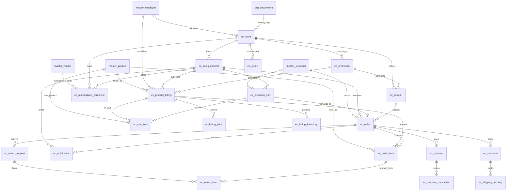

# ERD_22 — E-Commerce / External Channel

**Document:** Enterprise ERD — E-Commerce / External Channel Domain  
**Version:** 1.1  
**Status:** Locked — Ready for Sprint 22 Implementation Planning  
**Schema:** `ecommerce`  
**Table Prefix:** `ec_`  
**Aligned To:** BRD v1.0 · FRD-22 E-Commerce & External Channel Integration · SDD v1.1 · DBS v1.1 · Architecture Lock v1.1  
**Functional Requirements:** [FRD-22 E-Commerce & External Channel Integration Domain](../02_FRD/FRD-22-Ecommerce-External-Channel-Integration-Domain.md)  
**Classification:** Internal — Confidential  
**Prior Release:** [ERP Core v1.16-beta](../07_RELEASES/ERP_Core_v1.16-beta.md)  

> **C-01 note:** Party / item identity remains **`master.master_employee`**, **`master.master_customer`**, **`master.master_vendor`**, and **`master.master_product`**. E-Commerce **never** invents parallel masters. This module **extends ERP to external channels** — it does **not** replace Sales. **Sales remains order-of-record**, **Inventory remains stock authority**, **Finance remains payment accounting authority**, and **Integration Hub** handles external marketplace sync. Peers communicate via **services · events · UUID refs** — **never** via peer ORM writes.

---

## 1. Functional Overview (Purpose)

The E-Commerce / External Channel domain provides the **enterprise omnichannel commerce layer** for online storefronts, sales channels, product publishing, catalog / price / inventory synchronization views, customer carts, channel orders, payments, shipping / tracking, returns, coupons / promotions, marketplace connector bindings, notifications, and channel reports (FRD-22 §1–§15 · §18–§19).

This module **does not replace Sales**. It captures **channel-facing** commerce artifacts and maps confirmed orders into Sales as the **order-of-record**. It **does not own stock** (Inventory remains authoritative) and **does not own GL** (Finance posts only via `PostingService.post_system_journal()`).

E-Commerce **depends on** Foundation, Organization, Master Data, Sales, Inventory, Finance (posting only), and Integration Hub. It **consumes existing masters only (C-01)** — **`master_employee`**, **`master_customer`**, **`master_vendor`**, **`master_product`**, and **`org_department`**.

**Finance remains the only accounting system.** E-Commerce **never** ORM-writes `fin_*`. Any capture / settlement / refund journal uses **`finance_journal_id`** after **`PostingService.post_system_journal()`** only.

**Business Tables: 20**  
**Schema: `ecommerce`**

### Enterprise E-Commerce Modules (FRD-22 · Sprint 22 focus)

| # | Module | Primary Tables | Primary Consumers |
|---|--------|----------------|-------------------|
| 1 | Storefront & Channels | `ec_store`, `ec_sales_channel` | Store operators · marketplace managers |
| 2 | Catalog Publishing | `ec_product_listing`, `ec_listing_price`, `ec_listing_inventory` | Merchandisers · channel ops |
| 3 | Cart | `ec_customer_cart`, `ec_cart_item` | Storefront · mobile |
| 4 | Orders | `ec_order`, `ec_order_item` | Channel ops · Sales mapping |
| 5 | Payments | `ec_payment`, `ec_payment_transaction` | Finance · gateways |
| 6 | Fulfillment | `ec_shipment`, `ec_shipping_tracking` | Warehouse · carriers |
| 7 | Returns | `ec_return_request`, `ec_return_item` | CS · warehouse |
| 8 | Merchandising | `ec_coupon`, `ec_promotion` | Marketing · managers |
| 9 | Marketplace | `ec_marketplace_connector` | Marketplace managers · Integration Hub |
| 10 | Ops & Insights | `ec_notification`, `ec_report` | Operators · analysts |

**PostgreSQL Schema:** `ecommerce` (Sprint 22 introduction)

### Architectural Position

```text
Foundation (ERD_01) ── Workflow, Audit, RBAC, Platform Notification (unchanged owners)
Organization (ERD_02) ── Company, Branch, Department
Master Data (ERD_03) ── employee · customer · vendor · product (C-01)
Sales (ERD_05) ── ORDER-OF-RECORD (UUID map from channel order → sales_order)
Inventory (ERD_08) ── STOCK AUTHORITY (listing inventory is channel projection only)
Finance (ERD_04) ── PostingService.post_system_journal() ONLY (no fin_* ORM writes)
Integration Hub (ERD_21) ── marketplace / website / carrier sync (connectors · webhooks · queues)
        ↓
E-Commerce / External Channel (ERD_22) ── Store · Channel · Listing · Cart · Order · Pay · Ship · Return
        ↓
Website · Mobile · Marketplaces · B2B / dealer portals
```

### API Mount (planned)

**`/api/v1/ecommerce`** — routers for all aggregates (stores, sales-channels, product-listings, listing-prices, listing-inventories, customer-carts, cart-items, orders, order-items, payments, payment-transactions, shipments, shipping-trackings, return-requests, return-items, coupons, promotions, marketplace-connectors, notifications, reports).

---

## 2. Scope & Business Rules

### In Scope
- **Online storefronts** and **sales channels** — FRD-22 §9–§13
- **Product listings**, **listing prices**, **listing inventory projections** — FRD-22 §4–§5 · §11
- **Customer carts** and **cart items**
- **Channel orders** and **order items** with map-to-Sales
- **Payments** and **payment transactions** (gateway envelopes)
- **Shipments** and **shipping tracking** — FRD-22 §15
- **Return requests** and **return items** — FRD-22 §14
- **Coupons** and **promotions** — FRD-22 §12
- **Marketplace connector** bindings (Hub UUID) — FRD-22 §8
- **Notifications** and **channel reports**
- Workflow, RBAC, Celery stubs (planning)

### Out of Scope (Phase 2 / Separate)
- Replacing **Sales** order / invoice / delivery ownership — channel order **maps into** Sales; Sales remains order-of-record
- Replacing **Inventory** stock ledgers / reservations ownership — listing inventory is a **channel mirror**, not stock truth
- Full **payment gateway SDK product** — Phase 1: payment / transaction shells + PostingService path
- Full **carrier label engine product** — Phase 1: shipment + tracking metadata
- Duplicate `ec_employee` / `ec_customer` / `ec_vendor` / `ec_product` / `ec_department` — **forbidden (C-01)**
- Direct ORM writes to any peer business schema
- SQLAlchemy models, Alembic migrations, application code (implementation sprint)

### Business Rules
1. **Sales remains order-of-record** — `ec_order.sales_order_id` is UUID-only; Hub/services create Sales orders — **no `sales_*` ORM writes from E-Commerce**
2. **Inventory remains stock authority** — `ec_listing_inventory` is channel ATP projection; stock moves via Inventory services / events only
3. **Finance:** capture / settle / refund journals **only** via `PostingService.post_system_journal()`; store `finance_journal_id` UUID — **no `fin_*` ORM writes**
4. **Integration Hub** owns external marketplace / website / carrier transport — `ec_marketplace_connector` stores Hub connector UUID only
5. **C-01:** customers / products / vendors / employees / department resolve via Master Data / Organization only
6. Soft delete + version on mutable `ec_*` tables
7. Numbers company-scoped (`STO-` / `CHN-` / `LST-` / `CRT-` / `ECO-` / `PAY-` / `SHP-` / `RET-` / `CPN-` / `PRO-` / `MPK-`)
8. Credentials / gateway secrets are **vault refs** — never plaintext in DB
9. Analytics / Document / Helpdesk / Service / peers consume via UUID / events — **no peer ORM writes**

### Assumptions
- One `ec_store` may host many `ec_sales_channel` rows (web, mobile, marketplace brand store)
- A channel order may exist before Sales mapping; mapping is required before fulfillment accounting close
- Coupons and promotions attach to channel / store scope; order application stores coupon UUID on order
- Marketplace platforms (Amazon, Flipkart, Shopify, …) are represented as channel + marketplace connector, not as duplicate product masters

### Dependencies

| Upstream | Tables / Services Used |
|----------|------------------------|
| ERD_01 Foundation | `sec_tenant`, `sec_user`, `wf_definition`, `wf_instance`, platform audit / notification |
| ERD_02 Organization | `org_company`, `org_branch`, `org_department` |
| ERD_03 Master Data | **`master_employee`**, **`master_customer`**, **`master_vendor`**, **`master_product`** |
| ERD_05 Sales | Order-of-record via **service / UUID** — **no Sales ORM writes** |
| ERD_08 Inventory | Stock authority via **service / events / UUID** — **no Inventory ORM writes** |
| ERD_04 Finance | **`PostingService.post_system_journal()`** only |
| ERD_21 Integration Hub | Connector / webhook / sync UUID refs — **no Hub table ORM writes from E-Commerce adapters beyond published APIs** |

---

## 3. Table Inventory

| # | Table | Classification | tenant_id | company_id | Soft Delete | Version | Workflow |
|---|-------|----------------|-----------|------------|-------------|---------|----------|
| 1 | `ec_store` | Catalog | ✅ | ✅ | ✅ | ✅ | ✅ |
| 2 | `ec_sales_channel` | Catalog | ✅ | ✅ | ✅ | ✅ | — |
| 3 | `ec_product_listing` | Catalog / Transaction | ✅ | ✅ | ✅ | ✅ | ✅ |
| 4 | `ec_listing_price` | Config | ✅ | ✅ | ✅ | ✅ | — |
| 5 | `ec_listing_inventory` | Projection | ✅ | ✅ | ✅ | ✅ | — |
| 6 | `ec_customer_cart` | Transaction | ✅ | ✅ | ✅ | ✅ | — |
| 7 | `ec_cart_item` | Transaction Detail | ✅ | ✅ | ✅ | ✅ | — |
| 8 | `ec_order` | Transaction | ✅ | ✅ | ✅ | ✅ | ✅ |
| 9 | `ec_order_item` | Transaction Detail | ✅ | ✅ | ✅ | ✅ | — |
| 10 | `ec_payment` | Transaction | ✅ | ✅ | ✅ | ✅ | — |
| 11 | `ec_payment_transaction` | Ledger Detail | ✅ | ✅ | ✅ | ✅ | — |
| 12 | `ec_shipment` | Transaction | ✅ | ✅ | ✅ | ✅ | — |
| 13 | `ec_shipping_tracking` | Event Log | ✅ | ✅ | ✅ | ✅ | — |
| 14 | `ec_return_request` | Transaction | ✅ | ✅ | ✅ | ✅ | ✅ |
| 15 | `ec_return_item` | Transaction Detail | ✅ | ✅ | ✅ | ✅ | — |
| 16 | `ec_coupon` | Config | ✅ | ✅ | ✅ | ✅ | — |
| 17 | `ec_promotion` | Config | ✅ | ✅ | ✅ | ✅ | — |
| 18 | `ec_marketplace_connector` | Config | ✅ | ✅ | ✅ | ✅ | ✅ |
| 19 | `ec_notification` | Notification | ✅ | ✅ | ✅ | ✅ | — |
| 20 | `ec_report` | Snapshot | ✅ | ✅ | ✅ | ✅ | — |

**Business Tables: 20** · **Schema: `ecommerce`**

---

## 4. Entity Relationships

### Mermaid ER Diagram



### ASCII Relationship Overview

```text
org_company / org_branch / org_department
master_employee / master_customer / master_vendor / master_product (C-01)
    └── ec_store
            ├── ec_sales_channel
            │       ├── ec_product_listing ── master_product
            │       │       ├── ec_listing_price
            │       │       └── ec_listing_inventory   (channel projection; Inventory = stock truth)
            │       ├── ec_customer_cart ── master_customer
            │       │       └── ec_cart_item → ec_product_listing / master_product
            │       ├── ec_order ── master_customer · optional coupon
            │       │       ├── ec_order_item → listing / master_product
            │       │       ├── ec_payment → ec_payment_transaction
            │       │       │       └── finance_journal_id (PostingService only)
            │       │       ├── ec_shipment → ec_shipping_tracking
            │       │       └── ec_return_request → ec_return_item
            │       └── ec_notification
            ├── ec_marketplace_connector
            │       └── int_connector_id / int_external_system_id (UUID — Integration Hub)
            ├── ec_coupon
            ├── ec_promotion
            │       └── ec_coupon
            └── ec_report

Optional UUID-only (no FK): sales_order_id, sales_order_line_id, inventory_reservation_id,
  inventory_item_id, warehouse_id, int_connector_id, int_sync_job_id, int_message_id,
  crm_interaction_id, document_id, helpdesk_ticket_id, service_request_id, bi_dataset_ref_id,
  finance_journal_id, project_id, asset_id, qm_*, mfg_*, hr_*, pay_*, recruitment_*
```

---

## 5. Detailed Table Definitions

### 5.1 `ec_store`

| Column | Notes |
|--------|-------|
| `store_number` | `STO-YYYY-NNNNNN` |
| `store_code` / `store_name` | UK `(company_id, store_code)` |
| `store_type` | b2c, b2b, marketplace_brand, headless, portal — FRD-22 §13 |
| `default_currency` | CHAR(3) |
| `timezone` | VARCHAR |
| `owner_employee_id` | FK → `master_employee` |
| `department_id` | FK optional → `org_department` |
| `branch_id` | UUID optional → org branch (UUID or FK per org pattern) |
| `status` | draft, submitted, approved, active, inactive, retired |
| `workflow_*` | Store approval |
| **UK:** `(company_id, store_number)` |

---

### 5.2 `ec_sales_channel`

| Column | Notes |
|--------|-------|
| `channel_number` | `CHN-YYYY-NNNNNN` |
| `channel_code` / `channel_name` | UK `(company_id, channel_code)` |
| `store_id` | FK → `ec_store` |
| `channel_type` | website, mobile_app, amazon, flipkart, shopify, woocommerce, magento, ebay, etsy, custom_marketplace, dealer_portal, distributor_portal |
| `external_channel_ref` | VARCHAR — marketplace / CMS store id |
| `is_active` | BOOLEAN |
| `config_json` | JSONB (locale, catalog filters — no secrets) |
| `status` | draft, active, paused, retired |
| **UK:** `(company_id, channel_number)` |

---

### 5.3 `ec_product_listing`

| Column | Notes |
|--------|-------|
| `listing_number` | `LST-YYYY-NNNNNN` |
| `sales_channel_id` | FK → `ec_sales_channel` |
| `product_id` | FK → `master_product` |
| `external_sku` / `external_listing_id` | channel SKU / ASIN / handle |
| `title` / `description` | channel-facing copy |
| `attributes_json` | JSONB |
| `published_by_employee_id` | FK → `master_employee` |
| `published_at` | TIMESTAMPTZ |
| `status` | draft, submitted, approved, published, unpublished, archived |
| `workflow_*` | Listing approval |
| **UK:** `(company_id, listing_number)` · soft UK `(sales_channel_id, product_id)` when active |

---

### 5.4 `ec_listing_price`

| Column | Notes |
|--------|-------|
| `product_listing_id` | FK → `ec_product_listing` |
| `price_type` | retail, wholesale, contract, promotional — FRD-22 §11 |
| `currency` | CHAR(3) |
| `list_price` / `sale_price` | NUMERIC |
| `effective_from` / `effective_to` | TIMESTAMPTZ |
| `promotion_id` | FK optional → `ec_promotion` |
| `status` | draft, active, expired, superseded |
| **UK soft:** `(product_listing_id, price_type, effective_from)` |

---

### 5.5 `ec_listing_inventory`

| Column | Notes |
|--------|-------|
| `product_listing_id` | FK → `ec_product_listing` |
| `warehouse_id` | UUID optional — **no Inventory FK** |
| `available_qty` / `reserved_qty` / `safety_stock_qty` | NUMERIC — **channel projection** |
| `last_synced_at` | TIMESTAMPTZ |
| `inventory_item_ref_id` | UUID optional — Inventory truth ref |
| `sync_status` | in_sync, pending, failed, stale |
| `status` | active, inactive |
| **Rule:** ERP Inventory = master inventory (FRD-22 §5); this table never posts stock |

---

### 5.6 `ec_customer_cart`

| Column | Notes |
|--------|-------|
| `cart_number` | `CRT-YYYY-NNNNNN` |
| `sales_channel_id` | FK → `ec_sales_channel` |
| `customer_id` | FK → `master_customer` |
| `currency` | CHAR(3) |
| `coupon_id` | FK optional → `ec_coupon` |
| `expires_at` | TIMESTAMPTZ |
| `converted_order_id` | FK optional → `ec_order` |
| `status` | open, merged, converted, abandoned, cancelled |
| **UK:** `(company_id, cart_number)` |

---

### 5.7 `ec_cart_item`

| Column | Notes |
|--------|-------|
| `cart_id` | FK → `ec_customer_cart` |
| `product_listing_id` | FK → `ec_product_listing` |
| `product_id` | FK → `master_product` |
| `quantity` | NUMERIC |
| `unit_price` | NUMERIC |
| `line_amount` | NUMERIC |
| `status` | active, removed |
| **UK soft:** `(cart_id, product_listing_id)` when active |

---

### 5.8 `ec_order`

| Column | Notes |
|--------|-------|
| `order_number` | `ECO-YYYY-NNNNNN` |
| `sales_channel_id` | FK → `ec_sales_channel` |
| `store_id` | FK → `ec_store` |
| `customer_id` | FK → `master_customer` |
| `cart_id` | FK optional → `ec_customer_cart` |
| `coupon_id` | FK optional → `ec_coupon` |
| `external_order_ref` | VARCHAR — marketplace / website order id |
| `currency` | CHAR(3) |
| `subtotal_amount` / `discount_amount` / `tax_amount` / `shipping_amount` / `grand_total` | NUMERIC |
| `shipping_address_json` / `billing_address_json` | JSONB |
| `sales_order_id` | UUID optional — **Sales order-of-record; no FK** |
| `placed_at` | TIMESTAMPTZ |
| `status` | new, submitted, under_review, accepted, processing, packed, shipped, delivered, returned, cancelled, failed |
| `workflow_*` | Order review |
| **UK:** `(company_id, order_number)` |
| **Rule:** Confirmed channel orders map into Sales via service; Sales owns fulfillment accounting path |

---

### 5.9 `ec_order_item`

| Column | Notes |
|--------|-------|
| `order_id` | FK → `ec_order` |
| `line_no` | INT |
| `product_listing_id` | FK → `ec_product_listing` |
| `product_id` | FK → `master_product` |
| `external_line_ref` | VARCHAR optional |
| `quantity` / `unit_price` / `discount_amount` / `tax_amount` / `line_total` | NUMERIC |
| `sales_order_line_id` | UUID optional — **no Sales FK** |
| `status` | open, allocated, shipped, cancelled, returned |
| **UK soft:** `(order_id, line_no)` |

---

### 5.10 `ec_payment`

| Column | Notes |
|--------|-------|
| `payment_number` | `PAY-YYYY-NNNNNN` |
| `order_id` | FK → `ec_order` |
| `payment_method` | card, upi, netbanking, wallet, cod, marketplace_collect, other |
| `currency` | CHAR(3) |
| `amount` | NUMERIC |
| `gateway_code` | VARCHAR |
| `gateway_payment_ref` | VARCHAR |
| `captured_at` | TIMESTAMPTZ |
| `finance_journal_id` | UUID optional — after **`PostingService.post_system_journal()`** |
| `status` | pending, authorized, captured, failed, refunded, cancelled |
| **UK:** `(company_id, payment_number)` |

---

### 5.11 `ec_payment_transaction`

| Column | Notes |
|--------|-------|
| `payment_id` | FK → `ec_payment` |
| `transaction_type` | authorize, capture, refund, void, chargeback |
| `amount` | NUMERIC |
| `gateway_txn_ref` | VARCHAR |
| `occurred_at` | TIMESTAMPTZ |
| `raw_payload_json` | JSONB (sanitized / non-secret) |
| `finance_journal_id` | UUID optional — PostingService only |
| `status` | recorded, posted, failed |
| **UK soft:** `(payment_id, gateway_txn_ref)` when present |

---

### 5.12 `ec_shipment`

| Column | Notes |
|--------|-------|
| `shipment_number` | `SHP-YYYY-NNNNNN` |
| `order_id` | FK → `ec_order` |
| `carrier_code` | shiprocket, delhivery, bluedart, fedex, dhl, other — FRD-22 §15 |
| `tracking_number` | VARCHAR |
| `shipped_at` / `delivered_at` | TIMESTAMPTZ |
| `shipping_label_uri` | VARCHAR optional |
| `sales_delivery_id` | UUID optional — **no Sales FK** |
| `status` | pending, packed, shipped, in_transit, delivered, cancelled, failed |
| **UK:** `(company_id, shipment_number)` |

---

### 5.13 `ec_shipping_tracking`

| Column | Notes |
|--------|-------|
| `shipment_id` | FK → `ec_shipment` |
| `tracked_at` | TIMESTAMPTZ |
| `tracking_status` | created, picked_up, in_transit, out_for_delivery, delivered, exception, returned_to_seller |
| `location_text` | VARCHAR |
| `carrier_event_code` | VARCHAR |
| `payload_json` | JSONB optional |
| `status` | recorded |

---

### 5.14 `ec_return_request`

| Column | Notes |
|--------|-------|
| `return_number` | `RET-YYYY-NNNNNN` |
| `order_id` | FK → `ec_order` |
| `customer_id` | FK → `master_customer` |
| `reason_code` | defective, wrong_item, not_as_described, size_fit, changed_mind, other |
| `requested_at` | TIMESTAMPTZ |
| `refund_payment_id` | FK optional → `ec_payment` |
| `sales_return_id` | UUID optional — **no Sales FK** |
| `status` | requested, submitted, approved, rejected, pickup_scheduled, received, inspected, refunded, closed, cancelled |
| `workflow_*` | Return approval |
| **UK:** `(company_id, return_number)` |

---

### 5.15 `ec_return_item`

| Column | Notes |
|--------|-------|
| `return_request_id` | FK → `ec_return_request` |
| `order_item_id` | FK → `ec_order_item` |
| `product_id` | FK → `master_product` |
| `quantity` | NUMERIC |
| `condition_code` | sellable, damaged, missing_parts, other |
| `refund_amount` | NUMERIC |
| `status` | open, approved, received, refunded, rejected |
| **UK soft:** `(return_request_id, order_item_id)` |

---

### 5.16 `ec_coupon`

| Column | Notes |
|--------|-------|
| `coupon_number` | `CPN-YYYY-NNNNNN` |
| `store_id` | FK → `ec_store` |
| `coupon_code` | UK `(company_id, coupon_code)` |
| `discount_type` | percent, fixed_amount, free_shipping |
| `discount_value` | NUMERIC |
| `max_redemptions` / `redeemed_count` | INT |
| `valid_from` / `valid_to` | TIMESTAMPTZ |
| `status` | draft, active, exhausted, expired, cancelled |
| **UK:** `(company_id, coupon_number)` |

---

### 5.17 `ec_promotion`

| Column | Notes |
|--------|-------|
| `promotion_number` | `PRO-YYYY-NNNNNN` |
| `store_id` | FK → `ec_store` |
| `promotion_code` / `promotion_name` | UK `(company_id, promotion_code)` |
| `promotion_type` | percent, coupon_linked, bundle, flash_sale, seasonal — FRD-22 §12 |
| `channel_scope_json` | JSONB — channel id list |
| `rules_json` | JSONB |
| `valid_from` / `valid_to` | TIMESTAMPTZ |
| `status` | draft, active, paused, expired, cancelled |
| **UK:** `(company_id, promotion_number)` |

---

### 5.18 `ec_marketplace_connector`

| Column | Notes |
|--------|-------|
| `connector_binding_number` | `MPK-YYYY-NNNNNN` |
| `sales_channel_id` | FK → `ec_sales_channel` |
| `marketplace_code` | amazon, flipkart, myntra, ebay, etsy, shopify, custom |
| `int_external_system_id` | UUID — Integration Hub system ref (**no FK**) |
| `int_connector_id` | UUID — Integration Hub connector ref (**no FK**) |
| `vendor_id` | FK optional → `master_vendor` (marketplace / platform party) |
| `sync_mode` | realtime, scheduled, manual — FRD-22 §4 |
| `last_sync_at` | TIMESTAMPTZ |
| `status` | draft, submitted, approved, active, paused, failed, retired |
| `workflow_*` | Marketplace sync approval |
| **UK:** `(company_id, connector_binding_number)` |
| **Rule:** Transport / retry / DLQ owned by Integration Hub — E-Commerce stores binding + business outcome only |

---

### 5.19 `ec_notification`

| Column | Notes |
|--------|-------|
| `sales_channel_id` / `order_id` / `return_request_id` / `shipment_id` | optional FKs / UUID as applicable |
| `notification_type` | order_received, order_shipped, order_delivered, return_requested, inventory_low, sync_failed, payment_failed, other — FRD-22 §18 |
| `channel` | email, sms, whatsapp, push, in_app |
| `recipient_customer_id` / `recipient_employee_id` | master / employee refs |
| `payload_json` | JSONB |
| `sent_at` | TIMESTAMPTZ |
| `delivery_status` | pending, sent, failed, read |
| `status` | active, archived |

---

### 5.20 `ec_report`

| Column | Notes |
|--------|-------|
| `report_code` | UK `(company_id, report_code)` |
| `store_id` / `sales_channel_id` | FK optional |
| `report_type` | channel_revenue, orders, conversion, returns, listing_sync, inventory_sync, promotion_performance |
| `period_start` / `period_end` | DATE |
| `metrics_json` | JSONB |
| `generated_at` | TIMESTAMPTZ |
| `status` | draft, finalized |

---

## 6. Primary Keys / Foreign Keys (summary)

**PKs:** `pk_ec_*` on `id` for all 20 tables.

**FKs (authoritative only):**
- `*_employee_id` → `master.master_employee`
- `customer_id` / `product_id` / optional `vendor_id` → masters (C-01)
- `department_id` → `organization.org_department`
- E-Commerce-internal FKs among `ec_*` parents
- `workflow_instance_id` → `foundation.wf_instance`

**No FK to:** `sales_*`, `inv_*` / inventory operational, `fin_*`, `int_*`, `crm_*`, `doc_*`, `bi_*`, `helpdesk_*`, `service_*`, …  
**Finance:** `finance_journal_id` UUID only; writes **only** via `PostingService.post_system_journal()`.  
**Sales / Inventory / Integration Hub:** UUID refs only — **no peer ORM writes**.

---

## 7. Naming Convention

| Artifact | Convention |
|----------|------------|
| Schema | `ecommerce` |
| Tables | `ec_*` |
| ORM | `Ec*` |
| Package | `modules/ecommerce` |
| API | `/api/v1/ecommerce` |
| Permissions | `ecommerce.*` |
| Workflows | `EC_*` |
| Celery | `ecommerce.*` |

| Number | Format |
|--------|--------|
| Store / Channel / Listing / Cart / Order / Payment / Shipment / Return / Coupon / Promotion / Marketplace | `STO-` `CHN-` `LST-` `CRT-` `ECO-` `PAY-` `SHP-` `RET-` `CPN-` `PRO-` `MPK-` + `YYYY-NNNNNN` |

---

## 8. Status Lifecycles (selected)

| Entity | Statuses |
|--------|----------|
| Store | draft → submitted → approved → active ↔ inactive → retired |
| Sales Channel | draft → active ↔ paused → retired |
| Product Listing | draft → submitted → approved → published ↔ unpublished → archived |
| Listing Price | draft → active → expired \| superseded |
| Listing Inventory | active ↔ inactive (`sync_status` separate) |
| Cart | open → converted \| abandoned \| cancelled \| merged |
| Order | new → submitted → under_review → accepted → processing → packed → shipped → delivered \| returned \| cancelled \| failed |
| Payment | pending → authorized → captured \| failed \| refunded \| cancelled |
| Payment Transaction | recorded → posted \| failed |
| Shipment | pending → packed → shipped → in_transit → delivered \| cancelled \| failed |
| Shipping Tracking | recorded (event stream) |
| Return Request | requested → submitted → approved/rejected → pickup → received → inspected → refunded → closed \| cancelled |
| Coupon / Promotion | draft → active ↔ paused/exhausted → expired \| cancelled |
| Marketplace Connector | draft → submitted → approved → active ↔ paused → failed \| retired |
| Notification | active → archived |
| Report | draft → finalized |

---

## 9. Workflow Matrix

| Workflow Code | Document | Path |
|---------------|----------|------|
| `EC_STORE_APPROVAL` | Store | Store Operator → E-Commerce Manager → E-Commerce Admin |
| `EC_LISTING_APPROVAL` | Product Listing | Store Operator → Marketplace/E-Commerce Manager → Admin |
| `EC_ORDER_REVIEW` | Channel Order | Store Operator → E-Commerce Manager → (map to Sales) |
| `EC_RETURN_APPROVAL` | Return Request | Store Operator → E-Commerce Manager → Admin |
| `EC_MARKETPLACE_SYNC` | Marketplace Connector | Marketplace Manager → E-Commerce Manager → Admin |

Seed only; instances on Foundation `wf_instance`. `is_parallel` on **`wf_step`** only.

---

## 10. RBAC Matrix

**Namespace:** `ecommerce.*`  
**Roles** (`status='active'`): `ECOMMERCE_ADMIN`, `ECOMMERCE_MANAGER`, `MARKETPLACE_MANAGER`, `STORE_OPERATOR`

| Resource | Permissions (planned) |
|----------|------------------------|
| `ecommerce.store` / `ecommerce.channel` | read, create, update, submit, approve |
| `ecommerce.listing` / `ecommerce.price` / `ecommerce.listing_inventory` | read, create, update, submit, approve, publish |
| `ecommerce.cart` | read, create, update |
| `ecommerce.order` | read, create, update, submit, review, accept, cancel |
| `ecommerce.payment` / `ecommerce.payment_txn` | read, create, capture, refund |
| `ecommerce.shipment` / `ecommerce.tracking` | read, create, update |
| `ecommerce.return` | read, create, submit, approve, reject |
| `ecommerce.coupon` / `ecommerce.promotion` | read, create, update |
| `ecommerce.marketplace` | read, create, update, submit, approve, sync |
| `ecommerce.notification` | read, acknowledge |
| `ecommerce.report` | read, export |

---

## 11. Migration Plan

Prior Alembic head: **`0398_seed_integration_workflows`**.

Revision budget **`0399`–`0420` (22 revisions)**. Schema + 20 tables + permissions + workflows = 23 logical steps → **`ec_shipment` and `ec_shipping_tracking` share one migration**.

| Order | Revision ID (≤32 chars) | Tables / Actions |
|-------|-------------------------|------------------|
| 399 | `0399_create_ecommerce_schema` | schema `ecommerce` |
| 400 | `0400_ec_store` | `ec_store` |
| 401 | `0401_ec_sales_channel` | `ec_sales_channel` |
| 402 | `0402_ec_product_listing` | `ec_product_listing` |
| 403 | `0403_ec_listing_price` | `ec_listing_price` |
| 404 | `0404_ec_listing_inventory` | `ec_listing_inventory` |
| 405 | `0405_ec_customer_cart` | `ec_customer_cart` |
| 406 | `0406_ec_cart_item` | `ec_cart_item` |
| 407 | `0407_ec_order` | `ec_order` |
| 408 | `0408_ec_order_item` | `ec_order_item` |
| 409 | `0409_ec_payment` | `ec_payment` |
| 410 | `0410_ec_payment_transaction` | `ec_payment_transaction` |
| 411 | `0411_ec_shipment_and_tracking` | `ec_shipment`, `ec_shipping_tracking` |
| 412 | `0412_ec_return_request` | `ec_return_request` |
| 413 | `0413_ec_return_item` | `ec_return_item` |
| 414 | `0414_ec_coupon` | `ec_coupon` |
| 415 | `0415_ec_promotion` | `ec_promotion` |
| 416 | `0416_ec_marketplace_connector` | `ec_marketplace_connector` |
| 417 | `0417_ec_notification` | `ec_notification` |
| 418 | `0418_ec_report` | `ec_report` |
| 419 | `0419_seed_ec_permissions` | RBAC |
| 420 | `0420_seed_ecommerce_workflows` | Workflows |

**Planned head:** `0420_seed_ecommerce_workflows`

### Celery task stubs (planning)

| Task | Purpose |
|------|---------|
| `ecommerce.listing_publish_scheduler` | Push approved listings / prices via Hub |
| `ecommerce.inventory_sync_pull` | Refresh listing inventory projections from Inventory events |
| `ecommerce.order_import_poller` | Import marketplace / website orders via Hub |
| `ecommerce.sales_order_mapper` | Map accepted `ec_order` → Sales order service |
| `ecommerce.shipment_tracking_poller` | Pull carrier tracking events |
| `ecommerce.cart_abandonment_notifier` | Notify / expire abandoned carts |

---

## 12. Cross Module Integration & Architecture Validation

### Upstream (E-Commerce Consumes)

| Module | Pattern |
|--------|---------|
| Foundation | tenant, user, workflow, audit, notification services |
| Organization | company, branch, **department** FK |
| Master Data | **employee · customer · vendor · product** (C-01) |
| Sales | **Order-of-record** — map via service / `sales_order_id` UUID — **no `sales_*` ORM writes** |
| Inventory | **Stock authority** — events / services / UUID — **no Inventory ORM writes** |
| Finance | **`PostingService.post_system_journal()`** — store `finance_journal_id` |
| Integration Hub | marketplace / website / carrier sync — `int_connector_id` / system UUID only |
| CRM | optional customer interaction UUID — **no CRM ORM writes** |
| Document | optional packing slip / label document UUID — **no Document ORM writes** |
| Helpdesk / Service | optional ticket / request UUID from return/shipment exceptions |
| Analytics | **read-only consumer** of channel metrics — **no Analytics ORM writes from E-Commerce** |
| Project / Asset / Quality / Manufacturing / HR / Payroll / Recruitment | UUID / event only if needed — **no peer ORM writes** |

### Downstream

| Consumer | Pattern |
|----------|---------|
| Website / Mobile / Marketplaces | Channel APIs + Hub connectors |
| Sales | Receives mapped channel orders as Sales orders |
| Inventory | Reservation / issue via Inventory services (not E-Commerce ledgers) |
| Finance | Journals via PostingService from payment / refund events |
| Analytics | Reads channel reports / events |

### Hard Rules

| Rule | Enforcement |
|------|-------------|
| C-01 | Masters only; no duplicate parties / products |
| Sales order-of-record | Channel order ≠ ERP sales order until mapped |
| Inventory stock authority | Listing inventory is projection only |
| Finance posting | Only `PostingService.post_system_journal()` |
| No peer ORM writes | UUID / services / events / Hub only |
| Integration Hub transport | No redesign of Hub; no embedding retry/DLQ in E-Commerce |
| Architecture Lock v1.1 | Modular Monolith · Clean Architecture · DDD preserved |

---

## 13. Phase Gate Checklist

| # | Gate Criterion | Status |
|---|----------------|--------|
| 1 | Business tables = **20**; schema = **`ecommerce`** | ✅ |
| 2 | Prefix `ec_` defined | ✅ |
| 3 | Aligned to FRD-22 E-Commerce / External Channel | ✅ |
| 4 | Consumes masters only (C-01) | ✅ |
| 5 | Finance only via PostingService; no fin_* ORM writes | ✅ |
| 6 | Sales order-of-record; Inventory stock authority; Hub marketplace sync; Analytics read-only | ✅ |
| 7 | UUID-only peer refs; no peer ORM writes | ✅ |
| 8 | Migration order `0399`–`0420`, revision IDs ≤ 32 chars | ✅ |
| 9 | Workflows (`EC_*`) + RBAC (`ecommerce.*`) + API mount + Celery stubs documented | ✅ |
| 10 | Architecture Lock v1.1 preserved; no prior module redesign | ✅ |

### ERD Phase Gate — E-Commerce / External Channel Summary

| Metric | Value |
|--------|-------|
| Business Tables | **20** |
| Schema | **`ecommerce`** |
| Prefix | `ec_` |
| API mount | `/api/v1/ecommerce` |
| Migration range | `0399` – `0420` |
| Prior head | `0398_seed_integration_workflows` |
| Planned head | `0420_seed_ecommerce_workflows` |
| Document Status | **Locked — Ready for Sprint 22 Implementation Planning** |

---

## 14. Document Control

| Version | Date | Change |
|---------|------|--------|
| 1.0 | 2026-07-15 | Initial ERD_22 E-Commerce / External Channel draft for Sprint 22 architecture review |
| 1.1 | 2026-07-15 | Editorial lock for Sprint 22 implementation planning. |

---

**ERD_22 E-Commerce / External Channel is locked and ready for Sprint 22 implementation planning.**
