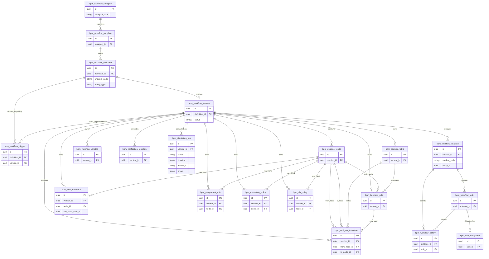

# ERD-25 — Workflow & Business Process Management (BPM) Designer

| Field | Value |
|-------|--------|
| **Document** | ERD-25 Workflow & BPM Designer |
| **Version** | 1.1 |
| **Status** | Locked — Ready for Sprint 25 Implementation Planning |
| **Schema / Prefix (proposed)** | `bpm` / `bpm_` |
| **Business Tables** | Exactly **20** |
| **Aligned To** | FRD-25 (Locked) · ERD-25 Entity Planning (Architect Approved) · Architecture Lock v1.1 (C-04 / DG-03) · Foundation Workflow Engine (ERD_01 `wf_*` — unchanged) |
| **Prior Release** | ERP Core v1.19-beta |

> Architect review editorial update. No redesign. Exactly 20 business tables.

### Version History

| Version | Date | Change |
|---------|------|--------|
| 1.0 | 2026-07-21 | Initial ERD-25 Workflow & BPM Designer Mermaid / relationships for architect review. |
| 1.1 | 2026-07-21 | Editorial lock after architect review. Mermaid, relationships and dependency model finalized. No architectural changes. |

---

## 1. Mermaid ER Diagram



---

## 2. ASCII Relationship Overview

```text
bpm_workflow_category
    └── bpm_workflow_template
            └── bpm_workflow_definition   (stable identity across versions)
                    │
                    ├── bpm_workflow_trigger  (DEFINES trigger capability)
                    │
                    └── bpm_workflow_version  (Draft | Published | Retired)
                            │                 ★ only one Published per definition
                            │
                            ├── bpm_workflow_trigger  (ACTIVE trigger implementation at runtime)
                            │
                            ├── DESIGN GRAPH
                            │     ├── bpm_designer_node
                            │     │       └── bpm_designer_transition
                            │     │               ├── Decision Tables
                            │     │               └── Condition Expressions
                            │     └── (node ↔ transition from/to)
                            │
                            ├── INTELLIGENCE / CONTEXT
                            │     ├── bpm_decision_table
                            │     │       └── bpm_business_rule  (evaluates — may invoke during routing/approval)
                            │     ├── bpm_business_rule
                            │     ├── bpm_workflow_variable
                            │     └── bpm_form_reference  → Low-Code form UUID only
                            │
                            ├── GOVERNANCE (version and/or node)
                            │     ├── bpm_assignment_rule
                            │     │       Assignment Resolution
                            │     │           ↓
                            │     │       Security Roles
                            │     │           ↓
                            │     │       Master Employee
                            │     │           ↓
                            │     │       Organization Context
                            │     ├── bpm_escalation_policy
                            │     └── bpm_sla_policy
                            │
                            ├── bpm_notification_template  → Foundation Notification delivers WHAT
                            ├── bpm_simulation_run         (status · duration · warnings · errors)
                            │
                            └── RUNTIME (Published version only)
                                  └── bpm_workflow_instance
                                          │   module_code + entity_id UUID
                                          │   (business module remains SoR — no peer ORM)
                                          ├── bpm_workflow_task
                                          │       └── bpm_task_delegation
                                          └── bpm_workflow_history

Operational reporting → Analytics + existing reporting framework
External triggers → Integration Hub (transport only)
C-01 masters / sec_role → assignment resolution only (consume)
```

---

## 3. Relationship Notes

### Design hierarchy
- **Category → Template → Definition → Version** is the stable design spine.
- **Definition** is the durable business identity; **Version** is the design unit that owns the designer graph and design-time policies.
- **Nodes → Transitions** form the visual graph; transitions may route via **Decision Tables** and/or **Condition Expressions**.
- Decision tables, business rules, variables, form references, notification templates, and triggers hang primarily off **Version**.
- **Decision Tables may invoke Business Rules** during routing and approval evaluation (`bpm_decision_table ||--o{ bpm_business_rule : evaluates`).

### Runtime hierarchy
- **Published Version → Instance → Task → History** is the runtime spine.
- **Task Delegation** hangs only off **Workflow Task**.
- **Instance** links to business work by **`module_code + entity_id` UUID only** — no FK into peer business tables; business modules remain SoR.
- Only the single **Published** version of a definition is eligible for runtime execution.

### Trigger clarification
- **Workflow Definition** defines **trigger capability** (what kinds of triggers the process supports).
- **Workflow Version** defines the **active trigger implementation** used during runtime.

### Governance hierarchy
- **Assignment / SLA / Escalation** attach to **Version** and optionally **Node**.
- Simulation attaches to **Version** only (pre-publish; no business mutation).
- Notification **templates** attach to **Version** (WHAT); WHEN is event/rule-driven; **Foundation Notification** delivers.

**Assignment Resolution** (documentation only — no new entities):

```text
Assignment Resolution
        ↓
Security Roles
        ↓
Master Employee
        ↓
Organization Context
```

### Cross-module ownership
| Area | Owner |
|------|--------|
| All 20 `bpm_*` design/runtime entities above | BPM (C-04 / DG-03 aligned) |
| Business documents | Owning business module |
| Dynamic form definitions | Low-Code Platform (Sprint 26) — reference only |
| Notification delivery | Foundation Notification |
| Operational reporting | Analytics |
| External transport | Integration Hub |
| Masters / roles | C-01 / Foundation Security (consume only) |
| Foundation `wf_*` (ERD_01) | Unchanged — no redesign / no competing engine |

---

## 4. Dependency Notes

1. **Version-centric design** — Nodes, transitions, decision tables, business rules, variables, form refs, assignment, escalation, SLA, triggers, notification templates, and simulation hang off `bpm_workflow_version`.
2. **Immutable published versions** — Published versions are immutable for audit; Draft and Retired may coexist; **only one Published Version per Definition** at a time; only Published is runtime-eligible.
3. **Runtime isolation** — Instances never mutate design rows; history is append-oriented; simulation does not write business SoR.
4. **UUID-only business references** — `bpm_workflow_instance` stores `module + entity_id` only; no peer ORM writes (Architecture Lock / Modular Monolith boundaries).
5. **Dynamic Forms references only** — `bpm_form_reference` stores Low-Code form UUID/key; BPM does not own form definitions.
6. **Foundation Notification delivery** — `bpm_notification_template` defines WHAT; Foundation `ntf_*` delivers; Integration Hub remains transport for external/API triggers.
7. **Analytics reporting ownership** — No BPM operational report table; Analytics + existing reporting framework own reporting.
8. **Trigger capability vs implementation** — **Workflow Definition** defines trigger capability; **Workflow Version** defines the active trigger implementation used during runtime.
9. **Decision Tables may invoke Business Rules** during routing and approval evaluation.
10. **C-01 / C-04 / DG-03** — No duplicate masters; single enterprise approval path; ERD_01 not redesigned.
11. **Exactly 20 business tables** — Category, Template, Definition, Version, Node, Transition, Decision Table, Business Rule, Variable, Form Reference, Assignment Rule, Task Delegation, Escalation Policy, SLA Policy, Trigger, Instance, Task, History, Simulation Run, Notification Template.

---

## Business Tables (20)

| # | Table |
|---|--------|
| 1 | `bpm_workflow_template` |
| 2 | `bpm_workflow_definition` |
| 3 | `bpm_workflow_version` |
| 4 | `bpm_designer_node` |
| 5 | `bpm_designer_transition` |
| 6 | `bpm_decision_table` |
| 7 | `bpm_business_rule` |
| 8 | `bpm_workflow_variable` |
| 9 | `bpm_form_reference` |
| 10 | `bpm_assignment_rule` |
| 11 | `bpm_task_delegation` |
| 12 | `bpm_escalation_policy` |
| 13 | `bpm_sla_policy` |
| 14 | `bpm_workflow_trigger` |
| 15 | `bpm_workflow_instance` |
| 16 | `bpm_workflow_task` |
| 17 | `bpm_workflow_history` |
| 18 | `bpm_simulation_run` |
| 19 | `bpm_notification_template` |
| 20 | `bpm_workflow_category` |

---

**Status:** Locked — Ready for Sprint 25 Implementation Planning

**ERD-25 Workflow & Business Process Management (BPM) Designer is locked and ready for Sprint 25 implementation planning.**
