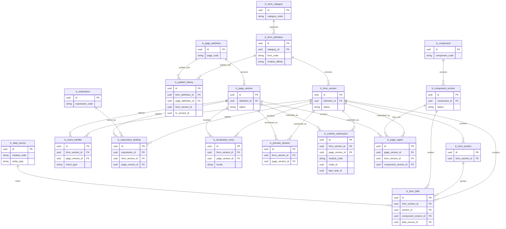

# ERD-26 — Low-Code Platform

| Field | Value |
|-------|--------|
| **Document** | ERD-26 Low-Code Platform |
| **Version** | 1.1 |
| **Status** | Locked — Ready for Future Reference |
| **Document Status** | Locked |
| **Next Stage** | Sprint 26 Backend Implementation |
| **Schema / Prefix (proposed)** | `lowcode` / `lc_` |
| **Business Tables** | Exactly **18** |
| **Aligned To** | FRD-26 (Locked v1.1) · ERD-26 Entity Planning (Locked v1.1) · FRD-25 (BPM form UUID references) · Architecture Lock v1.1 (C-01–C-06) |
| **Prior Release** | ERP Core v1.20-beta |

> **Detailed ERD design only.** Logical relationships. No SQL, migrations, APIs, indexes, or implementation. Exactly 18 entities from locked Entity Planning — no invented entities.

### Version History

| Version | Date | Change |
|---------|------|--------|
| 1.0 | 2026-07-22 | Initial ERD-26 Low-Code Platform Mermaid / relationships for architect review. |
| 1.1 | 2026-07-22 | Editorial Lock after Architecture Review. No relationship or architecture changes. |

---

## 1. Mermaid ER Diagram



---

## 2. ASCII Relationship Overview

```text
CATEGORIES
lc_form_category
    └── lc_form_definition   (stable form identity — BPM stores this UUID)
            │
            ├── lc_publish_history
            │
            └── lc_form_version   (Draft | Published | Retired)
                    │             ★ published versions immutable
                    │
                    ├── SECTIONS
                    │     └── lc_form_section
                    │             └── lc_form_field
                    │
                    ├── FIELDS
                    │     └── lc_form_field
                    │             ├── → lc_component_version   (renders)
                    │             └── → lc_data_source         (contract bind — no peer ORM)
                    │
                    ├── EXPRESSIONS
                    │     └── lc_expression_binding → lc_expression
                    │
                    ├── EVENTS
                    │     └── lc_event_handler
                    │
                    ├── LOCALIZATION
                    │     └── lc_localization_entry
                    │
                    ├── PREVIEW
                    │     └── lc_preview_session
                    │
                    └── SUBMISSION (Published only)
                          └── lc_runtime_submission
                                  module_code + entity_id UUID
                                  optional bpm_task_id UUID
                                  (business module remains SoR — handoff only)

COMPONENTS
lc_component
    └── lc_component_version   (properties merged on version)

PAGES
lc_page_definition   (stable page identity)
    │
    ├── lc_publish_history
    │
    └── lc_page_version   (Draft | Published | Retired)
            │
            ├── REGIONS
            │     └── lc_page_region
            │             ├── embeds lc_form_version (UUID)
            │             └── may_use lc_component_version
            │
            ├── EXPRESSIONS
            │     └── lc_expression_binding → lc_expression
            │
            ├── EVENTS
            │     └── lc_event_handler
            │
            ├── LOCALIZATION
            │     └── lc_localization_entry
            │
            ├── PREVIEW
            │     └── lc_preview_session
            │
            └── SUBMISSION (Published only)
                  └── lc_runtime_submission

DATA SOURCES (registry only)
lc_data_source  → module contracts (C-01 / C-02) — modules own data

CROSS-MODULE (logical — not Low-Code tables)
BPM            → stores Form UUID only; Low-Code resolves published form version
Foundation     → RBAC · Audit · Notification · Workflow Engine
Business SoR   → receive submit handoff via service contracts
Document Mgmt  → attachment Document UUID refs only
Integration Hub→ external transport only
Analytics      → reporting consumption (read-only)
```

---

## 3. Relationship Notes

### Design hierarchy
- **Category → Definition → Version** is the form design spine.
- **Definition → Version** is the page design spine (no page category entity in locked planning).
- **Version** is the design unit: sections, fields, event handlers, expression bindings, and localization hang off form/page versions.
- **Section → Field** groups fields; fields may also hang directly off the form version.
- **Page Region** embeds published **form versions** by UUID and may reference **component versions** — regions never copy form field SoR.

### Runtime hierarchy
- **Published Form/Page Version → Runtime Submission** is the runtime spine.
- **Runtime Submission** carries merged values + context (`module_code` + `entity_id` UUID, optional BPM task UUID).
- Submission is a **correlation / handoff envelope** — not business SoR; owning modules (or BPM task contracts) receive the payload.
- **Preview Session** hangs off form/page versions for design-time preview only; it does not create workflow instances or mutate business data.

### Publishing hierarchy
- **Definition → Publish History** records publish/retire lineage (who/when/from→to version).
- Published versions are **immutable**; upgrades are explicit and auditable.
- Publish History **complements** Foundation Audit (C-06); it does not replace the Foundation Audit SoR.

### Component hierarchy
- **Component → Component Version** mirrors definition→version.
- Form fields and page regions reference the **component version used at design/publish time** (Component Compatibility Policy).
- Component **properties are merged** onto `lc_component_version` (no separate properties entity).

### Localization hierarchy
- **Form Version / Page Version → Localization Entry** (unified entity keyed by artifact type).
- Locale labels/messages are version-scoped so published immutability is preserved.

### Submission hierarchy
- **Published Version → Runtime Submission** (values + context merged).
- Handoff targets owning **business module contracts** or **BPM task completion** — never peer ORM writes.
- Document attachments remain **Document UUID references** only.

### Cross-module ownership
| Area | Owner |
|------|--------|
| All 18 `lc_*` entities | Low-Code Platform |
| Business documents / ledgers | Owning business module |
| Form UUID references on BPM tasks/definitions | BPM stores UUID; Low-Code resolves |
| Workflow instances / tasks / history | BPM / Foundation Workflow (C-04) |
| Masters / org | Master Data / Organization (C-01) — consume via services |
| Notification delivery | Foundation Notification (C-05) |
| Enterprise audit warehouse | Foundation Audit (C-06) |
| Documents / files | Document Management |
| External transport | Integration Hub (C-03) |
| Operational / enterprise reporting | Analytics |

---

## Relationship Principles

Architectural philosophy behind the ERD-26 relationships (documentation only — no redesign):

- **Definitions own Versions.** Form and page definitions are the stable identity; versions are lineage under that identity.
- **Versions own design metadata.** Sections, fields, regions, events, expression bindings, and localization hang off versions.
- **Published Versions are immutable.** Once published, design metadata for that version is not silently edited.
- **Runtime always resolves Published Versions.** Preview may use drafts; production runtime and BPM bindings resolve published versions per policy.
- **Cross-module relationships use UUIDs and service contracts.** Business context, BPM task context, and document refs are UUID-oriented; data access goes through owning-module contracts.
- **No peer ORM relationships.** Low-Code does not form ORM FKs into peer business schemas.
- **Business modules remain System of Record.** Submissions are handoff envelopes; transactional and master data stay with owning modules.
- **Ownership always follows Architecture Lock v1.1.** Foundation (RBAC · Audit · Notification · Workflow Engine), BPM form UUID references, Document Management, Integration Hub, and Analytics boundaries remain unchanged.

---

## 4. Dependency Notes

1. **Version-centric architecture** — Sections, fields, events, expression bindings, localization, preview, and submission resolution hang off form/page **versions**.
2. **Published immutability** — Published form/page versions are immutable; Draft and Retired may coexist; runtime and new BPM bindings prefer Published (policy); in-flight usages retain the resolved version.
3. **UUID-only references** — Business context uses `module_code` + `entity_id` UUID; BPM task context uses task UUID; Document attachments use Document UUID; no peer-table FKs.
4. **No peer ORM** — `lc_data_source` is a **contract registry** only; lookups/writes execute via owning module services (C-02).
5. **Business modules remain SoR** — Low-Code never owns PO/invoice/leave/ticket/journal rows or master directories.
6. **BPM stores Form UUID only** — Fulfills FRD-25 / FRD-26; Low-Code resolves the bound published form version at design and runtime.
7. **Foundation ownership** — RBAC, Audit, Notification, and Workflow Engine remain Foundation SoR (C-04 / C-05 / C-06).
8. **Document Management ownership** — Files remain Document SoR; Low-Code stores references only.
9. **Integration Hub boundary** — External side effects use Hub transport patterns; Low-Code event handlers are not a competing integration bus.
10. **Analytics boundary** — Usage/error reporting consumed by Analytics; no Low-Code operational report SoR table.
11. **Expressions are UI logic** — Not a replacement for BPM Decision Tables / Business Rules.
12. **Exactly 18 business entities** — No invented tables beyond locked Entity Planning.

---

## Business Tables (18)

| # | Table |
|---|--------|
| 1 | `lc_form_category` |
| 2 | `lc_form_definition` |
| 3 | `lc_form_version` |
| 4 | `lc_form_section` |
| 5 | `lc_form_field` |
| 6 | `lc_page_definition` |
| 7 | `lc_page_version` |
| 8 | `lc_page_region` |
| 9 | `lc_component` |
| 10 | `lc_component_version` |
| 11 | `lc_data_source` |
| 12 | `lc_expression` |
| 13 | `lc_expression_binding` |
| 14 | `lc_event_handler` |
| 15 | `lc_localization_entry` |
| 16 | `lc_publish_history` |
| 17 | `lc_runtime_submission` |
| 18 | `lc_preview_session` |

---

## 5. Validation Table

| Gate | Result |
|------|--------|
| Exactly 18 entities from locked Entity Planning | Pass |
| No invented entities | Pass |
| Mermaid covers all 18 entities with logical relationships only | Pass |
| ASCII hierarchy covers Categories → Definitions → Versions → Sections → Fields · Pages · Components · Expressions · Events · Runtime · Preview · Publish · Submission | Pass |
| Version-centric · published immutability · UUID-only · no peer ORM | Pass |
| BPM Form UUID boundary preserved | Pass |
| Business modules remain SoR | Pass |
| Foundation · Document Management · Integration Hub · Analytics boundaries preserved | Pass |
| Architecture Lock v1.1 · C-01–C-06 · FRD-26 · Entity Planning locked baselines | Pass |
| No SQL · migrations · APIs · indexes · implementation | Pass |
| FRD / Entity Planning unmodified | Pass |

---

## Document Status

| Field | Value |
|-------|--------|
| **Document Status** | Locked |
| **Next Stage** | Sprint 26 Backend Implementation |

ERD-26 Low-Code Platform is locked as the approved architectural database design baseline.

Future implementation must follow this document unless superseded through formal architecture governance.
