# ERD-27 — Enterprise AI Platform

| Field | Value |
|-------|--------|
| **Document** | ERD-27 Enterprise AI Platform |
| **Version** | 1.1 |
| **Status** | Locked — Ready for Future Reference |
| **Document Status** | Locked |
| **Next Stage** | Sprint 27 Backend Planning |
| **Schema / Prefix (proposed)** | `ai` / `ai_` |
| **Business Tables** | Exactly **34** |
| **Aligned To** | FRD-27 (Locked v1.1) · ERD-27 Entity Planning (Locked v1.1) · Architecture Lock v1.1 (C-01–C-06) · FRD-01 Foundation · FRD-25 BPM · FRD-26 Low-Code · FRD-18 Analytics · FRD-19 Document · FRD-21 Integration Hub |
| **Prior Release** | ERP Core v1.21-beta |

> **Detailed ERD design only.** Logical relationships. No SQL, migrations, APIs, indexes, column catalogs, or implementation. Exactly **34** entities from locked Entity Planning — no invented entities, no renaming, no redesign.

### Version History

| Version | Date | Change |
|---------|------|--------|
| 1.0 | 2026-07-23 | Initial ERD-27 Enterprise AI Platform Mermaid / relationships for architect review. |
| 1.1 | 2026-07-23 | Editorial Lock after Architecture Review. Added Enterprise AI ERD Design Principles, Entity Classification, Architecture Layer Overview, Runtime Resolution Flow, Publish Dependency Matrix, Version Compatibility Summary, Future Reserved AI Capabilities, and expanded AI Ownership Summary. No functional changes. No entity or Mermaid relationship changes. Still exactly 34 entities. |

---

## Enterprise AI ERD Design Principles

| Principle | Statement |
|-----------|-----------|
| **AI owns AI artifacts only** | All 34 `ai_*` entities are intelligence SoR — not business documents, masters, or ledgers |
| **Version-first** | Prompt, agent, tool, knowledge, and policy artifacts bind at published versions |
| **Published immutability** | Published versions are never silently replaced |
| **Policy before model** | Gateway, guardrails, moderation, and rate limits apply before provider invocation |
| **UUID references only** | Peer domains are referenced by UUID / module code — never peer schema FKs |
| **Contracts only** | Cross-module reads/writes use owning-module service contracts |
| **No peer ORM** | AI never writes peer-module ORM models |
| **AI recommends only** | AI never becomes business decision authority; BPM and Business Modules remain execution authorities |
| **Foundation ownership preserved** | AuthN · AuthZ · RBAC · Audit · Notification · Workflow Engine unchanged |
| **BPM / Low-Code / Document / Analytics / Integration Hub preserved** | Workflow, forms/pages, files, reporting, and external transport ownership unchanged |
| **Architecture Lock v1.1** | Final — never modified by this ERD |

---

## Entity Classification

| Group | Entities (34 total — unchanged) |
|-------|----------------------------------|
| **Core AI** | `ai_provider` · `ai_model` · `ai_prompt_template` · `ai_prompt_version` · `ai_prompt_variable` · `ai_assistant` · `ai_agent` · `ai_agent_version` · `ai_skill` · `ai_tool` · `ai_tool_version` |
| **Knowledge** | `ai_knowledge_base` · `ai_knowledge_source` · `ai_knowledge_chunk` · `ai_embedding` · `ai_vector_index` |
| **Runtime** | `ai_session` · `ai_conversation` · `ai_conversation_message` · `ai_conversation_memory` · `ai_context_package` |
| **Governance** | `ai_gateway_policy` · `ai_routing_rule` · `ai_guardrail_policy` · `ai_moderation_policy` · `ai_evaluation` · `ai_feedback` · `ai_rate_limit_policy` · `ai_configuration` · `ai_provider_credential_reference` |
| **Operations** | `ai_usage_record` · `ai_cost_record` · `ai_cache_entry` |
| **Future Ready** | `ai_multimodal_profile` |

*Classification is documentation-only. Entity inventory remains exactly **34**.*

---

## Architecture Layer Overview

```text
┌─────────────────────────────────────────────────────────────┐
│                    CONSUMING SURFACES                         │
│   Modules · BPM tasks · Low-Code copilots · Portals (host)   │
└───────────────────────────┬─────────────────────────────────┘
                            │ UUID / service contracts only
┌───────────────────────────▼─────────────────────────────────┐
│                 AI PLATFORM (34 entities)                     │
│  Assistants · Agents · Prompts · Tools · Skills               │
│  Knowledge / RAG · Sessions · Context                         │
│  Gateway · Routing · Guardrails · Moderation · Quotas         │
│  Usage · Cost · Cache · Configuration · Multimodal profiles   │
└───────┬─────────────────┬──────────────────┬────────────────┘
        │                 │                  │
        ▼                 ▼                  ▼
┌───────────────┐ ┌───────────────┐ ┌─────────────────────────┐
│  AI Gateway   │ │ Knowledge idx │ │ Tool allow-list calls   │
│  → Providers  │ │ (not file SoR)│ │ → owning module services│
└───────┬───────┘ └───────┬───────┘ └───────────┬─────────────┘
        │                 │                      │
        ▼                 ▼                      ▼
  LLM / Embedding     Document UUID          Business SoR
  Providers           (Document Mgmt)        (modules remain SoR)

CROSS-CUTTING (not AI tables)
Foundation AuthN/AuthZ/RBAC · Audit · Notification · Workflow Engine
BPM Workflow · Low-Code Forms/Pages · Analytics Reporting · Integration Hub
```

ASCII only. No Mermaid changes. No new entities.

---

## Runtime Resolution Flow

```text
Authorized User / Host Context
        ↓
Resolve AI Configuration + Rate Limit Policy
        ↓
Resolve Assistant or Agent Version (Published)
        ↓
Resolve Prompt Version (Published) + Variables
        ↓
Apply Gateway Policy → Routing Rule → Provider / Model
        ↓
Apply Guardrail Policy + Moderation Policy
        ↓
Optional RAG:
  Knowledge Base → Source → Chunk → Embedding → Vector Index
        ↓
Assemble Context Package
  (module_code + entity_id UUID · optional Low-Code / BPM / Document UUIDs)
        ↓
Open / Continue Session → Conversation → Message
        ↓
Optional Tool Version invoke
  (allow-list only → owning module service contract)
        ↓
Record Usage / Cost · optional Cache Entry
        ↓
Emit Audit event to Foundation Audit (C-06)
        ↓
Optional Feedback

★ AI recommends only — business writes / approvals remain module / BPM authority
```

---

## Publish Dependency Matrix

| To publish… | Must resolve / bind (logical) |
|-------------|-------------------------------|
| `ai_prompt_version` | Parent `ai_prompt_template`; variables consistent while Draft |
| `ai_assistant` | Published `ai_prompt_version`; applicable gateway / guardrail / moderation / rate-limit policies |
| `ai_tool_version` | Parent `ai_tool` |
| `ai_skill` | Published tool versions (and optional prompt versions) it composes |
| `ai_agent_version` | Parent `ai_agent`; published prompt version; allowed published tool versions / skills; optional published knowledge base |
| `ai_knowledge_base` | Curated sources eligible; Document UUIDs valid where used |
| `ai_routing_rule` | Parent gateway policy; registered provider/model |
| `ai_multimodal_profile` | Registered provider; Document UUID refs for media context only |
| `ai_evaluation` | Published prompt / knowledge / guardrail versions under test |

Published artifacts are immutable. Runtime binds the exact published versions selected at invoke/publish time.

---

## Version Compatibility Summary

| Artifact | Version unit | Compatibility rule |
|----------|--------------|--------------------|
| Prompt | `ai_prompt_version` | Exact published version bound at invoke |
| Agent | `ai_agent_version` | Exact published agent + its bound prompt/tool/skill set |
| Tool | `ai_tool_version` | Breaking changes require deliberate rebind |
| Knowledge | `ai_knowledge_base` lineage | Workload binds authorized published knowledge pack |
| Guardrail | `ai_guardrail_policy` | Exact published safety pack per policy |
| Moderation | `ai_moderation_policy` | Exact published moderation pack |
| Gateway / routing | `ai_gateway_policy` · `ai_routing_rule` | Behavior-changing updates require governance |
| Multimodal | `ai_multimodal_profile` | Exact published profile when enabled |
| Assistant | `ai_assistant` | Publishable surface binding published prompt/policies |

Existing sessions continue on resolved versions unless explicitly migrated under policy.

---

## Future Reserved AI Capabilities

> **NOT part of the 34 locked entities.** Documentation reservation only. No schema, no implementation, no entity invention.

| Reserved capability (future) | Notes |
|------------------------------|-------|
| Certified prompt/agent pack marketplace | Packaging/attestation beyond current registries |
| Continuous online evaluation / auto-regression gates | Automation around existing `ai_evaluation` |
| Advanced multi-agent collaboration graphs | Orchestration patterns over existing agent versions |
| Controlled fine-tuning workflows | Training pipelines — privacy/contract gated |
| Portal-specific AI packs | Host surfaces; still consume the same 34 entities |
| Industry-deep copilots | Module UX expansion; no new SoR tables implied here |
| Enterprise feature store for AI features | Must not become transactional SoR if ever introduced |

Any future entity would require formal architecture approval and must not violate Architecture Lock v1.1 or FRD-27 / Entity Planning baselines.

---

## 1. Mermaid ER Diagram

```mermaid
erDiagram
    ai_provider ||--o{ ai_model : catalogs
    ai_provider ||--o{ ai_provider_credential_reference : authenticates_via
    ai_provider ||--o{ ai_routing_rule : may_route_to
    ai_provider ||--o{ ai_multimodal_profile : supports

    ai_model ||--o{ ai_routing_rule : may_select
    ai_model ||--o{ ai_embedding : generated_by
    ai_model ||--o{ ai_vector_index : indexed_with
    ai_model ||--o{ ai_usage_record : consumed_as
    ai_model ||--o{ ai_cost_record : costed_as

    ai_prompt_template ||--o{ ai_prompt_version : versions
    ai_prompt_version ||--o{ ai_prompt_variable : declares
    ai_prompt_version ||--o{ ai_assistant : bound_by
    ai_prompt_version ||--o{ ai_agent_version : bound_by
    ai_prompt_version ||--o{ ai_skill : may_use
    ai_prompt_version ||--o{ ai_evaluation : evaluated_as
    ai_prompt_version ||--o{ ai_conversation_message : cited_by
    ai_prompt_version ||--o{ ai_context_package : uses

    ai_tool ||--o{ ai_tool_version : versions
    ai_tool_version ||--o{ ai_skill : composed_into
    ai_tool_version ||--o{ ai_agent_version : allowed_by
    ai_tool_version ||--o{ ai_conversation_message : invoked_as

    ai_agent ||--o{ ai_agent_version : versions
    ai_skill ||--o{ ai_agent_version : enabled_on

    ai_knowledge_base ||--o{ ai_knowledge_source : contains
    ai_knowledge_base ||--o{ ai_vector_index : indexed_as
    ai_knowledge_base ||--o{ ai_assistant : may_ground
    ai_knowledge_base ||--o{ ai_agent_version : may_ground
    ai_knowledge_base ||--o{ ai_evaluation : evaluated_with

    ai_knowledge_source ||--o{ ai_knowledge_chunk : produces
    ai_knowledge_chunk ||--o{ ai_embedding : embedded_as
    ai_embedding ||--o{ ai_vector_index : stored_in
    ai_knowledge_chunk ||--o{ ai_context_package : retrieved_into

    ai_gateway_policy ||--o{ ai_routing_rule : governs
    ai_gateway_policy ||--o{ ai_assistant : applied_to
    ai_gateway_policy ||--o{ ai_agent_version : applied_to
    ai_guardrail_policy ||--o{ ai_assistant : protects
    ai_guardrail_policy ||--o{ ai_agent_version : protects
    ai_guardrail_policy ||--o{ ai_evaluation : evaluated_with
    ai_moderation_policy ||--o{ ai_assistant : moderates
    ai_moderation_policy ||--o{ ai_agent_version : moderates
    ai_rate_limit_policy ||--o{ ai_assistant : limits
    ai_rate_limit_policy ||--o{ ai_agent_version : limits
    ai_rate_limit_policy ||--o{ ai_session : enforces_on

    ai_assistant ||--o{ ai_session : starts
    ai_agent_version ||--o{ ai_session : may_start
    ai_session ||--o{ ai_conversation : contains
    ai_session ||--o{ ai_context_package : assembles
    ai_session ||--o{ ai_usage_record : meters
    ai_session ||--o{ ai_cost_record : meters
    ai_session ||--o{ ai_cache_entry : may_use
    ai_session ||--o{ ai_feedback : may_receive

    ai_conversation ||--o{ ai_conversation_message : has
    ai_conversation ||--o{ ai_conversation_memory : remembers
    ai_conversation ||--o{ ai_feedback : rated_on
    ai_conversation_message ||--o{ ai_feedback : rated_on

    ai_configuration ||--o{ ai_assistant : configures
    ai_configuration ||--o{ ai_session : scopes
    ai_multimodal_profile ||--o{ ai_assistant : may_enable
    ai_multimodal_profile ||--o{ ai_agent_version : may_enable
    ai_multimodal_profile ||--o{ ai_knowledge_source : may_ingest_via

    ai_provider {
        uuid id
        string provider_code
    }
    ai_model {
        uuid id
        uuid provider_id
        string model_code
    }
    ai_prompt_template {
        uuid id
        string template_code
    }
    ai_prompt_version {
        uuid id
        uuid template_id
        string status
    }
    ai_prompt_variable {
        uuid id
        uuid prompt_version_id
    }
    ai_assistant {
        uuid id
        uuid prompt_version_id
        string assistant_kind
    }
    ai_agent {
        uuid id
        string agent_code
    }
    ai_agent_version {
        uuid id
        uuid agent_id
        uuid prompt_version_id
        string status
    }
    ai_skill {
        uuid id
        string skill_code
    }
    ai_tool {
        uuid id
        string tool_code
    }
    ai_tool_version {
        uuid id
        uuid tool_id
        string status
    }
    ai_knowledge_base {
        uuid id
        string knowledge_base_code
    }
    ai_knowledge_source {
        uuid id
        uuid knowledge_base_id
        uuid document_id
    }
    ai_knowledge_chunk {
        uuid id
        uuid knowledge_source_id
    }
    ai_embedding {
        uuid id
        uuid knowledge_chunk_id
        uuid model_id
    }
    ai_vector_index {
        uuid id
        uuid knowledge_base_id
        uuid model_id
    }
    ai_session {
        uuid id
        uuid assistant_id
        uuid agent_version_id
        string module_code
        uuid entity_id
    }
    ai_conversation {
        uuid id
        uuid session_id
    }
    ai_conversation_message {
        uuid id
        uuid conversation_id
        uuid prompt_version_id
        uuid tool_version_id
    }
    ai_conversation_memory {
        uuid id
        uuid conversation_id
    }
    ai_context_package {
        uuid id
        uuid session_id
        uuid prompt_version_id
        string module_code
        uuid entity_id
    }
    ai_gateway_policy {
        uuid id
        string status
    }
    ai_routing_rule {
        uuid id
        uuid gateway_policy_id
        uuid provider_id
        uuid model_id
    }
    ai_guardrail_policy {
        uuid id
        string status
    }
    ai_moderation_policy {
        uuid id
        string status
    }
    ai_evaluation {
        uuid id
        uuid prompt_version_id
        uuid knowledge_base_id
        uuid guardrail_policy_id
    }
    ai_feedback {
        uuid id
        uuid session_id
        uuid conversation_id
        uuid message_id
    }
    ai_usage_record {
        uuid id
        uuid session_id
        uuid model_id
    }
    ai_cost_record {
        uuid id
        uuid session_id
        uuid model_id
    }
    ai_rate_limit_policy {
        uuid id
        string status
    }
    ai_cache_entry {
        uuid id
        uuid session_id
    }
    ai_configuration {
        uuid id
        string scope
    }
    ai_provider_credential_reference {
        uuid id
        uuid provider_id
    }
    ai_multimodal_profile {
        uuid id
        uuid provider_id
        string status
    }
```



---

## 2. ASCII Relationship Diagram

```text
PROVIDERS & MODELS
ai_provider
    ├── ai_provider_credential_reference   (secret-store pointer only — never secrets)
    ├── ai_model
    │       ├── used by ai_routing_rule
    │       ├── used by ai_embedding / ai_vector_index
    │       └── metered by ai_usage_record / ai_cost_record
    └── ai_multimodal_profile              (OCR / STT / TTS / Vision governance pack)

PROMPTS
ai_prompt_template   (stable identity)
    └── ai_prompt_version   (Draft | Published | Retired) ★ published immutable
            ├── ai_prompt_variable
            ├── bound by ai_assistant
            ├── bound by ai_agent_version
            ├── may be used by ai_skill
            ├── cited by ai_conversation_message / ai_context_package
            └── evaluated by ai_evaluation

ASSISTANTS & AGENTS
ai_assistant   (kind = assistant | copilot)
    └── starts ai_session

ai_agent   (stable identity)
    └── ai_agent_version   (Draft | Published | Retired) ★ published immutable
            ├── binds ai_prompt_version
            ├── enables ai_skill
            ├── allows ai_tool_version
            ├── may ground ai_knowledge_base
            ├── protected by gateway / guardrail / moderation / rate-limit policies
            └── may start ai_session

ai_tool
    └── ai_tool_version
            ├── composed into ai_skill
            ├── allowed on ai_agent_version
            └── invoked on ai_conversation_message

KNOWLEDGE / RAG
ai_knowledge_base
    ├── ai_knowledge_source
    │       └── ai_knowledge_chunk
    │               └── ai_embedding → ai_model
    ├── ai_vector_index → ai_model
    ├── may_ground ai_assistant / ai_agent_version
    └── evaluated_with ai_evaluation

    External: knowledge_source.document_id UUID → Document Management (file SoR)

GOVERNANCE
ai_gateway_policy
    └── ai_routing_rule → ai_provider / ai_model

ai_guardrail_policy  ──protects──► ai_assistant / ai_agent_version / ai_evaluation
ai_moderation_policy ──moderates─► ai_assistant / ai_agent_version
ai_rate_limit_policy ──limits────► ai_assistant / ai_agent_version / ai_session
ai_configuration     ──scopes────► assistants / sessions (platform · tenant · workload)

RUNTIME
ai_session
    ├── ai_conversation
    │       ├── ai_conversation_message
    │       └── ai_conversation_memory
    ├── ai_context_package
    │       module_code + entity_id UUID (business context — not business SoR)
    │       optional Low-Code form/page UUID · BPM task/instance UUID
    ├── ai_usage_record / ai_cost_record
    ├── ai_cache_entry   (not SoR)
    └── ai_feedback

CROSS-MODULE (logical — not AI tables)
Foundation     → AuthN · AuthZ · RBAC · Audit (C-06) · Notification (C-05) · Workflow Engine (C-04)
BPM            → workflow definition/instance/task UUID for HITL / process-aware assistance
Low-Code       → form/page UUID for copilots (forms remain Low-Code SoR)
Document Mgmt  → document/file UUID for knowledge ingestion / multimodal context
Master Data    → party/item UUID context (C-01)
Organization   → company/branch/org UUID scoping
Business SoR   → module_code + entity_id; writes only via owning module services
Integration Hub→ external provider transport where required (C-03)
Analytics      → read-only consumption of usage/cost metrics
```

---

## 3. Relationship Notes

### Provider / model hierarchy
- **Provider → Model** is the model catalog spine.
- **Provider → Credential Reference** points at enterprise secret stores — never stores secrets in AI tables.
- **Provider / Model → Routing Rule** enables provider-agnostic gateway selection.
- **Provider → Multimodal Profile** governs OCR / STT / TTS / Vision integration points without owning media files.

### Prompt hierarchy
- **Prompt Template → Prompt Version** is the prompt design spine.
- **Prompt Version → Prompt Variable** declares typed parameters (Draft-editable only).
- Published prompt versions are **immutable** and are the unit bound by assistants, agents, skills, evaluations, messages, and context packages.

### Assistant / agent hierarchy
- **Assistant** (includes Copilot via `assistant_kind`) binds a published prompt version and policy set; starts runtime sessions.
- **Agent → Agent Version** mirrors template→version.
- **Agent Version** logically enables **Skills** and allows **Tool Versions**; may ground **Knowledge Bases**.
- Agent orchestration metadata is **not** a second workflow engine (C-04 preserved).

### Tool / skill hierarchy
- **Tool → Tool Version** is version-first; breaking schema changes require deliberate agent rebind.
- **Skill** composes published tool versions and may reference prompt versions.
- Tool side effects execute only through **owning-module service contracts** — never peer ORM.

### Knowledge / RAG hierarchy
- **Knowledge Base → Source → Chunk → Embedding → Vector Index** is the retrieval spine.
- Sources reference **Document UUID** only; Document Management remains file SoR.
- Chunks/embeddings are AI index metadata — not business ledgers or master records.
- Retrieved chunk UUIDs may appear in **Context Packages** for grounded generation.

### Governance hierarchy
- **Gateway Policy → Routing Rule** controls provider/model selection (policy before model).
- **Guardrail / Moderation / Rate Limit** policies protect assistants, agent versions, and sessions.
- **Configuration** scopes platform / tenant / workload enablement.
- **Evaluation** binds published prompt / knowledge / guardrail versions and stores merged results.
- **Feedback** attaches to session / conversation / message and may open Foundation/BPM review by UUID — AI does not own case SoR.

### Runtime hierarchy
- **Session → Conversation → Message / Memory** is the conversational runtime spine.
- **Context Package** assembles authorized context references for an invocation.
- **Usage / Cost / Cache** meter and accelerate sessions; cache is not SoR.
- External business context uses `module_code` + `entity_id` UUID (and optional Low-Code / BPM UUIDs).

### Cross-module ownership
| Area | Owner |
|------|--------|
| All 34 `ai_*` entities | AI Platform |
| Business documents / ledgers | Owning business module |
| Masters / org | Master Data / Organization (C-01) |
| Workflow design / instances / tasks / history | BPM / Foundation Workflow (C-04) |
| Forms / pages / components | Low-Code (FRD-26) |
| Notification delivery | Foundation Notification (C-05) |
| Enterprise audit warehouse | Foundation Audit (C-06) |
| Documents / files | Document Management |
| External transport | Integration Hub (C-03) |
| Enterprise BI / reporting | Analytics |

---

## Relationship Principles

- **Templates/Definitions own Versions** where version-first applies (prompt, agent, tool).
- **Published versions are immutable** and are what runtime binds.
- **Policy before model** — gateway, guardrails, moderation, and rate limits apply before provider invocation.
- **Cross-module relationships use UUIDs and service contracts only.**
- **No peer ORM relationships** into Foundation/BPM/Low-Code/Document/Analytics/Business schemas.
- **Business modules remain System of Record** for transactions and masters.
- **AI recommends; BPM and Business Modules remain execution authorities.**
- **Ownership always follows Architecture Lock v1.1.**

---

## 4. Dependency Notes

1. **Version-centric architecture** — Assistants, agents, skills, evaluations, and runtime citations hang off **published** prompt / agent / tool / policy / knowledge versions.
2. **Published immutability** — Published versions are never silently replaced; upgrades are explicit and auditable.
3. **UUID-only references** — Business context, BPM task/instance, Low-Code form/page, Document file, and master/org refs are UUID-oriented.
4. **No peer ORM** — AI never writes peer module models; tool side effects use owning-module contracts.
5. **Contracts only** — Reads/writes to business data go through owning module services.
6. **No business data ownership** — AI is intelligence SoR only.
7. **Foundation ownership** — AuthN/AuthZ/RBAC, Audit, Notification, Workflow Engine remain Foundation.
8. **BPM ownership** — Workflow remains BPM/Foundation; AI HITL uses UUID contracts only.
9. **Low-Code ownership** — Forms/pages remain Low-Code; copilots reference UUIDs only.
10. **Document ownership** — Files remain Document Management; knowledge sources store Document UUID only.
11. **Analytics ownership** — Usage/cost metrics may be consumed read-only; Analytics remains reporting SoR.
12. **Integration Hub boundary** — External provider connectivity follows C-03 where required.
13. **Provider-agnostic** — No provider-specific business logic inside ERP.
14. **Exactly 34 business entities** — No invented tables beyond locked Entity Planning.

---

## 5. Entity Lifecycle Summary

| Lifecycle Pattern | Entities |
|-------------------|----------|
| **Active / Suspended / Retired** | `ai_provider` · `ai_knowledge_source` |
| **Draft / Approved / Deprecated / Retired** | `ai_model` |
| **Catalog identity + versioned publish** | `ai_prompt_template` · `ai_agent` · `ai_tool` |
| **Draft → Publish → Retire** (published immutable) | `ai_prompt_version` · `ai_assistant` · `ai_agent_version` · `ai_skill` · `ai_tool_version` · `ai_knowledge_base` · `ai_gateway_policy` · `ai_routing_rule` · `ai_guardrail_policy` · `ai_moderation_policy` · `ai_rate_limit_policy` · `ai_multimodal_profile` |
| **Follows parent Draft** | `ai_prompt_variable` |
| **Created / Rebuilt / Invalidated** | `ai_knowledge_chunk` · `ai_embedding` |
| **Active / Rebuilding / Retired** | `ai_vector_index` |
| **Open → Active → Closed / Expired** | `ai_session` |
| **Active → Archived / Purged** | `ai_conversation` · `ai_conversation_memory` |
| **Append-oriented (retention-bound)** | `ai_conversation_message` · `ai_usage_record` · `ai_cost_record` |
| **Ephemeral / retained per policy** | `ai_context_package` · `ai_cache_entry` |
| **Queued → Running → Completed / Failed** | `ai_evaluation` |
| **Captured → Reviewed / Closed** | `ai_feedback` |
| **Draft → Active → Retired** | `ai_configuration` |
| **Active / Rotated / Retired** | `ai_provider_credential_reference` |

```text
Draft
  ↓
Review / Evaluation
  ↓
Approval
  ↓
Publish   ★ immutable
  ↓
Production
  ↓
Monitoring
  ↓
Feedback
  ↓
Retire
```

---

## 6. Versioning Strategy

| Artifact | Version Unit | Compatibility Rule |
|----------|--------------|--------------------|
| Prompt | `ai_prompt_version` | Runtime binds exact published prompt version |
| Agent | `ai_agent_version` | Runs resolve published agent version and its bound prompt/tool/skill set |
| Tool | `ai_tool_version` | Breaking schema changes require deliberate agent/skill rebind |
| Knowledge pack | `ai_knowledge_base` (+ source/chunk/index lineage) | RAG uses authorized published knowledge pack version bound to workload |
| Guardrail | `ai_guardrail_policy` | Safety packs applied are the published guardrail version required by policy |
| Moderation | `ai_moderation_policy` | Same publish/immutability rules |
| Gateway / routing | `ai_gateway_policy` · `ai_routing_rule` | Provider configuration version family — behavior-changing updates require governance |
| Multimodal | `ai_multimodal_profile` | Integration profile versions follow Draft → Publish → Retire |
| Assistant | `ai_assistant` | Publishable surface; binds published prompt/policy versions |

**Rules**
- Published versions are never silently replaced.
- Existing sessions continue on resolved versions unless explicitly migrated under policy.
- Provider/model upgrades that change behavior require explicit rebinding or re-evaluation.
- Version upgrades must be explicit and auditable (Foundation Audit + AI operational history).

---

## 7. Ownership Matrix

| Entity | Owner |
|--------|--------|
| `ai_provider` | AI Platform |
| `ai_model` | AI Platform |
| `ai_prompt_template` | AI Platform |
| `ai_prompt_version` | AI Platform |
| `ai_prompt_variable` | AI Platform |
| `ai_assistant` | AI Platform |
| `ai_agent` | AI Platform |
| `ai_agent_version` | AI Platform |
| `ai_skill` | AI Platform |
| `ai_tool` | AI Platform |
| `ai_tool_version` | AI Platform |
| `ai_knowledge_base` | AI Platform |
| `ai_knowledge_source` | AI Platform |
| `ai_knowledge_chunk` | AI Platform |
| `ai_embedding` | AI Platform |
| `ai_vector_index` | AI Platform |
| `ai_session` | AI Platform |
| `ai_conversation` | AI Platform |
| `ai_conversation_message` | AI Platform |
| `ai_conversation_memory` | AI Platform |
| `ai_context_package` | AI Platform |
| `ai_gateway_policy` | AI Platform |
| `ai_routing_rule` | AI Platform |
| `ai_guardrail_policy` | AI Platform |
| `ai_moderation_policy` | AI Platform |
| `ai_evaluation` | AI Platform |
| `ai_feedback` | AI Platform |
| `ai_usage_record` | AI Platform |
| `ai_cost_record` | AI Platform |
| `ai_rate_limit_policy` | AI Platform |
| `ai_cache_entry` | AI Platform |
| `ai_configuration` | AI Platform |
| `ai_provider_credential_reference` | AI Platform |
| `ai_multimodal_profile` | AI Platform |

| Concern | Owner |
|---------|--------|
| Authentication · Authorization · RBAC | Foundation |
| Audit warehouse | Foundation Audit (C-06) |
| Notification delivery | Foundation Notification (C-05) |
| Workflow Engine | Foundation (C-04) / BPM design-runtime |
| Forms / pages | Low-Code |
| Files | Document Management |
| Reporting | Analytics |
| External transport | Integration Hub |
| Business transactions / masters | Business Modules / Master Data / Organization |

### Expanded AI Ownership Summary

| AI owns (34 entities) | AI does NOT own |
|-----------------------|-----------------|
| Providers · models · credential references | Authentication · Authorization · RBAC |
| Prompt templates · versions · variables | Foundation Audit warehouse |
| Assistants (incl. copilots) · agents · skills · tools | Notification delivery |
| Knowledge base / source / chunk · embedding · vector index metadata | Workflow design · instances · tasks · history |
| Sessions · conversations · messages · memory · context packages | Forms · pages · components (Low-Code) |
| Gateway · routing · guardrail · moderation · rate-limit policies | Document / file storage |
| Evaluations · feedback | Enterprise BI / reporting warehouse |
| Usage · cost · cache · configuration | Integration Hub transport |
| Multimodal profiles | Business transactions · masters · ledgers |

AI **recommends**. BPM and Business Modules remain **execution authorities**.

---

## 8. Runtime Boundary Notes

| Boundary | Rule |
|----------|------|
| Runtime spine | Session → Conversation → Message / Memory / Context |
| Production binding | Resolve **published** prompt / agent / tool / policy / knowledge versions |
| Business context | `module_code` + `entity_id` UUID only — never business row SoR in AI |
| Low-Code context | Form/page UUID for copilots — Low-Code remains forms/pages SoR |
| BPM context | Definition/instance/task UUID for assistance / HITL — BPM remains workflow SoR |
| Document context | Document UUID for ingestion/multimodal — Document remains file SoR |
| Tool execution | Allow-listed tool versions only; side effects via owning-module contracts |
| Cache | Acceleration only — not SoR; must not bypass guardrails |
| Writes | AI never posts business transactions; modules remain execution authority |
| Approvals | AI suggestions are not approvals (C-04 / DG-03) |

---

## 9. AI Governance Boundary

| Concern | AI Platform | Outside AI |
|---------|-------------|------------|
| Prompt / agent / tool / policy publish | Owns lifecycle & immutability | Human publishers via RBAC |
| Guardrails / moderation / rate limits | Owns policy packs | — |
| Provider routing | Owns gateway/routing | Provider credentials in secret stores |
| Audit trail of significant AI actions | Emits events | Foundation Audit SoR |
| Safety incidents / quota alerts | May request notify | Foundation Notification delivery |
| High-risk actions | Recommends / gates | BPM + Business Module execution |
| Knowledge originals | Indexes metadata | Document Management files |
| Cost/usage reporting | Owns operational records | Analytics consumes read-only |
| Identity | Consumes | Foundation AuthN/AuthZ/RBAC |

**AI Decision Boundary:** AI recommends. AI never becomes business decision authority. BPM and Business Modules remain execution authorities.

---

## Entity Catalog (34) — Logical Detail

For each locked entity: purpose, lifecycle, logical relationships, ownership, external UUID references, design notes.

### Core AI

| Entity | Purpose | Lifecycle | Logical relationships | Ownership | External UUID refs | Design notes |
|--------|---------|-----------|----------------------|-----------|--------------------|--------------|
| `ai_provider` | Provider registry | Active / Suspended / Retired | → models, credentials, routing, multimodal | AI Platform | — | Provider-agnostic; no business logic per vendor |
| `ai_model` | Model catalog | Draft / Approved / Deprecated / Retired | ← provider; → routing, embedding, index, usage, cost | AI Platform | — | Capability/residency/cost class metadata |
| `ai_prompt_template` | Prompt identity | Catalog identity | → versions | AI Platform | — | Stable identity across versions |
| `ai_prompt_version` | Versioned prompt | Draft → Publish → Retire | ← template; → variables, assistants, agents, skills, eval, messages, context | AI Platform | — | Published immutable |
| `ai_prompt_variable` | Prompt parameters | Follows Draft parent | ← prompt version | AI Platform | — | No secrets as defaults |
| `ai_assistant` | Assistant/copilot surface | Draft → Publish → Retire | ← prompt version; → sessions; policies/knowledge refs | AI Platform | optional Low-Code form/page UUID | Merged assistant+copilot |
| `ai_agent` | Agent identity | Catalog identity | → agent versions | AI Platform | — | Not workflow SoR |
| `ai_agent_version` | Versioned agent config | Draft → Publish → Retire | ← agent; binds prompt; enables skills/tools; may start sessions | AI Platform | optional BPM definition UUID | HITL via contracts only |
| `ai_skill` | Skills registry | Draft → Publish → Retire | composes tool versions; used by agent versions | AI Platform | — | No business transactions |
| `ai_tool` | Tool/function registry | Draft → Publish → Retire | → tool versions | AI Platform | — | Function merged into tool |
| `ai_tool_version` | Versioned tool schema | Draft → Publish → Retire | ← tool; used by skills/agents/messages | AI Platform | optional module contract keys | Side effects via module services |

### Knowledge

| Entity | Purpose | Lifecycle | Logical relationships | Ownership | External UUID refs | Design notes |
|--------|---------|-----------|----------------------|-----------|--------------------|--------------|
| `ai_knowledge_base` | Corpus metadata | Draft → Publish → Retire | → sources, indexes; grounds assistants/agents; eval | AI Platform | — | Not Document SoR |
| `ai_knowledge_source` | Source registration | Active / Suspended / Retired | ← knowledge base; → chunks | AI Platform | `document_id` (Document) | File UUID only |
| `ai_knowledge_chunk` | Chunk metadata | Created / Invalidated | ← source; → embeddings; retrieved into context | AI Platform | — | Not business ledger |
| `ai_embedding` | Embedding metadata | Created / Rebuilt / Invalidated | ← chunk; ← model; → vector index | AI Platform | — | Storage tech deferred beyond logical entity |
| `ai_vector_index` | Vector index registry | Active / Rebuilding / Retired | ← knowledge base; ← model | AI Platform | — | Semantic/vector search enablement |

### Runtime

| Entity | Purpose | Lifecycle | Logical relationships | Ownership | External UUID refs | Design notes |
|--------|---------|-----------|----------------------|-----------|--------------------|--------------|
| `ai_session` | Session control | Open → Active → Closed / Expired | ← assistant/agent version; → conversation, context, usage, cost, cache, feedback | AI Platform | `user_id` (Foundation); `module_code`+`entity_id`; optional BPM task UUID | Not business case SoR |
| `ai_conversation` | Thread | Active → Archived / Purged | ← session; → messages, memory, feedback | AI Platform | — | Retention/privacy bound |
| `ai_conversation_message` | Message | Append-oriented | ← conversation; may cite prompt/tool versions | AI Platform | — | Not transaction log |
| `ai_conversation_memory` | Memory summary | Active → Expired / Purged | ← conversation | AI Platform | — | Never cross-tenant |
| `ai_context_package` | Context snapshot | Ephemeral / retained | ← session; uses prompt version; retrieved chunks | AI Platform | `module_code`+`entity_id`; optional Low-Code/BPM/Document UUIDs | References only |

### Governance

| Entity | Purpose | Lifecycle | Logical relationships | Ownership | External UUID refs | Design notes |
|--------|---------|-----------|----------------------|-----------|--------------------|--------------|
| `ai_gateway_policy` | Gateway policy pack | Draft → Publish → Retire | → routing rules; applied to assistants/agents | AI Platform | — | Policy before model |
| `ai_routing_rule` | Route provider/model | Draft → Publish → Retire | ← gateway policy; → provider/model | AI Platform | — | Failover without disabling safety |
| `ai_guardrail_policy` | Safety pack | Draft → Publish → Retire | protects assistants/agents; used by evaluation | AI Platform | — | Fail closed when required |
| `ai_moderation_policy` | Moderation pack | Draft → Publish → Retire | moderates assistants/agents | AI Platform | — | Complements guardrails |
| `ai_evaluation` | Evaluation run (+ results) | Queued → Running → Completed / Failed | binds prompt/knowledge/guardrail versions | AI Platform | — | Results merged; no SoR mutation |
| `ai_feedback` | User/operator feedback | Captured → Reviewed / Closed | ← session/conversation/message | AI Platform | optional BPM/case UUID for review handoff | AI does not own case SoR |
| `ai_rate_limit_policy` | Quotas | Draft → Publish → Retire | limits assistants/agents/sessions | AI Platform | — | Gateway enforced |
| `ai_configuration` | AI config scopes | Draft → Active → Retired | configures assistants/sessions | AI Platform | tenant/company scope UUIDs | No secrets |
| `ai_provider_credential_reference` | Secret pointer | Active / Rotated / Retired | ← provider | AI Platform | secret-store reference id | Never store raw secrets |

### Operations & Future Ready

| Entity | Purpose | Lifecycle | Logical relationships | Ownership | External UUID refs | Design notes |
|--------|---------|-----------|----------------------|-----------|--------------------|--------------|
| `ai_usage_record` | Usage telemetry | Append-oriented | ← session; ← model | AI Platform | `user_id` / tenant | Analytics may consume read-only |
| `ai_cost_record` | Cost telemetry | Append-oriented | ← session; ← model | AI Platform | — | Not Finance GL SoR |
| `ai_cache_entry` | Cache metadata | Created → Expired / Invalidated | ← session | AI Platform | — | Not SoR; no guardrail bypass |
| `ai_multimodal_profile` | OCR/STT/TTS/Vision profile | Draft → Publish → Retire | ← provider; may enable assistants/agents; may assist knowledge ingest | AI Platform | Document UUID for media context | Merged multimodal refs; Document owns files |

---

## Business Tables (34)

| # | Table |
|---|--------|
| 1 | `ai_provider` |
| 2 | `ai_model` |
| 3 | `ai_prompt_template` |
| 4 | `ai_prompt_version` |
| 5 | `ai_prompt_variable` |
| 6 | `ai_assistant` |
| 7 | `ai_agent` |
| 8 | `ai_agent_version` |
| 9 | `ai_skill` |
| 10 | `ai_tool` |
| 11 | `ai_tool_version` |
| 12 | `ai_knowledge_base` |
| 13 | `ai_knowledge_source` |
| 14 | `ai_knowledge_chunk` |
| 15 | `ai_embedding` |
| 16 | `ai_vector_index` |
| 17 | `ai_session` |
| 18 | `ai_conversation` |
| 19 | `ai_conversation_message` |
| 20 | `ai_conversation_memory` |
| 21 | `ai_context_package` |
| 22 | `ai_gateway_policy` |
| 23 | `ai_routing_rule` |
| 24 | `ai_guardrail_policy` |
| 25 | `ai_moderation_policy` |
| 26 | `ai_evaluation` |
| 27 | `ai_feedback` |
| 28 | `ai_usage_record` |
| 29 | `ai_cost_record` |
| 30 | `ai_rate_limit_policy` |
| 31 | `ai_cache_entry` |
| 32 | `ai_configuration` |
| 33 | `ai_provider_credential_reference` |
| 34 | `ai_multimodal_profile` |

---

## 10. Validation Table

| Gate | Result |
|------|--------|
| Exactly **34** entities from locked Entity Planning | Pass |
| No entity added · removed · renamed · merged · split · redesigned | Pass |
| Mermaid relationships unchanged (editorial lock) | Pass |
| Ownership boundaries unchanged | Pass |
| Architecture Lock v1.1 preserved | Pass |
| FRD-27 Locked v1.1 unmodified | Pass |
| ERD-27 Entity Planning Locked v1.1 unmodified | Pass |
| ASCII hierarchy · Relationship Notes · Dependency Notes · Lifecycle · Versioning · Ownership · Runtime · Governance present | Pass |
| Editorial additions present (Design Principles · Classification · Layer Overview · Runtime Flow · Publish Matrix · Compatibility · Future Reserved · Ownership Summary) | Pass |
| Future Reserved capabilities explicitly **not** part of the 34 entities | Pass |
| Version-first · published immutability · UUID-only · no peer ORM · contracts only | Pass |
| Business modules remain SoR · AI recommends only | Pass |
| Foundation · BPM · Low-Code · Document · Analytics · Integration Hub boundaries preserved | Pass |
| No SQL · column catalogs · data types · PK/FK SQL · indexes · constraints · Alembic · APIs · services · repositories · implementation · sprint reports | Pass |
| Documentation improvements only | Pass |
| Ready for Sprint 27 Backend Planning | Pass |

---

## Document Status

| Field | Value |
|-------|--------|
| **Version** | 1.1 |
| **Status** | Locked — Ready for Future Reference |
| **Document Status** | Locked |
| **Next Stage** | Sprint 27 Backend Planning |
| **Business Tables** | Exactly **34** |

---

## Closing Statement

ERD-27 Enterprise AI Platform is now Locked and becomes the architectural database design baseline for Sprint 27 backend planning and implementation.

Exactly **34** entities remain unchanged. Mermaid relationships, ownership boundaries, FRD-27, Entity Planning, and Architecture Lock v1.1 are preserved.

Future backend implementation must follow this document unless superseded through formal architecture governance.
