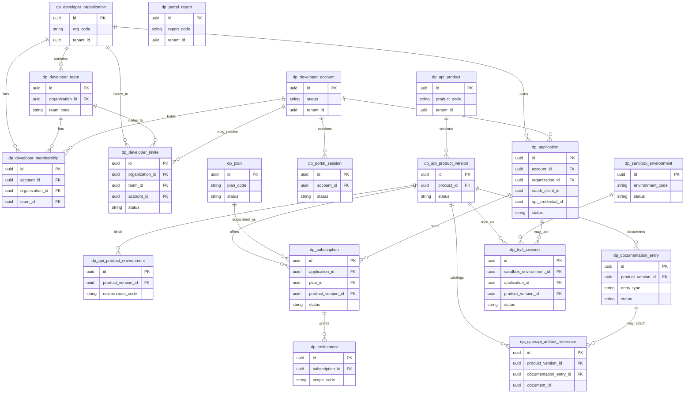

# ERD-28 — API Developer Portal

| Field | Value |
|-------|--------|
| **Document** | ERD-28 API Developer Portal |
| **Version** | 1.1 |
| **Status** | Locked — Ready for Future Reference |
| **Document Status** | Locked |
| **Next Stage** | Sprint 28 Backend Planning |
| **Schema / Prefix (proposed)** | `devportal` / `dp_` |
| **Business Tables** | Exactly **18** |
| **Aligned To** | FRD-28 (Locked v1.1) · ERD-28 Entity Planning (Locked v1.1) · Approved ERD-28 Detailed ERD Analysis · Sprint 28 ARB Recommendation Locked v1.1 · Architecture Lock v1.1 (C-01–C-06) · FRD-01 Foundation · FRD-19 Document · FRD-21 Integration Hub · FRD-23 Customer Portal · FRD-24 Vendor Portal |
| **Prior Release** | ERP Core v1.22-beta |
| **Planned Delivery** | ERP Core v1.23-beta (planned) |

> **Detailed ERD design only.** Logical relationships. No SQL, migrations, APIs, indexes, column catalogs, models, repositories, services, backend planning, or implementation. Exactly **18** entities from locked Entity Planning — no invented entities, no renaming, no redesign.

### Version History

| Version | Date | Change |
|---------|------|--------|
| 1.0 | 2026-07-28 | Initial ERD-28 API Developer Portal Detailed ERD (Mermaid · relationship matrix · strategies) for Architect Review. Exactly 18 entities. Intra-schema relationships only. Cross-module = UUID/service contracts only. Architecture Lock v1.1 preserved. |
| 1.1 | 2026-07-28 | Editorial Lock after Permanent Enterprise Architecture Review Board unanimous approval. Added Relationship Design Notes; metadata Version 1.1 / Locked — Ready for Future Reference / Next Stage Sprint 28 Backend Planning. No entity, Mermaid, relationship, ownership, or strategy changes. Still exactly **18** entities. Architecture Lock v1.1 preserved. |

---

## 1. Document Control

| Field | Value |
|-------|--------|
| **Document ID** | ERD-28 |
| **Document Title** | API Developer Portal — Detailed ERD |
| **Domain** | API Developer Portal |
| **Classification** | Internal — Confidential |
| **Authoritative Baselines** | BRD v1.0 · SDD v1.1 · DBS v1.1 · Architecture Lock v1.1 · Master FRD · FRD-01…FRD-28 (FRD-28 Locked v1.1) · ERD-01…ERD-27 · ERD-28 Entity Planning Locked v1.1 · Approved Detailed ERD Analysis · Sprint 26/27 · Sprint 28 ARB Recommendation Locked v1.1 |
| **Permanent ARB** | 13 architects · 20+ years enterprise experience each · unanimous approval required |
| **Entity Planning Baseline** | [ERD_28_API_Developer_Portal_Entity_Planning.md](./ERD_28_API_Developer_Portal_Entity_Planning.md) (Locked v1.1) |

---

## 2. Purpose

This Detailed ERD freezes the **logical data model** for the API Developer Portal bounded context:

- Exactly **18** `dp_*` entities under proposed schema `devportal`
- Intra-schema relationships only (ORM FKs within `devportal`)
- Cross-module references as **UUID / service contracts only** — never peer-schema foreign keys
- Ownership preserved: DX / catalog / entitlement / documentation-sandbox / portal operational metadata only

**Integration Hub** remains connectivity SoR. **Foundation** remains security SoR. **Architecture Lock v1.1** is FINAL.

Later Backend Planning and implementation **must use only these entities and relationships**.

---

## 3. ERD Design Principles

| Principle | Statement |
|-----------|-----------|
| **Developer Portal owns DX metadata only** | All 18 `dp_*` entities are portal metadata SoR — not business documents, masters, or transport |
| **Zero duplicate ownership** | Never duplicate Foundation, Integration Hub, Customer Portal, Vendor Portal, or AI SoR |
| **Intra-schema FKs only** | ORM foreign keys exist only among `dp_*` tables |
| **UUID references only (peers)** | Hub / Document / Foundation / Analytics / business modules referenced by UUID — never peer schema FKs |
| **No peer ORM** | Developer Portal never writes peer-module ORM models |
| **Hub bindings as attributes** | OAuth/credential UUIDs on `dp_application` — not Hub table clones |
| **Version-first catalog** | `dp_api_product_version` Draft → Published → Retired; published immutable |
| **OpenAPI reference only** | Portal catalogs artifact refs; FastAPI remains generator |
| **No API Gateway product** | Environment / Try-it / Entitlement remain metadata (ERD-21 deferral) |
| **Architecture Lock v1.1** | Final — never modified by this ERD |

---

## 4. Entity Classification

| Group | Entities (18 total — unchanged) |
|-------|----------------------------------|
| **Core** | `dp_developer_account` · `dp_developer_organization` · `dp_developer_team` · `dp_developer_membership` · `dp_developer_invite` · `dp_portal_session` · `dp_application` · `dp_api_product` · `dp_api_product_version` · `dp_api_product_environment` · `dp_plan` · `dp_subscription` · `dp_entitlement` |
| **Extension** | `dp_documentation_entry` · `dp_openapi_artifact_reference` · `dp_sandbox_environment` · `dp_tryit_session` |
| **Operational** | `dp_portal_report` |
| **Future Ready** | *(none as Sprint 28 entities)* |

*Classification is documentation-only. Entity inventory remains exactly **18**.*

---

## 5. Mermaid ERD

Intra-schema relationships only. Cross-module UUIDs appear as attributes — **not** Mermaid relationship edges to peer modules.



**Notes on Mermaid attributes:**

- `oauth_client_id` · `api_credential_id` on `dp_application` = Integration Hub UUIDs (**not** Mermaid FKs)
- `document_id` on `dp_openapi_artifact_reference` = Document Management UUID (**not** a Mermaid FK)
- Optional FKs (`team_id`, `organization_id`, `documentation_entry_id`, `application_id` on try-it) may be null per business rules at implementation time

### Relationship Design Notes

Documentation only.

- Cross-module UUID attributes intentionally do **NOT** become Mermaid relationships.
- Mermaid represents only **intra-schema ownership**.
- Service contracts remain the **only** integration mechanism with external bounded contexts.
- **No peer ORM** is permitted.

---

## 6. Relationship Matrix

| Parent | Child | Cardinality | Ownership | Notes |
|--------|-------|-------------|-----------|-------|
| `dp_developer_organization` | `dp_developer_team` | 1 : 0..* | Developer Portal | Team belongs to one organization |
| `dp_developer_organization` | `dp_developer_membership` | 1 : 0..* | Developer Portal | Org-level membership |
| `dp_developer_organization` | `dp_developer_invite` | 1 : 0..* | Developer Portal | Invite targets an organization |
| `dp_developer_organization` | `dp_application` | 1 : 0..* | Developer Portal | Optional org ownership of application |
| `dp_developer_team` | `dp_developer_membership` | 1 : 0..* | Developer Portal | Optional team-scoped membership |
| `dp_developer_team` | `dp_developer_invite` | 1 : 0..* | Developer Portal | Optional team-targeted invite |
| `dp_developer_account` | `dp_developer_membership` | 1 : 0..* | Developer Portal | Account holds memberships |
| `dp_developer_account` | `dp_portal_session` | 1 : 0..* | Developer Portal | Sessions of account |
| `dp_developer_account` | `dp_application` | 1 : 0..* | Developer Portal | Account registers applications |
| `dp_developer_account` | `dp_developer_invite` | 1 : 0..* | Developer Portal | Optional invitee account link |
| `dp_api_product` | `dp_api_product_version` | 1 : 1..* | Developer Portal | Version spine of product |
| `dp_api_product_version` | `dp_api_product_environment` | 1 : 0..* | Developer Portal | Environment bindings (not gateway) |
| `dp_api_product_version` | `dp_subscription` | 1 : 0..* | Developer Portal | Subscriptions bind published versions |
| `dp_api_product_version` | `dp_documentation_entry` | 1 : 0..* | Developer Portal | Docs align to product version |
| `dp_api_product_version` | `dp_openapi_artifact_reference` | 1 : 0..* | Developer Portal | OpenAPI refs align to product version |
| `dp_api_product_version` | `dp_tryit_session` | 1 : 0..* | Developer Portal | Optional try-it against a version |
| `dp_plan` | `dp_subscription` | 1 : 0..* | Developer Portal | Plan offerings |
| `dp_application` | `dp_subscription` | 1 : 0..* | Developer Portal | Application holds subscriptions |
| `dp_subscription` | `dp_entitlement` | 1 : 0..* | Developer Portal | Entitlements under subscription |
| `dp_documentation_entry` | `dp_openapi_artifact_reference` | 1 : 0..* | Developer Portal | Optional attach of artifact to doc entry |
| `dp_sandbox_environment` | `dp_tryit_session` | 1 : 0..* | Developer Portal | Try-it hosted in sandbox metadata |
| `dp_application` | `dp_tryit_session` | 1 : 0..* | Developer Portal | Optional application context for try-it |
| — | `dp_portal_report` | — | Developer Portal | Standalone operational report metadata; no required parent |

**Forbidden relationships:** any Mermaid/ORM FK from `dp_*` into `integration.*`, `sec_*` / Foundation tables, `doc_*`, `portal.*` (`pt_*`), `vendor_portal.*` (`vp_*`), `ai_*`, or business schemas.

---

## 7. Aggregate Hierarchy

ASCII only.

```text
Developer Identity
├── dp_developer_organization
│     ├── dp_developer_team
│     ├── dp_developer_membership
│     └── dp_developer_invite
├── dp_developer_account
│     ├── dp_developer_membership
│     ├── dp_portal_session
│     ├── dp_application
│     └── dp_developer_invite
└── dp_portal_session

Application Registration
└── dp_application
      └── (oauth_client_id UUID · api_credential_id UUID → Integration Hub contracts)

API Product Catalog
└── dp_api_product
      └── dp_api_product_version   ★ Draft | Published | Retired
            ├── dp_api_product_environment
            ├── dp_documentation_entry
            ├── dp_openapi_artifact_reference
            └── dp_subscription / dp_tryit_session (consumers)

Access Governance
├── dp_plan
└── dp_subscription
      └── dp_entitlement

Documentation Catalog
├── dp_documentation_entry
└── dp_openapi_artifact_reference
      └── (document_id UUID → Document Management contract)

Sandbox Experience
├── dp_sandbox_environment
└── dp_tryit_session

Portal Operations
└── dp_portal_report
      └── (usage metrics projected via Integration Hub services)
```

---

## 8. Cross-module References

UUID / service contracts only. **No peer ORM.**

| Portal Entity | Peer Reference | Peer Owner | Integration Mode |
|---------------|----------------|------------|------------------|
| `dp_application` | `oauth_client_id` UUID | Integration Hub | UUID + Hub service contracts |
| `dp_application` | `api_credential_id` UUID | Integration Hub | UUID + Hub service contracts |
| `dp_openapi_artifact_reference` | `document_id` UUID | Document Management | UUID + Document service contracts |
| `dp_portal_report` | Usage / rate-limit metrics | Integration Hub | **Service projection only** — not local metering SoR |
| Account / Application / Subscription approvals | Workflow instance / definition UUID | Foundation Workflow | C-04 contracts |
| Significant mutations | Audit events | Foundation Audit | C-06 emit only |
| Notifications | Delivery requests | Foundation Notification | C-05 — portal does not own delivery |
| Optional DX metrics | Report snapshots | Analytics | Read-only consumption |
| Tenant / company scope | Organization context | Foundation / Organization | Context filters — no org master duplication |
| Customer Portal / Vendor Portal | — | FRD-23 / FRD-24 | **No shared SoR / no FKs** |
| AI Platform | — | FRD-27 | **No AI entities / no FKs** |

**Forbidden:** peer-schema foreign keys · portal secret vaults · portal-owned OpenAPI generation · portal-owned API Gateway · merge with Customer/Vendor Portal.

---

## 9. Versioning Strategy

Documentation only.

| Concern | Strategy |
|---------|----------|
| **API Product Version** | Draft → Published → Retired on `dp_api_product_version` |
| **Published immutability** | Published versions are never silently replaced |
| **Subscription binding** | Subscriptions bind to an exact published `dp_api_product_version` |
| **Documentation alignment** | Documentation entries / OpenAPI refs align to a product version |
| **Optimistic concurrency** | Mutable drafts use DBS `version` stamp pattern |
| **SDK / OpenAPI versions** | Compatibility documented in FRD; portal stores refs — does not generate OpenAPI |
| **Platform API path version** | `/api/v1` remains platform-owned; catalog binds products to published platform API versions as metadata |

---

## 10. Soft Delete Strategy

Documentation only.

| Concern | Strategy |
|---------|----------|
| **Mutable metadata** | Soft-delete / retire patterns per DBS soft-delete standards |
| **Published product versions** | Retire lifecycle preferred over hard delete; preserve historical subscription resolution |
| **Sessions** | Expire / revoke; retention per policy |
| **Audit-relevant history** | Soft-deleted rows remain queryable for audit/compliance windows |
| **Hard delete** | Not used for published catalog or entitlement history without ARB-approved exception |

---

## 11. Audit Strategy

Documentation only.

| Concern | Strategy |
|---------|----------|
| **Audit warehouse owner** | Foundation Audit (C-06) |
| **Portal role** | Emit audit events for significant mutations — never become audit SoR |
| **Minimum audited actions** | Account approve/lock · Application bind/approve · Product version publish/retire · Subscription approve/suspend · Documentation publish · Invite decisions |
| **Retention** | Foundation / enterprise retention policy |

---

## 12. Lifecycle Strategy

Documentation only.

| Entity / Concern | Lifecycle |
|------------------|-----------|
| `dp_developer_account` | Draft → Submit → Approve → Active / Lock / Suspend → Retire |
| `dp_developer_invite` | Draft → Sent → Accepted / Expired / Revoked (workflow as required) |
| `dp_application` | Draft → Submit → Approve → Active / Suspend → Retire |
| `dp_api_product_version` | Draft → Published → Retired (published immutable) |
| `dp_plan` | Draft → Active / Retired (or equivalent publishable status) |
| `dp_subscription` | Draft → Submit → Approve → Active / Suspend → Retire |
| `dp_portal_session` | Active → Expired / Revoked |
| `dp_tryit_session` | Active → Closed / Expired |
| `dp_documentation_entry` | Draft → Published → Retired (where applicable) |
| `dp_sandbox_environment` | Draft → Active / Retired |
| Approvals | Foundation Workflow (`DP_ACCOUNT_APPROVAL` · `DP_APPLICATION_APPROVAL` · `DP_SUBSCRIPTION_APPROVAL` planning names) |

---

## 13. Future Reserved

Documentation only. **No entities.**

| Roadmap Item | Notes |
|--------------|-------|
| Developer Marketplace | Future certified partner integration catalog |
| SDK Registry | Future SDK packages vs OpenAPI / API Product Version |
| Webhook Catalog | Future Hub webhook discoverability (Hub remains SoR) |
| GraphQL Explorer | Future DX surface (SDD future) |
| Plugin Marketplace | Future governed plugin discovery |
| Future API Discovery enhancements | Search/tagging over locked catalog |
| Production frontend / DX UI | Separately authorized |
| Full API Gateway (Kong/Envoy) | Deferred per ERD-21 — **not** a portal ownership transfer |

---

## 14. Architectural Constraints

| # | Constraint |
|---|------------|
| 1 | Architecture Lock v1.1 is FINAL — no modification |
| 2 | Exactly **18** entities — no add · no remove · no rename without unanimous Permanent ARB approval |
| 3 | Intra-schema ORM FKs only within `devportal` / `dp_*` |
| 4 | Cross-module references = UUID + service contracts only — **no peer ORM** |
| 5 | Integration Hub remains connectivity / credential / usage / rate-limit SoR |
| 6 | Foundation remains AuthN/AuthZ/RBAC/Audit/Notification/Workflow SoR |
| 7 | Full API Gateway product remains out of scope |
| 8 | Customer Portal and Vendor Portal remain distinct — no merge |
| 9 | AI Platform ownership unchanged |
| 10 | FastAPI remains OpenAPI generator — portal stores references only |
| 11 | No SQL, migrations, models, APIs, backend planning, or implementation in this document |
| 12 | BRD / SDD / DBS / FRD-28 / Entity Planning — unchanged by this ERD |
| 13 | Unanimous Permanent ARB approval required before implementation |

---

## 15. Metadata

| Field | Value |
|-------|--------|
| **Version** | **1.1** |
| **Status** | **Locked — Ready for Future Reference** |
| **Document Status** | **Locked** |
| **Next Stage** | **Sprint 28 Backend Planning** |
| **Entity Count** | **18** |
| **Schema / Prefix (proposed)** | `devportal` / `dp_` |
| **Architecture Lock** | v1.1 — Preserved |

---

## 16. Version History

| Version | Date | Change |
|---------|------|--------|
| 1.0 | 2026-07-28 | Initial ERD-28 API Developer Portal Detailed ERD for Architect Review. Exactly 18 entities from Entity Planning Locked v1.1. Mermaid intra-schema only. Cross-module UUID/service contracts only. No SQL, APIs, backend planning, or implementation. Architecture Lock v1.1 preserved. |
| 1.1 | 2026-07-28 | Editorial Lock after Permanent Enterprise Architecture Review Board unanimous approval. Added Relationship Design Notes; metadata Version 1.1 / Locked — Ready for Future Reference / Next Stage Sprint 28 Backend Planning. No entity, Mermaid, relationship matrix, aggregate hierarchy, cross-module reference, or strategy changes. Still exactly **18** entities. Architecture Lock v1.1 preserved. |

---

## 17. Closing Statement

ERD-28 Detailed ERD is now Locked and becomes the baseline for all future Backend Planning, implementation, validation, and release activities.

No architectural or ownership changes were introduced.

**ERD-28 Detailed ERD — Complete.**

**Architecture Lock preserved.**

**Ready for Sprint 28 Backend Planning.**

